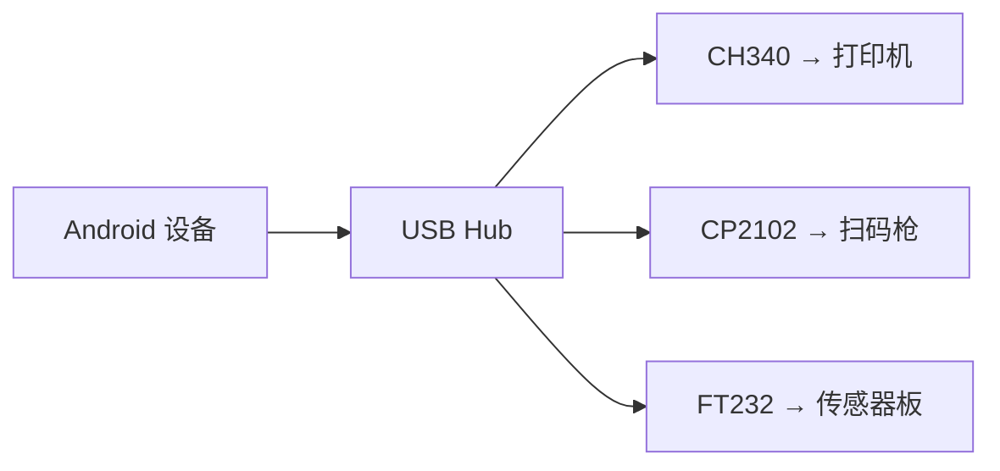
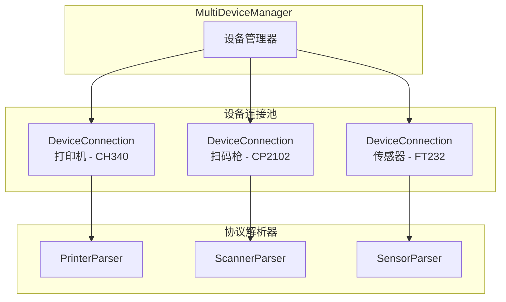
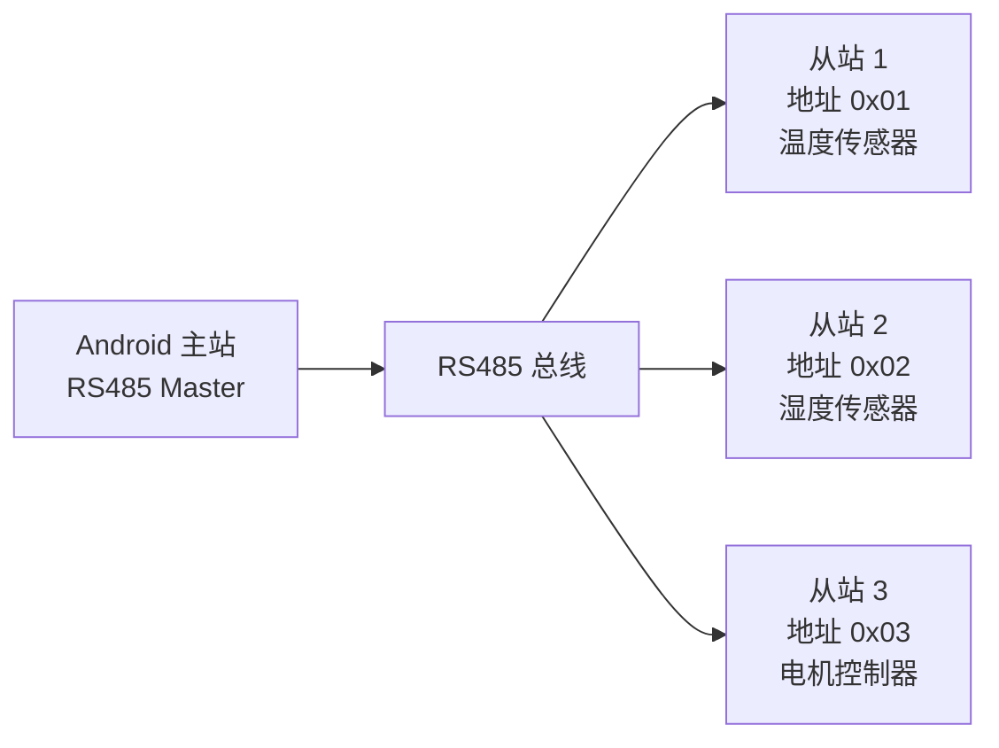
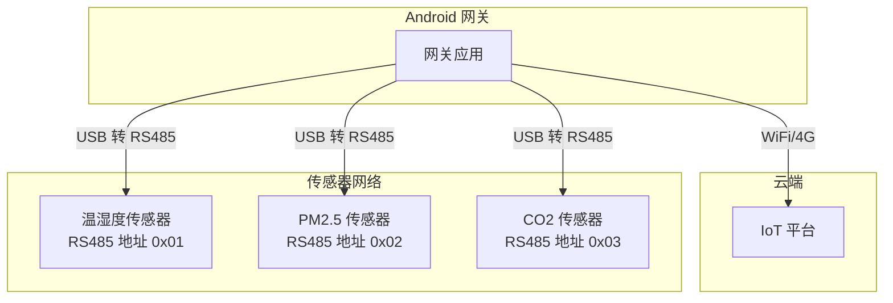

# 多设备与通道管理

## 多 USB 串口设备并行通信

在很多实际场景中，Android 设备需要同时连接多个串口外设（如打印机 + 扫码枪 + 传感器）。通过 USB Hub 或多 USB 接口设备可以实现多串口并行通信。



### 设备枚举与识别

```kotlin
/**
 * 枚举所有已连接的 USB 串口设备并返回详细信息
 */
fun enumerateSerialDevices(usbManager: UsbManager): List<SerialDeviceInfo> {
    val drivers = UsbSerialProber.getDefaultProber().findAllDrivers(usbManager)
    return drivers.mapIndexed { index, driver ->
        val device = driver.device
        SerialDeviceInfo(
            index = index,
            deviceName = device.deviceName,
            vendorId = device.vendorId,
            productId = device.productId,
            driverType = driver.javaClass.simpleName,
            portCount = driver.ports.size,
            serialNumber = try { device.serialNumber } catch (_: Exception) { null }
        )
    }
}

data class SerialDeviceInfo(
    val index: Int,
    val deviceName: String,
    val vendorId: Int,
    val productId: Int,
    val driverType: String,
    val portCount: Int,
    val serialNumber: String?
) {
    val identifier: String
        get() = "$vendorId:$productId:${serialNumber ?: deviceName}"
}
```

### 独立连接管理

每个串口设备维护独立的连接、读写线程和解析器：

```kotlin
/**
 * 单个设备的连接封装
 */
class DeviceConnection(
    val info: SerialDeviceInfo,
    val port: UsbSerialPort,
    val connection: UsbDeviceConnection,
    val scope: CoroutineScope
) {
    private var readJob: Job? = null
    private val _dataFlow = MutableSharedFlow<ByteArray>(extraBufferCapacity = 64)
    val dataFlow: SharedFlow<ByteArray> = _dataFlow
    var parser: SerialProtocolParser? = null

    fun startReading() {
        readJob = scope.launch(Dispatchers.IO) {
            val buffer = ByteArray(4096)
            while (isActive && port.isOpen) {
                try {
                    val bytesRead = port.read(buffer, 200)
                    if (bytesRead > 0) {
                        val data = buffer.copyOf(bytesRead)
                        _dataFlow.emit(data)
                        parser?.feed(data)
                    }
                } catch (e: IOException) {
                    break
                }
            }
        }
    }

    fun send(data: ByteArray) {
        scope.launch(Dispatchers.IO) {
            port.write(data, 1000)
        }
    }

    fun close() {
        readJob?.cancel()
        port.close()
        connection.close()
    }
}
```

### 并行通信架构



## 设备路由与寻址策略

### 基于 VID/PID 的静态路由

当设备类型固定时，可通过 VID/PID 自动将设备分配到对应角色：

```kotlin
enum class DeviceRole(val vendorId: Int, val productId: Int) {
    PRINTER(0x1A86, 0x7523),     // CH340 → 打印机
    SCANNER(0x10C4, 0xEA60),     // CP2102 → 扫码枪
    SENSOR(0x0403, 0x6001);      // FT232 → 传感器

    companion object {
        fun fromDevice(vid: Int, pid: Int): DeviceRole? {
            return entries.find { it.vendorId == vid && it.productId == pid }
        }
    }
}

class DeviceRouter {
    fun assignRole(device: SerialDeviceInfo): DeviceRole? {
        return DeviceRole.fromDevice(device.vendorId, device.productId)
    }
}
```

### 基于端口索引的路由

部分芯片（如 FT2232）提供多个端口，通过端口索引区分：

```kotlin
// FT2232 双通道芯片
val driver: UsbSerialDriver = ... // FtdiSerialDriver，portCount = 2
val portA = driver.ports[0]  // 通道 A → 传感器 1
val portB = driver.ports[1]  // 通道 B → 传感器 2
```

### 动态设备发现与注册

```kotlin
class MultiDeviceManager(
    private val usbManager: UsbManager,
    private val scope: CoroutineScope
) {
    private val _devices = MutableStateFlow<Map<String, DeviceConnection>>(emptyMap())
    val devices: StateFlow<Map<String, DeviceConnection>> = _devices.asStateFlow()

    fun onDeviceAttached(usbDevice: UsbDevice) {
        val drivers = UsbSerialProber.getDefaultProber().findAllDrivers(usbManager)
        val matchedDriver = drivers.find { it.device == usbDevice } ?: return

        val info = SerialDeviceInfo(
            index = 0,
            deviceName = usbDevice.deviceName,
            vendorId = usbDevice.vendorId,
            productId = usbDevice.productId,
            driverType = matchedDriver.javaClass.simpleName,
            portCount = matchedDriver.ports.size,
            serialNumber = try { usbDevice.serialNumber } catch (_: Exception) { null }
        )

        val connection = usbManager.openDevice(usbDevice) ?: return
        val port = matchedDriver.ports[0].apply {
            open(connection)
            setParameters(115200, 8, UsbSerialPort.STOPBITS_1, UsbSerialPort.PARITY_NONE)
        }

        val deviceConn = DeviceConnection(info, port, connection, scope)
        deviceConn.startReading()

        _devices.update { current ->
            current + (info.identifier to deviceConn)
        }
    }

    fun onDeviceDetached(usbDevice: UsbDevice) {
        val identifier = "${usbDevice.vendorId}:${usbDevice.productId}:${usbDevice.deviceName}"
        _devices.value[identifier]?.close()
        _devices.update { it - identifier }
    }

    fun sendTo(deviceId: String, data: ByteArray) {
        _devices.value[deviceId]?.send(data)
    }

    fun broadcastToAll(data: ByteArray) {
        _devices.value.values.forEach { it.send(data) }
    }

    fun disconnectAll() {
        _devices.value.values.forEach { it.close() }
        _devices.value = emptyMap()
    }
}
```

## 通道复用与分发器模式

当单个物理串口需要承载多种逻辑消息时，使用命令码进行分发：

```kotlin
/**
 * 消息分发器 -- 将解析后的帧按命令码路由到不同处理器
 */
class MessageDispatcher {
    private val handlers = mutableMapOf<Byte, (ByteArray) -> Unit>()

    fun register(command: Byte, handler: (ByteArray) -> Unit) {
        handlers[command] = handler
    }

    fun unregister(command: Byte) {
        handlers.remove(command)
    }

    fun dispatch(command: Byte, data: ByteArray) {
        handlers[command]?.invoke(data)
            ?: Log.w("Dispatcher", "未注册的命令: 0x${"%02X".format(command)}")
    }
}

// 使用示例
val dispatcher = MessageDispatcher().apply {
    register(Command.HEARTBEAT.code) { data -> handleHeartbeat(data) }
    register(Command.SENSOR_REPORT.code) { data -> handleSensorReport(data) }
    register(Command.MOTOR_CONTROL.code) { data -> handleMotorFeedback(data) }
}

val parser = ProtocolParser { cmd, seq, data ->
    dispatcher.dispatch(cmd, data)
}
```

## 设备组管理

### DeviceGroup 抽象

对一组相关设备进行统一管理：

```kotlin
data class DeviceGroup(
    val name: String,
    val devices: List<DeviceConnection>,
    val defaultConfig: SerialConfig
) {
    fun configureAll() {
        devices.forEach { device ->
            device.port.setParameters(
                defaultConfig.baudRate,
                defaultConfig.dataBits,
                defaultConfig.stopBits,
                defaultConfig.parity
            )
        }
    }

    fun startAllReading() = devices.forEach { it.startReading() }
    fun closeAll() = devices.forEach { it.close() }
}
```

### 统一事件总线

将多个设备的数据汇聚到统一的 Flow：

```kotlin
class DeviceEventBus(private val devices: List<DeviceConnection>) {

    data class DeviceEvent(
        val deviceId: String,
        val data: ByteArray,
        val timestamp: Long = System.currentTimeMillis()
    )

    val events: Flow<DeviceEvent> = merge(
        *devices.map { device ->
            device.dataFlow.map { data ->
                DeviceEvent(device.info.identifier, data)
            }
        }.toTypedArray()
    )
}
```

## RS485 多从站寻址

### 主从模式

RS485 总线上一个主站（Android 设备）与多个从站通信，使用地址区分：



```kotlin
/**
 * RS485 多从站轮询管理器
 * 使用 Modbus RTU 协议按地址轮询所有从站
 */
class Rs485PollingManager(
    private val serialManager: SerialCommunicationManager,
    private val scope: CoroutineScope
) {
    private val slaveAddresses = mutableListOf<Int>()
    private var pollingJob: Job? = null

    private val _slaveData = MutableSharedFlow<SlaveResponse>(extraBufferCapacity = 32)
    val slaveData: SharedFlow<SlaveResponse> = _slaveData

    fun addSlave(address: Int) {
        slaveAddresses.add(address)
    }

    /**
     * 启动轮询
     * @param intervalMs 每个从站的轮询间隔（毫秒）
     */
    fun startPolling(intervalMs: Long = 200) {
        pollingJob = scope.launch(Dispatchers.IO) {
            while (isActive) {
                for (address in slaveAddresses) {
                    val request = ModbusMaster.buildReadHoldingRegisters(
                        slaveAddress = address,
                        startRegister = 0,
                        registerCount = 10
                    )
                    serialManager.send(request)
                    delay(intervalMs)
                }
            }
        }
    }

    fun stopPolling() {
        pollingJob?.cancel()
    }

    data class SlaveResponse(
        val address: Int,
        val registers: List<Int>,
        val timestamp: Long = System.currentTimeMillis()
    )
}
```

### 地址分配策略

| 策略 | 说明 | 适用场景 |
|------|------|---------|
| 静态分配 | 出厂时固化地址（拨码开关或烧录） | 设备数量少、固定的场景 |
| 配置下发 | 主站通过广播地址(0x00)下发配置 | 可动态调整的场景 |
| 自动发现 | 遍历地址范围探测在线从站 | 未知设备拓扑 |

```kotlin
/**
 * 遍历地址范围自动发现在线的 Modbus 从站
 */
suspend fun discoverSlaves(
    serialManager: SerialCommunicationManager,
    addressRange: IntRange = 1..247
): List<Int> {
    val onlineSlaves = mutableListOf<Int>()

    for (address in addressRange) {
        val request = ModbusMaster.buildReadHoldingRegisters(address, 0, 1)
        serialManager.send(request)
        delay(100) // 等待响应
        // 如果收到有效响应则从站在线
        // 实际实现需结合 parser 的响应回调来判断
    }

    return onlineSlaves
}
```

## 实际场景

### Android IoT 网关

Android 设备作为网关，通过串口连接多个传感器节点，再通过 WiFi/4G 上报到云端：



### POS / 自助终端

同时连接打印机、扫码枪、刷卡器：

| 设备 | 连接方式 | 协议 | 波特率 |
|------|---------|------|--------|
| 热敏打印机 | USB 转串口 (CH340) | ESC/POS 指令集 | 9600 |
| 二维码扫码枪 | USB 转串口 (CP2102) | ASCII 文本 + 回车 | 115200 |
| IC 卡读卡器 | USB 转串口 (FT232) | 自定义二进制协议 | 38400 |

## 踩坑记录

> 此区域供团队成员补充项目中遇到的真实案例。

| 日期 | 记录人 | 问题描述 | 解决方案 |
|------|--------|----------|----------|
| | | | |

## 参考资料

- [RS-485 多点通信 - Wikipedia](https://en.wikipedia.org/wiki/RS-485)
- [Modbus 协议规范](https://modbus.org/specs.php)
- [USB Hub 多设备使用注意事项](https://developer.android.com/develop/connectivity/usb/host)
- [通信稳定性与错误处理](08-通信稳定性与错误处理communication-stability.md) — 本模块下一篇
