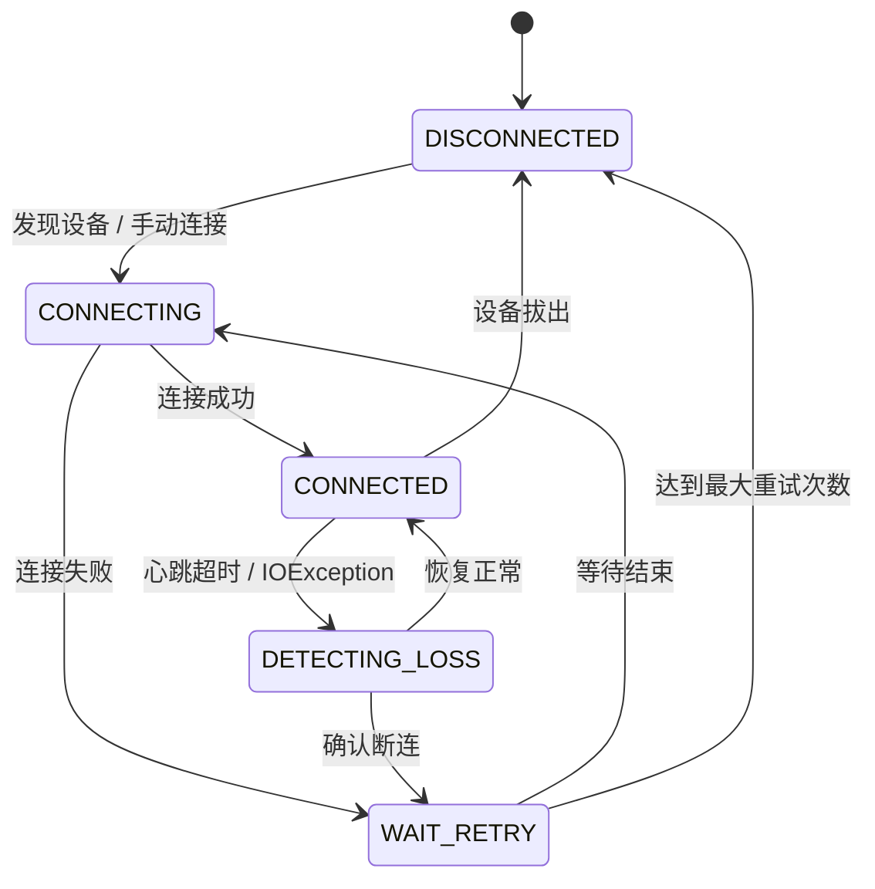
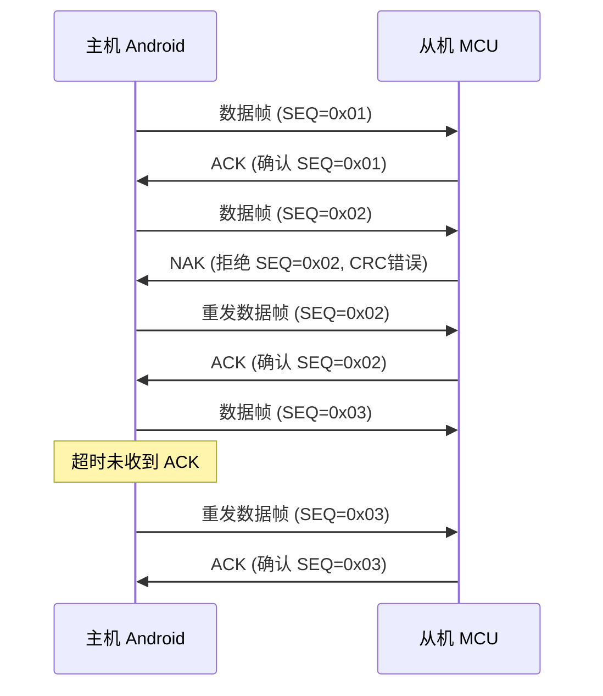

# 通信稳定性与错误处理

## 常见断连场景分析

| 场景 | 表现 | 根因 |
|------|------|------|
| USB 松动/接触不良 | 突然 IOException | 物理连接中断 |
| 供电不足 | 间歇性断连、数据异常 | USB Hub 供电不够或设备功耗过大 |
| 驱动异常 | 打开失败或读取返回错误 | 芯片驱动不兼容或设备故障 |
| 系统休眠/Doze | 一段时间无数据后断连 | CPU 休眠导致读取线程暂停 |
| OOM 进程被杀 | Service 被杀，连接丢失 | 系统内存不足回收后台进程 |
| 电磁干扰 | 数据错误、CRC 校验失败 | 工业环境干扰 |

## 断连检测机制

### 心跳包机制

定时发送心跳包是检测连接存活的最可靠方式：

```kotlin
class HeartbeatManager(
    private val serialManager: SerialCommunicationManager,
    private val frameBuilder: FrameBuilder,
    private val scope: CoroutineScope
) {
    private var heartbeatJob: Job? = null
    private var lastResponseTime = System.currentTimeMillis()

    private val _connectionAlive = MutableStateFlow(true)
    val connectionAlive: StateFlow<Boolean> = _connectionAlive.asStateFlow()

    /**
     * 启动心跳检测
     * @param intervalMs 心跳发送间隔
     * @param timeoutMs 未收到响应的超时时间
     */
    fun start(intervalMs: Long = 3000, timeoutMs: Long = 10000) {
        heartbeatJob = scope.launch(Dispatchers.IO) {
            while (isActive) {
                val heartbeat = frameBuilder.buildFrame(Command.HEARTBEAT)
                serialManager.send(heartbeat)

                delay(intervalMs)

                val elapsed = System.currentTimeMillis() - lastResponseTime
                if (elapsed > timeoutMs) {
                    _connectionAlive.value = false
                    break
                }
            }
        }
    }

    fun onHeartbeatResponseReceived() {
        lastResponseTime = System.currentTimeMillis()
        _connectionAlive.value = true
    }

    fun stop() {
        heartbeatJob?.cancel()
    }
}
```

### 读取超时检测

当 `read()` 持续返回 0 字节或抛出 IOException 时判定断连：

```kotlin
class ReadTimeoutDetector(
    private val maxZeroReadCount: Int = 50,
    private val onTimeout: () -> Unit
) {
    private var consecutiveZeroReads = 0

    fun onReadResult(bytesRead: Int) {
        if (bytesRead == 0) {
            consecutiveZeroReads++
            if (consecutiveZeroReads >= maxZeroReadCount) {
                onTimeout()
                consecutiveZeroReads = 0
            }
        } else {
            consecutiveZeroReads = 0
        }
    }

    fun reset() {
        consecutiveZeroReads = 0
    }
}
```

### USB 设备状态监控

结合 USB 广播和 port 状态进行综合判断：

```kotlin
fun isDeviceStillConnected(usbManager: UsbManager, device: UsbDevice): Boolean {
    return usbManager.deviceList.values.any {
        it.vendorId == device.vendorId &&
        it.productId == device.productId &&
        it.deviceName == device.deviceName
    }
}
```

## 重连状态机



```kotlin
class ReconnectionManager(
    private val serialManager: SerialCommunicationManager,
    private val config: SerialConfig,
    private val scope: CoroutineScope
) {
    private val _state = MutableStateFlow(ReconnState.DISCONNECTED)
    val state: StateFlow<ReconnState> = _state.asStateFlow()

    private var retryCount = 0
    private val maxRetries = 10
    private var reconnectJob: Job? = null

    fun onConnectionLost() {
        if (_state.value == ReconnState.WAIT_RETRY) return
        _state.value = ReconnState.WAIT_RETRY
        startReconnect()
    }

    private fun startReconnect() {
        reconnectJob = scope.launch {
            while (retryCount < maxRetries && isActive) {
                val delayMs = calculateBackoff(retryCount)
                Log.i(TAG, "第 ${retryCount + 1} 次重连，等待 ${delayMs}ms")
                delay(delayMs)

                _state.value = ReconnState.CONNECTING
                try {
                    serialManager.disconnect()
                    delay(500)
                    serialManager.connect(config)
                    _state.value = ReconnState.CONNECTED
                    retryCount = 0
                    return@launch
                } catch (e: Exception) {
                    retryCount++
                    _state.value = ReconnState.WAIT_RETRY
                }
            }

            Log.e(TAG, "达到最大重试次数 $maxRetries，放弃重连")
            _state.value = ReconnState.DISCONNECTED
            retryCount = 0
        }
    }

    fun cancel() {
        reconnectJob?.cancel()
        _state.value = ReconnState.DISCONNECTED
        retryCount = 0
    }

    companion object {
        private const val TAG = "ReconnectionManager"
    }
}

enum class ReconnState {
    DISCONNECTED, CONNECTING, CONNECTED, WAIT_RETRY
}
```

### 退避策略

使用指数退避避免频繁重连消耗资源：

```kotlin
/**
 * 计算指数退避延迟
 * @param attempt 当前重试次数（0 起始）
 * @param baseMs 基础延迟（默认 1 秒）
 * @param maxMs 最大延迟（默认 30 秒）
 * @param jitter 是否添加随机抖动
 */
fun calculateBackoff(
    attempt: Int,
    baseMs: Long = 1000,
    maxMs: Long = 30000,
    jitter: Boolean = true
): Long {
    val exponential = baseMs * (1L shl minOf(attempt, 15))
    val capped = minOf(exponential, maxMs)
    return if (jitter) {
        capped / 2 + (Math.random() * capped / 2).toLong()
    } else {
        capped
    }
}
```

退避时间示意：

| 重试次数 | 基础延迟 | 含抖动范围 |
|---------|---------|-----------|
| 0 | 1s | 0.5s ~ 1s |
| 1 | 2s | 1s ~ 2s |
| 2 | 4s | 2s ~ 4s |
| 3 | 8s | 4s ~ 8s |
| 4 | 16s | 8s ~ 16s |
| 5+ | 30s (cap) | 15s ~ 30s |

## 超时管理策略

### 读超时

```kotlin
// 读超时应略大于设备的最大响应时间
// 对于 Modbus RTU，典型响应时间 < 100ms
val bytesRead = port.read(buffer, 200) // 200ms 超时
```

### 写超时

```kotlin
// 写超时应考虑发送缓冲区大小
// 大数据包适当增加超时
port.write(largeData, 5000) // 大数据包用更长超时
```

### 命令响应超时

请求-响应配对是串口通信中的典型模式：

```kotlin
class CommandSender(
    private val serialManager: SerialCommunicationManager,
    private val frameBuilder: FrameBuilder
) {
    private val pendingRequests = ConcurrentHashMap<Byte, CompletableDeferred<ByteArray>>()

    /**
     * 发送命令并等待响应
     * @return 响应数据，超时返回 null
     */
    suspend fun sendAndWait(
        command: Command,
        data: ByteArray = byteArrayOf(),
        timeoutMs: Long = 3000
    ): ByteArray? {
        val frame = frameBuilder.buildFrame(command, data)
        val seq = frame[4] // 序列号位置

        val deferred = CompletableDeferred<ByteArray>()
        pendingRequests[seq] = deferred

        serialManager.send(frame)

        return try {
            withTimeout(timeoutMs) {
                deferred.await()
            }
        } catch (e: TimeoutCancellationException) {
            Log.w(TAG, "命令 ${command.name} 响应超时 (seq=0x${"%02X".format(seq)})")
            null
        } finally {
            pendingRequests.remove(seq)
        }
    }

    /**
     * 当收到响应帧时调用，完成对应的 pending 请求
     */
    fun onResponseReceived(seq: Byte, data: ByteArray) {
        pendingRequests[seq]?.complete(data)
    }

    companion object {
        private const val TAG = "CommandSender"
    }
}
```

## 数据完整性保障

### CRC 校验失败处理

```kotlin
class DataIntegrityHandler(
    private val serialManager: SerialCommunicationManager,
    private val frameBuilder: FrameBuilder
) {
    private var crcFailCount = 0
    private val maxConsecutiveFails = 5

    fun onFrameReceived(frame: ByteArray): Boolean {
        if (CrcUtils.verifyCrc16(frame)) {
            crcFailCount = 0
            return true
        }

        crcFailCount++
        Log.w(TAG, "CRC 校验失败 ($crcFailCount/$maxConsecutiveFails)")

        if (crcFailCount >= maxConsecutiveFails) {
            Log.e(TAG, "连续 CRC 失败过多，可能存在硬件问题")
            // 触发重连或告警
        }

        return false
    }
}
```

### ACK/NAK 应答机制



### 重传机制

```kotlin
class ReliableSender(
    private val serialManager: SerialCommunicationManager,
    private val commandSender: CommandSender
) {
    /**
     * 可靠发送：带自动重传
     * @param maxRetries 最大重传次数
     */
    suspend fun sendReliably(
        command: Command,
        data: ByteArray,
        maxRetries: Int = 3,
        timeoutMs: Long = 2000
    ): Result<ByteArray> {
        repeat(maxRetries) { attempt ->
            val response = commandSender.sendAndWait(command, data, timeoutMs)
            if (response != null) {
                return Result.success(response)
            }
            Log.w(TAG, "重传 ${command.name}，第 ${attempt + 1} 次")
        }
        return Result.failure(
            TimeoutException("命令 ${command.name} 在 $maxRetries 次重试后仍无响应")
        )
    }
}
```

### 序列号去重

防止因重传导致接收方重复处理同一帧：

```kotlin
class SequenceDeduplicator(private val windowSize: Int = 32) {
    private val processedSequences = LinkedHashSet<Byte>()

    /**
     * @return true 表示是新帧需要处理，false 表示重复帧应丢弃
     */
    fun isNew(seq: Byte): Boolean {
        if (processedSequences.contains(seq)) return false
        processedSequences.add(seq)
        while (processedSequences.size > windowSize) {
            processedSequences.remove(processedSequences.first())
        }
        return true
    }

    fun reset() = processedSequences.clear()
}
```

## 异常恢复策略

### USB 设备重置

```kotlin
fun resetUsbDevice(connection: UsbDeviceConnection): Boolean {
    return try {
        // 发送 USB Reset 请求
        val result = connection.controlTransfer(
            0x21, // bmRequestType: Class, Interface, Host to Device
            0x22, // bRequest: SET_CONTROL_LINE_STATE
            0,    // wValue: DTR/RTS off
            0,    // wIndex: interface
            null, 0, 1000
        )
        result >= 0
    } catch (e: Exception) {
        false
    }
}
```

### 完整重连流程

```kotlin
suspend fun fullReconnect(
    serialManager: SerialCommunicationManager,
    config: SerialConfig
) {
    // 1. 关闭现有连接
    serialManager.disconnect()

    // 2. 等待设备稳定
    delay(1000)

    // 3. 重新发现设备
    // 4. 重新请求权限（如需）
    // 5. 重新打开连接
    serialManager.connect(config)

    // 6. 恢复业务（重发未确认的命令等）
}
```

## 后台保活

### Foreground Service

在需要长时间后台串口通信的场景，必须使用前台服务：

```kotlin
// 在 SerialService 中持有 WakeLock
private var wakeLock: PowerManager.WakeLock? = null

private fun acquireWakeLock() {
    val pm = getSystemService(POWER_SERVICE) as PowerManager
    wakeLock = pm.newWakeLock(
        PowerManager.PARTIAL_WAKE_LOCK,
        "SerialService::SerialWakeLock"
    ).apply {
        acquire(60 * 60 * 1000L) // 最长 1 小时，需要定期 renew
    }
}

private fun releaseWakeLock() {
    wakeLock?.let {
        if (it.isHeld) it.release()
    }
    wakeLock = null
}
```

### WakeLock 注意事项

| 注意项 | 说明 |
|--------|------|
| 类型选择 | 使用 `PARTIAL_WAKE_LOCK`，仅保持 CPU 运行 |
| 超时释放 | 必须设置超时，避免永久持有耗尽电池 |
| 及时释放 | 不需要通信时立即释放 |
| 电池影响 | 长期持有会显著增加耗电，需告知用户 |

### Doze 模式影响

Android 6.0+ 的 Doze 模式会限制后台网络和 CPU 活动：

| Doze 阶段 | 对串口的影响 | 解决方案 |
|-----------|------------|---------|
| 轻度 Doze | 延迟较大，但不中断 | 通常可接受 |
| 深度 Doze | CPU 可能暂停，串口读取中断 | WakeLock + 前台服务 |
| App Standby | 后台应用被限制 | 前台服务豁免 |

```xml
<!-- 请求加入电池优化白名单（需用户手动确认） -->
<uses-permission android:name="android.permission.REQUEST_IGNORE_BATTERY_OPTIMIZATIONS" />
```

```kotlin
fun requestBatteryOptimizationExemption(context: Context) {
    val pm = context.getSystemService(Context.POWER_SERVICE) as PowerManager
    if (!pm.isIgnoringBatteryOptimizations(context.packageName)) {
        val intent = Intent(Settings.ACTION_REQUEST_IGNORE_BATTERY_OPTIMIZATIONS).apply {
            data = Uri.parse("package:${context.packageName}")
        }
        context.startActivity(intent)
    }
}
```

## 踩坑记录

> 此区域供团队成员补充项目中遇到的真实案例。

| 日期 | 记录人 | 问题描述 | 解决方案 |
|------|--------|----------|----------|
| | | | |

## 参考资料

- [Android Doze 模式文档](https://developer.android.com/training/monitoring-device-state/doze-standby)
- [Android 前台服务文档](https://developer.android.com/develop/background-work/services/foreground-services)
- [PowerManager.WakeLock 文档](https://developer.android.com/reference/android/os/PowerManager.WakeLock)
- [性能优化](09-性能优化performance-optimization.md) — 本模块下一篇
