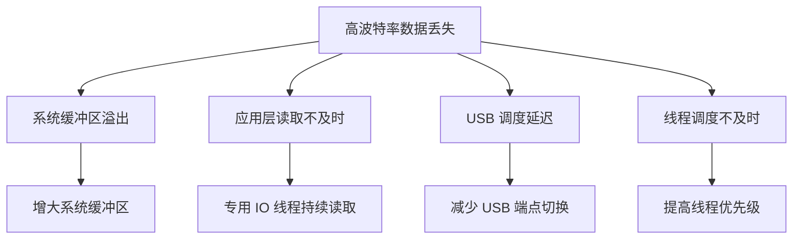
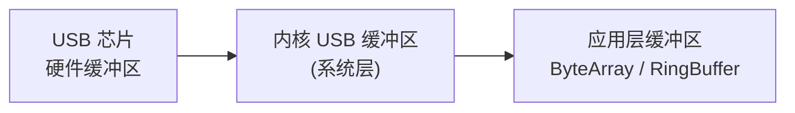

# 性能优化

## 高波特率通信

### 高波特率注意事项

串口通信速率受限于 USB 带宽和芯片能力。在追求高吞吐量时需注意以下限制：

| 芯片 | 最大波特率 | 实测稳定波特率 | 备注 |
|------|-----------|--------------|------|
| CH340 | 2M bps | 921600 bps | 超过 1M 不同批次芯片表现不一 |
| CP2102 | 921600 bps | 921600 bps | 稳定性好 |
| CP2104 | 2M bps | 2M bps | CP2102 增强版 |
| FT232R | 3M bps | 1M bps | 需配置特殊波特率 |
| PL2303 | 1.2M bps | 460800 bps | 假芯片可能更低 |
| CDC/ACM | 取决于 MCU | 取决于 MCU | STM32 通常支持到 2M+ |

**USB 带宽限制**：

- USB 2.0 Full Speed：12 Mbps（实际有效约 8 Mbps）
- USB 2.0 High Speed：480 Mbps
- 大多数 USB 转串口模块使用 Full Speed，因此理论上限约 800 KB/s

### 高波特率下的数据丢失问题

高波特率通信时，数据丢失的主要原因：



**解决策略**：

```kotlin
// 1. 使用 SerialInputOutputManager 持续读取（内部维护独立线程）
val ioManager = SerialInputOutputManager(port, listener).apply {
    readBufferSize = 16384  // 增大读取缓冲区
}

// 2. 提高读取线程优先级
val readThread = Thread {
    android.os.Process.setThreadPriority(android.os.Process.THREAD_PRIORITY_URGENT_AUDIO)
    // 读取循环...
}
readThread.start()

// 3. 在协程中使用 IO 调度器
scope.launch(Dispatchers.IO) {
    val buffer = ByteArray(16384)
    while (isActive) {
        val n = port.read(buffer, 50) // 短超时，快速轮转
        if (n > 0) { /* ... */ }
    }
}
```

## 读取缓冲区调优

### 系统缓冲区 vs 应用缓冲区

串口数据经过两层缓冲：



| 缓冲层级 | 大小 | 可调节性 | 影响 |
|---------|------|---------|------|
| 硬件缓冲区 | 芯片决定（64~4096 bytes） | 不可调 | 硬件溢出导致数据丢失 |
| 内核 USB 缓冲区 | 通常 4KB~16KB | 部分可调 | 影响系统层数据暂存能力 |
| 应用层缓冲区 | 由代码决定 | 完全可调 | 影响解析吞吐量 |

### 缓冲区大小对吞吐量的影响

以 921600 bps 波特率实测为例：

| 应用层 read 缓冲区 | 单次读取耗时 | 吞吐量 | CPU 占用 |
|-------------------|------------|--------|---------|
| 256 bytes | ~0.5ms | ~85 KB/s | 较高 |
| 1024 bytes | ~1ms | ~90 KB/s | 中等 |
| 4096 bytes | ~4ms | ~91 KB/s | **推荐** |
| 16384 bytes | ~15ms | ~91 KB/s | 最低 |

> **推荐**：应用层 read 缓冲区使用 **4096 bytes**，在吞吐量和 CPU 占用之间取得最佳平衡。

## 批量读写优化

### 批量读写 vs 逐字节读写

```kotlin
// 逐字节读取（极低效，禁止使用）
while (true) {
    val b = inputStream.read() // 每次系统调用只读 1 字节
    // ...
}

// 批量读取（推荐）
val buffer = ByteArray(4096)
while (true) {
    val n = port.read(buffer, 200) // 一次读取多字节
    if (n > 0) processData(buffer, n)
}
```

### 写入合并策略

频繁的小数据包写入会增加 USB 事务开销：

```kotlin
/**
 * 写入合并器 -- 将短时间内的多次小写入合并为一次
 */
class WriteMerger(
    private val port: UsbSerialPort,
    private val scope: CoroutineScope,
    private val flushIntervalMs: Long = 10
) {
    private val pendingData = Channel<ByteArray>(Channel.UNLIMITED)

    init {
        scope.launch(Dispatchers.IO) {
            val mergedBuffer = ByteArrayOutputStream()
            while (isActive) {
                // 收集 flushIntervalMs 时间窗口内的所有数据
                val first = pendingData.receive()
                mergedBuffer.write(first)

                delay(flushIntervalMs)

                // 取出剩余待发数据
                while (true) {
                    val next = pendingData.tryReceive().getOrNull() ?: break
                    mergedBuffer.write(next)
                }

                // 一次性写入
                val merged = mergedBuffer.toByteArray()
                mergedBuffer.reset()
                port.write(merged, 1000)
            }
        }
    }

    fun write(data: ByteArray) {
        pendingData.trySend(data)
    }
}
```

## 减少调用开销

### JNI 调用优化（原生串口方案）

| 优化点 | 说明 |
|--------|------|
| 减少 JNI 跨界次数 | 在 C 层批量处理，减少 Java ↔ Native 切换 |
| 使用 DirectByteBuffer | 避免数据在 Java heap 和 native memory 间复制 |
| 预分配缓冲区 | 在 JNI 层维护固定缓冲区，避免反复分配 |

```kotlin
// 使用 DirectByteBuffer 减少内存拷贝
val directBuffer = ByteBuffer.allocateDirect(4096)
// 传给 JNI 层直接填充，避免 ByteArray 的额外拷贝
```

### USB API 调用优化

```kotlin
// bulkTransfer 比 read/write 封装层更底层，开销更小
// 但一般通过 usb-serial-for-android 的 read/write 已经足够高效

// 减少不必要的参数重设
// 连接参数只在打开时设置一次，不要在每次读写前重复调用 setParameters
```

## CPU 占用优化

### 读取轮询间隔

| 策略 | CPU 占用 | 延迟 | 适用场景 |
|------|---------|------|---------|
| 忙轮询（timeout=0） | 极高 | 极低 | 禁止使用 |
| 短超时（timeout=50~200ms） | 中等 | 低 | 实时通信 |
| 长超时（timeout=500~1000ms） | 低 | 较高 | 低频通信 |
| 事件驱动（SerialInputOutputManager） | 低 | 低 | **推荐** |

```kotlin
// 推荐：使用合理的 timeout 参数
val bytesRead = port.read(buffer, 200) // 200ms 是多数场景的最佳值

// 或使用 SerialInputOutputManager 事件驱动方式
val ioManager = SerialInputOutputManager(port, listener)
```

### 阻塞模式 vs 非阻塞模式

| 模式 | 原理 | CPU | 延迟 | 推荐 |
|------|------|-----|------|------|
| 阻塞 + 超时 | `read(buffer, timeout)` 阻塞等待 | 低 | 可控 | **是** |
| 非阻塞轮询 | `read(buffer, 0)` + sleep | 取决于 sleep | 取决于 sleep | 否 |
| 事件回调 | SerialInputOutputManager | 低 | 低 | **是** |

## 内存优化

### ByteArray 复用

避免在读取循环中频繁创建 ByteArray：

```kotlin
// 差：每次读取创建新数组
while (isActive) {
    val buffer = ByteArray(4096) // 每次循环创建新对象
    val n = port.read(buffer, 200)
    if (n > 0) process(buffer.copyOf(n)) // 又创建一次
}

// 好：复用缓冲区
val buffer = ByteArray(4096) // 创建一次
while (isActive) {
    val n = port.read(buffer, 200)
    if (n > 0) {
        // 直接使用 buffer 的前 n 个字节，传递 offset + length
        processInPlace(buffer, 0, n)
    }
}
```

### 对象池模式

对于高频分配的小对象（如帧数据包装），使用对象池：

```kotlin
class ByteArrayPool(private val bufferSize: Int, private val poolSize: Int = 16) {
    private val pool = ArrayDeque<ByteArray>(poolSize)

    fun acquire(): ByteArray {
        return synchronized(pool) {
            pool.removeFirstOrNull()
        } ?: ByteArray(bufferSize)
    }

    fun release(buffer: ByteArray) {
        if (buffer.size == bufferSize) {
            synchronized(pool) {
                if (pool.size < poolSize) {
                    pool.addLast(buffer)
                }
            }
        }
    }
}
```

### 避免频繁 GC

| 问题 | 原因 | 解决 |
|------|------|------|
| 频繁 Minor GC | 大量短命 ByteArray | 对象池 + 缓冲区复用 |
| 数据转换临时对象 | `toHexString()` 等操作创建 String | 仅在调试模式转换 |
| Flow emit 创建包装 | 每次 emit 创建新 ByteArray | 使用 Channel + 复用 buffer |

## 吞吐量与延迟测量

### Benchmark 工具代码

```kotlin
/**
 * 串口性能测试工具
 */
class SerialBenchmark(
    private val port: UsbSerialPort
) {
    /**
     * 吞吐量测试：连续发送固定数据，计算单位时间传输量
     */
    suspend fun measureThroughput(
        durationMs: Long = 5000,
        packetSize: Int = 256
    ): ThroughputResult {
        val packet = ByteArray(packetSize) { (it % 256).toByte() }
        var totalBytes = 0L
        val startTime = System.nanoTime()
        val endTime = startTime + durationMs * 1_000_000

        while (System.nanoTime() < endTime) {
            port.write(packet, 1000)
            totalBytes += packetSize
        }

        val elapsedMs = (System.nanoTime() - startTime) / 1_000_000.0
        val bytesPerSecond = totalBytes / (elapsedMs / 1000.0)

        return ThroughputResult(
            totalBytes = totalBytes,
            elapsedMs = elapsedMs,
            bytesPerSecond = bytesPerSecond,
            kbPerSecond = bytesPerSecond / 1024
        )
    }

    /**
     * 延迟测试：发送数据并等待回声，计算 RTT
     */
    suspend fun measureLatency(
        iterations: Int = 100,
        packetSize: Int = 16
    ): LatencyResult {
        val packet = ByteArray(packetSize) { 0xAA.toByte() }
        val buffer = ByteArray(4096)
        val latencies = mutableListOf<Long>()

        repeat(iterations) {
            val start = System.nanoTime()
            port.write(packet, 1000)
            port.read(buffer, 500) // 等待回声
            val elapsed = (System.nanoTime() - start) / 1_000 // 微秒
            latencies.add(elapsed)
            delay(10)
        }

        latencies.sort()
        return LatencyResult(
            avgUs = latencies.average().toLong(),
            minUs = latencies.first(),
            maxUs = latencies.last(),
            p50Us = latencies[latencies.size / 2],
            p95Us = latencies[(latencies.size * 0.95).toInt()],
            p99Us = latencies[(latencies.size * 0.99).toInt()]
        )
    }

    data class ThroughputResult(
        val totalBytes: Long,
        val elapsedMs: Double,
        val bytesPerSecond: Double,
        val kbPerSecond: Double
    )

    data class LatencyResult(
        val avgUs: Long,
        val minUs: Long,
        val maxUs: Long,
        val p50Us: Long,
        val p95Us: Long,
        val p99Us: Long
    )
}
```

### 实测数据参考

以下数据在 RK3399 Android 10 设备上测得，仅供参考：

| 芯片 | 波特率 | 写吞吐量 | 读吞吐量 | 平均延迟(RTT) |
|------|--------|---------|---------|-------------|
| CH340 | 115200 | 11.2 KB/s | 11.2 KB/s | ~2ms |
| CH340 | 921600 | 85 KB/s | 82 KB/s | ~1.5ms |
| CP2102 | 115200 | 11.2 KB/s | 11.2 KB/s | ~1.8ms |
| CP2102 | 921600 | 88 KB/s | 87 KB/s | ~1.2ms |
| FT232R | 115200 | 11.2 KB/s | 11.2 KB/s | ~1.5ms |
| FT232R | 1000000 | 95 KB/s | 93 KB/s | ~1.0ms |
| CDC/ACM | 115200 | 11.2 KB/s | 11.2 KB/s | ~1.2ms |
| CDC/ACM | 921600 | 90 KB/s | 89 KB/s | ~0.8ms |

> **注意**：115200 波特率下各芯片吞吐量接近理论上限（11.52 KB/s），差异主要体现在高波特率场景。

## 踩坑记录

> 此区域供团队成员补充项目中遇到的真实案例。

| 日期 | 记录人 | 问题描述 | 解决方案 |
|------|--------|----------|----------|
| | | | |

## 参考资料

- [USB 2.0 规范](https://www.usb.org/document-library/usb-20-specification)
- [Android 性能优化指南](https://developer.android.com/topic/performance)
- [调试与问题排查](10-调试与问题排查debugging-and-troubleshooting.md) — 本模块下一篇
