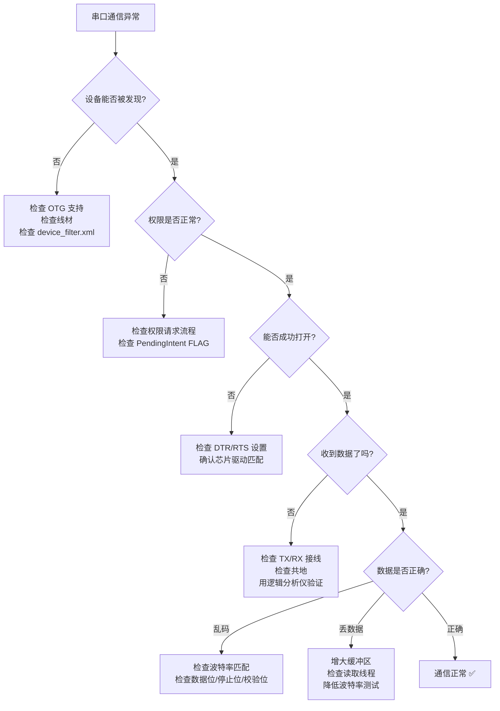

# 调试与问题排查

## 开发环境搭建

### USB 调试线与 USB OTG 同时使用

Android 串口开发最大的环境障碍是：ADB 调试需要 USB 口，串口设备也需要 USB 口。

| 方案 | 操作 | 优点 | 缺点 |
|------|------|------|------|
| **ADB over WiFi** | `adb tcpip 5555` → `adb connect <ip>:5555` | 简单快捷 | 需同一局域网，速度较慢 |
| **Wireless ADB (Android 11+)** | 开发者选项 → 无线调试 | 官方方案，配对安全 | 需 Android 11+ |
| **USB Hub** | 一端接 PC ADB，一端接串口设备 | 无需配置 | 部分手机不支持 |
| **双 USB 口设备** | 工控板通常有多个 USB 口 | 最理想 | 仅限工控板 |

**ADB over WiFi 快速设置**：

```bash
# 1. 先用 USB 连接手机
adb tcpip 5555

# 2. 查看手机 IP
adb shell ip route | grep wlan0

# 3. 断开 USB，通过 WiFi 连接
adb connect 192.168.1.100:5555

# 4. 验证连接
adb devices

# 5. USB 口现在可以接串口设备了
```

### 开发板推荐配置

| 组件 | 推荐 | 说明 |
|------|------|------|
| 开发板 | RK3399 / RK3588 | 多 USB + 板载 UART |
| USB 转串口 | CH340 模块 | 便宜可靠，¥5 |
| OTG 线 | Type-C / Micro-USB OTG | 确保支持 Host 模式 |
| 逻辑分析仪 | Saleae Logic 8 / 低成本方案 | 波形验证 |
| 对接设备 | Arduino / STM32 | 自定义固件配合调试 |

## PC 端串口调试工具

### sscom / 串口调试助手

Windows 平台最常用的串口调试工具：

- 支持 Hex 和 ASCII 收发
- 定时自动发送
- 数据记录与回放
- 校验和自动计算

### CoolTerm

跨平台（Windows/Mac/Linux）串口终端：

- 支持多个连接同时打开
- 数据记录到文件
- 支持二进制和文本模式

### minicom（Linux/Mac）

```bash
# 安装
sudo apt install minicom   # Ubuntu/Debian
brew install minicom        # macOS

# 使用
minicom -D /dev/ttyUSB0 -b 115200
```

### RealTerm

Windows 平台高级串口工具：

- 二进制显示（Hex/Dec/ASCII 混合）
- 精确时间戳
- 数据捕获与触发
- 支持 I2C/SPI 调试模式

## Android 端串口调试工具

### Serial USB Terminal

Google Play 免费应用，快速验证 USB 串口连通性：

1. 插入 USB 转串口设备
2. 打开 Serial USB Terminal
3. 选择设备，配置波特率
4. 收发数据验证

适合在现场快速排查串口连通性，无需编写代码。

### 自建调试面板

在 App 中嵌入串口调试功能，便于开发和现场排查：

```kotlin
/**
 * 内置串口调试面板的核心数据模型
 */
class DebugPanelViewModel : ViewModel() {

    private val _logEntries = MutableStateFlow<List<LogEntry>>(emptyList())
    val logEntries: StateFlow<List<LogEntry>> = _logEntries.asStateFlow()

    fun addLog(direction: Direction, data: ByteArray) {
        val entry = LogEntry(
            timestamp = System.currentTimeMillis(),
            direction = direction,
            hex = data.joinToString(" ") { "%02X".format(it) },
            ascii = String(data, Charsets.ISO_8859_1).replace(Regex("[^\\x20-\\x7E]"), "."),
            size = data.size
        )
        _logEntries.update { (it + entry).takeLast(500) }
    }

    fun clear() {
        _logEntries.value = emptyList()
    }

    data class LogEntry(
        val timestamp: Long,
        val direction: Direction,
        val hex: String,
        val ascii: String,
        val size: Int
    )

    enum class Direction { TX, RX }
}
```

## 逻辑分析仪

### Saleae Logic / PulseView

逻辑分析仪是串口开发的终极调试工具，可以直接抓取物理层波形：

**使用步骤**：

1. 将逻辑分析仪的通道接到串口 TX/RX 线上（并联，不影响通信）
2. 设置采样率（至少为波特率的 4 倍以上）
3. 开始采集
4. 在软件中添加 UART 协议解析器
5. 配置正确的波特率、数据位、校验位
6. 自动解析出每个字节的值

**推荐采样率**：

| 波特率 | 最低采样率 | 推荐采样率 |
|--------|-----------|-----------|
| 9600 | 38.4 kHz | 1 MHz |
| 115200 | 460.8 kHz | 2 MHz |
| 921600 | 3.68 MHz | 8 MHz |

### 波形分析要点

如何从波形中识别问题：

| 波形特征 | 诊断 |
|---------|------|
| 起始位和停止位清晰，数据正确 | 正常 |
| 位宽度不均匀 | 波特率偏差，检查晶振 |
| 信号幅度不足 | 电平不匹配，需加电平转换 |
| 大量毛刺 | 电磁干扰，加滤波或屏蔽 |
| 数据全零或全一 | TX/RX 接反或未连接 |

## 数据 Hex 日志系统

### 收发日志封装

```kotlin
import android.util.Log
import java.text.SimpleDateFormat
import java.util.Date
import java.util.Locale

object SerialLogger {
    private const val TAG = "SerialData"
    private val timeFormat = SimpleDateFormat("HH:mm:ss.SSS", Locale.getDefault())

    var enabled = true
    var logToFile = false
    private var fileWriter: java.io.FileWriter? = null

    fun logTx(data: ByteArray) {
        if (!enabled) return
        val hex = data.joinToString(" ") { "%02X".format(it) }
        val msg = "[TX ${data.size}B] $hex"
        Log.d(TAG, msg)
        writeToFile("TX", data)
    }

    fun logRx(data: ByteArray) {
        if (!enabled) return
        val hex = data.joinToString(" ") { "%02X".format(it) }
        val msg = "[RX ${data.size}B] $hex"
        Log.d(TAG, msg)
        writeToFile("RX", data)
    }

    fun logFrame(direction: String, command: Byte, seq: Byte, data: ByteArray) {
        if (!enabled) return
        val hex = data.joinToString(" ") { "%02X".format(it) }
        val msg = "[$direction] CMD=0x${"%02X".format(command)} SEQ=0x${"%02X".format(seq)} DATA=[$hex]"
        Log.i(TAG, msg)
    }

    fun logError(message: String, throwable: Throwable? = null) {
        Log.e(TAG, message, throwable)
    }

    private fun writeToFile(direction: String, data: ByteArray) {
        if (!logToFile) return
        try {
            val timestamp = timeFormat.format(Date())
            val hex = data.joinToString(" ") { "%02X".format(it) }
            fileWriter?.write("$timestamp [$direction ${data.size}B] $hex\n")
            fileWriter?.flush()
        } catch (_: Exception) {}
    }

    fun startFileLogging(filePath: String) {
        fileWriter = java.io.FileWriter(filePath, true)
        logToFile = true
    }

    fun stopFileLogging() {
        logToFile = false
        fileWriter?.close()
        fileWriter = null
    }
}
```

### 日志分级

| 级别 | 内容 | Logcat Tag |
|------|------|-----------|
| VERBOSE | 原始字节（每次 read/write） | `SerialData` |
| DEBUG | 解析后的帧信息 | `SerialData` |
| INFO | 业务级数据（命令+载荷） | `SerialData` |
| WARN | 异常情况（CRC 失败、超时） | `SerialData` |
| ERROR | 致命错误（连接断开、异常） | `SerialData` |

### 日志文件轮转

```kotlin
class RotatingFileLogger(
    private val directory: File,
    private val maxFileSize: Long = 5 * 1024 * 1024, // 5 MB
    private val maxFiles: Int = 5
) {
    private var currentFile: File? = null
    private var writer: java.io.BufferedWriter? = null

    fun write(line: String) {
        ensureFile()
        writer?.write(line)
        writer?.newLine()
        writer?.flush()

        if ((currentFile?.length() ?: 0) > maxFileSize) {
            rotate()
        }
    }

    private fun ensureFile() {
        if (writer == null) {
            directory.mkdirs()
            currentFile = File(directory, "serial_log_current.txt")
            writer = currentFile!!.bufferedWriter()
        }
    }

    private fun rotate() {
        writer?.close()
        writer = null

        // 重命名现有文件
        for (i in maxFiles - 1 downTo 1) {
            val src = File(directory, "serial_log_$i.txt")
            val dst = File(directory, "serial_log_${i + 1}.txt")
            if (src.exists()) src.renameTo(dst)
        }
        currentFile?.renameTo(File(directory, "serial_log_1.txt"))
        currentFile = null

        // 删除超出数量的旧文件
        File(directory, "serial_log_${maxFiles + 1}.txt").delete()
    }

    fun close() {
        writer?.close()
        writer = null
    }
}
```

## 常见问题速查表

### 连接类问题

| 问题 | 可能原因 | 解决方案 |
|------|---------|---------|
| 无法发现 USB 设备 | OTG 不支持 / OTG 线问题 / 设备无驱动 | 检查 `hasSystemFeature(FEATURE_USB_HOST)`；换线测试；检查 ProbeTable |
| 权限弹窗不出现 | 未注册 intent-filter / device_filter 配置错误 | 检查 AndroidManifest；确认 VID/PID 为十进制 |
| `openDevice()` 返回 null | 权限未授予 | 先调用 `requestPermission()` |
| 打开串口后立即关闭 | DTR/RTS 信号问题 | 尝试设置 `dtr=true` 和 `rts=true` |
| 频繁断连 | USB 接触不良 / 供电不足 / 线材质量差 | 换线/换口/独立供电 |

### 数据类问题

| 问题 | 可能原因 | 解决方案 |
|------|---------|---------|
| 收到全是乱码 | 波特率不匹配 | 确认双方波特率一致；用逻辑分析仪测量实际波特率 |
| 完全收不到数据 | TX/RX 接反 / 未共地 | 交换 TX/RX；连接 GND |
| 数据偶尔丢失 | 缓冲区溢出 / 读取不及时 | 增大缓冲区；使用持续读取线程 |
| 数据重复 | 重传机制未配合去重 | 使用序列号去重（见 `08-通信稳定性`） |
| 粘包/拆包 | 串口字节流特性 | 使用状态机解析器（见 `02-协议设计`） |
| 数据尾部缺失 | 读取超时过短 | 增大 `read()` 的 timeout 参数 |
| CRC 校验频繁失败 | 电磁干扰 / 波特率偏差 | 降低波特率；添加屏蔽；检查线缆长度 |

### 性能类问题

| 问题 | 可能原因 | 解决方案 |
|------|---------|---------|
| 延迟高 | 读取超时设置过大 / 缓冲区过大 | 减小 timeout；减小缓冲区 |
| 吞吐量低于预期 | 波特率被限制 / 读取不及时 | 确认实际波特率；使用事件驱动读取 |
| CPU 占用过高 | 忙轮询 / 缓冲区过小 | 使用阻塞式 read(timeout)；增大缓冲区 |
| 内存持续增长 | ByteArray 未复用 / 日志累积 | 使用对象池；限制日志缓存大小 |

### 兼容性问题

| 问题 | 可能原因 | 解决方案 |
|------|---------|---------|
| 特定芯片不工作 | 默认 ProbeTable 不包含该芯片 | 自定义 ProbeTable 添加 VID/PID |
| 特定 Android 版本异常 | PendingIntent / BroadcastReceiver API 变化 | 参考 `05-USB设备管理与权限` 版本适配 |
| 特定手机不支持 OTG | 硬件不支持 USB Host | 更换支持 OTG 的设备 |
| PL2303 假芯片 | 芯片为仿制品，驱动不兼容 | 更换 CH340 或 CP2102 模块 |

## USB 设备调试命令

### adb shell 常用命令

```bash
# 列出 USB 设备（需 root 或 usb 权限）
lsusb
# 输出示例: Bus 001 Device 003: ID 1a86:7523 QinHeng Electronics CH340

# 查看已注册的串口驱动
cat /proc/tty/drivers

# 列出所有串口设备节点
ls -l /dev/ttyS*
ls -l /dev/ttyUSB*
ls -l /dev/ttyACM*

# 查看内核 USB 相关日志
dmesg | grep -i usb

# 查看 USB 设备详细信息
cat /sys/bus/usb/devices/*/idVendor
cat /sys/bus/usb/devices/*/idProduct
```

### dumpsys 命令

```bash
# 查看 USB 设备管理器状态
adb shell dumpsys usb

# 输出包含：
# - 当前连接的 USB 设备列表
# - 设备权限状态
# - USB Host/Accessory 模式信息
```

### 通过 adb 直接测试串口（root 设备）

```bash
# 写入串口
echo -ne '\x01\x03\x00\x00\x00\x0A' > /dev/ttyS1

# 读取串口（持续读取直到 Ctrl+C）
cat /dev/ttyS1 | xxd

# 设置串口参数
stty -F /dev/ttyS1 115200 cs8 -cstopb -parenb raw
```

## 排查流程图

遇到串口通信问题时，建议按以下流程排查：



## 踩坑记录

> 此区域供团队成员补充项目中遇到的真实案例。

| 日期 | 记录人 | 问题描述 | 解决方案 |
|------|--------|----------|----------|
| | | | |

## 参考资料

- [Saleae Logic 软件下载](https://www.saleae.com/downloads/)
- [PulseView (开源逻辑分析仪软件)](https://sigrok.org/wiki/PulseView)
- [Serial USB Terminal - Google Play](https://play.google.com/store/apps/details?id=de.kai_morich.serial_usb_terminal)
- [CoolTerm 下载](https://freeware.the-meiers.org/)
- [Android USB 调试文档](https://developer.android.com/studio/debug/dev-options)
