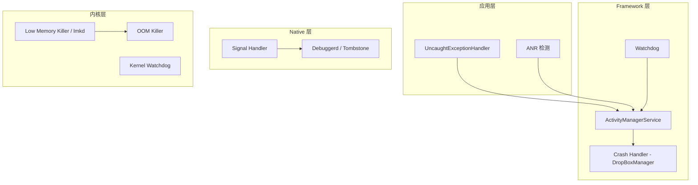
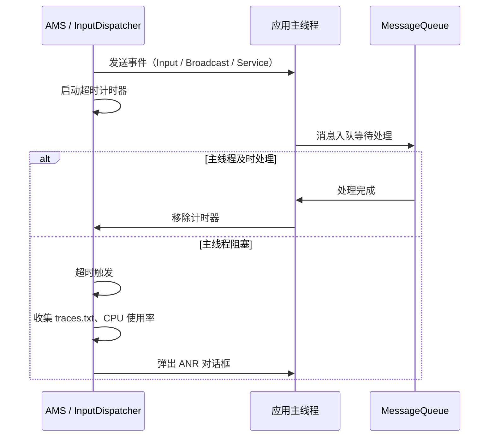
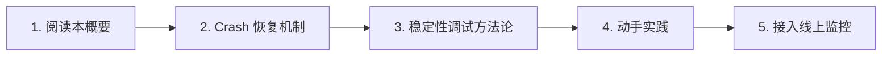

# 系统稳定性概要

## 核心原理

Android 系统稳定性保障是一套多层次的防御体系，从内核到应用层层设防，确保设备在异常情况下能够检测、恢复或优雅降级。



### 四大核心机制

| 机制 | 层级 | 作用 | 触发条件 |
|------|------|------|----------|
| **Watchdog** | Framework | 监控系统关键服务是否死锁 | 关键锁 60s 内未释放 |
| **ANR 检测** | Framework | 检测应用主线程无响应 | Input 5s / Broadcast 10s / Service 20s |
| **Crash Handler** | 应用/Native | 捕获未处理异常和信号 | 未捕获异常、非法内存访问等 |
| **Low Memory Killer** | 内核 | 在内存不足时按优先级杀进程 | 可用内存低于阈值 |

## Crash 分类

### Java Crash

应用层未捕获的异常（`RuntimeException`、`OutOfMemoryError` 等），由虚拟机抛出，通过 `Thread.UncaughtExceptionHandler` 捕获。产生的日志可在 Logcat 中以 `FATAL EXCEPTION` 标识查看。

### Native Crash（Tombstone）

Native 层（C/C++ 代码）因信号触发的崩溃，常见信号包括 `SIGSEGV`（段错误）、`SIGABRT`（主动终止）、`SIGBUS`（总线错误）。崩溃信息由 `debuggerd` 生成 Tombstone 文件，保存于 `/data/tombstones/`。

### System Server Crash

SystemServer 进程崩溃会导致 Zygote 重启，进而引发整个用户空间重启（软重启）。Watchdog 检测到死锁时也会触发此流程。

### Kernel Panic

内核不可恢复的致命错误，导致设备硬重启。常见原因包括驱动异常、内存损坏、硬件故障等。日志需通过 `last_kmsg` 或 `pstore` 机制恢复。

## ANR 原理

ANR（Application Not Responding）的本质是 **主线程在规定时间内未完成预期工作**。



### ANR 超时阈值

| 场景 | 超时时间 | 说明 |
|------|----------|------|
| InputDispatching | 5 秒 | 触摸/按键事件未在 5s 内被消费 |
| BroadcastReceiver | 前台 10 秒 / 后台 60 秒 | `onReceive()` 执行超时 |
| Service | 前台 20 秒 / 后台 200 秒 | `onCreate()` / `onStartCommand()` 超时 |
| ContentProvider | 10 秒 | `publish` 超时（Android 12+） |

## 发展趋势

| Android 版本 | 稳定性相关变化 |
|-------------|---------------|
| Android 8.0 | 后台执行限制，减少后台 Crash 概率 |
| Android 10 | 引入 `malloc` 调试工具 HWASan |
| Android 11 | **GWP-ASan**：低开销的内存安全错误检测，可在生产环境启用 |
| Android 12 | **Restricted Standby Bucket**：限制异常应用的资源使用；改进 Tombstone 格式（protobuf） |
| Android 13 | 前台服务任务管理器，用户可直接停止异常服务 |
| Android 14 | 改进 `ApplicationExitInfo`，提供更详细的退出原因；增强 `onTrimMemory` 回调 |
| Android 15 | 增强 16KB 页面大小支持，影响 Native 内存管理与崩溃排查 |

### GWP-ASan 启用方式

在 `AndroidManifest.xml` 中为应用启用：

```xml
<application android:gwpAsanMode="always">
    ...
</application>
```

## 主流方案与开源项目对比

| 方案 | 类型 | Java Crash | Native Crash | ANR | 优势 | 劣势 |
|------|------|:---:|:---:|:---:|------|------|
| **Firebase Crashlytics** | 商业（免费） | ✅ | ✅ | ✅ | Google 生态集成好、实时告警 | 依赖 Google 服务 |
| **Bugly（腾讯）** | 商业（免费） | ✅ | ✅ | ✅ | 国内网络友好、符号化便捷 | 社区维护放缓 |
| **Sentry** | 开源/商业 | ✅ | ✅ | ✅ | 可私有部署、多平台支持 | 自建成本较高 |
| **xCrash（爱奇艺）** | 开源 | ✅ | ✅ | ✅ | 轻量、无需 root、支持 ANR 捕获 | 仅采集不含分析平台 |
| **ACRA** | 开源 | ✅ | ❌ | ❌ | 极轻量、可自定义上报后端 | 仅 Java Crash |

### 选型建议

- **国内项目 + 快速接入**：Bugly 或 xCrash
- **海外项目 + Google 生态**：Firebase Crashlytics
- **私有化部署需求**：Sentry 自建
- **需要极致轻量或定制**：xCrash + 自建分析后台

## 快速上手路径



**推荐阅读顺序：**

1. **本文**（00-overview）—— 建立系统稳定性全景认知
2. [死机检测与重启恢复](01-crash-recovery.md) —— 理解检测机制与恢复策略
3. [稳定性调试方法论](02-stability-debugging.md) —— 掌握排查工具链与实战技巧
