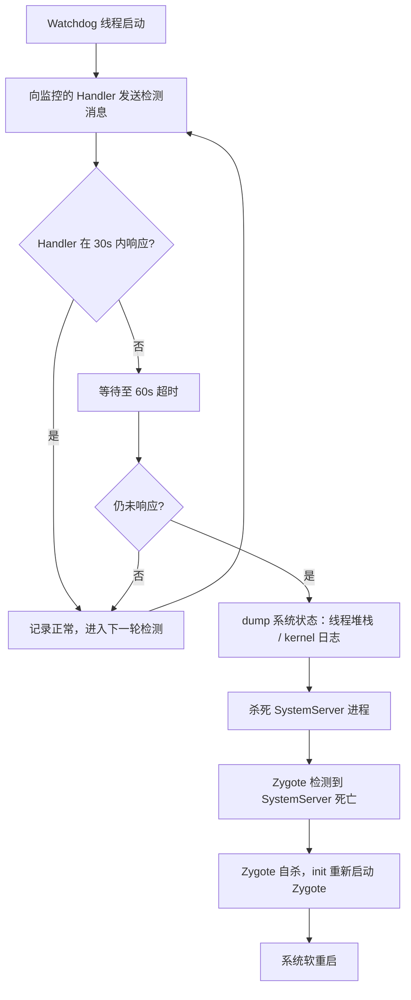
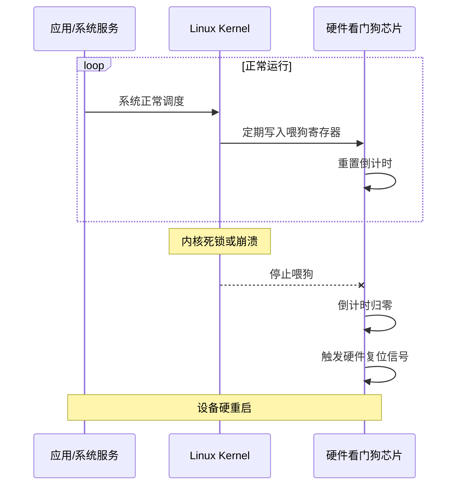
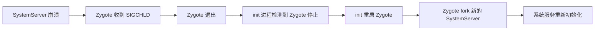
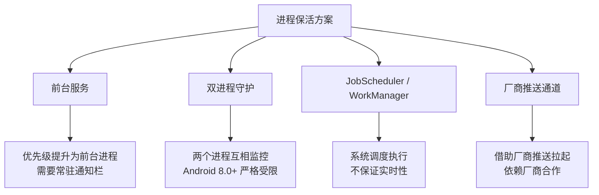

# 死机检测与重启恢复

## 系统级死机检测

### Android Watchdog 机制

SystemServer 启动后会创建一个 `Watchdog` 线程，定期检查系统关键服务（AMS、WMS、PMS 等）持有的锁是否能在规定时间内释放。如果某个锁超过 60 秒未释放，Watchdog 判定系统死锁，主动触发 SystemServer 重启。



#### Watchdog 监控的关键服务

```kotlin
// 以下是 Watchdog 默认监控的部分关键锁对象（源码简化）
class Watchdog : Thread() {
    private val handlerCheckers = listOf(
        // 主线程 Handler —— 检测 Framework 主线程是否阻塞
        HandlerChecker(DisplayThread.getHandler(), "main thread"),
        // UI 线程
        HandlerChecker(UiThread.getHandler(), "ui thread"),
        // IO 线程
        HandlerChecker(IoThread.getHandler(), "io thread"),
        // Surface 动画线程
        HandlerChecker(AnimationThread.getHandler(), "animation thread"),
    )

    // 同时监控的锁对象
    private val monitorCheckers = listOf(
        // ActivityManagerService 内部锁
        // WindowManagerService 内部锁
        // PowerManagerService 内部锁
    )
}
```

### Kernel Watchdog 与硬件看门狗

| 类型 | 工作原理 | 超时行为 |
|------|----------|----------|
| **软件看门狗（softlockup）** | 内核线程定期检测 CPU 是否长时间未调度 | 打印告警日志，默认不重启 |
| **硬件看门狗（hardlockup）** | NMI 中断检测 CPU 是否完全锁死 | 触发 Kernel Panic → 硬重启 |
| **外部硬件看门狗** | 独立芯片，需要系统定期"喂狗" | 未喂狗时直接切断/重置电源 |



## 系统级重启方案

### 方案对比

| 方案 | 需要权限 | 适用场景 | 重启类型 |
|------|----------|----------|----------|
| `PowerManager.reboot()` | `REBOOT`（系统签名） | 系统应用主动重启 | 完整重启 |
| `RuntimeInit.zygoteInit` | 系统内部调用 | SystemServer 崩溃恢复 | 软重启 |
| `adb shell reboot` | adb / root | 开发调试、自动化测试 | 完整重启 |
| AlarmManager + root | `root` | 设备定时重启策略 | 完整重启 |

### PowerManager.reboot()

```kotlin
// 需要系统签名权限：android.permission.REBOOT
fun performSystemReboot(context: Context, reason: String = "recovery") {
    val powerManager = context.getSystemService(Context.POWER_SERVICE) as PowerManager
    // reason 参数会写入 sys.powerctl 属性，供 bootloader / recovery 读取
    // 常用值："recovery"（进入恢复模式）、"bootloader"（进入 fastboot）、null（普通重启）
    powerManager.reboot(reason)
}
```

### RuntimeInit.zygoteInit 重启

当 SystemServer 崩溃时，Zygote 检测到子进程退出，触发自身退出。`init` 进程监测到 Zygote 停止后会重新启动它，从而完成软重启：



### 通过 Shell 命令重启

```kotlin
// 需要 root 权限
fun rebootViaShell() {
    try {
        val process = Runtime.getRuntime().exec(arrayOf("su", "-c", "reboot"))
        process.waitFor()
    } catch (e: Exception) {
        // 无 root 权限时 fallback
        Log.e("Reboot", "需要 root 权限才能执行 shell 重启", e)
    }
}
```

### 定时重启策略

适用于长期运行的 Android 设备（展示屏、车机、IoT），通过定时重启释放资源、恢复系统状态：

```kotlin
class ScheduledRebootManager(private val context: Context) {

    // 设置每天凌晨 3:00 自动重启
    fun scheduleNightlyReboot() {
        val alarmManager = context.getSystemService(Context.ALARM_SERVICE) as AlarmManager

        val intent = Intent(context, RebootReceiver::class.java)
        val pendingIntent = PendingIntent.getBroadcast(
            context, 0, intent,
            PendingIntent.FLAG_UPDATE_CURRENT or PendingIntent.FLAG_IMMUTABLE
        )

        // 计算下次凌晨 3:00 的时间戳
        val calendar = Calendar.getInstance().apply {
            set(Calendar.HOUR_OF_DAY, 3)
            set(Calendar.MINUTE, 0)
            set(Calendar.SECOND, 0)
            if (timeInMillis <= System.currentTimeMillis()) {
                add(Calendar.DAY_OF_YEAR, 1)
            }
        }

        // 设置精确重复闹钟（每 24 小时）
        alarmManager.setExactAndAllowWhileIdle(
            AlarmManager.RTC_WAKEUP,
            calendar.timeInMillis,
            pendingIntent
        )
    }
}

class RebootReceiver : BroadcastReceiver() {
    override fun onReceive(context: Context, intent: Intent) {
        // 执行重启前确认：检查是否有用户正在交互
        val powerManager = context.getSystemService(Context.POWER_SERVICE) as PowerManager
        if (!powerManager.isInteractive) {
            // 屏幕关闭时才执行重启，避免打断用户操作
            try {
                Runtime.getRuntime().exec(arrayOf("su", "-c", "reboot"))
            } catch (e: Exception) {
                Log.e("RebootReceiver", "定时重启失败", e)
            }
        }
    }
}
```

## 应用级恢复策略

### UncaughtExceptionHandler 全局异常捕获

```kotlin
class GlobalCrashHandler private constructor() : Thread.UncaughtExceptionHandler {

    private var defaultHandler: Thread.UncaughtExceptionHandler? = null
    private lateinit var appContext: Context

    companion object {
        val instance: GlobalCrashHandler by lazy { GlobalCrashHandler() }
    }

    fun init(context: Context) {
        appContext = context.applicationContext
        // 保存系统默认的异常处理器，便于链式调用
        defaultHandler = Thread.getDefaultUncaughtExceptionHandler()
        Thread.setDefaultUncaughtExceptionHandler(this)
    }

    override fun uncaughtException(thread: Thread, throwable: Throwable) {
        // 1. 收集崩溃信息
        val crashInfo = collectCrashInfo(throwable)

        // 2. 写入本地文件（确保离线也能保留）
        saveCrashToFile(crashInfo)

        // 3. 尝试上报到服务端（非阻塞）
        reportCrashAsync(crashInfo)

        // 4. 根据策略决定后续行为
        handleCrashRecovery()
    }

    private fun collectCrashInfo(throwable: Throwable): CrashInfo {
        return CrashInfo(
            timestamp = System.currentTimeMillis(),
            threadName = Thread.currentThread().name,
            stackTrace = Log.getStackTraceString(throwable),
            deviceInfo = buildDeviceInfo(),
            memoryInfo = buildMemoryInfo()
        )
    }

    private fun buildDeviceInfo(): String {
        return buildString {
            appendLine("品牌: ${Build.BRAND}")
            appendLine("型号: ${Build.MODEL}")
            appendLine("SDK: ${Build.VERSION.SDK_INT}")
            appendLine("ABI: ${Build.SUPPORTED_ABIS.joinToString()}")
        }
    }

    private fun buildMemoryInfo(): String {
        val runtime = Runtime.getRuntime()
        val maxMem = runtime.maxMemory() / 1024 / 1024
        val totalMem = runtime.totalMemory() / 1024 / 1024
        val freeMem = runtime.freeMemory() / 1024 / 1024
        return "最大内存: ${maxMem}MB, 已分配: ${totalMem}MB, 空闲: ${freeMem}MB"
    }

    private fun saveCrashToFile(info: CrashInfo) {
        try {
            val dir = File(appContext.filesDir, "crash_logs")
            if (!dir.exists()) dir.mkdirs()

            val sdf = SimpleDateFormat("yyyy-MM-dd_HH-mm-ss", Locale.CHINA)
            val file = File(dir, "crash_${sdf.format(Date())}.txt")
            file.writeText(info.toString())
        } catch (e: Exception) {
            Log.e("CrashHandler", "崩溃日志写入失败", e)
        }
    }

    private fun reportCrashAsync(info: CrashInfo) {
        // 由于主进程可能即将退出，使用独立进程/WorkManager 进行上报
        // 此处仅做标记，实际上报由下次启动时 WorkManager 处理
        val prefs = appContext.getSharedPreferences("crash_pending", Context.MODE_PRIVATE)
        prefs.edit().putBoolean("has_pending_crash", true).apply()
    }

    private fun handleCrashRecovery() {
        // 方案 A：重启应用到主界面
        val intent = appContext.packageManager
            .getLaunchIntentForPackage(appContext.packageName)
            ?.apply {
                addFlags(Intent.FLAG_ACTIVITY_NEW_TASK or Intent.FLAG_ACTIVITY_CLEAR_TASK)
                putExtra("from_crash", true)
            }

        if (intent != null) {
            appContext.startActivity(intent)
        }

        // 杀掉当前进程，确保状态完全清理
        android.os.Process.killProcess(android.os.Process.myPid())
        exitProcess(1)
    }
}

data class CrashInfo(
    val timestamp: Long,
    val threadName: String,
    val stackTrace: String,
    val deviceInfo: String,
    val memoryInfo: String
)
```

### 应用自启动与状态恢复

崩溃重启后，应用需要检测并恢复用户状态：

```kotlin
class MainActivity : AppCompatActivity() {

    override fun onCreate(savedInstanceState: Bundle?) {
        super.onCreate(savedInstanceState)

        val isFromCrash = intent.getBooleanExtra("from_crash", false)

        if (isFromCrash) {
            // 从崩溃恢复启动
            handleCrashRecovery()
        } else if (savedInstanceState != null) {
            // 从系统回收恢复
            restoreFromSavedState(savedInstanceState)
        }
    }

    private fun handleCrashRecovery() {
        // 1. 提示用户（非必须，取决于产品策略）
        Toast.makeText(this, "应用已恢复运行", Toast.LENGTH_SHORT).show()

        // 2. 从持久化存储恢复关键状态
        val lastPage = PreferenceManager
            .getDefaultSharedPreferences(this)
            .getString("last_active_page", null)

        // 3. 上报上一次的崩溃信息
        CrashReportUploader.uploadPendingReports(this)

        // 4. 根据策略跳转到合适页面
        if (lastPage != null) {
            navigateToPage(lastPage)
        }
    }

    override fun onSaveInstanceState(outState: Bundle) {
        super.onSaveInstanceState(outState)
        // 持久化保存关键业务状态，用于系统回收后恢复
        outState.putString("current_page", currentPageId)
    }

    private fun restoreFromSavedState(state: Bundle) {
        val page = state.getString("current_page")
        if (page != null) navigateToPage(page)
    }

    private fun navigateToPage(pageId: String) {
        // 根据 pageId 导航到对应页面
    }

    private val currentPageId: String
        get() = "main" // 示例：返回当前页面标识
}
```

### 进程保活方案对比



| 方案 | 可靠性 | 系统友好度 | 适用版本 | 推荐场景 |
|------|:------:|:----------:|----------|----------|
| **前台服务** | ⭐⭐⭐⭐ | ⭐⭐⭐ | 全版本 | 音乐播放、导航、下载等有明确用户感知的场景 |
| **双进程守护** | ⭐⭐ | ⭐ | Android 7.0 以下尚可 | **不推荐**，高版本系统会一并杀死关联进程 |
| **JobScheduler** | ⭐⭐⭐ | ⭐⭐⭐⭐⭐ | Android 5.0+ | 定时同步、日志上报等非实时任务 |
| **厂商推送** | ⭐⭐⭐ | ⭐⭐⭐⭐ | 取决于厂商 | 消息推送场景，需接入各厂商 SDK |

**选型建议：** 优先使用前台服务（合理场景下）+ WorkManager（后台任务），放弃双进程守护等对抗系统的黑科技方案。Android 系统对后台限制越来越严格，与系统对抗的方案只会越来越不可靠。

## 实践建议：自定义 CrashHandler 完整实现

以下代码将上述各部分整合为一个可直接使用的 CrashHandler 模块：

```kotlin
/**
 * 应用崩溃处理模块初始化入口
 * 在 Application.onCreate() 中调用
 */
class App : Application() {

    override fun onCreate() {
        super.onCreate()

        // 初始化全局崩溃捕获
        GlobalCrashHandler.instance.init(this)

        // 检查是否有未上报的崩溃日志
        checkAndUploadPendingCrash()
    }

    private fun checkAndUploadPendingCrash() {
        val prefs = getSharedPreferences("crash_pending", MODE_PRIVATE)
        if (prefs.getBoolean("has_pending_crash", false)) {
            // 使用 WorkManager 在后台上报
            val uploadWork = OneTimeWorkRequestBuilder<CrashUploadWorker>()
                .setConstraints(
                    Constraints.Builder()
                        .setRequiredNetworkType(NetworkType.CONNECTED)
                        .build()
                )
                .setBackoffCriteria(
                    BackoffPolicy.EXPONENTIAL,
                    Duration.ofMinutes(1)
                )
                .build()

            WorkManager.getInstance(this).enqueueUniqueWork(
                "crash_upload",
                ExistingWorkPolicy.REPLACE,
                uploadWork
            )

            prefs.edit().putBoolean("has_pending_crash", false).apply()
        }
    }
}

/**
 * 崩溃日志上报 Worker
 * 在有网络时将本地崩溃日志上传到服务端
 */
class CrashUploadWorker(
    context: Context,
    params: WorkerParameters
) : CoroutineWorker(context, params) {

    override suspend fun doWork(): Result {
        val crashDir = File(applicationContext.filesDir, "crash_logs")
        if (!crashDir.exists()) return Result.success()

        val files = crashDir.listFiles() ?: return Result.success()

        return try {
            files.forEach { file ->
                // 读取崩溃日志内容
                val content = file.readText()
                // 上传到服务端（替换为实际的 API 调用）
                val uploaded = uploadToServer(content)
                if (uploaded) {
                    file.delete() // 上传成功后删除本地文件
                }
            }
            Result.success()
        } catch (e: Exception) {
            if (runAttemptCount < 3) {
                Result.retry() // 重试最多 3 次
            } else {
                Result.failure()
            }
        }
    }

    private suspend fun uploadToServer(content: String): Boolean {
        // 实际实现：调用服务端 API 上传崩溃日志
        // 此处为占位示例
        return true
    }
}
```

## 常见坑点

### 1. CrashHandler 中再次崩溃导致无限循环

```kotlin
// ❌ 错误：CrashHandler 中的操作也可能抛异常，导致递归调用
override fun uncaughtException(thread: Thread, throwable: Throwable) {
    riskyOperation() // 如果此处再次崩溃，会递归调用 uncaughtException
}

// ✅ 正确：用 try-catch 保护，并设置递归标志位
override fun uncaughtException(thread: Thread, throwable: Throwable) {
    if (isHandling) {
        // 已经在处理中，直接交给系统默认处理器
        defaultHandler?.uncaughtException(thread, throwable)
        return
    }
    isHandling = true
    try {
        saveCrashToFile(collectCrashInfo(throwable))
    } catch (e: Exception) {
        // 静默失败，确保不会再次触发 uncaughtException
    } finally {
        isHandling = false
        defaultHandler?.uncaughtException(thread, throwable)
    }
}
```

### 2. 崩溃重启时 Intent 中传递大量数据导致 TransactionTooLargeException

```kotlin
// ❌ 错误：将大量崩溃数据通过 Intent 传递
intent.putExtra("crash_stack", veryLongStackTrace) // 可能超过 1MB 限制

// ✅ 正确：将数据写入文件，仅传递标志位
intent.putExtra("from_crash", true)
// 崩溃详情通过 SharedPreferences 或文件读取
```

### 3. 多进程应用中 CrashHandler 未正确初始化

```kotlin
// ❌ 错误：仅在主进程初始化 CrashHandler
// 导致子进程的崩溃无法捕获

// ✅ 正确：在 Application.onCreate() 中对所有进程都初始化
class App : Application() {
    override fun onCreate() {
        super.onCreate()
        // CrashHandler 应在所有进程中初始化
        GlobalCrashHandler.instance.init(this)

        // 其他初始化可以按进程区分
        if (isMainProcess()) {
            initMainProcessComponents()
        }
    }

    private fun isMainProcess(): Boolean {
        val pid = android.os.Process.myPid()
        val am = getSystemService(ACTIVITY_SERVICE) as ActivityManager
        return am.runningAppProcesses?.any {
            it.pid == pid && it.processName == packageName
        } ?: false
    }
}
```

### 4. ANR 期间执行耗时的崩溃收集

崩溃收集操作如果在主线程执行，可能会加剧 ANR 或导致新的 ANR。建议将日志收集放在独立线程中完成，并设置超时机制。

## 踩坑记录

> 此区域供团队成员补充项目中遇到的真实案例。

| 日期 | 记录人 | 问题描述 | 解决方案 |
|------|--------|----------|----------|
| | | | |

## 参考资料

- [Android 官方文档 - ApplicationExitInfo](https://developer.android.com/reference/android/app/ApplicationExitInfo)
- [Android 源码 - Watchdog.java](https://cs.android.com/android/platform/superproject/+/main:frameworks/base/services/core/java/com/android/server/Watchdog.java)
- [xCrash - 爱奇艺开源崩溃捕获库](https://github.com/nicknux/xCrash)
- [Firebase Crashlytics 接入指南](https://firebase.google.com/docs/crashlytics/get-started?platform=android)
- [Android Vitals - ANR 概览](https://developer.android.com/topic/performance/vitals/anr)
- [GWP-ASan 官方文档](https://developer.android.com/ndk/guides/gwp-asan)
