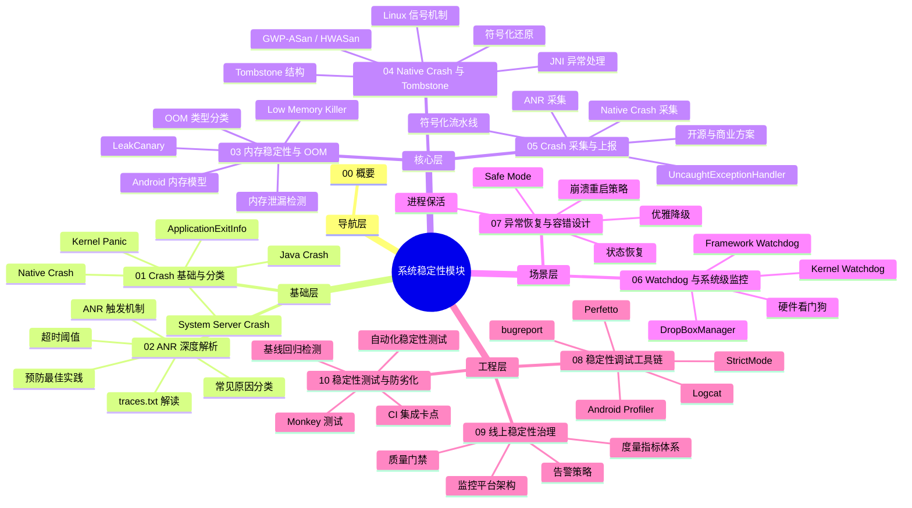
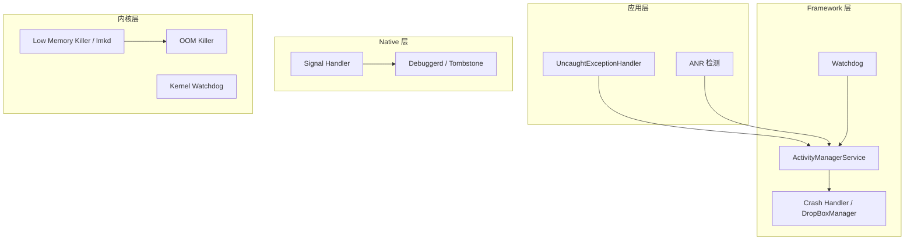
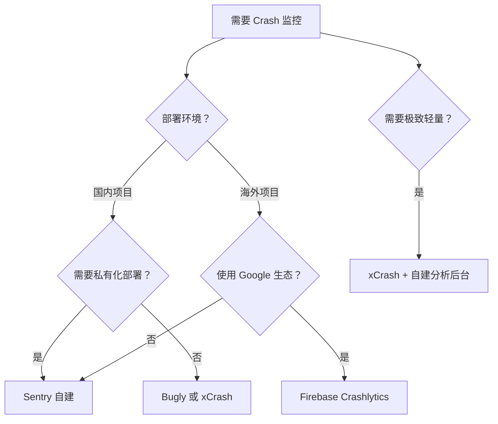
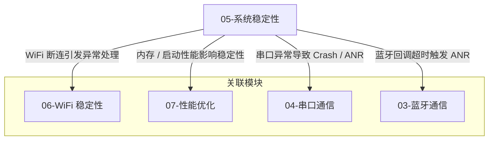
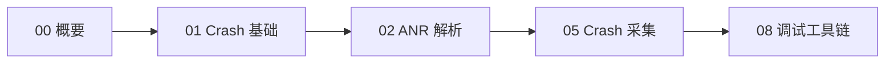

# 系统稳定性 - 概要

## 模块定位

系统稳定性是 Android 应用质量的基石。一个频繁崩溃或无响应的应用会直接导致用户流失和品牌受损。本模块系统性地覆盖从崩溃分类、检测、采集，到恢复、治理、防劣化的完整知识链条，帮助团队建立对 Android 稳定性问题"能理解、能发现、能修复、能预防"的全方位能力。

| 领域 | 说明 | 对应文件 |
|------|------|----------|
| Crash 基础与分类 | Java Crash、Native Crash、System Server Crash、Kernel Panic | `01-Crash基础与分类` |
| ANR 深度解析 | ANR 触发机制、超时阈值、traces.txt 解读、预防实践 | `02-ANR深度解析` |
| 内存稳定性与 OOM | 内存模型、Low Memory Killer、OOM 类型、泄漏检测 | `03-内存稳定性与OOM` |
| Native Crash 与 Tombstone | 信号机制、Tombstone 解读、符号化还原、GWP-ASan | `04-NativeCrash与Tombstone分析` |
| Crash 采集与上报 | UncaughtExceptionHandler、xCrash、Crashlytics、符号化流水线 | `05-Crash采集与上报` |
| Watchdog 与系统级监控 | Framework/Kernel/硬件 Watchdog、DropBoxManager | `06-Watchdog与系统级监控` |
| 异常恢复与容错设计 | 崩溃恢复策略、状态恢复、优雅降级、进程保活 | `07-异常恢复与容错设计` |
| 稳定性调试工具链 | StrictMode、Profiler、Perfetto、bugreport、Logcat | `08-稳定性调试工具链` |
| 线上稳定性治理 | 度量指标、监控架构、告警策略、质量门禁 | `09-线上稳定性治理` |
| 稳定性测试与防劣化 | Monkey 测试、自动化测试、CI 集成、基线回归检测 | `10-稳定性测试与防劣化` |

## 知识全景图

## 核心原理

Android 系统稳定性保障是一套多层次的防御体系，从内核到应用层层设防，确保设备在异常情况下能够检测、恢复或优雅降级。

### 四大核心机制

| 机制 | 层级 | 作用 | 触发条件 |
|------|------|------|----------|
| **Watchdog** | Framework | 监控系统关键服务是否死锁 | 关键锁 60s 内未释放 |
| **ANR 检测** | Framework | 检测应用主线程无响应 | Input 5s / Broadcast 10s / Service 20s |
| **Crash Handler** | 应用/Native | 捕获未处理异常和信号 | 未捕获异常、非法内存访问等 |
| **Low Memory Killer** | 内核 | 在内存不足时按优先级杀进程 | 可用内存低于阈值 |

## Crash 四大分类速览

| 类型 | 层级 | 日志来源 | 影响范围 | 详见 |
|------|------|----------|----------|------|
| **Java Crash** | 应用层 | Logcat `FATAL EXCEPTION` | 单个应用进程退出 | `01-Crash基础与分类` |
| **Native Crash** | Native 层 | Tombstone (`/data/tombstones/`) | 单个应用进程退出 | `04-NativeCrash与Tombstone分析` |
| **System Server Crash** | Framework | Logcat + DropBox | 整个用户空间软重启 | `01-Crash基础与分类` |
| **Kernel Panic** | 内核 | `last_kmsg` / `pstore` | 设备硬重启 | `01-Crash基础与分类` |

## ANR 核心原理速览

ANR（Application Not Responding）的本质是**主线程在规定时间内未完成预期工作**。与 Crash 不同，ANR 不一定导致进程退出，但会弹出"应用无响应"对话框，严重影响用户体验。

| 场景 | 超时时间 | 说明 |
|------|----------|------|
| InputDispatching | 5 秒 | 触摸/按键事件未在 5s 内被消费 |
| BroadcastReceiver | 前台 10s / 后台 60s | `onReceive()` 执行超时 |
| Service | 前台 20s / 后台 200s | `onCreate()` / `onStartCommand()` 超时 |
| ContentProvider | 10 秒 | `publish` 超时（Android 12+） |

> 详细的 ANR 分析方法论参见 `02-ANR深度解析`。

## 发展趋势

| Android 版本 | 稳定性相关变化 |
|-------------|---------------|
| Android 8.0 | 后台执行限制，减少后台 Crash 概率 |
| Android 10 | 引入 `malloc` 调试工具 HWASan |
| Android 11 | **GWP-ASan**：低开销内存安全检测，可在生产环境启用；**ApplicationExitInfo** API |
| Android 12 | **Restricted Standby Bucket**：限制异常应用资源；改进 Tombstone 格式（protobuf） |
| Android 13 | 前台服务任务管理器，用户可直接停止异常服务 |
| Android 14 | 改进 `ApplicationExitInfo`，提供更详细退出原因；增强 `onTrimMemory` 回调 |
| Android 15 | 增强 16KB 页面大小支持，影响 Native 内存管理与崩溃排查 |

## 主流方案与开源项目对比

| 方案 | 类型 | Java Crash | Native Crash | ANR | 优势 | 劣势 |
|------|------|:---:|:---:|:---:|------|------|
| **Firebase Crashlytics** | 商业（免费） | ✅ | ✅ | ✅ | Google 生态集成好、实时告警 | 依赖 Google 服务 |
| **Bugly（腾讯）** | 商业（免费） | ✅ | ✅ | ✅ | 国内网络友好、符号化便捷 | 社区维护放缓 |
| **Sentry** | 开源/商业 | ✅ | ✅ | ✅ | 可私有部署、多平台支持 | 自建成本较高 |
| **xCrash（爱奇艺）** | 开源 | ✅ | ✅ | ✅ | 轻量、无需 root、支持 ANR | 仅采集不含分析平台 |
| **ACRA** | 开源 | ✅ | ❌ | ❌ | 极轻量、可自定义上报后端 | 仅 Java Crash |

### 选型建议

## 模块间关系

## 推荐阅读路径

### 新人入门路径

适合刚接触 Android 稳定性的开发者，按顺序阅读：

1. **概要**（本文）— 建立系统稳定性全局认知
2. **Crash 基础与分类** — 理解四类崩溃的本质与区别
3. **ANR 深度解析** — 掌握 ANR 分析方法论
4. **Crash 采集与上报** — 接入崩溃监控 SDK
5. **稳定性调试工具链** — 掌握日常调试工具

### 按需深入路径

已有基础的开发者，根据当前任务选择对应文件：

| 你的任务 | 推荐阅读 |
|----------|----------|
| 排查线上 Java/Native 崩溃 | `01-Crash基础与分类` |
| 处理 ANR 问题 | `02-ANR深度解析` |
| 排查内存泄漏或 OOM | `03-内存稳定性与OOM` |
| 分析 Native 崩溃 Tombstone | `04-NativeCrash与Tombstone分析` |
| 接入崩溃监控 SDK | `05-Crash采集与上报` |
| 理解系统级看门狗机制 | `06-Watchdog与系统级监控` |
| 设计崩溃恢复/容错策略 | `07-异常恢复与容错设计` |
| 使用 Perfetto/Profiler 调试 | `08-稳定性调试工具链` |
| 搭建线上稳定性监控体系 | `09-线上稳定性治理` |
| 建立稳定性测试流程 | `10-稳定性测试与防劣化` |

## 踩坑记录

> 此区域供团队成员补充项目中遇到的真实案例。

| 日期 | 记录人 | 问题描述 | 解决方案 |
|------|--------|----------|----------|
| | | | |

## 参考资料

- [Android 官方文档 - ApplicationExitInfo](https://developer.android.com/reference/android/app/ApplicationExitInfo)
- [Android 官方文档 - ANR](https://developer.android.com/topic/performance/vitals/anr)
- [Android 源码 - Watchdog.java](https://cs.android.com/android/platform/superproject/+/main:frameworks/base/services/core/java/com/android/server/Watchdog.java)
- [Firebase Crashlytics](https://firebase.google.com/docs/crashlytics)
- [xCrash - GitHub](https://github.com/nicknux/xCrash)
- [Sentry for Android](https://docs.sentry.io/platforms/android/)
- [Perfetto 官方文档](https://perfetto.dev/docs/)
- [GWP-ASan 官方文档](https://developer.android.com/ndk/guides/gwp-asan)
