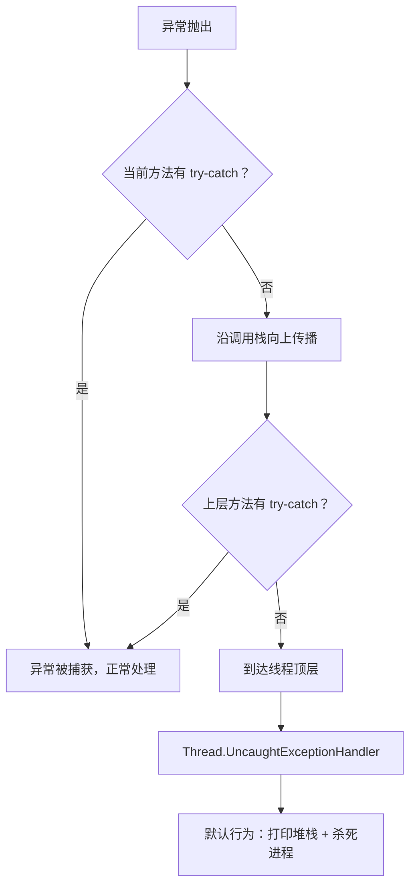
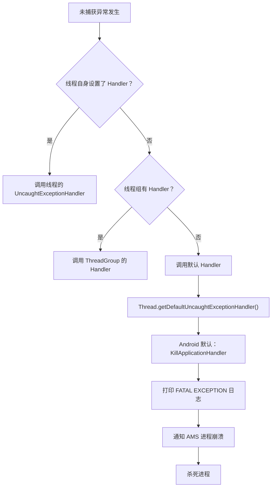
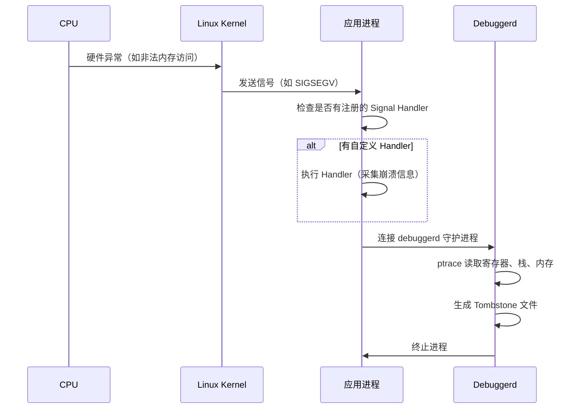
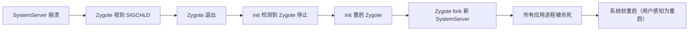
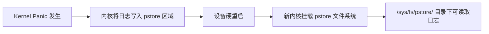

# Crash 基础与分类

## Java Crash

### RuntimeException 体系与常见类型

Java Crash 是应用层未被捕获的异常（Uncaught Exception），由 Dalvik/ART 虚拟机抛出。当异常沿调用栈传播到顶层仍未被 `try-catch` 捕获时，虚拟机将调用 `Thread.UncaughtExceptionHandler`，最终导致进程退出。



**常见 Java Crash 类型：**

| 异常类型 | 典型场景 | 排查要点 |
|----------|----------|----------|
| `NullPointerException` | 空引用调用方法/属性 | 检查可空变量、异步回调中 Activity 是否已销毁 |
| `IllegalStateException` | 在错误的生命周期阶段执行操作 | Fragment 已 detach 后操作 View、commit after onSaveInstanceState |
| `IllegalArgumentException` | 传入非法参数 | 检查边界条件、空字符串、负数索引 |
| `IndexOutOfBoundsException` | 数组/集合越界访问 | 并发修改集合、异步数据变更后未更新 UI |
| `ClassNotFoundException` | 类加载失败 | 混淆（ProGuard/R8）误删、多 dex 配置问题 |
| `OutOfMemoryError` | Java Heap 溢出 | 大图加载、缓存过大、内存泄漏（详见 `03-内存稳定性与OOM`） |
| `StackOverflowError` | 递归过深 | 无终止条件的递归、布局层级过深导致 measure 递归 |

### UncaughtExceptionHandler 原理

当线程中发生未捕获异常时，JVM 按以下优先级查找处理器：



Android 系统默认的处理器是 `KillApplicationHandler`（`RuntimeInit` 内部类），它会：

1. 通过 `ActivityManager.getService().handleApplicationCrash()` 通知 AMS
2. AMS 记录崩溃信息到 DropBox
3. 最终调用 `Process.killProcess()` 杀死当前进程

### 堆栈解读方法

Logcat 中 Java Crash 的典型格式：

```text
E/AndroidRuntime: FATAL EXCEPTION: main                    ← 崩溃线程名
    Process: com.example.myapp, PID: 12345                  ← 包名与进程 ID
    java.lang.NullPointerException: Attempt to invoke virtual method
    'void android.widget.TextView.setText(java.lang.CharSequence)'
    on a null object reference                               ← 异常类型与消息
        at com.example.myapp.ui.HomeFragment.updateUI(HomeFragment.kt:85)  ← 崩溃位置
        at com.example.myapp.ui.HomeFragment.onViewCreated(HomeFragment.kt:42)
        at androidx.fragment.app.Fragment.performViewCreated(Fragment.java:3128)
        ...
    Caused by: ...                                           ← 链式异常（如有）
```

**解读要点：**

| 字段 | 含义 |
|------|------|
| `FATAL EXCEPTION: main` | 崩溃发生在主线程（`main`）；如果是子线程会显示线程名 |
| `Process / PID` | 崩溃的应用包名和进程 ID |
| 异常类名 + 消息 | 异常的具体类型和描述信息 |
| `at` 行 | 调用栈，从上到下是从崩溃点到调用入口的路径 |
| `Caused by` | 引发当前异常的根因异常 |

> **提示：** 混淆后的堆栈需要通过 `mapping.txt` 文件还原。可使用 `retrace` 工具：
> ```bash
> retrace mapping.txt stacktrace.txt
> ```

## Native Crash

### Linux 信号机制概述

Native Crash 由 Linux 信号（Signal）触发。当 C/C++ 代码执行了非法操作（如访问无效内存地址），CPU 产生硬件异常，内核将其转化为信号发送给进程。如果进程未注册对应的信号处理器（或处理器未能修复问题），进程会被终止。



### 常见崩溃信号分类

| 信号 | 编号 | 名称 | 常见原因 | 快速判断 |
|------|------|------|----------|----------|
| `SIGSEGV` | 11 | 段错误 | 空指针、野指针、越界、use-after-free | `fault addr` 接近 0x0 → 空指针；随机地址 → 野指针 |
| `SIGABRT` | 6 | 主动终止 | `abort()` / assert 失败 / C++ 异常 / JNI 错误 | 查看 `abort message` 字段 |
| `SIGBUS` | 7 | 总线错误 | 内存对齐错误、mmap 文件被截断 | 检查 `fault addr` 是否在 mmap 区域 |
| `SIGFPE` | 8 | 算术异常 | 整数除零、无效浮点运算 | 检查崩溃位置附近的算术操作 |
| `SIGILL` | 4 | 非法指令 | 代码段被覆写、ABI 不匹配 | 确认 .so 目标架构与设备一致 |

### debuggerd 工作流程

`debuggerd` 是 Android 的 Native 崩溃收集守护进程。当 Native 进程收到致命信号后：

1. 信号处理器通过 socket 连接 `debuggerd`
2. `debuggerd` fork 出子进程，通过 `ptrace` 附着到崩溃进程
3. 读取寄存器状态、调用栈、内存映射等信息
4. 生成 Tombstone 文件，保存到 `/data/tombstones/`
5. 将摘要信息写入 Logcat（`DEBUG` tag）

> Tombstone 的详细解读方法参见 `04-NativeCrash与Tombstone分析`。

### Native Crash 与 Java Crash 的区别

| 维度 | Java Crash | Native Crash |
|------|-----------|-------------|
| 触发方式 | 未捕获的 Java/Kotlin 异常 | Linux 信号（SIGSEGV 等） |
| 日志位置 | Logcat（`FATAL EXCEPTION`） | Tombstone + Logcat（`DEBUG`） |
| 捕获手段 | `UncaughtExceptionHandler` | `sigaction` 信号处理器 |
| 分析工具 | Logcat + mapping.txt + retrace | Tombstone + addr2line + ndk-stack |
| 堆栈可读性 | 直接可读（混淆后需 retrace） | 需符号化还原（需保留未 strip 的 .so） |
| 常见来源 | 应用层 Kotlin/Java 代码 | NDK 代码、第三方 .so、系统库 |

## System Server Crash

### SystemServer 角色与崩溃影响

SystemServer 是 Android 系统的核心进程，承载了几乎所有 Framework 层服务：

| 服务 | 职责 |
|------|------|
| ActivityManagerService (AMS) | 管理 Activity、Service、Broadcast、进程生命周期 |
| WindowManagerService (WMS) | 窗口管理、输入事件分发 |
| PackageManagerService (PMS) | 应用安装、权限管理 |
| PowerManagerService | 电源管理、WakeLock |
| InputManagerService | 输入设备管理 |

SystemServer 崩溃的传导链：



> **影响范围：** 不同于单个应用崩溃只影响该应用，SystemServer 崩溃会导致整个用户空间重启，所有应用进程被杀死，用户体验等同于手机重启。

### 常见触发原因

| 原因 | 说明 |
|------|------|
| **系统服务死锁** | 多个系统服务之间的锁竞争导致死锁，Watchdog 检测后杀死 SystemServer |
| **资源耗尽** | SystemServer 进程的 FD、线程数、内存耗尽 |
| **Framework Bug** | AOSP 或厂商定制 ROM 中 Framework 代码的 Bug |
| **异常的 Binder 调用** | 应用通过 Binder 发送异常数据触发 SystemServer 侧崩溃 |

## Kernel Panic

### 内核不可恢复错误

Kernel Panic 是 Linux 内核遇到不可恢复的致命错误时的最终保护机制。与用户态的 Crash 不同，Kernel Panic 意味着操作系统本身已无法继续运行，设备会**硬重启**。

**Kernel Panic 与 Kernel Oops 的区别：**

| 特性 | Kernel Oops | Kernel Panic |
|------|-------------|-------------|
| 严重程度 | 较低 | 致命 |
| 系统行为 | 杀死触发的进程，系统可能继续运行 | 系统完全停止，触发硬重启 |
| 可恢复性 | 部分可恢复 | 不可恢复 |
| 典型原因 | 驱动 Bug、非关键路径异常 | 根文件系统损坏、关键数据结构破坏 |

**常见 Kernel Panic 原因：**

- **驱动异常**：设备驱动中的空指针、越界访问、死锁
- **内存损坏**：DMA 操作越界覆写内核数据结构
- **硬件故障**：内存条损坏、存储介质坏块
- **文件系统损坏**：根分区挂载失败

### 日志恢复机制

Kernel Panic 后设备硬重启，内存中的日志数据丢失。Android 提供了两种机制在重启后恢复日志：

**1. last_kmsg**

```bash
# 重启后读取上次内核崩溃的日志
adb shell cat /proc/last_kmsg

# 或者（取决于设备）
adb shell cat /sys/fs/pstore/console-ramoops-0
```

**2. pstore / ramoops**

pstore（Persistent Store）利用一块在重启后不会被清除的 RAM 区域保存内核日志：



```bash
# 列出 pstore 中保存的日志
adb shell ls /sys/fs/pstore/
# 典型输出：
# console-ramoops-0   ← 内核控制台日志
# dmesg-ramoops-0     ← 内核消息
# pmsg-ramoops-0      ← 用户态日志

# 读取内核崩溃日志
adb shell cat /sys/fs/pstore/dmesg-ramoops-0
```

## ApplicationExitInfo（Android 11+）

### API 概述

`ApplicationExitInfo` 是 Android 11（API 30）引入的标准化 API，用于查询应用历史退出原因。它统一了以往分散在 Logcat、Tombstone、traces.txt 中的信息，提供了一个结构化的查询接口。

**支持的退出原因（`reason` 枚举）：**

| 常量 | 含义 |
|------|------|
| `REASON_CRASH` | Java Crash |
| `REASON_CRASH_NATIVE` | Native Crash |
| `REASON_ANR` | ANR |
| `REASON_LOW_MEMORY` | 被 Low Memory Killer 杀死 |
| `REASON_EXIT_SELF` | 应用主动退出（`System.exit()`） |
| `REASON_SIGNALED` | 被信号杀死 |
| `REASON_USER_REQUESTED` | 用户手动关闭 |
| `REASON_DEPENDENCY_DIED` | 依赖的进程死亡 |
| `REASON_OTHER` | 其他原因 |

### 获取退出原因示例

```kotlin
fun analyzeExitReasons(context: Context) {
    if (Build.VERSION.SDK_INT < Build.VERSION_CODES.R) return

    val am = context.getSystemService(Context.ACTIVITY_SERVICE) as ActivityManager
    val exitInfos = am.getHistoricalProcessExitReasons(
        context.packageName,
        0,  // pid = 0 获取所有记录
        20  // 最多 20 条
    )

    exitInfos.forEach { info ->
        val reasonName = when (info.reason) {
            ApplicationExitInfo.REASON_CRASH -> "Java Crash"
            ApplicationExitInfo.REASON_CRASH_NATIVE -> "Native Crash"
            ApplicationExitInfo.REASON_ANR -> "ANR"
            ApplicationExitInfo.REASON_LOW_MEMORY -> "Low Memory Kill"
            ApplicationExitInfo.REASON_EXIT_SELF -> "Self Exit"
            ApplicationExitInfo.REASON_SIGNALED -> "Signaled"
            ApplicationExitInfo.REASON_USER_REQUESTED -> "User Requested"
            else -> "Other(${info.reason})"
        }

        Log.d("ExitInfo", buildString {
            appendLine("原因: $reasonName")
            appendLine("时间: ${Date(info.timestamp)}")
            appendLine("进程: ${info.processName} (PID: ${info.pid})")
            appendLine("重要性: ${info.importance}")
            appendLine("PSS: ${info.pss}KB / RSS: ${info.rss}KB")
            appendLine("描述: ${info.description}")
        })

        // ANR 场景可获取 traces
        if (info.reason == ApplicationExitInfo.REASON_ANR) {
            val traces = info.traceInputStream?.bufferedReader()?.readText()
            Log.d("ExitInfo", "ANR Traces:\n$traces")
        }
    }
}
```

### 与传统方案的对比

| 维度 | 传统方案 | ApplicationExitInfo |
|------|----------|---------------------|
| Java Crash | `UncaughtExceptionHandler` 主动捕获 | 被动查询，无需注册 Handler |
| Native Crash | 解析 Tombstone 文件 | 通过 `REASON_CRASH_NATIVE` 获取 |
| ANR | 监听 `/data/anr/` 或自定义 Watchdog | `REASON_ANR` + `traceInputStream` 获取 traces |
| LMK | 无直接 API（需分析日志） | `REASON_LOW_MEMORY` 直接获取 |
| 权限要求 | Tombstone/traces 可能需要 root | 无需特殊权限（仅查询自身应用） |
| 历史记录 | 每次崩溃需主动保存 | 系统自动保留历史记录 |

> **最佳实践：** 在应用启动时调用 `getHistoricalProcessExitReasons` 检查上次退出原因，与传统的 `UncaughtExceptionHandler` 形成互补。特别是对于 LMK 导致的进程被杀，传统方案几乎无法感知，而 `ApplicationExitInfo` 可以精确识别。

## 常见坑点

### 1. 混淆后堆栈无法解读

```bash
# ❌ 混淆后的堆栈
at a.b.c.d(Unknown Source:42)

# ✅ 使用 retrace 还原
# 确保每个版本都保留 mapping.txt
retrace -verbose mapping.txt obfuscated_stacktrace.txt
```

**解决方案：** 在 CI/CD 流程中自动归档 `mapping.txt`，按 `versionCode` + Git commit 关联存储。

### 2. 崩溃线程不是主线程但导致主线程受影响

子线程崩溃默认也会导致整个进程退出（因为默认的 `UncaughtExceptionHandler` 会杀进程）。需要根据业务场景判断是否要拦截子线程的崩溃：

```kotlin
// 为特定线程设置独立的异常处理器，避免子线程崩溃杀死整个进程
val workerThread = Thread {
    // 执行可能崩溃的任务
}.apply {
    uncaughtExceptionHandler = Thread.UncaughtExceptionHandler { t, e ->
        Log.e("Worker", "子线程 ${t.name} 崩溃，进行容错处理", e)
        // 记录日志但不杀进程
    }
}
workerThread.start()
```

> **注意：** 这种方式要谨慎使用——如果崩溃导致数据状态不一致，"吞掉"异常反而可能造成更严重的后果。

### 3. Kotlin 协程中的异常传播

Kotlin 协程的异常传播机制与传统线程不同，未被处理的异常会沿 Job 层级向上传播：

```kotlin
// ❌ 错误：launch 中的异常会传播到父 CoroutineScope，可能导致整个 Scope 取消
viewModelScope.launch {
    val data = riskyOperation() // 抛出异常 → 整个 viewModelScope 被取消
}

// ✅ 正确：使用 SupervisorJob 或 try-catch
viewModelScope.launch {
    try {
        val data = riskyOperation()
    } catch (e: Exception) {
        Log.e("VM", "操作失败", e)
    }
}

// 或者使用 CoroutineExceptionHandler
val handler = CoroutineExceptionHandler { _, throwable ->
    Log.e("Coroutine", "协程异常", throwable)
}
viewModelScope.launch(handler) {
    riskyOperation()
}
```

## 踩坑记录

> 此区域供团队成员补充项目中遇到的真实案例。

| 日期 | 记录人 | 问题描述 | 解决方案 |
|------|--------|----------|----------|
| | | | |

## 参考资料

- [Android 官方文档 - ApplicationExitInfo](https://developer.android.com/reference/android/app/ApplicationExitInfo)
- [Android 官方文档 - Crashes](https://developer.android.com/topic/performance/vitals/crash)
- [Android 源码 - RuntimeInit.java](https://cs.android.com/android/platform/superproject/+/main:frameworks/base/core/java/com/android/internal/os/RuntimeInit.java)
- [Android 源码 - debuggerd](https://cs.android.com/android/platform/superproject/+/main:system/core/debuggerd/)
- [Kotlin 协程异常处理](https://kotlinlang.org/docs/exception-handling.html)
- [R8/ProGuard retrace 工具](https://developer.android.com/build/shrink-code#decode-stack-trace)
