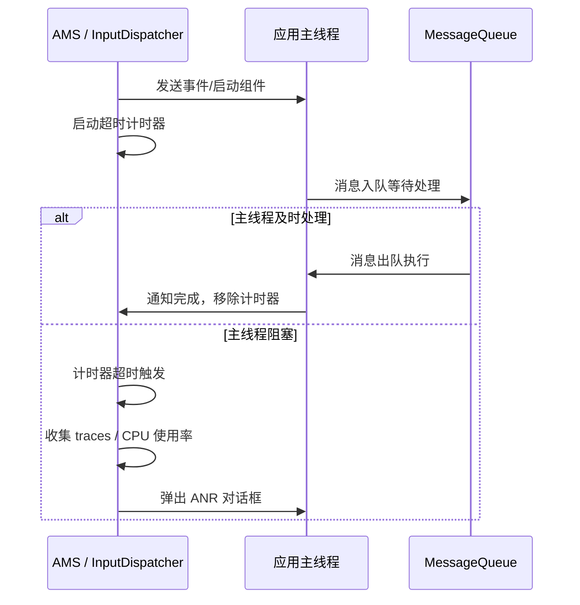
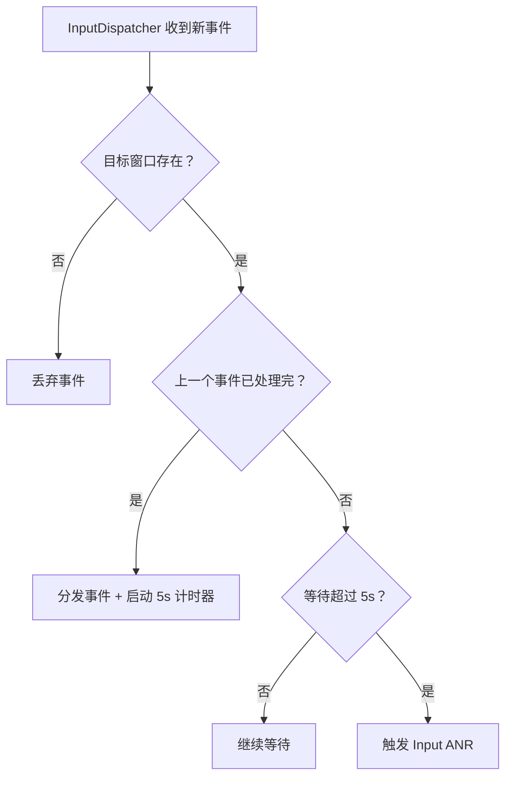
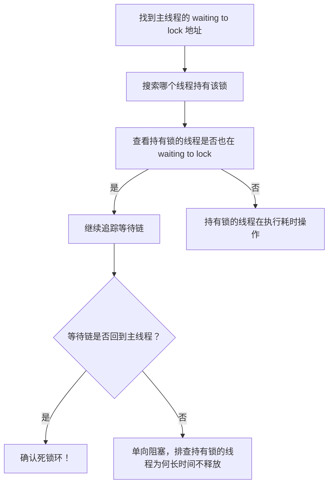
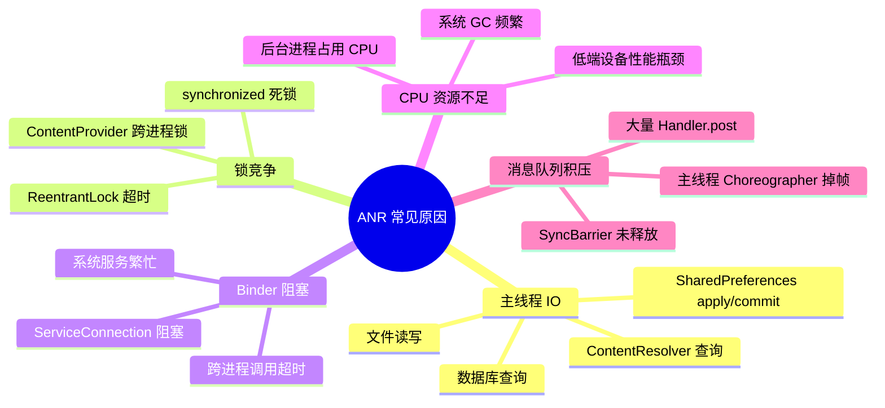

# ANR 深度解析

## ANR 触发机制原理

### AMS / InputDispatcher 计时器模型

ANR（Application Not Responding）的本质是**主线程在规定时间内未完成预期工作**。Android 系统中有两个独立的 ANR 检测入口：

1. **InputDispatcher**：负责检测输入事件（触摸、按键）的处理超时
2. **ActivityManagerService**：负责检测 BroadcastReceiver、Service、ContentProvider 的超时



### 四类 ANR 超时阈值详解

| ANR 类型 | 触发组件 | 前台超时 | 后台超时 | 检测入口 |
|----------|----------|----------|----------|----------|
| **Input ANR** | InputDispatcher | 5 秒 | 5 秒 | `InputDispatcher.cpp` |
| **Broadcast ANR** | AMS | 10 秒 | 60 秒 | `BroadcastQueue.java` |
| **Service ANR** | AMS | 20 秒 | 200 秒 | `ActiveServices.java` |
| **ContentProvider ANR** | AMS | 10 秒 | 10 秒 | `ContentProviderHelper.java`（Android 12+） |

**Input ANR 的特殊性：**

Input ANR 与其他三种不同。InputDispatcher 检测的不是"主线程处理耗时"，而是"事件分发后 5 秒内没有收到处理完成的反馈"。如果主线程正忙于处理上一个消息，新的输入事件排在 MessageQueue 中无法被分发，5 秒后就会触发 ANR。



## traces.txt 完整解读

### 文件位置与获取方式

ANR 发生时，系统会将所有进程的线程堆栈写入 trace 文件：

```bash
# 方式 1：直接拉取（需 root 或 debuggable 应用）
adb pull /data/anr/traces.txt

# Android 11+ 可能按时间戳命名
adb shell ls /data/anr/
adb pull /data/anr/anr_2026-04-06-10-30-00-000

# 方式 2：通过 bugreport（推荐，信息更完整）
adb bugreport bugreport.zip

# 方式 3：ApplicationExitInfo API（Android 11+，无需 root）
```

```kotlin
fun getAnrTraces(context: Context): String? {
    if (Build.VERSION.SDK_INT < Build.VERSION_CODES.R) return null

    val am = context.getSystemService(Context.ACTIVITY_SERVICE) as ActivityManager
    val exitInfos = am.getHistoricalProcessExitReasons(
        context.packageName, 0, 10
    )
    return exitInfos
        .filter { it.reason == ApplicationExitInfo.REASON_ANR }
        .firstOrNull()
        ?.traceInputStream
        ?.bufferedReader()
        ?.readText()
}
```

### 关键字段解读

```text
----- pid 12345 at 2026-04-06 10:30:00.000 -----
Cmd line: com.example.myapp                        ← 包名
...
"main" prio=5 tid=1 Blocked                        ← 主线程状态
  | group="main" sCount=1 ucsCount=0 flags=1 obj=0x...
  | sysTid=12345 nice=-10 cgrp=default sched=0/0 handle=0x...
  | state=S schedstat=( ... ) utm=150 stm=30 core=2 HZ=100
  | stack=0x... stackSize=...
  | held mutexes=
  at com.example.myapp.db.UserDao.queryAll(UserDao.kt:85)     ← 阻塞位置
  - waiting to lock <0x0abcdef0> (a java.lang.Object)          ← 等待的锁
  - locked <0x0abcdef1> (a java.lang.Object)                   ← 已持有的锁
  at com.example.myapp.ui.MainActivity.loadData(MainActivity.kt:42)
  ...
```

**各字段含义：**

| 字段 | 含义 | 排查要点 |
|------|------|----------|
| `main` 线程的状态 | `Blocked` / `Waiting` / `Sleeping` / `Runnable` / `Native` | Blocked = 锁等待；Runnable = CPU 密集 |
| `waiting to lock <addr>` | 主线程正在等待获取的锁 | 在其他线程中搜索 `locked <addr>` 找到持有者 |
| `locked <addr>` | 当前线程已持有的锁 | 判断是否构成死锁环 |
| `utm` / `stm` | 用户态 / 内核态 CPU 时间（单位：jiffies） | 值很大 → 确实在执行计算；值很小 → 被阻塞 |
| `state=S` | 内核态线程状态 | S=Sleeping, R=Running, D=Disk Sleep |

### 死锁环检测方法

从 traces.txt 中检测死锁的步骤：



**死锁示例：**

```text
"main" ... Blocked
  - waiting to lock <0xAAA> (held by thread "worker-1")
  - locked <0xBBB>

"worker-1" ... Blocked
  - waiting to lock <0xBBB> (held by thread "main")  ← 死锁！
  - locked <0xAAA>
```

## ANR 常见原因分类



### 主线程 IO

最常见的 ANR 原因。典型场景：

```kotlin
// ❌ 在主线程查询数据库
override fun onCreate(savedInstanceState: Bundle?) {
    super.onCreate(savedInstanceState)
    val users = database.userDao().queryAll() // 主线程 IO → ANR
    updateUI(users)
}

// ✅ 使用协程异步查询
override fun onCreate(savedInstanceState: Bundle?) {
    super.onCreate(savedInstanceState)
    lifecycleScope.launch {
        val users = withContext(Dispatchers.IO) {
            database.userDao().queryAll()
        }
        updateUI(users)
    }
}
```

### 锁竞争

```kotlin
// ❌ 死锁示例：两个线程以不同顺序获取锁
val lockA = Object()
val lockB = Object()

// 主线程
fun onButtonClick() {
    synchronized(lockA) {
        Thread.sleep(100)
        synchronized(lockB) { /* ... */ }  // 等待 lockB
    }
}

// 子线程
fun backgroundTask() {
    synchronized(lockB) {
        Thread.sleep(100)
        synchronized(lockA) { /* ... */ }  // 等待 lockA → 死锁
    }
}
```

### Binder 阻塞

```kotlin
// ❌ 主线程调用系统服务（Binder 调用是同步阻塞的）
fun checkPermission() {
    // getInstalledPackages 是 Binder 调用，如果 PMS 繁忙会阻塞主线程
    val packages = packageManager.getInstalledPackages(0)
}

// ✅ 移到子线程
fun checkPermission() {
    lifecycleScope.launch(Dispatchers.IO) {
        val packages = packageManager.getInstalledPackages(0)
        withContext(Dispatchers.Main) { updateUI(packages) }
    }
}
```

### 消息队列积压

```kotlin
// ❌ 短时间内 post 大量消息导致队列积压
for (i in 0 until 10000) {
    handler.post { updateItem(i) }
}

// ✅ 合并更新或使用 RecyclerView DiffUtil
handler.post {
    adapter.submitList(newList) // 一次性更新
}
```

## adb bugreport 中 ANR 分析

```bash
adb bugreport bugreport.zip
```

解压后搜索以下关键信息：

| 搜索关键字 | 含义 | 分析方法 |
|-----------|------|----------|
| `"ANR in"` | ANR 发生的应用和组件 | 确定出问题的 Activity / Service / BroadcastReceiver |
| `"CPU usage from"` | ANR 前后的 CPU 使用率 | 查看各进程 CPU 占比，判断是否资源竞争 |
| `"iowait"` | IO 等待占比 | 高 iowait → 磁盘瓶颈（存储卡慢、频繁读写） |
| `"100%TOTAL"` | 系统整体 CPU 满载 | CPU 资源不足导致调度延迟 |
| `"Blocked"` in traces | 主线程锁等待 | 定位锁竞争 |

**CPU 使用率解读示例：**

```text
CPU usage from 5000ms to 0ms ago:
  45% 12345/com.example.myapp: 30% user + 15% kernel
  20% 678/system_server: 15% user + 5% kernel
  10% 890/com.android.systemui: 8% user + 2% kernel
  95% TOTAL: 70% user + 20% kernel + 5% iowait
```

- 应用自身占 45% CPU → 可能有密集计算
- TOTAL 95% → 系统 CPU 满载
- iowait 5% → 有一定 IO 等待

## ANR 预防最佳实践

### 协程化异步处理

```kotlin
class UserRepository(
    private val userDao: UserDao,
    private val api: UserApi,
    private val ioDispatcher: CoroutineDispatcher = Dispatchers.IO
) {
    // 所有耗时操作通过 suspend 函数暴露
    suspend fun getUsers(): List<User> = withContext(ioDispatcher) {
        val cached = userDao.queryAll()
        if (cached.isNotEmpty()) return@withContext cached

        val remote = api.fetchUsers()
        userDao.insertAll(remote)
        remote
    }
}

class UserViewModel(private val repo: UserRepository) : ViewModel() {
    val users = MutableLiveData<List<User>>()

    fun loadUsers() {
        viewModelScope.launch {
            // 自动在 IO 线程执行，结果回到主线程
            users.value = repo.getUsers()
        }
    }
}
```

### 避免主线程 IO

使用 StrictMode 在开发阶段检测主线程 IO：

```kotlin
if (BuildConfig.DEBUG) {
    StrictMode.setThreadPolicy(
        StrictMode.ThreadPolicy.Builder()
            .detectDiskReads()
            .detectDiskWrites()
            .detectNetwork()
            .penaltyLog()
            .penaltyFlashScreen()
            .build()
    )
}
```

### 锁优化策略

```kotlin
// 1. 减小锁粒度
// ❌ 粗粒度锁
synchronized(this) {
    readData()
    processData()
    writeData()
}

// ✅ 只锁定必要的部分
val data = synchronized(dataLock) { readData() }
val result = processData(data) // 无锁区域
synchronized(dataLock) { writeData(result) }

// 2. 使用读写锁
private val rwLock = ReentrantReadWriteLock()

fun readData(): Data {
    rwLock.readLock().lock()
    try { return cache.getData() }
    finally { rwLock.readLock().unlock() }
}

fun writeData(data: Data) {
    rwLock.writeLock().lock()
    try { cache.setData(data) }
    finally { rwLock.writeLock().unlock() }
}

// 3. 避免嵌套锁（预防死锁）
// 如果必须持有多把锁，确保所有线程以相同顺序获取
```

### Binder 调用优化

```kotlin
// 避免在主线程调用可能耗时的系统服务 API
// 以下方法内部是 Binder 调用，在系统繁忙时可能阻塞数秒：
// - PackageManager.getInstalledPackages()
// - ConnectivityManager.getActiveNetworkInfo()
// - TelephonyManager.getDeviceId()
// - ContentResolver.query()

// 封装为挂起函数
suspend fun getInstalledApps(pm: PackageManager): List<PackageInfo> =
    withContext(Dispatchers.IO) {
        pm.getInstalledPackages(0)
    }
```

## 线上 ANR 检测方案

### 自定义主线程 Watchdog

```kotlin
class MainThreadWatchdog(
    private val timeout: Long = 5000L,
    private val reporter: AnrReporter
) {
    private val mainHandler = Handler(Looper.getMainLooper())
    private val watchdogThread = HandlerThread("anr-watchdog").apply { start() }
    private val watchdogHandler = Handler(watchdogThread.looper)

    @Volatile
    private var tickCounter = 0

    @Volatile
    private var lastTickSeen = 0

    fun start() {
        scheduleCheck()
    }

    private fun scheduleCheck() {
        // 主线程：递增计数器
        mainHandler.post { tickCounter++ }

        // Watchdog 线程：超时后检查计数器是否变化
        watchdogHandler.postDelayed({
            if (tickCounter == lastTickSeen) {
                // 主线程未响应
                val stackTrace = Looper.getMainLooper().thread.stackTrace
                reporter.reportPotentialAnr(stackTrace)
            }
            lastTickSeen = tickCounter
            scheduleCheck()
        }, timeout)
    }

    fun stop() {
        mainHandler.removeCallbacksAndMessages(null)
        watchdogHandler.removeCallbacksAndMessages(null)
        watchdogThread.quitSafely()
    }
}

interface AnrReporter {
    fun reportPotentialAnr(stackTrace: Array<StackTraceElement>)
}
```

### FileObserver 监听方案

```kotlin
// 监听 /data/anr/ 目录变化（需要权限）
class AnrFileObserver(
    private val onAnrDetected: (String) -> Unit
) : FileObserver(File("/data/anr/"), CLOSE_WRITE) {

    override fun onEvent(event: Int, path: String?) {
        if (event == CLOSE_WRITE && path != null) {
            // 新的 ANR traces 文件写入完成
            val file = File("/data/anr/$path")
            if (file.exists() && file.canRead()) {
                val content = file.readText()
                if (content.contains(BuildConfig.APPLICATION_ID)) {
                    onAnrDetected(content)
                }
            }
        }
    }
}
```

> **限制：** FileObserver 方案在 Android 11+ 上受到文件访问权限限制，推荐优先使用 `ApplicationExitInfo` API。

## 常见坑点

### 1. SharedPreferences.apply() 也可能导致 ANR

`apply()` 虽然异步写入，但在 Activity `onPause` / `onStop` 时，系统会等待所有 `apply()` 操作完成。如果积压了大量 apply 操作，会阻塞主线程。

```kotlin
// ❌ 高频调用 apply
for (item in items) {
    prefs.edit().putString(item.key, item.value).apply()
}

// ✅ 合并为一次写入
prefs.edit().apply {
    items.forEach { putString(it.key, it.value) }
}.apply()

// 更好的方案：迁移到 DataStore
val dataStore = context.createDataStore(name = "settings")
```

### 2. SyncBarrier 泄漏导致消息队列停滞

如果 `MessageQueue` 中的 SyncBarrier 未被移除，后续的同步消息（包括 Input 事件处理）将永远无法执行，导致 ANR。

常见场景：`ViewRootImpl.scheduleTraversals()` 会 post SyncBarrier，如果 `unscheduleTraversals()` 未被调用（如 View detach 异常），Barrier 就会泄漏。

### 3. 后台 ANR 容易被忽视

后台 Broadcast ANR 超时为 60 秒，表面上"更宽松"，但后台进程优先级低、CPU 调度不及时，实际更容易触发。而且后台 ANR 默认不弹对话框，容易被开发团队忽视——但 Google Play 仍然会统计。

## 踩坑记录

> 此区域供团队成员补充项目中遇到的真实案例。

| 日期 | 记录人 | 问题描述 | 解决方案 |
|------|--------|----------|----------|
| | | | |

## 参考资料

- [Android 官方文档 - ANR](https://developer.android.com/topic/performance/vitals/anr)
- [Android 源码 - InputDispatcher.cpp](https://cs.android.com/android/platform/superproject/+/main:frameworks/native/services/inputflinger/dispatcher/InputDispatcher.cpp)
- [Android 源码 - BroadcastQueue.java](https://cs.android.com/android/platform/superproject/+/main:frameworks/base/services/core/java/com/android/server/am/BroadcastQueue.java)
- [Android 源码 - ActiveServices.java](https://cs.android.com/android/platform/superproject/+/main:frameworks/base/services/core/java/com/android/server/am/ActiveServices.java)
- [Android Vitals - ANR 概览](https://developer.android.com/topic/performance/vitals/anr)
- [ApplicationExitInfo 文档](https://developer.android.com/reference/android/app/ApplicationExitInfo)
