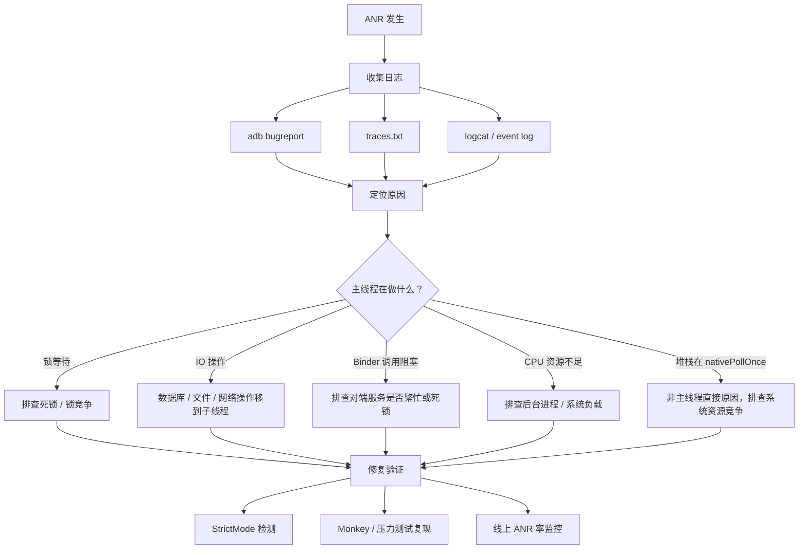
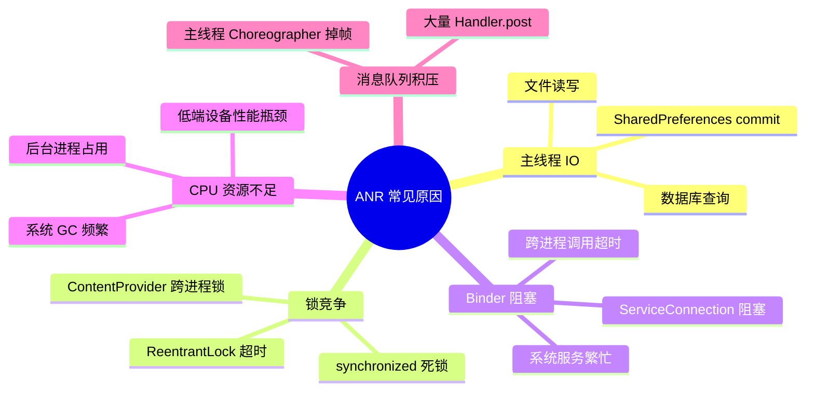
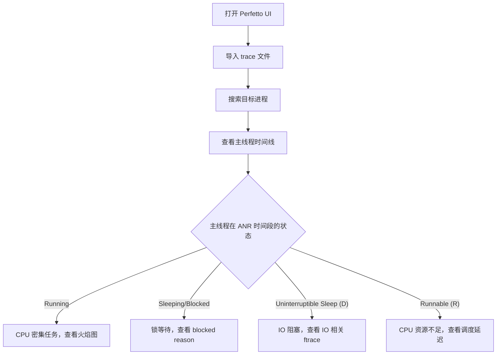
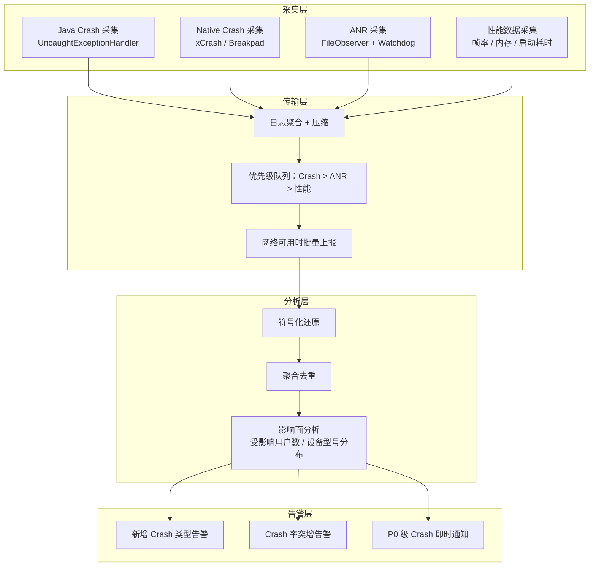

# 稳定性调试方法论

## ANR 分析实战

### ANR 排查流程



### traces.txt 文件解读

ANR 发生时，系统会将所有进程的线程堆栈写入 `/data/anr/traces.txt`（Android 11+ 可能在 `/data/anr/` 下以时间戳命名）。

**获取 traces.txt：**

```bash
# 方式 1：直接拉取（需要 root 或 debuggable 应用）
adb pull /data/anr/traces.txt

# 方式 2：通过 bugreport 获取（推荐，包含更完整的信息）
adb bugreport bugreport.zip

# 方式 3：ApplicationExitInfo API（Android 11+，无需 root）
```

```kotlin
// Android 11+ 通过代码获取 ANR traces
fun getAnrTraces(context: Context): String? {
    if (Build.VERSION.SDK_INT < Build.VERSION_CODES.R) return null

    val am = context.getSystemService(Context.ACTIVITY_SERVICE) as ActivityManager
    val exitInfos = am.getHistoricalProcessExitReasons(
        context.packageName,
        0,  // pid = 0 表示获取所有记录
        10  // 最多获取 10 条
    )

    return exitInfos
        .filter { it.reason == ApplicationExitInfo.REASON_ANR }
        .firstOrNull()
        ?.traceInputStream
        ?.bufferedReader()
        ?.readText()
}
```

**traces.txt 关键字段解读：**

```text
----- pid 12345 at 2026-04-06 10:30:00.000 -----
Cmd line: com.example.myapp                        ← 包名
...
"main" prio=5 tid=1 Blocked                        ← 主线程状态：Blocked 表示锁等待
  | group="main" sCount=1 ucsCount=0 flags=1 obj=0x... self=0x...
  | sysTid=12345 nice=-10 cgrp=default sched=0/0 handle=0x...
  | state=S schedstat=( ... ) utm=150 stm=30 core=2 HZ=100
  | stack=0x... stackSize=...
  | held mutexes=
  at com.example.myapp.db.DatabaseHelper.query(DatabaseHelper.kt:85)  ← 阻塞位置
  - waiting to lock <0x0abcdef0> (a java.lang.Object)                 ← 等待的锁
  - locked <0x0abcdef1> (a java.lang.Object)                          ← 已持有的锁
  at com.example.myapp.ui.MainActivity.loadData(MainActivity.kt:42)
  at android.app.Activity.performResume(Activity.java:8100)
  ...
```

**关注重点：**

| 字段 | 含义 | 排查提示 |
|------|------|----------|
| `main` 线程的 `state` | `Blocked`/`Waiting`/`Sleeping`/`Running` | Blocked = 锁等待，Running = CPU 密集计算 |
| `waiting to lock` | 主线程正在等待的锁对象 | 搜索哪个线程持有此锁 |
| `held mutexes` | 当前线程持有的锁 | 判断是否存在死锁环 |
| `utm` / `stm` | 用户态/内核态 CPU 时间 | 值很大说明确实在执行，值很小说明被阻塞 |

### ANR 常见原因分类与排查思路



### 使用 adb bugreport

```bash
# 生成完整 bugreport（包含 ANR traces、系统日志、CPU 信息等）
adb bugreport bugreport.zip

# 解压后重点文件
# bugreport-xxx.txt       → 主报告，包含 ANR 分析、CPU 使用率等
# FS/data/anr/            → ANR traces 文件
# FS/data/tombstones/     → Native crash 信息
# proto/                  → 结构化数据（Android 12+）
```

**bugreport 中 ANR 相关的关键段落：**

```text
搜索关键字              含义
"ANR in"              ANR 发生的应用和组件
"CPU usage"           ANR 发生前后的 CPU 使用率分布
"iowait"              IO 等待占比，高值说明存在磁盘瓶颈
"100%TOTAL"           系统整体 CPU 满载
```

## Tombstone / Native Crash 分析

### Tombstone 文件结构解读

Native Crash 发生时，`debuggerd` 守护进程会生成 Tombstone 文件，保存在 `/data/tombstones/` 目录下。

```text
*** *** *** *** *** *** *** *** *** *** *** *** *** *** *** ***
Build fingerprint: 'google/raven/raven:14/...'
Revision: '0'
ABI: 'arm64'
Timestamp: 2026-04-06 10:30:00.123456789+0800
Process uptime: 3600s

pid: 12345, tid: 12346, name: RenderThread  >>> com.example.myapp <<<
uid: 10100
tagged_addr_ctrl: 0000000000000001
signal 11 (SIGSEGV), code 1 (SEGV_MAPERR), fault addr 0x0000000000000010
    x0  0x0000000000000000  x1  0x0000007fc3a4e8b0  x2  0x0000000000000010
    x3  0x0000000000000000  x4  0x0000007b5a234560  x5  0x0000000000000001
    ...

backtrace:
    #00 pc 0x00000000000a1234  /data/app/.../lib/arm64/libnative.so (processFrame+64)
    #01 pc 0x00000000000a1100  /data/app/.../lib/arm64/libnative.so (renderLoop+128)
    #02 pc 0x00000000000b2200  /data/app/.../lib/arm64/libnative.so (Java_com_example_NativeRenderer_draw+32)
    #03 pc 0x0000000000567890  /apex/com.android.art/lib64/libart.so (art_quick_invoke_stub+520)
    ...

stack:
    0x0000007fc3a4e800  0x0000007b5a234560  /data/app/.../lib/arm64/libnative.so
    ...

memory near x0 ([anon:scudo:primary]):
    0x0000000000000000  ????????????????  ????????????????
    ...
```

**关键字段解读：**

| 字段 | 含义 |
|------|------|
| `signal 11 (SIGSEGV)` | 崩溃信号类型（见下方分类表） |
| `code 1 (SEGV_MAPERR)` | 信号子码，MAPERR = 访问未映射内存 |
| `fault addr` | 引发崩溃的内存地址，0x0 附近通常为空指针解引用 |
| `backtrace` | 调用栈，`pc` 是程序计数器偏移量 |
| `x0-x30` | ARM64 寄存器快照 |

### addr2line / ndk-stack 符号化方法

原始 Tombstone 中的地址需要通过符号表还原为源代码位置：

```bash
# 方法 1：addr2line —— 逐地址解析
# 需要保留未 strip 的 .so 文件（通常在 app/build/intermediates/cmake/debug/obj/ 下）
${NDK_HOME}/toolchains/llvm/prebuilt/linux-x86_64/bin/llvm-addr2line \
    -e app/build/intermediates/cmake/debug/obj/arm64-v8a/libnative.so \
    -f -C \
    0x00000000000a1234

# 输出示例：
# processFrame(Frame*)
# /home/dev/project/native/src/renderer.cpp:142

# 方法 2：ndk-stack —— 批量解析完整 tombstone
adb logcat -d | ${NDK_HOME}/ndk-stack -sym app/build/intermediates/cmake/debug/obj/arm64-v8a/

# 方法 3：直接解析 tombstone 文件
${NDK_HOME}/ndk-stack -sym obj/arm64-v8a/ -dump tombstone_00
```

**符号化工作流程：**


> **重要提示：** 发版时务必归档未 strip 的 .so 文件与对应的 Git commit hash，否则线上 crash 将无法符号化。建议在 CI/CD 流程中自动上传符号表。

### 常见 Native Crash 类型

| 信号 | 名称 | 常见原因 | 排查思路 |
|------|------|----------|----------|
| `SIGSEGV` (11) | 段错误 | 空指针解引用、野指针、越界访问、use-after-free | 检查 `fault addr`：接近 0x0 → 空指针；随机地址 → 野指针/use-after-free |
| `SIGABRT` (6) | 主动终止 | `abort()` 调用、assert 失败、C++ 未捕获异常、JNI 异常未处理 | 查看 `abort message` 字段，通常包含具体原因 |
| `SIGBUS` (7) | 总线错误 | 内存对齐错误、映射文件被截断 | 检查 `fault addr` 是否在 mmap 区域内 |
| `SIGFPE` (8) | 算术异常 | 整数除以零、无效浮点运算 | 检查崩溃位置附近的算术操作 |
| `SIGILL` (4) | 非法指令 | 代码段被覆写、ABI 不匹配、编译器 bug | 确认 .so 的目标架构与设备一致 |

```kotlin
// JNI 中常见的导致 SIGABRT 的错误
// ❌ 错误：JNI 调用后未检查异常，后续调用触发 abort
external fun nativeProcess(): String

fun callNative() {
    val result = nativeProcess()
    // 如果 nativeProcess 内部抛出了 Java 异常（通过 ThrowNew），
    // 但 native 代码未检查并 return，继续调用其他 JNI 函数时
    // 虚拟机会 abort 并输出 "JNI DETECTED ERROR IN APPLICATION"
}
```

```c
// ✅ 正确的 JNI 异常检查模式（C 代码示例）
JNIEXPORT jstring JNICALL
Java_com_example_NativeLib_process(JNIEnv *env, jobject thiz) {
    jclass cls = (*env)->FindClass(env, "com/example/DataClass");
    // 每次 JNI 调用后检查是否有 pending exception
    if ((*env)->ExceptionCheck(env)) {
        // 有异常，清除并返回，避免后续 JNI 调用触发 abort
        (*env)->ExceptionClear(env);
        return NULL;
    }
    // ... 继续操作
}
```

## 调试工具链

### StrictMode 使用

StrictMode 是 Android 提供的开发期检测工具，可发现主线程上的 IO 操作、内存泄漏等问题。

```kotlin
class App : Application() {
    override fun onCreate() {
        super.onCreate()

        if (BuildConfig.DEBUG) {
            enableStrictMode()
        }
    }

    private fun enableStrictMode() {
        // 线程策略：检测主线程上的不当操作
        StrictMode.setThreadPolicy(
            StrictMode.ThreadPolicy.Builder()
                .detectDiskReads()          // 检测磁盘读取
                .detectDiskWrites()         // 检测磁盘写入
                .detectNetwork()            // 检测网络操作
                .detectCustomSlowCalls()    // 检测自定义慢调用
                .penaltyLog()               // 违规时输出日志
                .penaltyFlashScreen()       // 违规时屏幕闪烁（直观提示）
                // .penaltyDeath()          // 违规时直接崩溃（严格模式）
                .build()
        )

        // VM 策略：检测虚拟机层面的问题
        StrictMode.setVmPolicy(
            StrictMode.VmPolicy.Builder()
                .detectLeakedSqlLiteObjects()       // 检测未关闭的 SQLite 对象
                .detectLeakedClosableObjects()      // 检测未关闭的 Closeable
                .detectActivityLeaks()              // 检测 Activity 泄漏
                .detectLeakedRegistrationObjects()  // 检测未注销的 BroadcastReceiver 等
                .detectFileUriExposure()             // 检测 file:// URI 暴露
                .detectContentUriWithoutPermission() // 检测无权限的 ContentUri
                .penaltyLog()
                .build()
        )
    }
}
```

**StrictMode 日志示例与解读：**

```text
D/StrictMode: StrictMode policy violation: ~duration=120 ms
    android.os.StrictMode$StrictModeDiskReadViolation
        at android.os.StrictMode$AndroidBlockGuardPolicy.onReadFromDisk(...)
        at com.example.myapp.SettingsManager.loadConfig(SettingsManager.kt:35)
        at com.example.myapp.MainActivity.onCreate(MainActivity.kt:22)
```

上述日志表示在 `MainActivity.onCreate` 中通过 `SettingsManager.loadConfig` 在主线程执行了 120ms 的磁盘读取操作，应迁移到协程或子线程中。

### Android Profiler 实时监控

Android Studio 内置的 Profiler 工具可实时监控应用的 CPU、内存、网络和能耗：

```kotlin
// 在代码中插入自定义 trace 标记，方便在 Profiler / Perfetto 中定位
import android.os.Trace

fun heavyComputation() {
    Trace.beginSection("heavyComputation") // 标记开始
    try {
        // 耗时操作
        processData()
        transformResults()
    } finally {
        Trace.endSection() // 标记结束（务必在 finally 中调用）
    }
}

// Kotlin 扩展函数封装，简化使用
inline fun <T> traceBlock(sectionName: String, block: () -> T): T {
    Trace.beginSection(sectionName)
    return try {
        block()
    } finally {
        Trace.endSection()
    }
}

// 使用方式
fun loadUserData() = traceBlock("loadUserData") {
    val users = database.queryAllUsers()
    users.map { it.toDisplayModel() }
}
```

**Profiler 使用要点：**

| 功能 | 用途 | 快捷操作 |
|------|------|----------|
| CPU Profiler | 查看方法执行耗时、线程状态 | 录制 trace → 火焰图分析热点方法 |
| Memory Profiler | 监控堆内存分配、检测泄漏 | Heap Dump → 搜索泄漏的 Activity/Fragment |
| Network Profiler | 查看网络请求时序和数据量 | 点击请求查看详情 |
| Energy Profiler | 检测 WakeLock、JobScheduler 使用 | 查看异常的唤醒和后台任务 |

### Perfetto 系统级 Trace 分析

Perfetto 是 Google 推出的下一代系统级 trace 工具，替代旧版 systrace，支持在 [ui.perfetto.dev](https://ui.perfetto.dev) 中可视化分析。

```bash
# 录制 perfetto trace（推荐方式）
adb shell perfetto \
    -c - --txt \
    -o /data/misc/perfetto-traces/trace.perfetto-trace \
    <<EOF
buffers: {
    size_kb: 63488
    fill_policy: RING_BUFFER
}
data_sources: {
    config {
        name: "linux.ftrace"
        ftrace_config {
            ftrace_events: "sched/sched_switch"
            ftrace_events: "power/suspend_resume"
            ftrace_events: "sched/sched_wakeup"
            ftrace_events: "sched/sched_blocked_reason"
            atrace_categories: "am"
            atrace_categories: "wm"
            atrace_categories: "view"
            atrace_categories: "gfx"
            atrace_categories: "dalvik"
            atrace_apps: "com.example.myapp"
        }
    }
}
duration_ms: 10000
EOF

# 拉取 trace 文件
adb pull /data/misc/perfetto-traces/trace.perfetto-trace

# 在浏览器中打开分析
# 访问 https://ui.perfetto.dev 并导入 trace 文件
```

**Perfetto 分析 ANR 的关键视图：**



### Logcat 高效过滤技巧

```bash
# 按优先级过滤（仅显示 Warning 及以上）
adb logcat *:W

# 按 Tag 过滤应用日志
adb logcat -s MyApp:D CrashHandler:V

# 按 PID 过滤（先获取目标进程 PID）
adb shell pidof com.example.myapp
adb logcat --pid=12345

# 使用正则过滤（查找 ANR 相关日志）
adb logcat | grep -E "(ANR|anr|Application Not Responding)"

# 查看系统事件日志（包含 ANR、Crash 等系统级事件）
adb logcat -b events | grep -E "(am_anr|am_crash|am_proc_died)"

# 按时间范围过滤
adb logcat -T "04-06 10:30:00.000"

# 输出到文件并实时查看
adb logcat -f /sdcard/log.txt &
adb logcat | tee local_log.txt

# 清除旧日志后开始新录制
adb logcat -c && adb logcat
```

**常用 Logcat Tag 速查表：**

| Tag | 来源 | 用途 |
|-----|------|------|
| `ActivityManager` | AMS | ANR、进程启动/死亡、Activity 生命周期 |
| `WindowManager` | WMS | 窗口管理、焦点变化 |
| `System.err` | Java Runtime | 未捕获异常堆栈 |
| `DEBUG` | debuggerd | Native crash 信息 |
| `lowmemorykiller` | lmkd | 低内存杀进程记录 |
| `Watchdog` | SystemServer | 系统服务死锁检测 |
| `StrictMode` | StrictMode | 开发期违规检测 |

```kotlin
// 在代码中规范化日志输出，方便 Logcat 过滤
object AppLog {
    private const val TAG = "MyApp"

    fun d(message: String, tag: String = TAG) {
        if (BuildConfig.DEBUG) {
            Log.d(tag, "[${Thread.currentThread().name}] $message")
        }
    }

    fun e(message: String, throwable: Throwable? = null, tag: String = TAG) {
        Log.e(tag, "[${Thread.currentThread().name}] $message", throwable)
    }

    // 带性能时间戳的日志，用于排查耗时问题
    fun perf(label: String, block: () -> Unit) {
        val start = SystemClock.elapsedRealtime()
        block()
        val elapsed = SystemClock.elapsedRealtime() - start
        d("[$label] 耗时: ${elapsed}ms")
        if (elapsed > 16) {
            Log.w(TAG, "[$label] 耗时 ${elapsed}ms，超过一帧时间(16ms)，可能导致掉帧")
        }
    }
}
```

## 线上监控体系建设建议



**建设建议：**

| 阶段 | 目标 | 关键指标 |
|------|------|----------|
| **第一阶段：基础采集** | 接入 Crash/ANR 采集 SDK | Crash 率 < 0.1%、ANR 率 < 0.5% |
| **第二阶段：符号化 + 聚合** | 自动化符号还原、相似堆栈聚合 | Top 10 Crash 覆盖率 > 90% |
| **第三阶段：告警 + 度量** | 新增 Crash 告警、发版后 Crash 率对比 | 新版本 Crash 率不高于上一版本 |
| **第四阶段：深度分析** | 设备/OS/渠道维度分析、根因自动归类 | 平均修复周期 < 3 天 |

```kotlin
// 线上 ANR 检测方案示例：基于主线程 Watchdog
class MainThreadWatchdog(
    private val timeout: Long = 5000L,
    private val reporter: AnrReporter
) {

    private val mainHandler = Handler(Looper.getMainLooper())
    private val watchdogThread = HandlerThread("anr-watchdog").apply { start() }
    private val watchdogHandler = Handler(watchdogThread.looper)

    @Volatile
    private var mainThreadResponded = false

    fun start() {
        scheduleCheck()
    }

    private fun scheduleCheck() {
        mainThreadResponded = false

        // 向主线程发送心跳消息
        mainHandler.post { mainThreadResponded = true }

        // 在 watchdog 线程中等待超时
        watchdogHandler.postDelayed({
            if (!mainThreadResponded) {
                // 主线程在 timeout 内未响应，可能发生 ANR
                val stackTrace = Looper.getMainLooper().thread.stackTrace
                reporter.reportPotentialAnr(stackTrace)
            }
            scheduleCheck() // 继续下一轮检测
        }, timeout)
    }

    fun stop() {
        mainHandler.removeCallbacksAndMessages(null)
        watchdogHandler.removeCallbacksAndMessages(null)
    }
}

interface AnrReporter {
    fun reportPotentialAnr(stackTrace: Array<StackTraceElement>)
}
```

## 踩坑记录

> 此区域供团队成员补充项目中遇到的真实案例。

| 日期 | 记录人 | 问题描述 | 解决方案 |
|------|--------|----------|----------|
| | | | |

## 参考资料

- [Android 官方文档 - ANR](https://developer.android.com/topic/performance/vitals/anr)
- [Android 官方文档 - Tombstone 调试](https://source.android.com/docs/core/tests/debug)
- [Perfetto 官方文档](https://perfetto.dev/docs/)
- [NDK 调试指南 - addr2line](https://developer.android.com/ndk/guides/ndk-stack)
- [StrictMode 官方文档](https://developer.android.com/reference/android/os/StrictMode)
- [Android Profiler 使用指南](https://developer.android.com/studio/profile)
- [xCrash - Native Crash 捕获方案](https://github.com/nicknux/xCrash)
- [ApplicationExitInfo 文档](https://developer.android.com/reference/android/app/ApplicationExitInfo)
