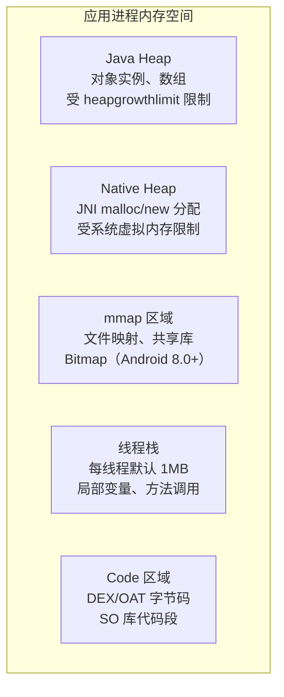
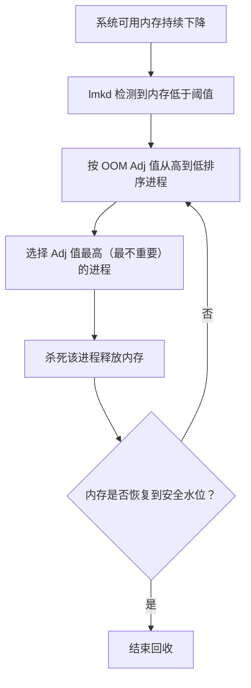
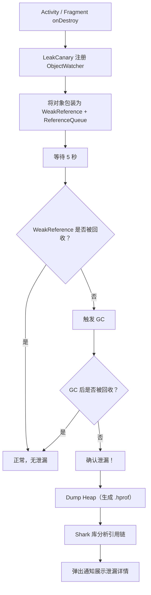

# 内存稳定性与 OOM

## Android 进程内存模型

### 内存区域划分

Android 应用进程的内存由多个区域组成，每个区域有不同的用途和限制：



| 区域 | 内容 | 限制 | 监控方式 |
|------|------|------|----------|
| Java Heap | 对象实例、数组 | `dalvik.vm.heapgrowthlimit`（通常 256-512MB） | `Runtime.maxMemory()` / `totalMemory()` / `freeMemory()` |
| Native Heap | JNI 代码中 `malloc` / `new` 分配 | 受虚拟地址空间限制（32 位 ~3GB，64 位几乎无限） | `/proc/[pid]/status` 中 `VmRSS` |
| mmap | 文件映射、SO 库、Android 8.0+ 的 Bitmap | 受虚拟地址空间限制 | `/proc/[pid]/maps` |
| 线程栈 | 局部变量、方法调用帧 | 每线程默认 ~1MB | `/proc/[pid]/status` 中 `Threads` |
| Code | DEX / OAT 字节码、.so 代码段 | 只读映射 | — |

### 进程内存上限

```kotlin
fun printMemoryInfo(context: Context) {
    val runtime = Runtime.getRuntime()
    val am = context.getSystemService(Context.ACTIVITY_SERVICE) as ActivityManager
    val memoryClass = am.memoryClass           // 标准内存限制（MB）
    val largeMemoryClass = am.largeMemoryClass  // largeHeap 内存限制（MB）

    Log.d("Memory", buildString {
        appendLine("标准内存限制: ${memoryClass}MB")
        appendLine("largeHeap 限制: ${largeMemoryClass}MB")
        appendLine("JVM 最大内存: ${runtime.maxMemory() / 1024 / 1024}MB")
        appendLine("JVM 已分配: ${runtime.totalMemory() / 1024 / 1024}MB")
        appendLine("JVM 空闲: ${runtime.freeMemory() / 1024 / 1024}MB")
    })
}
```

> **largeHeap 使用须知：** 在 `AndroidManifest.xml` 中设置 `android:largeHeap="true"` 可获得更大的 Java Heap 上限。但这不是解决内存问题的正确方式——它只是推迟了 OOM 的发生，同时增加了 GC 停顿时间。仅在确实需要大量内存的应用（如图片编辑器）中使用。

## Low Memory Killer（lmkd）

### OOM Adj 优先级体系

Android 通过 `oom_adj` 值为每个进程设置优先级。内存不足时，系统按优先级从低到高杀进程：

| OOM Adj 值 | 进程类型 | 说明 | 被杀优先级 |
|-----------|----------|------|-----------|
| 0 | FOREGROUND | 前台 Activity / 前台 Service | 最后被杀 |
| 100 | VISIBLE | 可见但非前台（如被对话框部分遮挡） | 低 |
| 200 | PERCEPTIBLE | 用户可感知（如后台播放音乐） | 低 |
| 300 | BACKUP | 备份进程 | 中 |
| 700 | SERVICE | 后台 Service（已启动 30 分钟以上） | 中 |
| 800 | HOME | Launcher 进程 | 中高 |
| 900 | PREVIOUS | 上一个 Activity 的进程 | 高 |
| 999 | CACHED | 缓存进程（空进程） | 最先被杀 |

### lmkd 工作机制



```bash
# 查看当前进程的 OOM Adj 值
adb shell cat /proc/$(adb shell pidof com.example.myapp)/oom_adj

# 查看 lmkd 的内存阈值配置
adb shell getprop sys.lmk.minfree_levels
```

### 进程优先级提升策略

```kotlin
// 通过前台 Service 提升进程优先级
class KeepAliveService : Service() {
    override fun onStartCommand(intent: Intent?, flags: Int, startId: Int): Int {
        val notification = createNotification()
        startForeground(NOTIFICATION_ID, notification)
        return START_STICKY
    }

    private fun createNotification(): Notification {
        val channel = NotificationChannel(
            "keep_alive", "后台运行",
            NotificationManager.IMPORTANCE_LOW
        )
        val nm = getSystemService(NotificationManager::class.java)
        nm.createNotificationChannel(channel)

        return NotificationCompat.Builder(this, "keep_alive")
            .setContentTitle("应用运行中")
            .setSmallIcon(R.drawable.ic_notification)
            .build()
    }

    override fun onBind(intent: Intent?): IBinder? = null

    companion object {
        private const val NOTIFICATION_ID = 1001
    }
}
```

## OOM 类型分类

### Java OOM

Java Heap 空间不足，`new` 对象时抛出 `OutOfMemoryError`：

```kotlin
// 常见触发场景
// 1. 大图直接加载到内存
val bitmap = BitmapFactory.decodeFile(hugeImagePath) // 可能一张图占 100MB+

// 2. 集合无限制增长
val cache = mutableListOf<ByteArray>()
while (true) {
    cache.add(ByteArray(1024 * 1024)) // 1MB per item，持续增长直到 OOM
}

// 3. 内存泄漏导致可用内存越来越少（详见"内存泄漏常见模式"章节）
```

### Native OOM

Native Heap（`malloc` / `new`）分配失败。常见于大量 JNI 操作或底层库的内存消耗：

```text
# Native OOM 的典型日志
A/libc: Fatal signal 6 (SIGABRT), code -1 in tid 12345
A/DEBUG: Abort message: 'Failed to allocate 16777216 bytes'
```

> **32 位进程的特殊问题：** 32 位进程的虚拟地址空间上限约 3-4GB，在大量 mmap 映射后，即使物理内存充裕也会因为虚拟地址空间碎片化而 OOM。

### FD 耗尽

Linux 系统中每个进程有文件描述符（FD）上限，Android 中默认为 1024：

```bash
# 查看进程的 FD 使用情况
adb shell ls -la /proc/$(adb shell pidof com.example.myapp)/fd | wc -l

# 查看 FD 上限
adb shell cat /proc/$(adb shell pidof com.example.myapp)/limits | grep "open files"
```

常见 FD 泄漏源：

| 泄漏源 | 原因 | 修复 |
|--------|------|------|
| 未关闭的 `InputStream` / `OutputStream` | `open()` 后异常分支未 `close()` | 使用 `use {}` 扩展函数 |
| 未关闭的 `Cursor` | 数据库查询后未 close | 使用 `use {}` 或 Room 自动管理 |
| `HandlerThread` 未 quit | 线程内部持有 Looper 的 FD | 在不需要时调用 `quitSafely()` |
| `ParcelFileDescriptor` 未关闭 | 跨进程传递 FD 后未释放 | 使用 `use {}` |

```kotlin
// ✅ 使用 Kotlin use 扩展自动关闭
context.contentResolver.query(uri, null, null, null, null)?.use { cursor ->
    while (cursor.moveToNext()) {
        // 处理数据
    }
} // 自动 close
```

### 线程数限制

Android 对每个进程的线程数有限制（通常 500-2000，取决于设备）。线程数耗尽时 `pthread_create` 失败：

```text
java.lang.OutOfMemoryError: pthread_create (1040KB stack) failed: Try again
```

```bash
# 查看进程当前线程数
adb shell cat /proc/$(adb shell pidof com.example.myapp)/status | grep Threads
```

## 内存泄漏常见模式

### Activity / Fragment 泄漏

```kotlin
// ❌ 静态变量持有 Activity 引用
companion object {
    var leakedActivity: Activity? = null  // Activity 销毁后仍被引用
}

// ❌ 单例持有 Activity Context
object AppManager {
    private lateinit var context: Context
    fun init(context: Context) {
        this.context = context // 如果传入 Activity，则泄漏
    }
}

// ✅ 使用 Application Context
object AppManager {
    private lateinit var context: Context
    fun init(context: Context) {
        this.context = context.applicationContext
    }
}
```

### Handler 泄漏

```kotlin
// ❌ 匿名 Handler 隐式持有外部 Activity 引用
class MyActivity : AppCompatActivity() {
    private val handler = object : Handler(Looper.getMainLooper()) {
        override fun handleMessage(msg: Message) {
            // 匿名内部类隐式引用外部 Activity
            updateUI(msg.what)
        }
    }

    override fun onCreate(savedInstanceState: Bundle?) {
        super.onCreate(savedInstanceState)
        handler.sendEmptyMessageDelayed(0, 60_000) // 1 分钟后执行
        // 如果 Activity 在 1 分钟内销毁，Handler 仍引用 Activity → 泄漏
    }
}

// ✅ 使用 WeakReference + 静态 Handler
class MyActivity : AppCompatActivity() {
    private class SafeHandler(activity: MyActivity) : Handler(Looper.getMainLooper()) {
        private val activityRef = WeakReference(activity)
        override fun handleMessage(msg: Message) {
            activityRef.get()?.updateUI(msg.what)
        }
    }

    private val handler = SafeHandler(this)

    override fun onDestroy() {
        super.onDestroy()
        handler.removeCallbacksAndMessages(null) // 清理消息队列
    }
}
```

### 匿名内部类与 Lambda

```kotlin
// ❌ Kotlin Lambda 捕获外部 Activity 引用
class MyActivity : AppCompatActivity() {
    override fun onCreate(savedInstanceState: Bundle?) {
        super.onCreate(savedInstanceState)

        someService.registerCallback {
            // Lambda 捕获了 this（Activity），如果回调未注销，Activity 泄漏
            textView.text = "Updated"
        }
    }

    override fun onDestroy() {
        super.onDestroy()
        someService.unregisterCallback() // 必须注销
    }
}
```

### 单例持有 Context

```kotlin
// ✅ 安全的单例 Context 模式
class AppPreferences private constructor(context: Context) {
    // 始终使用 Application Context
    private val prefs = context.applicationContext
        .getSharedPreferences("app_prefs", Context.MODE_PRIVATE)

    companion object {
        @Volatile
        private var instance: AppPreferences? = null

        fun getInstance(context: Context): AppPreferences {
            return instance ?: synchronized(this) {
                instance ?: AppPreferences(context).also { instance = it }
            }
        }
    }
}
```

### 资源未关闭

```kotlin
// ❌ 异常分支导致资源未关闭
fun readFile(path: String): String {
    val stream = FileInputStream(path)
    val content = stream.bufferedReader().readText()
    stream.close() // 如果 readText() 抛异常，close 不会被执行
    return content
}

// ✅ 使用 use 自动关闭
fun readFile(path: String): String {
    return FileInputStream(path).use { stream ->
        stream.bufferedReader().readText()
    }
}
```

## LeakCanary 使用与原理

### 接入与配置

```kotlin
// build.gradle.kts
dependencies {
    // 仅在 debug 构建中引入，release 自动无操作
    debugImplementation("com.squareup.leakcanary:leakcanary-android:2.14")
}
```

无需任何初始化代码——LeakCanary 通过 `ContentProvider` 自动初始化。

### 检测原理



### 泄漏报告解读

LeakCanary 展示的 Leak Trace 是从 GC Root 到泄漏对象的最短引用链：

```text
┬───
│ GC Root: Global variable in runtime internals
│
├─ com.example.AppManager class
│    Leaking: NO (class is never leaking)
│    ↓ static AppManager.context
│                        ~~~~~~~
├─ com.example.MyActivity instance
│    Leaking: YES (Activity#mDestroyed = true)
│    ↓ MyActivity.textView
╰→ android.widget.TextView instance
     Leaking: YES (View detached)
```

**解读方法：**

| 符号 | 含义 |
|------|------|
| `Leaking: NO` | 该对象不应该被回收（GC Root / 全局单例等） |
| `Leaking: YES` | 该对象应该被回收但未被回收（泄漏对象） |
| `↓` 箭头后的字段名 | 造成泄漏的引用链中的具体字段 |
| `~~~~~~~` 下划线 | 标记出问题的引用（修复点） |

## onTrimMemory 回调处理

```kotlin
class MyApplication : Application(), ComponentCallbacks2 {

    override fun onTrimMemory(level: Int) {
        super.onTrimMemory(level)
        when (level) {
            // 应用在前台，系统内存开始紧张
            ComponentCallbacks2.TRIM_MEMORY_RUNNING_MODERATE ->
                releaseNonCriticalCache()

            ComponentCallbacks2.TRIM_MEMORY_RUNNING_LOW ->
                releaseImageCache()

            ComponentCallbacks2.TRIM_MEMORY_RUNNING_CRITICAL ->
                releaseAllCache()

            // 应用切到后台
            ComponentCallbacks2.TRIM_MEMORY_UI_HIDDEN ->
                releaseUIResources()

            // 应用在后台，系统内存越来越紧张
            ComponentCallbacks2.TRIM_MEMORY_BACKGROUND,
            ComponentCallbacks2.TRIM_MEMORY_MODERATE,
            ComponentCallbacks2.TRIM_MEMORY_COMPLETE ->
                releaseEverythingPossible()
        }
    }

    private fun releaseNonCriticalCache() {
        // 释放非关键缓存（如预加载数据）
    }

    private fun releaseImageCache() {
        Glide.get(this).clearMemory()
    }

    private fun releaseAllCache() {
        releaseImageCache()
        // 清理所有内存缓存
    }

    private fun releaseUIResources() {
        // 释放 UI 相关资源（大 Bitmap、动画缓存等）
    }

    private fun releaseEverythingPossible() {
        releaseAllCache()
        releaseUIResources()
        // 释放所有可释放的资源，避免被 LMK 杀死
    }
}
```

## Bitmap 与大图内存管理

**Bitmap 内存计算：**

```
内存 = 宽度 × 高度 × 每像素字节数

ARGB_8888: 4 bytes/pixel → 4000×3000 图片 = 48MB
RGB_565:   2 bytes/pixel → 4000×3000 图片 = 24MB
```

```kotlin
// 降采样加载大图
fun decodeSampledBitmap(path: String, reqWidth: Int, reqHeight: Int): Bitmap {
    val options = BitmapFactory.Options().apply {
        inJustDecodeBounds = true // 仅读取尺寸，不分配内存
    }
    BitmapFactory.decodeFile(path, options)

    options.inSampleSize = calculateInSampleSize(options, reqWidth, reqHeight)
    options.inJustDecodeBounds = false
    return BitmapFactory.decodeFile(path, options)
}

fun calculateInSampleSize(
    options: BitmapFactory.Options,
    reqWidth: Int,
    reqHeight: Int
): Int {
    val (height, width) = options.outHeight to options.outWidth
    var inSampleSize = 1
    if (height > reqHeight || width > reqWidth) {
        val halfHeight = height / 2
        val halfWidth = width / 2
        while (halfHeight / inSampleSize >= reqHeight
            && halfWidth / inSampleSize >= reqWidth) {
            inSampleSize *= 2
        }
    }
    return inSampleSize
}
```

> **推荐：** 使用 Glide 或 Coil 等图片库自动处理采样、缓存和内存管理，避免手动管理 Bitmap 生命周期。

## 线程与 FD 泄漏排查

```bash
# 1. 查看进程的线程数
adb shell cat /proc/$(adb shell pidof com.example.myapp)/status | grep Threads

# 2. 列出所有线程及其名称
adb shell ls /proc/$(adb shell pidof com.example.myapp)/task/ | while read tid; do
    echo "$tid: $(cat /proc/$(adb shell pidof com.example.myapp)/task/$tid/comm 2>/dev/null)"
done

# 3. 查看 FD 数量
adb shell ls /proc/$(adb shell pidof com.example.myapp)/fd | wc -l

# 4. 查看 FD 指向的资源
adb shell ls -la /proc/$(adb shell pidof com.example.myapp)/fd

# 5. 查看内存映射
adb shell cat /proc/$(adb shell pidof com.example.myapp)/maps | head -50

# 6. 完整内存信息
adb shell dumpsys meminfo com.example.myapp
```

```kotlin
// 在代码中监控线程数和 FD 数
fun logResourceUsage() {
    val threadCount = Thread.activeCount()
    val fdCount = File("/proc/self/fd").listFiles()?.size ?: -1
    val runtime = Runtime.getRuntime()
    val usedMemMB = (runtime.totalMemory() - runtime.freeMemory()) / 1024 / 1024

    Log.d("ResourceMonitor", buildString {
        appendLine("线程数: $threadCount")
        appendLine("FD 数: $fdCount")
        appendLine("Java Heap 已用: ${usedMemMB}MB")
    })

    if (fdCount > 800) {
        Log.w("ResourceMonitor", "FD 数即将达到上限(1024)，可能存在 FD 泄漏！")
    }
    if (threadCount > 300) {
        Log.w("ResourceMonitor", "线程数过多($threadCount)，可能存在线程泄漏！")
    }
}
```

## 常见坑点

### 1. Bitmap.recycle() 后仍被引用

```kotlin
// ❌ recycle 后尝试使用 Bitmap
bitmap.recycle()
canvas.drawBitmap(bitmap, 0f, 0f, null) // 崩溃！

// ✅ recycle 后置空引用
bitmap.recycle()
bitmap = null
```

### 2. WebView 内存泄漏

WebView 是 Android 中最容易导致内存泄漏的组件之一，因为它内部持有大量 Native 资源和 Activity 引用。

```kotlin
// ✅ 在独立进程中运行 WebView
// AndroidManifest.xml
// <activity android:name=".WebActivity" android:process=":web" />

// 在 Activity 销毁时彻底清理
override fun onDestroy() {
    webView.loadUrl("about:blank")
    webView.clearHistory()
    (webView.parent as? ViewGroup)?.removeView(webView)
    webView.destroy()
    super.onDestroy()
}
```

### 3. 使用 ArrayMap / SparseArray 替代 HashMap 减少内存

```kotlin
// 对于小规模数据（<1000 条），ArrayMap 比 HashMap 更省内存
val map = ArrayMap<String, Any>() // 替代 HashMap

// 键为 Int 时使用 SparseArray
val sparseArray = SparseArray<String>() // 替代 HashMap<Int, String>
```

## 踩坑记录

> 此区域供团队成员补充项目中遇到的真实案例。

| 日期 | 记录人 | 问题描述 | 解决方案 |
|------|--------|----------|----------|
| | | | |

## 参考资料

- [Android 官方文档 - 管理应用内存](https://developer.android.com/topic/performance/memory)
- [Android 官方文档 - 内存分析器](https://developer.android.com/studio/profile/memory-profiler)
- [LeakCanary 官方文档](https://square.github.io/leakcanary/)
- [Android 源码 - lmkd](https://cs.android.com/android/platform/superproject/+/main:system/memory/lmkd/)
- [Glide 内存管理](https://bumptech.github.io/glide/doc/caching.html)
