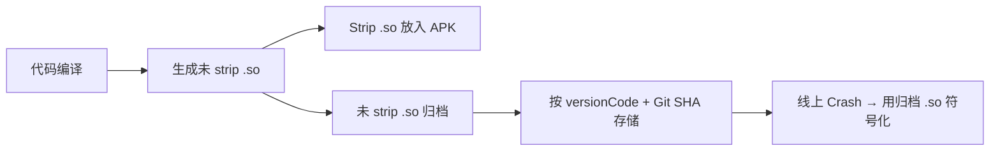

# Native Crash 与 Tombstone 分析

## Linux 信号机制详解

### 信号基本概念

信号（Signal）是 Linux 进程间通信的一种异步通知机制。当进程执行了非法操作时，CPU 硬件异常被内核捕获并转化为信号发送给进程。

信号分为两类：

| 类型 | 说明 | 举例 |
|------|------|------|
| **同步信号** | 由进程自身的操作触发（如非法内存访问） | SIGSEGV、SIGBUS、SIGFPE |
| **异步信号** | 由外部事件触发（如其他进程发送 `kill`） | SIGTERM、SIGKILL、SIGINT |

### 常见崩溃信号分类

| 信号 | 编号 | 名称 | 常见原因 | 子码与含义 |
|------|------|------|----------|-----------|
| `SIGSEGV` | 11 | 段错误 | 空指针、野指针、越界、use-after-free | `SEGV_MAPERR`=未映射地址、`SEGV_ACCERR`=权限不足 |
| `SIGABRT` | 6 | 主动终止 | `abort()`、assert 失败、C++ 异常 | 通常附带 `abort message` |
| `SIGBUS` | 7 | 总线错误 | 内存对齐错误、mmap 文件被截断 | `BUS_ADRALN`=对齐错误、`BUS_ADRERR`=物理地址不存在 |
| `SIGFPE` | 8 | 算术异常 | 整数除零、无效浮点运算 | `FPE_INTDIV`=整数除零、`FPE_FLTDIV`=浮点除零 |
| `SIGILL` | 4 | 非法指令 | 代码段被覆写、ABI 不匹配 | `ILL_ILLOPC`=非法操作码 |

### 自定义信号处理器

```c
#include <signal.h>
#include <string.h>

static struct sigaction old_sa[32]; // 保存旧的信号处理器

static void crash_signal_handler(int sig, siginfo_t *info, void *ucontext) {
    // 1. 在信号处理函数中只能调用 async-signal-safe 函数
    //    禁止：malloc、printf、Log
    //    允许：write、open、close、_exit

    // 2. 写入崩溃信息到预分配的 buffer
    const char *msg = "Native crash caught!\n";
    write(STDERR_FILENO, msg, strlen(msg));

    // 3. 恢复默认处理器，让系统生成 Tombstone
    sigaction(sig, &old_sa[sig], NULL);
    raise(sig); // 重新触发信号
}

void install_signal_handler() {
    struct sigaction sa;
    memset(&sa, 0, sizeof(sa));
    sa.sa_sigaction = crash_signal_handler;
    sa.sa_flags = SA_SIGINFO | SA_ONSTACK; // SA_ONSTACK: 使用备用栈

    // 注册需要捕获的信号
    int signals[] = {SIGSEGV, SIGABRT, SIGBUS, SIGFPE, SIGILL};
    for (int i = 0; i < 5; i++) {
        sigaction(signals[i], &sa, &old_sa[signals[i]]);
    }
}
```

> **备用栈（sigaltstack）：** 栈溢出（SIGSEGV with SEGV_ACCERR on stack address）时，原始栈已不可用，信号处理器需要在备用栈上运行：
>
> ```c
> stack_t ss;
> ss.ss_sp = malloc(SIGSTKSZ);
> ss.ss_size = SIGSTKSZ;
> ss.ss_flags = 0;
> sigaltstack(&ss, NULL);
> ```

## Tombstone 文件完整结构

### 头部信息

```text
*** *** *** *** *** *** *** *** *** *** *** *** *** *** *** ***
Build fingerprint: 'google/raven/raven:14/UP1A.231005.007/...'    ← 设备信息
Revision: '0'
ABI: 'arm64'                                                       ← CPU 架构
Timestamp: 2026-04-06 10:30:00.123456789+0800                      ← 崩溃时间
Process uptime: 3600s                                               ← 进程运行时长

pid: 12345, tid: 12346, name: RenderThread  >>> com.example.myapp <<<
uid: 10100
tagged_addr_ctrl: 0000000000000001
signal 11 (SIGSEGV), code 1 (SEGV_MAPERR), fault addr 0x0000000000000010
```

| 字段 | 含义 | 分析要点 |
|------|------|----------|
| `ABI` | CPU 架构 | 确认使用正确架构的 .so 进行符号化 |
| `pid / tid` | 进程 ID / 线程 ID | `pid == tid` 表示崩溃在主线程 |
| `name` | 崩溃线程名 | 判断是主线程、渲染线程还是业务线程 |
| `signal / code` | 信号类型和子码 | 参见上方"常见崩溃信号"表 |
| `fault addr` | 引发崩溃的内存地址 | 接近 0x0 → 空指针；小值偏移 → 结构体空指针成员访问 |

### 寄存器快照

```text
    x0  0x0000000000000000  x1  0x0000007fc3a4e8b0  x2  0x0000000000000010
    x3  0x0000000000000000  x4  0x0000007b5a234560  x5  0x0000000000000001
    ...
    x28 0x0000007b5a234000  x29 0x0000007fc3a4e900  
    lr  0x0000007b5a2345a8  sp  0x0000007fc3a4e8a0  pc  0x0000007b5a234578
```

| 寄存器 | 含义（ARM64） |
|--------|-------------|
| `x0` | 第 1 个函数参数 / 返回值 |
| `x0-x7` | 函数参数（前 8 个） |
| `x29` (fp) | 帧指针 |
| `x30` (lr) | 返回地址（Link Register） |
| `sp` | 栈指针 |
| `pc` | 程序计数器（崩溃时正在执行的指令地址） |

> **分析技巧：** `fault addr` 为 0x10 且 `x0` 为 0x0 → 代码尝试访问空指针对象偏移 0x10 处的成员变量。

### 调用栈（backtrace）

```text
backtrace:
      #00 pc 0x00000000000a1234  /data/app/.../lib/arm64/libnative.so (processFrame+64)
      #01 pc 0x00000000000a1100  /data/app/.../lib/arm64/libnative.so (renderLoop+128)
      #02 pc 0x00000000000b2200  /data/app/.../lib/arm64/libnative.so (nativeDraw+32)
      #03 pc 0x0000000000567890  /apex/com.android.art/lib64/libart.so (art_quick_invoke_stub+520)
```

| 字段 | 含义 |
|------|------|
| `#00` | 帧编号，#00 是崩溃点 |
| `pc 0x...` | 程序计数器在 .so 中的偏移量 |
| `.so 文件路径` | 崩溃发生的共享库 |
| `(函数名+偏移)` | 符号化后的函数名（如果 .so 未完全 strip） |

### 内存映射（memory map）

```text
memory map (fault addr 0x0000000000000010):
--->Fault address falls at unknown mapping
    ...
    0000007b59200000-0000007b59400000 r--p  /data/app/.../lib/arm64/libnative.so
    0000007b59400000-0000007b59600000 r-xp  /data/app/.../lib/arm64/libnative.so  ← 代码段
    0000007b59600000-0000007b59610000 rw-p  /data/app/.../lib/arm64/libnative.so  ← 数据段
```

> `r-xp` 段是代码段，`rw-p` 是数据段。backtrace 中的 pc 地址应落在 `r-xp` 段内。

## 符号化还原

### addr2line

```bash
# 语法：llvm-addr2line -e <未strip的.so> -f -C <pc偏移地址>
${NDK_HOME}/toolchains/llvm/prebuilt/linux-x86_64/bin/llvm-addr2line \
    -e app/build/intermediates/cmake/debug/obj/arm64-v8a/libnative.so \
    -f -C \
    0x00000000000a1234

# 输出：
# processFrame(Frame*)
# /home/dev/project/native/src/renderer.cpp:142
```

| 参数 | 含义 |
|------|------|
| `-e` | 指定未 strip 的 .so 文件 |
| `-f` | 显示函数名 |
| `-C` | 对 C++ 符号进行 demangle |

### ndk-stack

```bash
# 方式 1：从 logcat 管道输入
adb logcat -d | ${NDK_HOME}/ndk-stack -sym obj/arm64-v8a/

# 方式 2：直接解析 tombstone 文件
${NDK_HOME}/ndk-stack -sym obj/arm64-v8a/ -dump tombstone_00
```

### llvm-symbolizer

```bash
# 支持批量地址解析，比 addr2line 更高效
echo "0xa1234 0xa1100 0xb2200" | \
    ${NDK_HOME}/toolchains/llvm/prebuilt/linux-x86_64/bin/llvm-symbolizer \
    -e libnative.so \
    --demangle
```

### 符号表归档与 CI 集成



**CI 脚本示例：**

```bash
#!/bin/bash
VERSION_CODE=$(grep "versionCode" app/build.gradle.kts | awk '{print $3}')
GIT_SHA=$(git rev-parse --short HEAD)
SYMBOL_DIR="symbols/${VERSION_CODE}-${GIT_SHA}"

mkdir -p "$SYMBOL_DIR"
cp -r app/build/intermediates/cmake/release/obj/* "$SYMBOL_DIR/"

# 上传到符号表存储（如 S3、内部服务器）
# upload_symbols "$SYMBOL_DIR"
```

## 内存安全检测工具

### GWP-ASan

GWP-ASan（Guard With Page - AddressSanitizer）是 Android 11+ 引入的低开销内存安全检测工具，可在**生产环境**启用。

**启用方式（AndroidManifest.xml）：**

```xml
<application android:gwpAsanMode="always">
    ...
</application>
```

| 模式 | 说明 |
|------|------|
| `always` | 始终启用 |
| `never` | 禁用 |
| 默认 | 系统按一定概率采样启用 |

**可检测的问题：**

- Use-after-free（释放后使用）
- Heap buffer overflow（堆缓冲区溢出）
- Double-free（双重释放）

**原理：** GWP-ASan 随机选取少量 `malloc` 分配，将其放置在专用的 guard 页中。访问越界或释放后访问会触发 SIGSEGV，附带详细的分配/释放堆栈。

### HWASan（Hardware Address Sanitizer）

HWASan 利用 ARM64 的 TBI（Top Byte Ignore）特性，在指针的高字节中标记 tag，运行时检查 tag 是否匹配。

```bash
# 构建 HWASan 版本（需要 NDK r21+）
# CMakeLists.txt
# target_compile_options(mylib PRIVATE -fsanitize=hwaddress -fno-omit-frame-pointer)
# target_link_options(mylib PRIVATE -fsanitize=hwaddress)
```

| 工具 | 性能开销 | 适用环境 | 检测范围 |
|------|---------|---------|---------|
| **GWP-ASan** | <1% | 生产环境 | 采样检测（概率性） |
| **HWASan** | ~15% | 测试环境 | 全量检测 |
| **ASan** | ~100% | 开发环境 | 全量检测（最全面） |

### ASan（Address Sanitizer）

```bash
# 在 CMakeLists.txt 中启用
# target_compile_options(mylib PRIVATE -fsanitize=address -fno-omit-frame-pointer)
# target_link_options(mylib PRIVATE -fsanitize=address)
```

```bash
# 运行时需要设置环境变量
adb shell setprop wrap.com.example.myapp '"ASAN_OPTIONS=detect_leaks=0"'
```

## JNI 异常处理最佳实践

### ExceptionCheck 模式

```c
JNIEXPORT jstring JNICALL
Java_com_example_NativeLib_process(JNIEnv *env, jobject thiz) {
    // 每次 JNI 调用后都检查异常
    jclass cls = (*env)->FindClass(env, "com/example/DataClass");
    if ((*env)->ExceptionCheck(env)) {
        (*env)->ExceptionClear(env);
        return (*env)->NewStringUTF(env, "error: class not found");
    }

    jmethodID mid = (*env)->GetMethodID(env, cls, "getValue", "()I");
    if ((*env)->ExceptionCheck(env)) {
        (*env)->ExceptionClear(env);
        return (*env)->NewStringUTF(env, "error: method not found");
    }

    // ... 继续操作
    return (*env)->NewStringUTF(env, "success");
}
```

### 常见 JNI 崩溃模式

| 模式 | 信号 | 原因 | 修复 |
|------|------|------|------|
| JNI 异常未检查 | SIGABRT | 有 pending exception 时继续调用 JNI | 每次 JNI 调用后 `ExceptionCheck` |
| JNI 引用泄漏 | SIGABRT | 局部引用超过 512 上限 | 及时 `DeleteLocalRef` 或使用 `PushLocalFrame` |
| 线程未附着 | SIGABRT | 非 JVM 线程调用 JNI | 先 `AttachCurrentThread` |
| 错误的 JNI 签名 | SIGABRT | `GetMethodID` 的签名字符串错误 | 使用 `javap -s` 确认签名 |

### JNI 调试技巧

```bash
# 启用 CheckJNI（开发期自动开启）
adb shell setprop debug.checkjni 1

# CheckJNI 会检测：
# - JNI 函数调用参数是否合法
# - 引用是否有效
# - 数组越界
# - UTF-8 字符串是否合法
```

## 常见 Native Crash 模式与修复

| 模式 | 识别方式 | 修复策略 |
|------|----------|----------|
| **空指针解引用** | SIGSEGV + fault addr 接近 0x0 | 添加空指针检查 |
| **野指针 / use-after-free** | SIGSEGV + fault addr 随机 | 使用智能指针（`std::unique_ptr`、`std::shared_ptr`） |
| **栈溢出** | SIGSEGV + fault addr 在栈区域附近 | 减少递归深度、增大栈大小 |
| **双重释放** | SIGABRT + "double free" in abort message | 释放后置 `nullptr` |
| **堆缓冲区溢出** | SIGSEGV / SIGABRT | 使用安全的内存操作函数（`strncpy` 替代 `strcpy`） |
| **对齐错误** | SIGBUS + BUS_ADRALN | 使用 `__attribute__((aligned))` 或 `memcpy` 替代强制类型转换 |

## 常见坑点

### 1. Release 构建中 .so 被 strip 无法符号化

```bash
# ❌ release APK 中的 .so 已 strip，backtrace 只有地址没有函数名
# ✅ 在 CI 中保留未 strip 版本
# build.gradle.kts
android {
    buildTypes {
        release {
            // 保留 debug symbols 用于 crash 分析
            ndk {
                debugSymbolLevel = "FULL" // 生成 .so.dbg 或上传到 Play Console
            }
        }
    }
}
```

### 2. 32 位与 64 位 .so 混用

在 64 位设备上，如果应用包含 32 位 .so，整个应用会以 32 位模式运行。混用不同架构的 .so 会导致加载失败或崩溃。

### 3. Tombstone 中 backtrace 不完整

如果栈被覆写（buffer overflow on stack），backtrace 可能不完整或包含错误地址。此时需要结合 memory map 和寄存器快照手动分析。

## 踩坑记录

> 此区域供团队成员补充项目中遇到的真实案例。

| 日期 | 记录人 | 问题描述 | 解决方案 |
|------|--------|----------|----------|
| | | | |

## 参考资料

- [Android 官方文档 - 诊断原生代码崩溃](https://source.android.com/docs/core/tests/debug/native-crash)
- [NDK 调试指南 - ndk-stack](https://developer.android.com/ndk/guides/ndk-stack)
- [GWP-ASan 官方文档](https://developer.android.com/ndk/guides/gwp-asan)
- [HWASan 官方文档](https://developer.android.com/ndk/guides/hwasan)
- [Android 源码 - debuggerd](https://cs.android.com/android/platform/superproject/+/main:system/core/debuggerd/)
- [Linux Signal Manual](https://man7.org/linux/man-pages/man7/signal.7.html)
