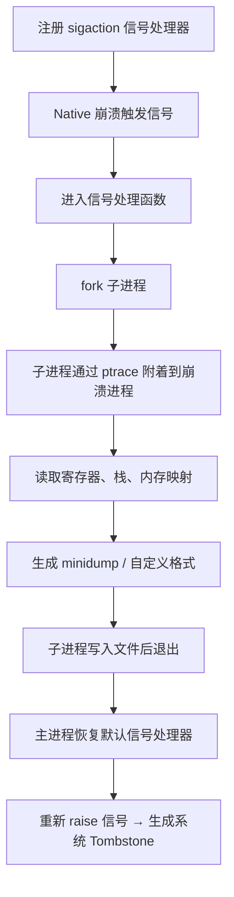
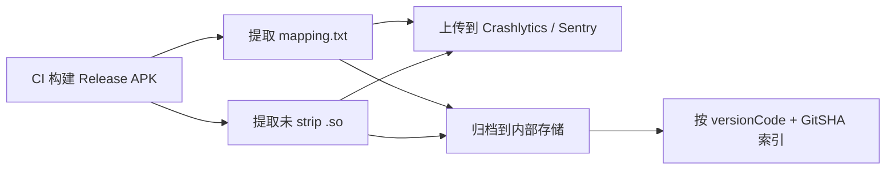

# Crash 采集与上报

## 自定义 UncaughtExceptionHandler

### 完整实现

```kotlin
class GlobalCrashHandler private constructor() : Thread.UncaughtExceptionHandler {

    private var defaultHandler: Thread.UncaughtExceptionHandler? = null
    private lateinit var appContext: Context

    @Volatile
    private var isHandling = false

    companion object {
        val instance: GlobalCrashHandler by lazy { GlobalCrashHandler() }
    }

    fun init(context: Context) {
        appContext = context.applicationContext
        defaultHandler = Thread.getDefaultUncaughtExceptionHandler()
        Thread.setDefaultUncaughtExceptionHandler(this)
    }

    override fun uncaughtException(thread: Thread, throwable: Throwable) {
        if (isHandling) {
            defaultHandler?.uncaughtException(thread, throwable)
            return
        }
        isHandling = true

        try {
            val crashInfo = collectCrashInfo(thread, throwable)
            saveCrashToFile(crashInfo)
            markPendingUpload()
        } catch (_: Exception) {
            // 静默失败，确保不会再次触发 uncaughtException
        } finally {
            isHandling = false
            defaultHandler?.uncaughtException(thread, throwable)
        }
    }

    private fun collectCrashInfo(thread: Thread, throwable: Throwable): String {
        return buildString {
            appendLine("========== Crash Report ==========")
            appendLine("Time: ${SimpleDateFormat("yyyy-MM-dd HH:mm:ss.SSS", Locale.CHINA).format(Date())}")
            appendLine("Thread: ${thread.name} (id=${thread.id})")
            appendLine()
            appendLine("--- Device Info ---")
            appendLine("Brand: ${Build.BRAND}")
            appendLine("Model: ${Build.MODEL}")
            appendLine("SDK: ${Build.VERSION.SDK_INT} (${Build.VERSION.RELEASE})")
            appendLine("ABI: ${Build.SUPPORTED_ABIS.joinToString()}")
            appendLine()
            appendLine("--- Memory Info ---")
            val rt = Runtime.getRuntime()
            appendLine("Max: ${rt.maxMemory() / 1024 / 1024}MB")
            appendLine("Total: ${rt.totalMemory() / 1024 / 1024}MB")
            appendLine("Free: ${rt.freeMemory() / 1024 / 1024}MB")
            appendLine()
            appendLine("--- App Info ---")
            try {
                val pm = appContext.packageManager
                val pi = pm.getPackageInfo(appContext.packageName, 0)
                appendLine("Package: ${pi.packageName}")
                appendLine("VersionName: ${pi.versionName}")
                appendLine("VersionCode: ${PackageInfoCompat.getLongVersionCode(pi)}")
            } catch (_: Exception) { }
            appendLine()
            appendLine("--- Stack Trace ---")
            appendLine(Log.getStackTraceString(throwable))
        }
    }

    private fun saveCrashToFile(content: String) {
        val dir = File(appContext.filesDir, "crash_logs")
        if (!dir.exists()) dir.mkdirs()

        val sdf = SimpleDateFormat("yyyy-MM-dd_HH-mm-ss-SSS", Locale.CHINA)
        val file = File(dir, "crash_${sdf.format(Date())}.txt")
        file.writeText(content)
    }

    private fun markPendingUpload() {
        appContext.getSharedPreferences("crash_pending", Context.MODE_PRIVATE)
            .edit().putBoolean("has_pending", true).apply()
    }
}
```

### 链式调用与默认 Handler

保存并调用系统默认 Handler 是**必须的**，原因：

1. 确保系统能正常记录崩溃信息（DropBox、Logcat `FATAL EXCEPTION`）
2. 不覆盖其他 SDK（如 Crashlytics）已注册的 Handler
3. 确保进程最终被正确终止


### 多进程场景

每个进程有独立的 VM 实例，因此 `UncaughtExceptionHandler` 需要在每个进程中都初始化：

```kotlin
class App : Application() {
    override fun onCreate() {
        super.onCreate()
        // 在所有进程中都初始化 CrashHandler
        GlobalCrashHandler.instance.init(this)

        // 按进程区分其他初始化
        if (isMainProcess()) {
            initMainProcessComponents()
        }
    }

    private fun isMainProcess(): Boolean {
        val pid = android.os.Process.myPid()
        val am = getSystemService(ACTIVITY_SERVICE) as ActivityManager
        return am.runningAppProcesses?.any {
            it.pid == pid && it.processName == packageName
        } ?: false
    }
}
```

### 防递归崩溃

如果 `uncaughtException` 中的代码再次抛出异常，会导致无限递归。使用 `isHandling` 标志位 + `try-catch` 双重保护：

```kotlin
override fun uncaughtException(thread: Thread, throwable: Throwable) {
    if (isHandling) {
        // 已经在处理中，直接交给默认处理器
        defaultHandler?.uncaughtException(thread, throwable)
        return
    }
    isHandling = true
    try {
        // 崩溃处理逻辑...
    } catch (_: Exception) {
        // 静默失败
    } finally {
        isHandling = false
        defaultHandler?.uncaughtException(thread, throwable)
    }
}
```

## Native Crash 采集原理

### 信号处理 + fork 子进程 dump

Native Crash 采集的核心流程：



> **为什么要 fork 子进程？** 信号处理函数中能调用的函数极其有限（async-signal-safe），不能 `malloc`、不能 `printf`。fork 子进程后，子进程拥有独立的地址空间，可以进行任意操作。

### Breakpad 方案

Google Breakpad 是跨平台的 Native Crash 采集库，被 Firefox、Chrome 等产品使用。

**核心组件：**

| 组件 | 作用 |
|------|------|
| `ExceptionHandler` | 在客户端注册信号处理器，崩溃时生成 minidump |
| `minidump_stackwalk` | 服务端工具，将 minidump + 符号表 → 可读堆栈 |
| `dump_syms` | 从 .so 中提取符号表（.sym 格式） |

```bash
# 1. 提取符号表
dump_syms libnative.so > libnative.so.sym

# 2. 解析 minidump
minidump_stackwalk crash.dmp symbols/
```

### xCrash 方案

xCrash 是爱奇艺开源的 Android 崩溃捕获库，轻量级且同时支持 Java Crash、Native Crash 和 ANR。

```kotlin
// 接入示例
class App : Application() {
    override fun attachBaseContext(base: Context) {
        super.attachBaseContext(base)

        val params = XCrash.InitParameters().apply {
            // Java Crash 配置
            setJavaLogDir(File(filesDir, "crash/java").absolutePath)
            setJavaCallback { logPath, emergency ->
                Log.d("xCrash", "Java crash: $logPath")
                uploadCrashLog(logPath)
            }

            // Native Crash 配置
            setNativeLogDir(File(filesDir, "crash/native").absolutePath)
            setNativeCallback { logPath, emergency ->
                Log.d("xCrash", "Native crash: $logPath")
                uploadCrashLog(logPath)
            }

            // ANR 配置
            setAnrLogDir(File(filesDir, "crash/anr").absolutePath)
            setAnrCallback { logPath, emergency ->
                Log.d("xCrash", "ANR: $logPath")
                uploadCrashLog(logPath)
            }
        }

        XCrash.init(this, params)
    }
}
```

## ANR 采集方案

### FileObserver 监听

```kotlin
class AnrFileObserver(
    private val onAnrDetected: (String) -> Unit
) : FileObserver(File("/data/anr/"), CLOSE_WRITE) {

    override fun onEvent(event: Int, path: String?) {
        if (event == CLOSE_WRITE && path != null) {
            try {
                val file = File("/data/anr/$path")
                if (file.exists() && file.canRead()) {
                    val content = file.readText()
                    // 检查是否包含自己的包名
                    if (content.contains(BuildConfig.APPLICATION_ID)) {
                        onAnrDetected(content)
                    }
                }
            } catch (e: Exception) {
                Log.e("ANR", "读取 ANR traces 失败", e)
            }
        }
    }
}
```

> **限制：** Android 11+ 文件访问权限收紧，FileObserver 方案兼容性下降。

### 主线程 Watchdog

```kotlin
class AnrWatchdog(
    private val timeout: Long = 5000L,
    private val reporter: (Array<StackTraceElement>) -> Unit
) {
    private val mainHandler = Handler(Looper.getMainLooper())
    private val watchdogThread = HandlerThread("anr-watchdog").apply { start() }
    private val watchdogHandler = Handler(watchdogThread.looper)

    @Volatile
    private var responded = false

    fun start() {
        scheduleCheck()
    }

    private fun scheduleCheck() {
        responded = false
        mainHandler.post { responded = true }

        watchdogHandler.postDelayed({
            if (!responded) {
                val stackTrace = Looper.getMainLooper().thread.stackTrace
                reporter(stackTrace)
            }
            scheduleCheck()
        }, timeout)
    }

    fun stop() {
        mainHandler.removeCallbacksAndMessages(null)
        watchdogHandler.removeCallbacksAndMessages(null)
        watchdogThread.quitSafely()
    }
}
```

### ApplicationExitInfo（Android 11+）

```kotlin
fun collectAnrInfo(context: Context) {
    if (Build.VERSION.SDK_INT < Build.VERSION_CODES.R) return

    val am = context.getSystemService(Context.ACTIVITY_SERVICE) as ActivityManager
    val exitInfos = am.getHistoricalProcessExitReasons(context.packageName, 0, 10)

    exitInfos
        .filter { it.reason == ApplicationExitInfo.REASON_ANR }
        .forEach { info ->
            val traces = info.traceInputStream?.bufferedReader()?.readText()
            Log.d("ANR", "ANR at ${Date(info.timestamp)}: $traces")
            // 上报到服务端
        }
}
```

## 商业 / 开源方案接入

### Firebase Crashlytics

```kotlin
// build.gradle.kts (project)
plugins {
    id("com.google.gms.google-services") version "4.4.2" apply false
    id("com.google.firebase.crashlytics") version "3.0.2" apply false
}

// build.gradle.kts (app)
plugins {
    id("com.google.gms.google-services")
    id("com.google.firebase.crashlytics")
}

dependencies {
    implementation(platform("com.google.firebase:firebase-bom:33.6.0"))
    implementation("com.google.firebase:firebase-crashlytics")
    implementation("com.google.firebase:firebase-analytics")
}
```

```kotlin
// 自定义日志与用户信息
Firebase.crashlytics.apply {
    setUserId("user_12345")
    setCustomKey("subscription", "premium")
    log("User clicked checkout button")
}

// 手动记录非致命异常
try {
    riskyOperation()
} catch (e: Exception) {
    Firebase.crashlytics.recordException(e)
}
```

### Bugly（腾讯）

```kotlin
// build.gradle.kts (app)
dependencies {
    implementation("com.tencent.bugly:crashreport:4.1.9.3")
    implementation("com.tencent.bugly:nativecrashreport:3.9.2")
}
```

```kotlin
class App : Application() {
    override fun onCreate() {
        super.onCreate()
        // 第三个参数为 debug 模式开关
        CrashReport.initCrashReport(this, "YOUR_APP_ID", BuildConfig.DEBUG)
    }
}
```

### Sentry

```kotlin
// build.gradle.kts (app)
plugins {
    id("io.sentry.android.gradle") version "4.14.1"
}

dependencies {
    implementation("io.sentry:sentry-android:7.18.1")
}
```

```kotlin
// 自定义上下文
Sentry.configureScope { scope ->
    scope.setTag("feature", "checkout")
    scope.user = User().apply { id = "user_12345" }
}

// 手动捕获异常
try {
    riskyOperation()
} catch (e: Exception) {
    Sentry.captureException(e)
}
```

### 方案对比与选型

| 维度 | Crashlytics | Bugly | Sentry | xCrash |
|------|:-----------:|:-----:|:------:|:------:|
| Java Crash | ✅ | ✅ | ✅ | ✅ |
| Native Crash | ✅ | ✅ | ✅ | ✅ |
| ANR | ✅ | ✅ | ✅ | ✅ |
| 自动符号化 | ✅ | ✅ | ✅ | ❌ |
| 私有化部署 | ❌ | ❌ | ✅ | ✅（仅采集） |
| 国内网络 | ❌（需翻墙） | ✅ | 取决于部署 | ✅ |
| 分析平台 | ✅ | ✅ | ✅ | ❌（需自建） |
| 成本 | 免费 | 免费 | 免费/付费 | 免费 |

## 符号化流水线搭建

### CI 自动上传符号表



**Crashlytics 自动上传（Gradle 插件自动完成）：**

```kotlin
// build.gradle.kts - Crashlytics 插件会自动在构建时上传 mapping.txt 和 native symbols
android {
    buildTypes {
        release {
            // 自动上传 native debug symbols
            ndk { debugSymbolLevel = "FULL" }
        }
    }
}
```

**Sentry 手动上传：**

```bash
# 上传 ProGuard mapping
sentry-cli upload-proguard --org my-org --project my-android \
    app/build/outputs/mapping/release/mapping.txt

# 上传 native symbols
sentry-cli debug-files upload --org my-org --project my-android \
    app/build/intermediates/cmake/release/obj/
```

### 版本 → 符号表映射管理

```bash
# 归档结构示例
symbols/
├── 100-abc1234/          # versionCode-gitShortSHA
│   ├── mapping.txt
│   └── arm64-v8a/
│       └── libnative.so
├── 101-def5678/
│   ├── mapping.txt
│   └── arm64-v8a/
│       └── libnative.so
```

## 日志上报策略

### 本地持久化

```kotlin
class CrashLogManager(private val context: Context) {

    private val logDir = File(context.filesDir, "crash_logs")
    private val maxLogCount = 50
    private val maxLogAge = 7L * 24 * 60 * 60 * 1000 // 7 天

    fun saveCrashLog(content: String): File {
        if (!logDir.exists()) logDir.mkdirs()
        cleanOldLogs()

        val fileName = "crash_${System.currentTimeMillis()}.txt"
        val file = File(logDir, fileName)
        file.writeText(content)
        return file
    }

    fun getPendingLogs(): List<File> {
        return logDir.listFiles()
            ?.filter { it.name.startsWith("crash_") }
            ?.sortedByDescending { it.lastModified() }
            ?: emptyList()
    }

    private fun cleanOldLogs() {
        val files = logDir.listFiles() ?: return
        val now = System.currentTimeMillis()

        // 删除过期日志
        files.filter { now - it.lastModified() > maxLogAge }
            .forEach { it.delete() }

        // 保留最多 maxLogCount 条
        val remaining = logDir.listFiles()?.sortedByDescending { it.lastModified() } ?: return
        if (remaining.size > maxLogCount) {
            remaining.drop(maxLogCount).forEach { it.delete() }
        }
    }
}
```

### 优先级队列

```kotlin
enum class LogPriority(val weight: Int) {
    CRASH(100),    // 最高优先级
    ANR(90),
    NATIVE_CRASH(95),
    PERFORMANCE(50),
    CUSTOM(10)     // 最低优先级
}
```

### 网络上报与重试

```kotlin
class CrashUploadWorker(
    context: Context,
    params: WorkerParameters
) : CoroutineWorker(context, params) {

    override suspend fun doWork(): Result {
        val logManager = CrashLogManager(applicationContext)
        val pendingLogs = logManager.getPendingLogs()
        if (pendingLogs.isEmpty()) return Result.success()

        return try {
            pendingLogs.forEach { file ->
                val content = file.readText()
                val uploaded = uploadToServer(content)
                if (uploaded) file.delete()
            }
            Result.success()
        } catch (e: Exception) {
            if (runAttemptCount < 3) Result.retry() else Result.failure()
        }
    }

    private suspend fun uploadToServer(content: String): Boolean {
        // 实际 API 调用
        return true
    }

    companion object {
        fun enqueue(context: Context) {
            val request = OneTimeWorkRequestBuilder<CrashUploadWorker>()
                .setConstraints(
                    Constraints.Builder()
                        .setRequiredNetworkType(NetworkType.CONNECTED)
                        .build()
                )
                .setBackoffCriteria(
                    BackoffPolicy.EXPONENTIAL,
                    Duration.ofMinutes(1)
                )
                .build()

            WorkManager.getInstance(context).enqueueUniqueWork(
                "crash_upload",
                ExistingWorkPolicy.REPLACE,
                request
            )
        }
    }
}
```

## 常见坑点

### 1. 多个 SDK 的 UncaughtExceptionHandler 覆盖

多个 Crash SDK 都会设置 `UncaughtExceptionHandler`，后注册的会覆盖先注册的。正确做法是**链式调用**——每个 SDK 注册时保存前一个 Handler，并在处理完后调用它。

```kotlin
// 初始化顺序：先 Crashlytics，再自定义 Handler
// Crashlytics 会自动链式调用前一个 Handler
FirebaseCrashlytics.getInstance() // 先初始化
GlobalCrashHandler.instance.init(this) // 后初始化，会保存 Crashlytics 的 Handler
```

### 2. 崩溃收集中访问已销毁的 Context

```kotlin
// ❌ 在 CrashHandler 中使用 Activity Context → 可能已销毁
// ✅ 始终使用 Application Context
fun init(context: Context) {
    appContext = context.applicationContext
}
```

### 3. 崩溃上报时 Intent 过大

```kotlin
// ❌ 通过 Intent 传递崩溃堆栈
intent.putExtra("stack", veryLongStackTrace) // 可能超过 1MB → TransactionTooLargeException

// ✅ 写入文件，只传递标志位
intent.putExtra("from_crash", true)
```

## 踩坑记录

> 此区域供团队成员补充项目中遇到的真实案例。

| 日期 | 记录人 | 问题描述 | 解决方案 |
|------|--------|----------|----------|
| | | | |

## 参考资料

- [Firebase Crashlytics 接入指南](https://firebase.google.com/docs/crashlytics/get-started?platform=android)
- [Sentry Android SDK](https://docs.sentry.io/platforms/android/)
- [xCrash - GitHub](https://github.com/nicknux/xCrash)
- [Google Breakpad](https://chromium.googlesource.com/breakpad/breakpad/)
- [Bugly 接入文档](https://bugly.qq.com/docs/user-guide/instruction-manual-android/)
- [WorkManager 官方文档](https://developer.android.com/topic/libraries/architecture/workmanager)
