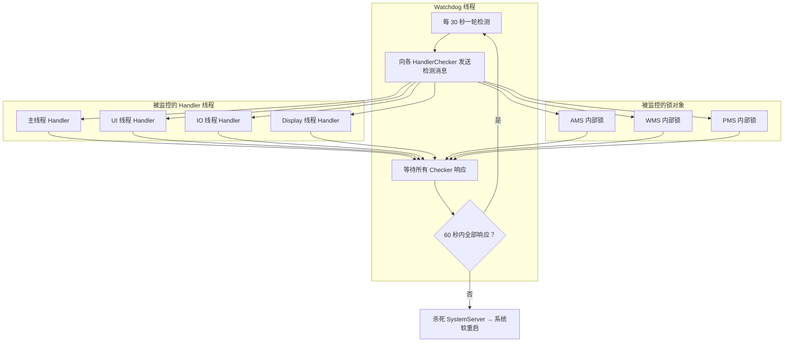
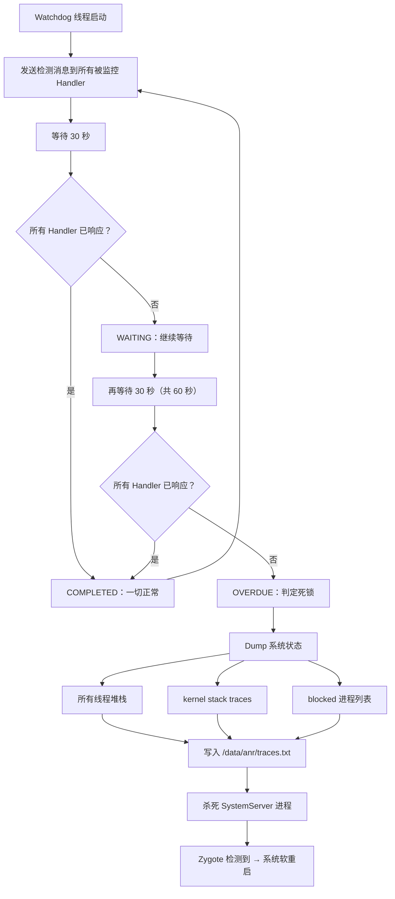
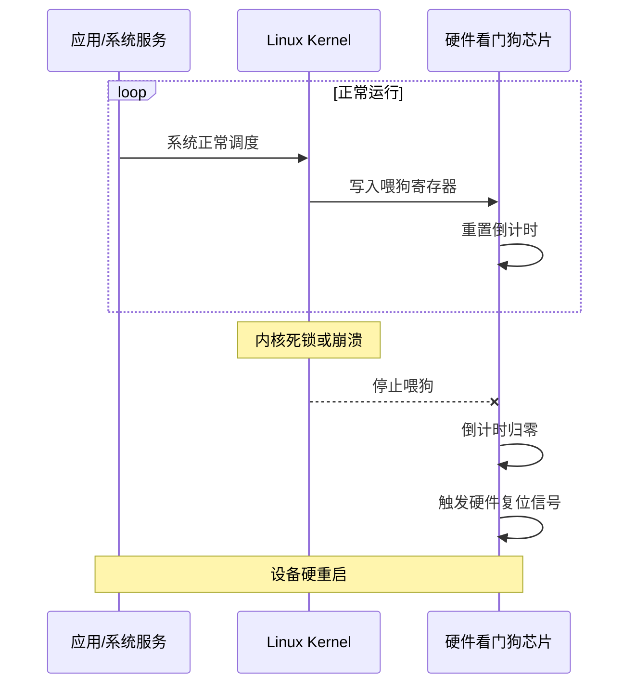

# Watchdog 与系统级监控

## Android Framework Watchdog

### Watchdog 源码解析

SystemServer 启动后会创建一个 `Watchdog` 线程，通过双重检测机制（HandlerChecker + MonitorChecker）监控系统关键服务的健康状态。



**HandlerChecker** 的工作原理：向目标线程的 Handler 发送一个空消息，如果消息在超时时间内被处理（说明线程 MessageQueue 正常运转），则视为健康。

**MonitorChecker** 的工作原理：尝试获取系统服务的内部锁（如 AMS 的 `this` 锁），如果在超时时间内获取成功，说明该服务未发生死锁。

```kotlin
// Watchdog 源码中的核心逻辑（简化）
class Watchdog : Thread() {

    // HandlerChecker：检测线程是否还在处理消息
    inner class HandlerChecker(
        val handler: Handler,
        val name: String
    ) : Runnable {
        @Volatile var completed = false

        fun scheduleCheckLocked() {
            completed = false
            handler.postAtFrontOfQueue(this)
        }

        override fun run() {
            completed = true // Handler 线程执行了此 Runnable → 线程存活
        }
    }

    override fun run() {
        while (true) {
            // 1. 发送检测消息
            synchronized(lock) {
                handlerCheckers.forEach { it.scheduleCheckLocked() }
            }

            // 2. 等待超时
            Thread.sleep(CHECK_INTERVAL) // 30 秒

            // 3. 检查结果
            val waitState = evaluateCheckerCompletionLocked()
            if (waitState == OVERDUE) {
                // 超过 60 秒未响应
                dumpStackTraces()
                dumpKernelStackTraces()
                // 杀死 SystemServer
                Process.killProcess(Process.myPid())
                System.exit(10)
            }
        }
    }
}
```

### 监控的关键服务

| 被监控对象 | 类型 | 说明 |
|-----------|------|------|
| `foreground thread` | HandlerChecker | Framework 主线程（DisplayThread） |
| `main thread` | HandlerChecker | SystemServer 主线程 |
| `ui thread` | HandlerChecker | UI 线程 |
| `io thread` | HandlerChecker | IO 线程 |
| `animation thread` | HandlerChecker | Surface 动画线程 |
| `ActivityManagerService` | MonitorChecker | AMS 内部锁 |
| `WindowManagerService` | MonitorChecker | WMS 内部锁 |
| `PowerManagerService` | MonitorChecker | PMS 内部锁 |
| `InputManagerService` | MonitorChecker | IMS 内部锁 |
| `NetworkManagementService` | MonitorChecker | 网络管理服务锁 |

### 检测流程



### 系统状态 Dump 内容

Watchdog 触发前会收集大量诊断信息：

```bash
# Watchdog 生成的文件和日志位置
/data/anr/traces.txt        # 所有进程/线程的堆栈
/data/system/dropbox/        # DropBox 中的 system_server_watchdog 条目

# Logcat 中的 Watchdog 日志
adb logcat -s Watchdog:*
```

## Kernel Watchdog

### 软件看门狗（softlockup）

内核软件看门狗通过高优先级内核线程（`watchdog/N`，每个 CPU 一个）定期检测 CPU 是否能正常调度。如果某个 CPU 上的 `watchdog` 线程长时间未被调度（默认 20 秒），说明该 CPU 被长时间占用或中断被禁用。

```text
# softlockup 典型内核日志
BUG: soft lockup - CPU#2 stuck for 22s! [kworker/2:1:12345]
```

### 硬件看门狗（hardlockup）

硬件看门狗通过 NMI（Non-Maskable Interrupt）检测 CPU 是否完全锁死。NMI 不可被屏蔽，即使中断被禁用也能触发。如果 NMI 处理器发现计数器未更新（说明 `watchdog` 内核线程完全无法运行），则判定为 hardlockup。

```text
# hardlockup 典型内核日志
NMI watchdog: Watchdog detected hard LOCKUP on cpu 2
Kernel panic - not syncing: Hard LOCKUP
```

### softlockup vs hardlockup 对比

| 特性 | softlockup | hardlockup |
|------|-----------|-----------|
| 检测机制 | 高优先级内核线程调度检测 | NMI 中断 |
| 超时时间 | 默认 20 秒 | 默认 10 秒 |
| 触发条件 | CPU 长时间未调度 watchdog 线程 | CPU 完全锁死（连中断都不响应） |
| 默认行为 | 打印告警日志 | 触发 Kernel Panic → 硬重启 |
| 常见原因 | 长时间关中断、自旋锁死锁 | 硬件故障、内核 Bug 导致 CPU 死锁 |

```bash
# 查看 softlockup 配置
adb shell cat /proc/sys/kernel/watchdog_thresh  # 超时阈值（秒）

# 查看是否启用
adb shell cat /proc/sys/kernel/softlockup_panic  # 1=触发panic, 0=仅告警
```

## 硬件看门狗芯片

### 工作原理

硬件看门狗是一个独立于主 CPU 的芯片（或 SoC 内置模块），具有独立的倒计时器。系统软件需要定期向看门狗寄存器写入特定值（"喂狗"），重置倒计时。如果系统异常导致无法喂狗，倒计时归零后看门狗会直接复位设备。



### 喂狗机制实现

```c
// 内核驱动中的典型喂狗实现
#include <linux/watchdog.h>

static struct watchdog_device my_wdt = {
    .info = &my_wdt_info,
    .ops = &my_wdt_ops,
    .timeout = 30, // 30 秒超时
    .min_timeout = 1,
    .max_timeout = 60,
};

static int my_wdt_start(struct watchdog_device *wdd) {
    // 启动硬件看门狗定时器
    writel(WDT_ENABLE, wdt_base + WDT_CTRL_REG);
    return 0;
}

static int my_wdt_ping(struct watchdog_device *wdd) {
    // "喂狗"：重置倒计时
    writel(WDT_RELOAD_VALUE, wdt_base + WDT_RELOAD_REG);
    return 0;
}
```

```bash
# 用户态喂狗（通过 /dev/watchdog）
adb shell echo "V" > /dev/watchdog  # 写入任意字符即可喂狗
```

### 适用场景

| 场景 | 说明 |
|------|------|
| IoT 设备 | 无人值守的 IoT 网关，异常后自动恢复 |
| 工控主板 | 工业控制设备，要求 7x24 不间断运行 |
| 车机系统 | 车载 Android 系统，异常时需快速恢复 |
| 数字标牌 | 商场/广告屏，Crash 后自动重启继续播放 |

## 自定义应用级 Watchdog

### 主线程 Watchdog 实现

```kotlin
class AppWatchdog(
    private val checkInterval: Long = 5000L,
    private val onMainThreadBlocked: (Array<StackTraceElement>) -> Unit
) {
    private val mainHandler = Handler(Looper.getMainLooper())
    private val watchdogThread = HandlerThread("app-watchdog").apply { start() }
    private val watchdogHandler = Handler(watchdogThread.looper)

    @Volatile
    private var tick = 0L

    @Volatile
    private var lastTickSeen = -1L

    fun start() {
        postTick()
        postCheck()
    }

    private fun postTick() {
        mainHandler.post {
            tick++
            mainHandler.postDelayed(::postTick, checkInterval / 2)
        }
    }

    private fun postCheck() {
        watchdogHandler.postDelayed({
            if (tick == lastTickSeen) {
                val stackTrace = Looper.getMainLooper().thread.stackTrace
                onMainThreadBlocked(stackTrace)
            }
            lastTickSeen = tick
            postCheck()
        }, checkInterval)
    }

    fun stop() {
        mainHandler.removeCallbacksAndMessages(null)
        watchdogHandler.removeCallbacksAndMessages(null)
        watchdogThread.quitSafely()
    }
}

// 使用
val watchdog = AppWatchdog { stackTrace ->
    Log.w("Watchdog", "主线程可能阻塞！堆栈：")
    stackTrace.forEach { Log.w("Watchdog", "  at $it") }
    // 上报到监控平台
}
watchdog.start()
```

### 业务线程 Watchdog

```kotlin
class BusinessThreadWatchdog(
    private val threadName: String,
    private val targetThread: Thread,
    private val timeout: Long = 10_000L,
    private val onTimeout: (String, Array<StackTraceElement>) -> Unit
) {
    private val timer = Timer("watchdog-$threadName", true)
    @Volatile private var lastHeartbeat = System.currentTimeMillis()

    fun reportHeartbeat() {
        lastHeartbeat = System.currentTimeMillis()
    }

    fun start() {
        timer.scheduleAtFixedRate(object : TimerTask() {
            override fun run() {
                val elapsed = System.currentTimeMillis() - lastHeartbeat
                if (elapsed > timeout) {
                    onTimeout(threadName, targetThread.stackTrace)
                }
            }
        }, timeout, timeout / 2)
    }

    fun stop() {
        timer.cancel()
    }
}
```

### Watchdog 与 ANR 检测的关系

| 维度 | 系统 ANR 检测 | 自定义 Watchdog |
|------|-------------|----------------|
| 检测主体 | AMS / InputDispatcher | 应用自身 |
| 检测对象 | 主线程对特定事件的响应 | 主线程/任意线程的心跳 |
| 超时阈值 | 固定（5s/10s/20s） | 可自定义 |
| 结果 | 弹出 ANR 对话框 | 自定义处理（上报/告警/恢复） |
| 适用场景 | 系统级监控 | 应用级主动监控，可在 ANR 之前发现问题 |

> **最佳实践：** 将 Watchdog 的超时设为比 ANR 阈值略短（如 4 秒），这样可以在系统 ANR 触发之前感知问题并采集堆栈，获得更准确的现场信息。

## DropBoxManager

### 系统日志收集机制

`DropBoxManager` 是 Android 系统的日志收集器，SystemServer 中各服务在遇到异常时会通过它记录日志。

| Tag | 来源 | 内容 |
|-----|------|------|
| `system_server_crash` | SystemServer 崩溃 | 崩溃堆栈 |
| `system_server_watchdog` | Watchdog 超时 | 线程堆栈 + 系统状态 |
| `system_app_crash` | 系统应用崩溃 | 崩溃堆栈 |
| `data_app_crash` | 第三方应用崩溃 | 崩溃堆栈 |
| `system_app_anr` | 系统应用 ANR | traces |
| `data_app_anr` | 第三方应用 ANR | traces |
| `SYSTEM_TOMBSTONE` | Native Crash | Tombstone 内容 |
| `system_server_wtf` | WTF 日志（What a Terrible Failure） | 异常信息 |

### 日志读取与分析

```bash
# 列出 DropBox 中的所有条目
adb shell dumpsys dropbox --print

# 按 Tag 过滤
adb shell dumpsys dropbox --print data_app_crash

# 查看最近 N 小时内的条目
adb shell dumpsys dropbox --print --hours 24

# 按时间过滤（Unix 毫秒时间戳）
adb shell dumpsys dropbox --print --since 1712400000000
```

### 在应用中读取 DropBox 日志

```kotlin
fun readDropBoxEntries(context: Context, tag: String, since: Long) {
    val dropBox = context.getSystemService(Context.DROPBOX_SERVICE) as DropBoxManager

    var entry = dropBox.getNextEntry(tag, since)
    while (entry != null) {
        Log.d("DropBox", buildString {
            appendLine("Tag: ${entry.tag}")
            appendLine("Time: ${Date(entry.timeMillis)}")
            appendLine("Text: ${entry.getText(4096)}") // 最多读取 4KB
        })
        entry.close()
        entry = dropBox.getNextEntry(tag, entry.timeMillis)
    }
}

// 需要权限：android.permission.READ_LOGS（签名级权限）
// 或通过 adb 授权：adb shell pm grant com.example.myapp android.permission.READ_LOGS
```

## 常见坑点

### 1. 自定义 Watchdog 误报

在应用后台或屏幕关闭时，系统可能降低 CPU 调度优先级，导致 Watchdog 误报。应结合应用前后台状态过滤：

```kotlin
private fun postCheck() {
    watchdogHandler.postDelayed({
        // 仅在应用处于前台时检测
        if (isAppInForeground() && tick == lastTickSeen) {
            onMainThreadBlocked(Looper.getMainLooper().thread.stackTrace)
        }
        lastTickSeen = tick
        postCheck()
    }, checkInterval)
}
```

### 2. Watchdog 线程自身阻塞

如果 Watchdog 所在的 `HandlerThread` 也被阻塞（如系统 CPU 满载），会导致检测失灵。可以使用独立的 `Timer` 线程或 Kotlin 协程替代。

## 踩坑记录

> 此区域供团队成员补充项目中遇到的真实案例。

| 日期 | 记录人 | 问题描述 | 解决方案 |
|------|--------|----------|----------|
| | | | |

## 参考资料

- [Android 源码 - Watchdog.java](https://cs.android.com/android/platform/superproject/+/main:frameworks/base/services/core/java/com/android/server/Watchdog.java)
- [Android 源码 - DropBoxManagerService.java](https://cs.android.com/android/platform/superproject/+/main:frameworks/base/services/core/java/com/android/server/DropBoxManagerService.java)
- [Linux Kernel Watchdog Documentation](https://www.kernel.org/doc/html/latest/admin-guide/lockup-watchdogs.html)
- [Android 官方文档 - DropBoxManager](https://developer.android.com/reference/android/os/DropBoxManager)
