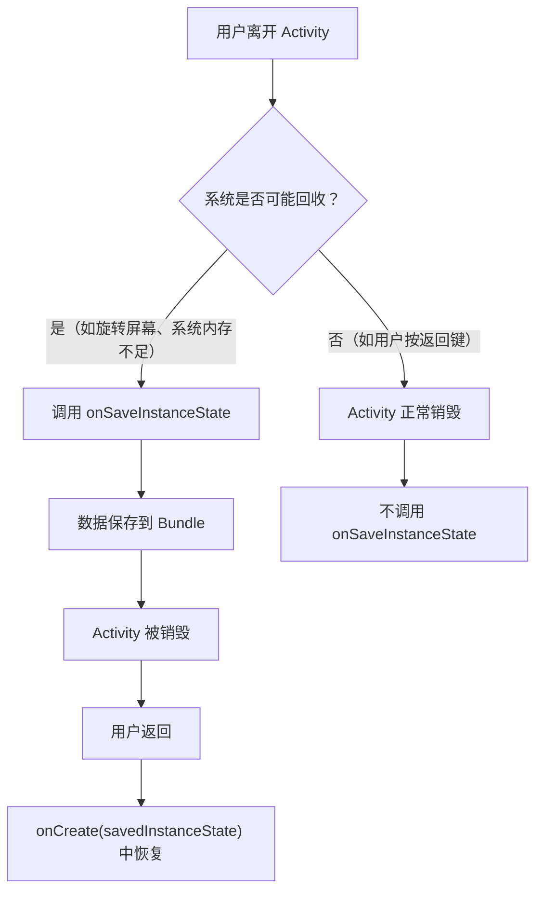
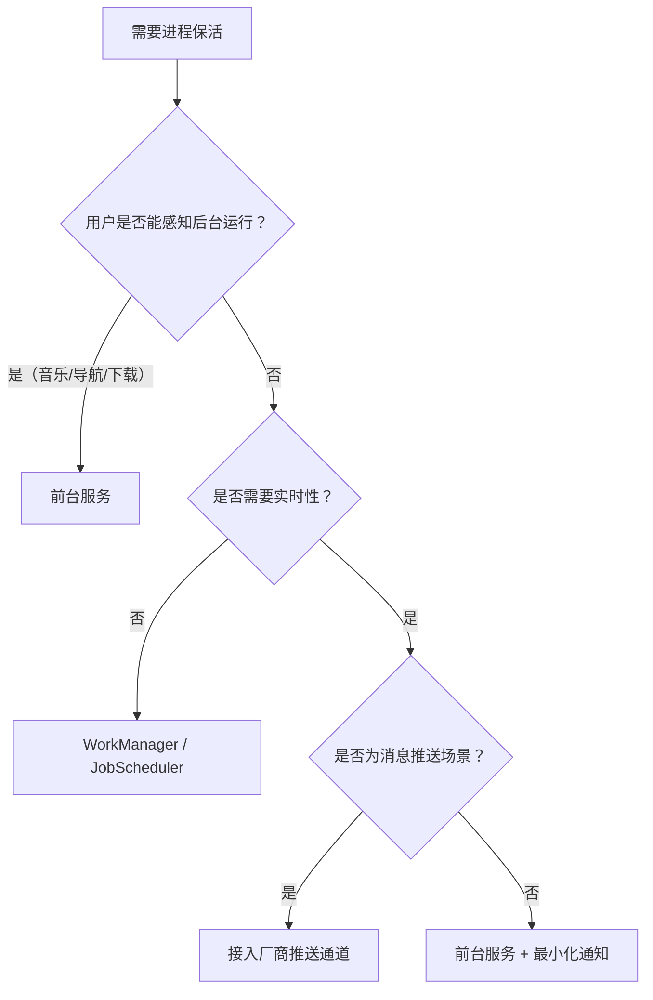
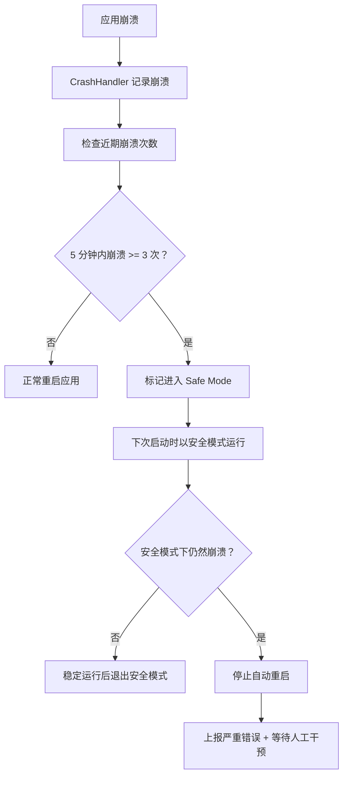

# 异常恢复与容错设计

## 崩溃自动重启策略

### Application 级重启

通过 `UncaughtExceptionHandler` 在进程退出前启动一个新的 Activity：

```kotlin
private fun restartApp(context: Context) {
    val intent = context.packageManager
        .getLaunchIntentForPackage(context.packageName)
        ?.apply {
            addFlags(Intent.FLAG_ACTIVITY_NEW_TASK or Intent.FLAG_ACTIVITY_CLEAR_TASK)
            putExtra("from_crash", true)
        }

    if (intent != null) {
        context.startActivity(intent)
    }

    android.os.Process.killProcess(android.os.Process.myPid())
    exitProcess(1)
}
```

> **注意：** 这种方式在部分 ROM 上可能失败（系统可能阻止崩溃进程启动新 Activity）。更可靠的方式是使用 `AlarmManager` 延迟重启。

```kotlin
private fun scheduleRestart(context: Context) {
    val intent = context.packageManager
        .getLaunchIntentForPackage(context.packageName)
        ?.apply { putExtra("from_crash", true) }
        ?: return

    val pendingIntent = PendingIntent.getActivity(
        context, 0, intent,
        PendingIntent.FLAG_ONE_SHOT or PendingIntent.FLAG_IMMUTABLE
    )

    val alarmManager = context.getSystemService(Context.ALARM_SERVICE) as AlarmManager
    alarmManager.setExactAndAllowWhileIdle(
        AlarmManager.ELAPSED_REALTIME_WAKEUP,
        SystemClock.elapsedRealtime() + 1000, // 1 秒后重启
        pendingIntent
    )

    android.os.Process.killProcess(android.os.Process.myPid())
    exitProcess(1)
}
```

### Activity 级重启

系统在 Activity 被回收后可通过 `SavedInstanceState` 自动恢复。对于崩溃场景，需要额外的恢复逻辑：

```kotlin
class MainActivity : AppCompatActivity() {

    override fun onCreate(savedInstanceState: Bundle?) {
        super.onCreate(savedInstanceState)
        setContentView(R.layout.activity_main)

        when {
            intent.getBooleanExtra("from_crash", false) -> handleCrashRecovery()
            savedInstanceState != null -> handleSystemRestore(savedInstanceState)
        }
    }

    private fun handleCrashRecovery() {
        Toast.makeText(this, "应用已恢复运行", Toast.LENGTH_SHORT).show()

        // 1. 上报上次崩溃信息
        CrashUploadWorker.enqueue(this)

        // 2. 从持久化存储恢复状态
        val lastState = AppStateManager.getLastState(this)
        if (lastState != null) {
            navigateTo(lastState.lastPage)
        }
    }

    private fun handleSystemRestore(state: Bundle) {
        val page = state.getString("current_page")
        if (page != null) navigateTo(page)
    }
}
```

### Service 重启策略

| 返回值 | 行为 | 适用场景 |
|--------|------|----------|
| `START_STICKY` | 系统回收后自动重建 Service，`intent` 为 null | 音乐播放、后台监控 |
| `START_REDELIVER_INTENT` | 自动重建并重新投递最后一个 Intent | 文件下载、消息处理 |
| `START_NOT_STICKY` | 不自动重建 | 一次性任务 |

```kotlin
class MonitorService : Service() {
    override fun onStartCommand(intent: Intent?, flags: Int, startId: Int): Int {
        // 处理业务逻辑...
        return START_STICKY // 被系统杀死后自动重启
    }

    override fun onBind(intent: Intent?): IBinder? = null
}
```

## 系统级重启方案

### 方案对比

| 方案 | 需要权限 | 适用场景 | 重启类型 |
|------|----------|----------|----------|
| `PowerManager.reboot()` | `REBOOT`（系统签名） | 系统应用主动重启 | 完整重启 |
| Zygote 软重启 | 系统内部 | SystemServer 崩溃自动恢复 | 软重启 |
| `adb shell reboot` | adb / root | 开发调试 | 完整重启 |
| AlarmManager + root | root | 定时重启策略 | 完整重启 |

### PowerManager.reboot()

```kotlin
// 需要系统签名权限：android.permission.REBOOT
fun performSystemReboot(context: Context, reason: String? = null) {
    val pm = context.getSystemService(Context.POWER_SERVICE) as PowerManager
    // reason: "recovery"（恢复模式）、"bootloader"（fastboot）、null（普通重启）
    pm.reboot(reason)
}
```

### 定时重启策略

适用于长期运行的 Android 设备（展示屏、车机、IoT）：

```kotlin
class ScheduledRebootManager(private val context: Context) {

    fun scheduleNightlyReboot(hour: Int = 3, minute: Int = 0) {
        val alarmManager = context.getSystemService(Context.ALARM_SERVICE) as AlarmManager
        val intent = Intent(context, RebootReceiver::class.java)
        val pendingIntent = PendingIntent.getBroadcast(
            context, 0, intent,
            PendingIntent.FLAG_UPDATE_CURRENT or PendingIntent.FLAG_IMMUTABLE
        )

        val calendar = Calendar.getInstance().apply {
            set(Calendar.HOUR_OF_DAY, hour)
            set(Calendar.MINUTE, minute)
            set(Calendar.SECOND, 0)
            if (timeInMillis <= System.currentTimeMillis()) {
                add(Calendar.DAY_OF_YEAR, 1)
            }
        }

        alarmManager.setExactAndAllowWhileIdle(
            AlarmManager.RTC_WAKEUP,
            calendar.timeInMillis,
            pendingIntent
        )
    }
}

class RebootReceiver : BroadcastReceiver() {
    override fun onReceive(context: Context, intent: Intent) {
        val pm = context.getSystemService(Context.POWER_SERVICE) as PowerManager
        // 仅在屏幕关闭时重启，避免打断用户操作
        if (!pm.isInteractive) {
            try {
                Runtime.getRuntime().exec(arrayOf("su", "-c", "reboot"))
            } catch (e: Exception) {
                Log.e("Reboot", "定时重启失败", e)
            }
        }
    }
}
```

## 状态持久化与恢复

### SavedInstanceState 机制



> **限制：** Bundle 大小不宜超过 500KB，大数据应使用 ViewModel + SavedStateHandle 或持久化存储。

### 持久化存储恢复

```kotlin
object AppStateManager {
    private const val PREFS_NAME = "app_state"
    private const val KEY_LAST_PAGE = "last_page"
    private const val KEY_LAST_DATA = "last_data"

    fun saveState(context: Context, page: String, data: String? = null) {
        context.getSharedPreferences(PREFS_NAME, Context.MODE_PRIVATE)
            .edit()
            .putString(KEY_LAST_PAGE, page)
            .putString(KEY_LAST_DATA, data)
            .putLong("timestamp", System.currentTimeMillis())
            .apply()
    }

    fun getLastState(context: Context): AppState? {
        val prefs = context.getSharedPreferences(PREFS_NAME, Context.MODE_PRIVATE)
        val page = prefs.getString(KEY_LAST_PAGE, null) ?: return null
        val timestamp = prefs.getLong("timestamp", 0)

        // 状态过期检查（超过 24 小时不恢复）
        if (System.currentTimeMillis() - timestamp > 24 * 60 * 60 * 1000) return null

        return AppState(
            lastPage = page,
            lastData = prefs.getString(KEY_LAST_DATA, null)
        )
    }

    data class AppState(val lastPage: String, val lastData: String?)
}
```

### ViewModel 与进程死亡

```kotlin
class FormViewModel(private val savedState: SavedStateHandle) : ViewModel() {
    // SavedStateHandle 在进程死亡后仍可恢复
    val userName = savedState.getLiveData("user_name", "")
    val userEmail = savedState.getLiveData("user_email", "")

    fun updateName(name: String) {
        userName.value = name
        savedState["user_name"] = name // 自动持久化
    }

    fun updateEmail(email: String) {
        userEmail.value = email
        savedState["user_email"] = email
    }
}
```

## 优雅降级设计

### 功能降级

```kotlin
class FeatureManager(private val context: Context) {

    fun <T> executeWithFallback(
        feature: String,
        primary: () -> T,
        fallback: () -> T
    ): T {
        return try {
            primary()
        } catch (e: Exception) {
            Log.w("Feature", "$feature 降级执行", e)
            reportDegradation(feature, e)
            fallback()
        }
    }
}

// 使用示例
val recommendations = featureManager.executeWithFallback(
    feature = "AI推荐",
    primary = { aiRecommendationEngine.getPersonalized(userId) },
    fallback = { defaultRecommendations }  // 降级为默认推荐列表
)
```

### 数据降级

```kotlin
class DataRepository(
    private val remoteApi: Api,
    private val localDb: AppDatabase,
    private val memoryCache: LruCache<String, Any>
) {
    suspend fun getData(key: String): Result<Data> {
        // 三级降级：网络 → 数据库 → 内存缓存
        return try {
            val remote = remoteApi.fetchData(key)
            localDb.dataDao().save(remote) // 更新本地缓存
            memoryCache.put(key, remote)
            Result.success(remote)
        } catch (networkError: IOException) {
            Log.w("Data", "网络不可用，降级到本地数据库")
            try {
                val local = localDb.dataDao().getByKey(key)
                if (local != null) Result.success(local)
                else Result.failure(networkError)
            } catch (dbError: Exception) {
                Log.w("Data", "数据库异常，降级到内存缓存")
                val cached = memoryCache.get(key) as? Data
                if (cached != null) Result.success(cached)
                else Result.failure(dbError)
            }
        }
    }
}
```

### UI 降级

```kotlin
class SafeFragmentLoader {
    fun loadFragment(
        manager: FragmentManager,
        containerId: Int,
        fragmentClass: Class<out Fragment>,
        args: Bundle? = null
    ) {
        try {
            val fragment = fragmentClass.newInstance().apply { arguments = args }
            manager.beginTransaction()
                .replace(containerId, fragment)
                .commitAllowingStateLoss()
        } catch (e: Exception) {
            Log.e("UI", "Fragment 加载失败，展示兜底 UI", e)
            // 降级为错误提示页面
            val errorFragment = ErrorFragment.newInstance("页面加载失败，请重试")
            manager.beginTransaction()
                .replace(containerId, errorFragment)
                .commitAllowingStateLoss()
        }
    }
}
```

## 进程保活方案

### 方案对比

| 方案 | 可靠性 | 系统友好度 | 适用版本 | 推荐场景 |
|------|:------:|:----------:|----------|----------|
| **前台服务** | ⭐⭐⭐⭐ | ⭐⭐⭐ | 全版本 | 音乐、导航、下载 |
| **WorkManager** | ⭐⭐⭐ | ⭐⭐⭐⭐⭐ | 5.0+ | 定时同步、日志上报 |
| **厂商推送** | ⭐⭐⭐ | ⭐⭐⭐⭐ | 因厂商而异 | 消息推送 |
| **双进程守护** | ⭐⭐ | ⭐ | 7.0 以下 | **不推荐** |



> **核心原则：** 放弃与系统对抗的黑科技方案。Android 系统对后台限制越来越严格，双进程守护、1 像素 Activity 等方案在高版本 Android 上均已失效。

## Safe Mode 安全模式设计

### 连续崩溃检测

```kotlin
class CrashLoopDetector(private val context: Context) {

    private val prefs = context.getSharedPreferences("crash_loop", Context.MODE_PRIVATE)
    private val maxCrashCount = 3
    private val timeWindow = 5 * 60 * 1000L // 5 分钟内

    fun recordCrash() {
        val timestamps = getCrashTimestamps().toMutableList()
        timestamps.add(System.currentTimeMillis())

        // 只保留时间窗口内的记录
        val cutoff = System.currentTimeMillis() - timeWindow
        timestamps.removeAll { it < cutoff }

        prefs.edit()
            .putString("timestamps", timestamps.joinToString(","))
            .apply()
    }

    fun shouldEnterSafeMode(): Boolean {
        val timestamps = getCrashTimestamps()
        val cutoff = System.currentTimeMillis() - timeWindow
        val recentCrashes = timestamps.count { it > cutoff }
        return recentCrashes >= maxCrashCount
    }

    fun resetCrashCount() {
        prefs.edit().remove("timestamps").apply()
    }

    private fun getCrashTimestamps(): List<Long> {
        val raw = prefs.getString("timestamps", "") ?: ""
        if (raw.isEmpty()) return emptyList()
        return raw.split(",").mapNotNull { it.toLongOrNull() }
    }
}
```

### Safe Mode 行为

```kotlin
class App : Application() {
    var isSafeMode = false
        private set

    override fun onCreate() {
        super.onCreate()

        val detector = CrashLoopDetector(this)

        if (detector.shouldEnterSafeMode()) {
            isSafeMode = true
            Log.w("App", "进入安全模式：禁用非核心功能")
            initSafeMode()
        } else {
            initNormalMode()
        }

        GlobalCrashHandler.instance.init(this)
    }

    private fun initSafeMode() {
        // 仅初始化核心组件
        // 不加载插件、不初始化第三方 SDK、使用默认配置
    }

    private fun initNormalMode() {
        // 正常初始化所有组件
        initThirdPartySDKs()
        loadPlugins()
    }
}
```

### 崩溃计数器重置

```kotlin
class MainActivity : AppCompatActivity() {
    private val stableRunThreshold = 30_000L // 运行 30 秒视为稳定

    override fun onCreate(savedInstanceState: Bundle?) {
        super.onCreate(savedInstanceState)

        // 正常运行一段时间后重置崩溃计数
        Handler(Looper.getMainLooper()).postDelayed({
            CrashLoopDetector(this).resetCrashCount()
            if ((application as App).isSafeMode) {
                // 提示用户可以退出安全模式
            }
        }, stableRunThreshold)
    }
}
```

## 崩溃防循环机制



## IoT / 车机等长运行设备的特殊策略

| 策略 | 说明 |
|------|------|
| **定时重启** | 凌晨定时重启释放内存碎片和资源泄漏 |
| **硬件看门狗** | 配合硬件看门狗芯片，内核死锁也能自动恢复 |
| **远程指令重启** | 通过 MQTT/HTTP 接收服务端重启指令 |
| **OTA 回滚** | 升级后检测稳定性，不稳定时自动回滚到上一版本 |
| **双系统分区** | A/B 分区方案，启动失败时自动切换到备份分区 |

```kotlin
// 远程重启指令示例
class RemoteCommandReceiver(private val context: Context) {
    fun onCommandReceived(command: String) {
        when (command) {
            "reboot" -> {
                Log.i("Remote", "收到远程重启指令")
                // 保存当前状态
                AppStateManager.saveState(context, "remote_reboot")
                // 执行重启
                Runtime.getRuntime().exec(arrayOf("su", "-c", "reboot"))
            }
            "clear_cache" -> {
                // 清理缓存而非重启
                clearAppCache()
            }
        }
    }
}
```

## 常见坑点

### 1. 崩溃重启导致无限循环

不设崩溃次数上限的自动重启会导致死循环：崩溃 → 重启 → 崩溃 → 重启 ...。必须配合 `CrashLoopDetector` 使用。

### 2. onSaveInstanceState 保存过大数据

```kotlin
// ❌ 保存大量数据到 Bundle
override fun onSaveInstanceState(outState: Bundle) {
    super.onSaveInstanceState(outState)
    outState.putParcelableArrayList("huge_list", hugeList) // 可能超过限制
}

// ✅ 只保存关键标识，大数据放持久化存储
override fun onSaveInstanceState(outState: Bundle) {
    super.onSaveInstanceState(outState)
    outState.putString("list_query_key", currentQueryKey)
}
```

### 3. 进程被 LMK 杀死后 Service 未重启

`START_STICKY` 不保证立即重启——系统会在资源可用时才重新创建 Service。在内存持续紧张的设备上，Service 可能长时间无法重启。

## 踩坑记录

> 此区域供团队成员补充项目中遇到的真实案例。

| 日期 | 记录人 | 问题描述 | 解决方案 |
|------|--------|----------|----------|
| | | | |

## 参考资料

- [Android 官方文档 - 保存和恢复 Activity 状态](https://developer.android.com/guide/components/activities/activity-lifecycle#save-simple,-lightweight-ui-state-using-onsaveinstancestate)
- [Android 官方文档 - SavedStateHandle](https://developer.android.com/topic/libraries/architecture/viewmodel/viewmodel-savedstate)
- [Android 官方文档 - 服务](https://developer.android.com/guide/components/services)
- [Android 官方文档 - 前台服务](https://developer.android.com/develop/background-work/services/foreground-services)
- [WorkManager 官方文档](https://developer.android.com/topic/libraries/architecture/workmanager)
