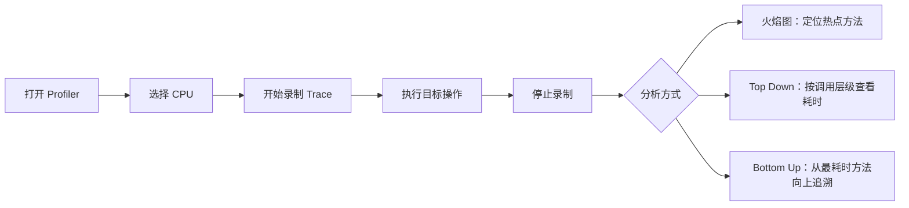
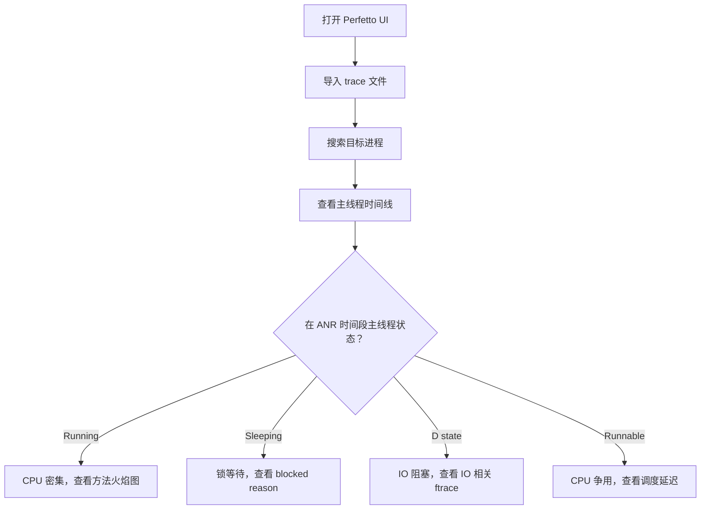

# 稳定性调试工具链

## StrictMode

### 线程策略（ThreadPolicy）

检测主线程上不应执行的操作：

```kotlin
if (BuildConfig.DEBUG) {
    StrictMode.setThreadPolicy(
        StrictMode.ThreadPolicy.Builder()
            .detectDiskReads()          // 磁盘读取
            .detectDiskWrites()         // 磁盘写入
            .detectNetwork()            // 网络操作
            .detectCustomSlowCalls()    // 自定义慢调用（通过 StrictMode.noteSlowCall）
            .detectResourceMismatches() // 资源类型不匹配（API 23+）
            .penaltyLog()               // 违规时输出日志
            .penaltyFlashScreen()       // 屏幕闪红（直观提示）
            .build()
    )
}
```

### VM 策略（VmPolicy）

检测虚拟机层面的资源泄漏：

```kotlin
if (BuildConfig.DEBUG) {
    StrictMode.setVmPolicy(
        StrictMode.VmPolicy.Builder()
            .detectLeakedSqlLiteObjects()       // 未关闭的 SQLite 对象
            .detectLeakedClosableObjects()      // 未关闭的 Closeable
            .detectActivityLeaks()              // Activity 泄漏
            .detectLeakedRegistrationObjects()  // 未注销的 Receiver / ServiceConnection
            .detectFileUriExposure()            // file:// URI 暴露
            .detectContentUriWithoutPermission() // 无权限的 ContentUri
            .detectCleartextNetwork()           // 明文网络请求（API 23+）
            .penaltyLog()
            .build()
    )
}
```

### 违规处理方式

| 策略 | 行为 | 适用场景 |
|------|------|----------|
| `penaltyLog()` | 输出到 Logcat（Tag: `StrictMode`） | 日常开发 |
| `penaltyFlashScreen()` | 屏幕闪红 | 快速发现违规 |
| `penaltyDeath()` | 直接崩溃 | 强制修复，用于 CI 测试 |
| `penaltyDropBox()` | 写入 DropBox | 记录到系统日志 |
| `penaltyDeathOnNetwork()` | 仅网络违规时崩溃 | 严格禁止主线程网络 |

### 日志解读

```text
D/StrictMode: StrictMode policy violation: ~duration=120 ms
    android.os.StrictMode$StrictModeDiskReadViolation
        at android.os.StrictMode$AndroidBlockGuardPolicy.onReadFromDisk(...)
        at com.example.myapp.SettingsManager.loadConfig(SettingsManager.kt:35)
        at com.example.myapp.MainActivity.onCreate(MainActivity.kt:22)
```

- `~duration=120 ms`：违规操作耗时 120ms
- `DiskReadViolation`：磁盘读取违规
- 堆栈指向 `SettingsManager.loadConfig` → 应迁移到子线程

## Android Profiler

### CPU Profiler



**在代码中插入自定义 Trace 标记：**

```kotlin
import android.os.Trace

inline fun <T> traceBlock(sectionName: String, block: () -> T): T {
    Trace.beginSection(sectionName)
    return try {
        block()
    } finally {
        Trace.endSection()
    }
}

// 使用
fun loadData() = traceBlock("loadData") {
    val users = database.queryAllUsers()
    users.map { it.toDisplayModel() }
}
```

### Memory Profiler

| 功能 | 操作 | 用途 |
|------|------|------|
| 实时监控 | 查看堆内存曲线 | 观察内存增长趋势 |
| Heap Dump | 点击 📷 按钮 | 捕获当前堆快照，搜索泄漏对象 |
| Allocation Tracking | 录制分配 | 追踪对象分配热点 |
| Force GC | 点击垃圾桶图标 | 触发 GC 后对比内存变化 |

**检测 Activity 泄漏的操作流程：**

1. 进入目标 Activity
2. 返回退出 Activity
3. 点击 Force GC
4. 点击 Heap Dump
5. 在快照中搜索 Activity 类名
6. 如果还能找到 → 泄漏！查看引用链定位原因

### Network Profiler

查看网络请求时序、请求体/响应体、数据量。对于排查因网络请求阻塞导致的 ANR 或性能问题很有帮助。

### Energy Profiler

| 检测项 | 关注点 |
|--------|--------|
| WakeLock | 是否有未释放的 WakeLock 导致不必要的唤醒 |
| JobScheduler | 后台任务调度是否合理 |
| Alarm | 是否有过于频繁的闹钟 |
| GPS | 是否有不必要的持续定位 |

## Perfetto

### 系统级 Trace 录制

```bash
# 录制 10 秒的系统 trace
adb shell perfetto \
    -c - --txt \
    -o /data/misc/perfetto-traces/trace.perfetto-trace \
    <<EOF
buffers: {
    size_kb: 63488
    fill_policy: RING_BUFFER
}
data_sources: {
    config {
        name: "linux.ftrace"
        ftrace_config {
            ftrace_events: "sched/sched_switch"
            ftrace_events: "sched/sched_wakeup"
            ftrace_events: "sched/sched_blocked_reason"
            ftrace_events: "power/suspend_resume"
            atrace_categories: "am"
            atrace_categories: "wm"
            atrace_categories: "view"
            atrace_categories: "gfx"
            atrace_categories: "dalvik"
            atrace_apps: "com.example.myapp"
        }
    }
}
duration_ms: 10000
EOF

# 拉取 trace 文件
adb pull /data/misc/perfetto-traces/trace.perfetto-trace

# 在浏览器中分析：https://ui.perfetto.dev
```

**常用 atrace_categories：**

| Category | 内容 |
|----------|------|
| `am` | ActivityManager（ANR、进程启动） |
| `wm` | WindowManager（窗口操作） |
| `view` | View 系统（measure/layout/draw） |
| `gfx` | 图形渲染（SurfaceFlinger） |
| `dalvik` | 虚拟机（GC 事件） |
| `sched` | CPU 调度 |

### Perfetto UI 分析

在 [ui.perfetto.dev](https://ui.perfetto.dev) 导入 trace 文件后：

1. **搜索目标进程**：按包名搜索
2. **查看主线程时间线**：展开进程 → 找到 `main` 线程
3. **分析主线程状态**：

| 颜色/状态 | 含义 | 分析方向 |
|----------|------|----------|
| 🟢 Running | 正在 CPU 上执行 | CPU 密集任务，查看具体在执行什么方法 |
| 🔵 Runnable (R) | 就绪但未被调度 | CPU 资源不足，被其他进程/线程抢占 |
| 🟠 Sleeping (S) | 休眠等待（如锁等待） | 检查 `blocked reason` |
| 🔴 Uninterruptible Sleep (D) | 不可中断休眠（IO 等待） | 磁盘 IO 瓶颈 |

### ANR 场景分析



### 自定义 Trace 标记

```kotlin
import android.os.Trace

fun loadUserProfile(userId: String) {
    Trace.beginSection("loadUserProfile")
    try {
        Trace.beginSection("queryDatabase")
        val user = database.getUser(userId)
        Trace.endSection()

        Trace.beginSection("fetchAvatar")
        val avatar = imageLoader.load(user.avatarUrl)
        Trace.endSection()

        updateUI(user, avatar)
    } finally {
        Trace.endSection()
    }
}
```

## adb bugreport

### 生成与解压

```bash
# 生成 bugreport（耗时 1-3 分钟）
adb bugreport bugreport.zip

# 解压后的目录结构
# bugreport-<device>-<date>.txt  → 主报告
# FS/data/anr/                   → ANR traces
# FS/data/tombstones/            → Native crash
# proto/                         → 结构化数据（Android 12+）
# version.txt                    → bugreport 版本
```

### 关键段落解读

| 搜索关键字 | 位置 | 含义 |
|-----------|------|------|
| `"ANR in"` | 主报告 | ANR 的应用和组件名 |
| `"CPU usage from"` | 主报告 | ANR 前后的 CPU 使用分布 |
| `"iowait"` | CPU 使用段 | IO 等待占比，高值 → 磁盘瓶颈 |
| `"Cmd line:"` | traces 段 | 各进程的包名 |
| `"DALVIK THREADS"` | traces 段 | Java 线程堆栈 |
| `"am_anr"` | event log 段 | ANR 事件记录 |
| `"am_crash"` | event log 段 | Crash 事件记录 |
| `"am_proc_died"` | event log 段 | 进程死亡记录 |

### 与 Battery Historian 配合

```bash
# 1. 生成 bugreport
adb bugreport bugreport.zip

# 2. 启动 Battery Historian（Docker 方式）
docker run -p 9999:9999 gcr.io/android-battery-historian/stable:3.1 --port 9999

# 3. 浏览器打开 http://localhost:9999，上传 bugreport.zip
# 可分析：
# - WakeLock 持有时间线
# - JobScheduler / Alarm 执行频率
# - 网络活动与电量消耗关系
# - 屏幕亮灭与休眠状态
```

## Logcat

### 高效过滤技巧

```bash
# 按优先级过滤（仅 Warning 及以上）
adb logcat *:W

# 按 Tag 过滤
adb logcat -s MyApp:D CrashHandler:V

# 按 PID 过滤
adb logcat --pid=$(adb shell pidof com.example.myapp)

# 按正则匹配
adb logcat | grep -E "(ANR|FATAL|OOM)"

# 系统事件日志
adb logcat -b events | grep -E "(am_anr|am_crash|am_proc_died)"

# 按时间过滤
adb logcat -T "04-06 10:30:00.000"

# 清除旧日志 + 开始录制
adb logcat -c && adb logcat

# 输出到文件
adb logcat -f /sdcard/log.txt -r 10240 -n 4  # 10MB 一个文件，最多 4 个
```

### 常用 Tag 速查表

| Tag | 来源 | 用途 |
|-----|------|------|
| `ActivityManager` | AMS | ANR、进程启动/死亡、Activity 生命周期 |
| `WindowManager` | WMS | 窗口管理、焦点变化 |
| `System.err` | Java Runtime | 未捕获异常堆栈 |
| `AndroidRuntime` | Runtime | `FATAL EXCEPTION` 崩溃日志 |
| `DEBUG` | debuggerd | Native crash 信息 |
| `lowmemorykiller` | lmkd | 低内存杀进程记录 |
| `Watchdog` | SystemServer | 系统服务死锁检测 |
| `StrictMode` | StrictMode | 开发期违规检测 |
| `chatty` | Logcat | 日志被折叠的提示 |

### 规范化日志输出

```kotlin
object AppLog {
    private const val TAG = "MyApp"

    fun d(message: String, tag: String = TAG) {
        if (BuildConfig.DEBUG) {
            Log.d(tag, "[${Thread.currentThread().name}] $message")
        }
    }

    fun e(message: String, throwable: Throwable? = null, tag: String = TAG) {
        Log.e(tag, "[${Thread.currentThread().name}] $message", throwable)
    }

    inline fun perf(label: String, block: () -> Unit) {
        val start = SystemClock.elapsedRealtime()
        block()
        val elapsed = SystemClock.elapsedRealtime() - start
        d("[$label] 耗时: ${elapsed}ms")
        if (elapsed > 16) {
            Log.w(TAG, "[$label] 耗时 ${elapsed}ms，超过一帧(16ms)")
        }
    }
}
```

## Android Studio 内存分析器

### Heap Dump 分析

1. **打开 Memory Profiler** → 点击 📷 Heap Dump
2. **查看类列表** → 按 Retained Size 排序（占用内存最大的对象在前）
3. **搜索可疑对象** → 如 `Activity`、`Fragment`、`Bitmap`
4. **查看引用链** → 选中对象 → References → 追踪 GC Root 引用链

| 概念 | 含义 |
|------|------|
| **Shallow Size** | 对象自身占用的内存 |
| **Retained Size** | 对象被 GC 后能释放的总内存（包括仅被它引用的其他对象） |
| **Dominator Tree** | 对象支配树，快速找到"持有最多内存"的对象 |

### Allocation Tracking

录制一段时间内的内存分配：

1. **开始录制** → 执行目标操作 → **停止录制**
2. 查看分配热点：哪些方法分配了最多对象
3. 优化频繁分配：对象池、避免在循环中 new 对象

## Simpleperf

Android NDK 自带的 CPU 性能分析工具，适合分析 Native 代码性能。

```bash
# 录制目标应用的 CPU profile（10 秒）
adb shell simpleperf record -p $(adb shell pidof com.example.myapp) \
    --duration 10 -o /data/local/tmp/perf.data

# 拉取数据
adb pull /data/local/tmp/perf.data

# 生成报告
simpleperf report -i perf.data

# 生成火焰图
simpleperf report-sample -i perf.data --symfs . | \
    stackcollapse-sample.awk | flamegraph.pl > flame.svg
```

## MAT（Memory Analyzer Tool）

### 导入 HPROF 文件

```bash
# 1. 从 Android Studio Memory Profiler 导出 .hprof
# 2. 转换为标准格式
hprof-conv android.hprof standard.hprof

# 3. 在 MAT 中打开 standard.hprof
```

### 常用分析功能

| 功能 | 用途 |
|------|------|
| **Leak Suspects Report** | 自动检测可能的内存泄漏 |
| **Histogram** | 按类列出对象数量和内存占用 |
| **Dominator Tree** | 按 Retained Size 排序的对象树 |
| **OQL** | 类 SQL 查询语法搜索对象 |

```sql
-- OQL 查询示例

-- 查找所有 Activity 实例
SELECT * FROM INSTANCEOF android.app.Activity

-- 查找大 Bitmap
SELECT * FROM android.graphics.Bitmap b WHERE b.@retainedHeapSize > 1000000

-- 查找未释放的 Cursor
SELECT * FROM INSTANCEOF android.database.Cursor
```

## 常见坑点

### 1. Profiler 连接不上设备

确保应用是 `debuggable` 的。Release 构建需要添加：

```kotlin
android {
    buildTypes {
        release {
            isProfileable = true // 允许 Profiler 连接但不影响性能
        }
    }
}
```

### 2. Perfetto trace 文件过大

减小 `buffers.size_kb` 或缩短 `duration_ms`。对于 ANR 分析，通常 10 秒录制已足够。

### 3. StrictMode 在 Release 中未关闭

StrictMode 检测有性能开销，务必只在 Debug 构建中启用。

## 踩坑记录

> 此区域供团队成员补充项目中遇到的真实案例。

| 日期 | 记录人 | 问题描述 | 解决方案 |
|------|--------|----------|----------|
| | | | |

## 参考资料

- [Android 官方文档 - StrictMode](https://developer.android.com/reference/android/os/StrictMode)
- [Android Profiler 使用指南](https://developer.android.com/studio/profile)
- [Perfetto 官方文档](https://perfetto.dev/docs/)
- [Simpleperf 文档](https://developer.android.com/ndk/guides/simpleperf)
- [Eclipse MAT](https://eclipse.dev/mat/)
- [Battery Historian](https://developer.android.com/topic/performance/power/battery-historian)
