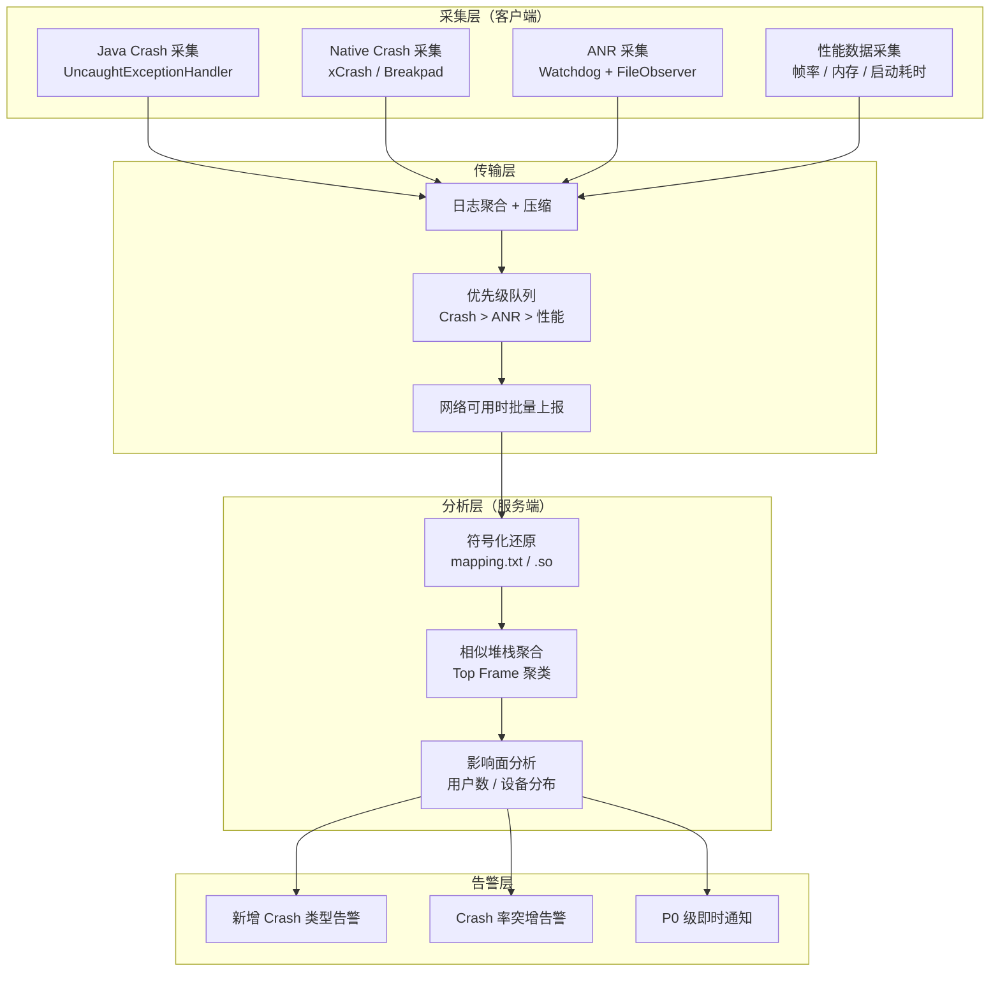
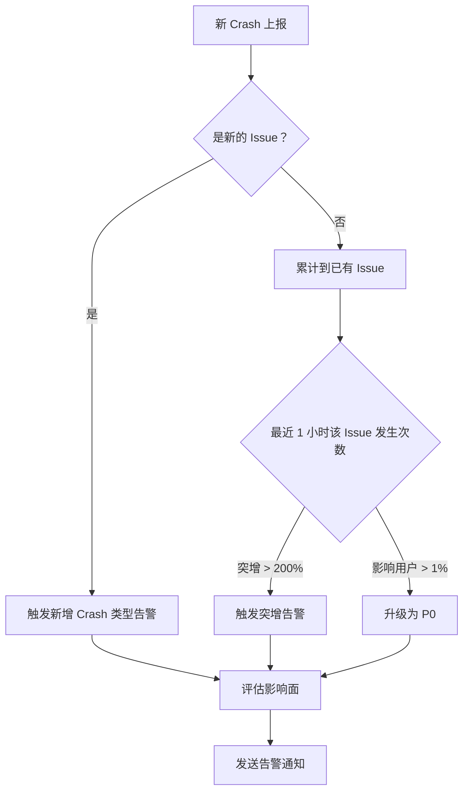
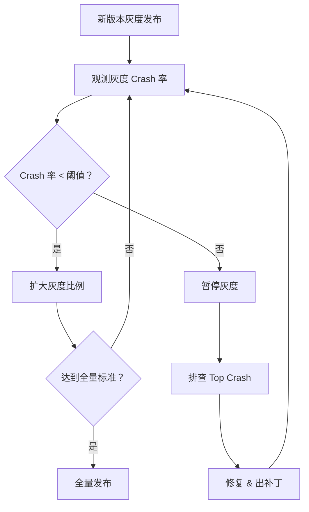
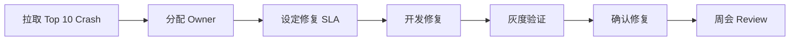
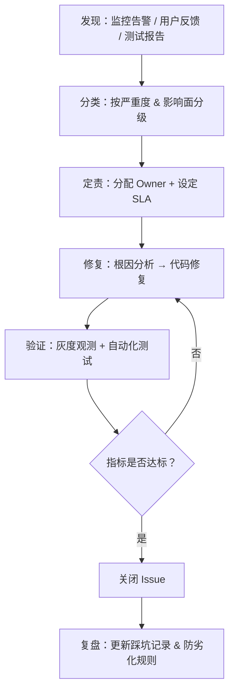

# 线上稳定性治理

## 稳定性度量指标体系

### 核心指标定义

| 指标 | 计算公式 | 行业基准 | 说明 |
|------|----------|----------|------|
| **Crash 率（UV）** | 发生 Crash 的用户数 / DAU × 100% | < 0.1% | 最核心指标，衡量影响面 |
| **Crash 率（PV）** | Crash 发生次数 / 应用启动次数 × 100% | < 0.2% | 衡量发生频率 |
| **ANR 率** | 发生 ANR 的用户数 / DAU × 100% | < 0.5% | Google Play 质量指标 |
| **Crash-free Users** | (DAU - Crash 用户数) / DAU × 100% | > 99.9% | Crashlytics 核心指标 |
| **启动崩溃率** | 启动 30s 内崩溃次数 / 启动次数 × 100% | < 0.05% | 最严重——用户无法使用 |

### 辅助指标

| 指标 | 用途 |
|------|------|
| 首次启动崩溃率 | 新版本安装后首次启动崩溃，影响留存 |
| 版本环比 Crash 率 | 新版本 vs 上一版本的 Crash 率变化 |
| 机型/OS 维度 Crash 率 | 识别特定设备或系统版本的问题 |
| Top N Crash 影响面 | 前 N 个 Crash 影响的总用户占比 |
| 平均修复周期 | 从发现到修复的平均天数 |

### 指标采集与计算

```kotlin
// 在应用启动时上报"启动成功"事件
class App : Application() {
    override fun onCreate() {
        super.onCreate()

        // 标记启动开始
        val startTime = SystemClock.elapsedRealtime()

        // ... 初始化完成后
        Handler(Looper.getMainLooper()).postDelayed({
            // 启动后 5 秒内未崩溃，上报"启动成功"
            analytics.reportEvent("app_launch_success", mapOf(
                "duration_ms" to (SystemClock.elapsedRealtime() - startTime).toString(),
                "version" to BuildConfig.VERSION_NAME
            ))
        }, 5000)
    }
}
```

```text
Crash 率 (UV) = 上报 Crash 的去重设备数 / 上报"启动成功"的去重设备数 × 100%
```

## 监控平台架构



### 采集层设计

统一的崩溃采集接口：

```kotlin
interface CrashCollector {
    fun collectJavaCrash(thread: Thread, throwable: Throwable): CrashReport
    fun collectNativeCrash(tombstonePath: String): CrashReport
    fun collectAnr(traces: String): CrashReport
}

data class CrashReport(
    val type: CrashType,         // JAVA / NATIVE / ANR
    val timestamp: Long,
    val stackTrace: String,
    val deviceInfo: DeviceInfo,
    val appInfo: AppInfo,
    val memoryInfo: MemoryInfo,
    val customData: Map<String, String> = emptyMap()
)

enum class CrashType { JAVA, NATIVE, ANR }
```

### 传输层设计

```kotlin
class CrashReportQueue(private val context: Context) {
    private val queue = PriorityBlockingQueue<PrioritizedReport>(
        20,
        compareByDescending { it.priority }
    )

    fun enqueue(report: CrashReport) {
        val priority = when (report.type) {
            CrashType.JAVA -> 100
            CrashType.NATIVE -> 95
            CrashType.ANR -> 90
        }
        queue.offer(PrioritizedReport(priority, report))
        scheduleUpload()
    }

    private fun scheduleUpload() {
        val request = OneTimeWorkRequestBuilder<CrashUploadWorker>()
            .setConstraints(
                Constraints.Builder()
                    .setRequiredNetworkType(NetworkType.CONNECTED)
                    .build()
            )
            .build()
        WorkManager.getInstance(context).enqueueUniqueWork(
            "crash_upload", ExistingWorkPolicy.KEEP, request
        )
    }

    data class PrioritizedReport(val priority: Int, val report: CrashReport)
}
```

### 分析层设计

**相似堆栈聚合算法：**

取崩溃堆栈的 Top N 帧作为"指纹"，相同指纹的 Crash 归为同一 Issue：

```text
指纹 = SHA256(
    异常类名 +
    Top 3 帧的 [类名.方法名:行号]
)
```

```text
示例：
NullPointerException
  at com.example.UserManager.getUser(UserManager.kt:42)
  at com.example.HomeFragment.loadData(HomeFragment.kt:85)
  at com.example.HomeFragment.onResume(HomeFragment.kt:30)

指纹 = SHA256("NullPointerException+UserManager.getUser:42+HomeFragment.loadData:85+HomeFragment.onResume:30")
```

## 告警策略设计

### 告警级别定义

| 级别 | 定义 | 响应时效 | 通知方式 |
|------|------|----------|----------|
| **P0** | 影响核心功能或 >1% 用户 | 30 分钟内 | IM + 电话 + 短信 |
| **P1** | 影响次要功能或 0.1%-1% 用户 | 4 小时内 | IM + 邮件 |
| **P2** | 长尾低频问题或 <0.1% 用户 | 下个迭代 | 邮件 |

### 告警触发规则



### 告警降噪

| 策略 | 说明 |
|------|------|
| **去重** | 同一 Issue 在告警冷却期内（如 1 小时）不重复告警 |
| **抑制** | 已知问题标记为"已确认"后，降低告警频率 |
| **合并** | 短时间内多个告警合并为一条摘要 |
| **值班轮转** | 告警发送给当前值班人，避免"所有人收到→没人处理" |

## 发版质量门禁

### Crash 率阈值卡控



### 灰度发布与观测

| 灰度阶段 | 比例 | 观测时间 | 核心指标 |
|----------|------|---------|---------|
| 第 1 阶段 | 1% | 24 小时 | 启动崩溃率、新增 Crash |
| 第 2 阶段 | 5% | 24 小时 | Crash 率（UV）、ANR 率 |
| 第 3 阶段 | 20% | 48 小时 | 全部稳定性指标 |
| 第 4 阶段 | 50% | 48 小时 | 与上一版本指标对比 |
| 全量 | 100% | 持续监控 | — |

### 回滚策略

| 触发条件 | 回滚方式 |
|----------|----------|
| 启动崩溃率 > 1% | 立即回滚（自动） |
| Crash 率环比 > 200% | 暂停灰度 + 人工评估 |
| P0 Crash 影响 > 10000 用户 | 立即回滚（自动） |

## Crash 治理优先级排序

### 影响面评估公式

```text
优先级分 = 影响用户数 × 频次权重 × 严重度权重

频次权重：
  - 每用户仅发生 1 次 → ×1
  - 每用户发生 2-5 次 → ×1.5
  - 每用户发生 >5 次 → ×2

严重度权重：
  - 启动崩溃 → ×10
  - 核心功能崩溃 → ×5
  - 次要功能崩溃 → ×2
  - 后台崩溃 → ×1
```

### Top N Crash 歼灭战



| 步骤 | 负责人 | SLA |
|------|--------|-----|
| 问题确认 & 分配 | 稳定性负责人 | 1 个工作日 |
| 根因分析 | Issue Owner | 2 个工作日 |
| 修复开发 | Issue Owner | 视复杂度 |
| 灰度验证 | QA | 1-2 天 |
| 全量覆盖 | 发版负责人 | 下一个版本 |

## 版本对比与趋势分析

| 分析维度 | 关注点 |
|----------|--------|
| **新增 Crash** | 新版本引入的全新 Issue |
| **已修复 Crash** | 上一版本存在但新版本消失的 Issue |
| **未修复 Crash** | 跨版本持续存在的 Issue |
| **版本 Crash 率对比** | 新版本 vs 上一版本的核心指标变化 |
| **设备/OS 分布变化** | 特定设备或 OS 版本的 Crash 集中度变化 |

## 稳定性专项治理流程



**建设阶段规划：**

| 阶段 | 目标 | 关键指标 |
|------|------|----------|
| **第 1 阶段** | 接入 Crash/ANR 采集 SDK | Crash 率 < 0.1%、ANR 率 < 0.5% |
| **第 2 阶段** | 自动符号化 + 聚合 | Top 10 Crash 覆盖率 > 90% |
| **第 3 阶段** | 告警 + 度量 | 新版本 Crash 率不高于上一版本 |
| **第 4 阶段** | 深度分析 + 防劣化 | 平均修复周期 < 3 天 |

## 常见坑点

### 1. DAU 口径不统一导致 Crash 率计算偏差

不同团队/平台对 DAU 的定义不同（启动次数 vs 去重设备数），导致 Crash 率数值差异大。需要团队内统一口径。

### 2. 灰度阶段样本量不足

1% 灰度时 DAU 可能只有几百人，Crash 率波动大，单个用户的多次崩溃会显著拉高指标。建议在样本量达到统计显著性后再做判断。

### 3. 符号化缺失导致 Crash 无法归类

未上传 mapping.txt 或 .so 的版本，线上 Crash 堆栈混淆后无法解读，也无法正确聚合。必须在 CI 中自动化符号表上传。

## 踩坑记录

> 此区域供团队成员补充项目中遇到的真实案例。

| 日期 | 记录人 | 问题描述 | 解决方案 |
|------|--------|----------|----------|
| | | | |

## 参考资料

- [Android Vitals - Google Play Console](https://developer.android.com/topic/performance/vitals)
- [Firebase Crashlytics Dashboard](https://firebase.google.com/docs/crashlytics)
- [Google Play 质量核心指标](https://developer.android.com/topic/performance/vitals/crash)
- [Sentry Performance Monitoring](https://docs.sentry.io/product/performance/)
