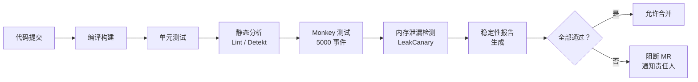
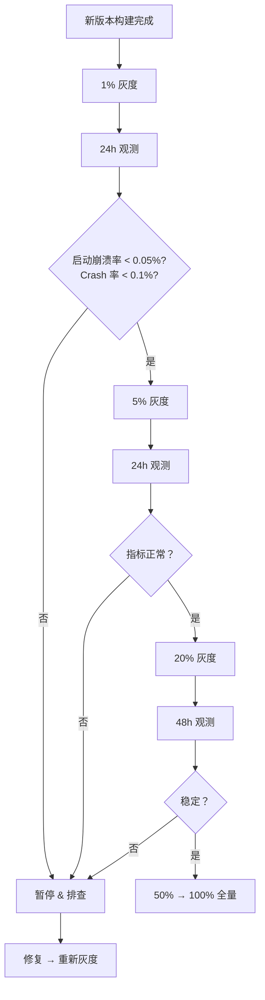

# 稳定性测试与防劣化

## Monkey 压力测试

### 基本用法与参数

Monkey 是 Android 自带的随机事件生成工具，通过注入随机触摸、按键、手势等事件对应用进行压力测试。

```bash
# 基础命令：向目标包发送 10000 个随机事件
adb shell monkey -p com.example.myapp -v 10000

# 完整参数示例
adb shell monkey \
    -p com.example.myapp \         # 目标包名
    --throttle 300 \               # 事件间隔（ms），避免过快
    --pct-touch 40 \               # 触摸事件占比 40%
    --pct-motion 20 \              # 手势事件占比 20%
    --pct-appswitch 10 \           # 应用切换占比 10%
    --pct-syskeys 5 \              # 系统按键占比 5%（Home/Back/Menu）
    --pct-anyevent 25 \            # 其他事件占比 25%
    --ignore-crashes \             # 遇到 Crash 继续运行（不停止）
    --ignore-timeouts \            # 遇到 ANR 继续运行
    --ignore-security-exceptions \ # 忽略权限异常
    -s 12345 \                     # 随机种子（相同种子可复现）
    -v -v -v \                     # 详细日志（3 级）
    50000                          # 总事件数
```

**关键参数说明：**

| 参数 | 说明 | 推荐值 |
|------|------|--------|
| `--throttle` | 事件间隔（ms），过快可能导致事件堆积 | 200-500 |
| `-s <seed>` | 随机种子，相同种子产生相同事件序列 | 记录用于复现 |
| `--pct-touch` | 触摸事件比例 | 40-60% |
| `--ignore-crashes` | Crash 不停止 | 建议添加，收集所有 Crash |
| `-v -v -v` | 3 级详细日志 | 排查时使用 |

### 场景定制

```bash
# 限定在特定 Activity 中执行
adb shell monkey \
    -p com.example.myapp \
    -c android.intent.category.LAUNCHER \
    --throttle 300 \
    10000

# 使用黑名单排除特定 Activity（如设置页）
# 创建 blacklist.txt
echo "com.example.myapp.SettingsActivity" > /tmp/blacklist.txt
adb push /tmp/blacklist.txt /data/local/tmp/
adb shell monkey \
    -p com.example.myapp \
    --pkg-blacklist-file /data/local/tmp/blacklist.txt \
    10000
```

### 结果分析

```bash
# 执行 Monkey 并将日志保存到文件
adb shell monkey -p com.example.myapp -v -v 10000 2>&1 | tee monkey_log.txt

# 从日志中提取 Crash 信息
grep -A 20 "CRASH" monkey_log.txt

# 从日志中提取 ANR 信息
grep -A 20 "ANR" monkey_log.txt

# 统计 Crash 和 ANR 次数
echo "Crash 次数: $(grep -c 'CRASH' monkey_log.txt)"
echo "ANR 次数: $(grep -c 'ANR' monkey_log.txt)"
```

**复现 Crash：** 使用相同的种子值（`-s`）再次运行即可复现：

```bash
# 记录种子值
adb shell monkey -p com.example.myapp -s 12345 -v 5000

# 复现时使用相同种子
adb shell monkey -p com.example.myapp -s 12345 -v 5000
```

### 与 CI 集成

```yaml
# GitHub Actions 示例
name: Monkey Test
on: [push]

jobs:
  monkey-test:
    runs-on: ubuntu-latest
    steps:
      - uses: actions/checkout@v4
      - name: Set up JDK
        uses: actions/setup-java@v4
        with:
          java-version: '17'
          distribution: 'temurin'

      - name: Build APK
        run: ./gradlew assembleDebug

      - name: Start Emulator
        uses: reactivecircus/android-emulator-runner@v2
        with:
          api-level: 34
          script: |
            adb install app/build/outputs/apk/debug/app-debug.apk
            adb shell monkey -p com.example.myapp \
              --throttle 300 \
              --ignore-crashes \
              --ignore-timeouts \
              -v -v 10000 2>&1 | tee monkey_log.txt

            # 判定：有 Crash 则失败
            if grep -q "CRASH" monkey_log.txt; then
              echo "Monkey test found crashes!"
              exit 1
            fi

      - name: Upload Monkey Log
        if: always()
        uses: actions/upload-artifact@v4
        with:
          name: monkey-log
          path: monkey_log.txt
```

## 自动化稳定性测试

### 长时间运行测试（Endurance Test）

模拟用户长时间使用应用，监控内存增长、FD 数变化、线程数变化：

```kotlin
@RunWith(AndroidJUnit4::class)
@LargeTest
class EnduranceTest {

    @get:Rule
    val activityRule = ActivityScenarioRule(MainActivity::class.java)

    @Test
    fun testLongRunningStability() {
        val metrics = mutableListOf<ResourceSnapshot>()

        repeat(100) { iteration ->
            // 模拟用户操作循环
            onView(withId(R.id.tab_home)).perform(click())
            Thread.sleep(1000)

            onView(withId(R.id.tab_search)).perform(click())
            Thread.sleep(1000)

            onView(withId(R.id.tab_profile)).perform(click())
            Thread.sleep(1000)

            // 每 10 轮采集资源数据
            if (iteration % 10 == 0) {
                metrics.add(captureResourceSnapshot())
            }
        }

        // 分析内存增长趋势
        val memoryGrowth = metrics.last().usedMemoryMB - metrics.first().usedMemoryMB
        assertThat("内存增长不应超过 50MB", memoryGrowth, lessThan(50f))

        val fdGrowth = metrics.last().fdCount - metrics.first().fdCount
        assertThat("FD 增长不应超过 50", fdGrowth, lessThan(50))
    }

    private fun captureResourceSnapshot(): ResourceSnapshot {
        val runtime = Runtime.getRuntime()
        val usedMem = (runtime.totalMemory() - runtime.freeMemory()) / 1024f / 1024f
        val fdCount = File("/proc/self/fd").listFiles()?.size ?: 0
        val threadCount = Thread.activeCount()

        return ResourceSnapshot(usedMem, fdCount, threadCount)
    }

    data class ResourceSnapshot(
        val usedMemoryMB: Float,
        val fdCount: Int,
        val threadCount: Int
    )
}
```

### 场景覆盖测试

```kotlin
@RunWith(AndroidJUnit4::class)
class StabilityScenarioTest {

    @Test
    fun testUnderLowMemory() {
        // 模拟低内存场景
        val am = InstrumentationRegistry.getInstrumentation()
            .targetContext.getSystemService(Context.ACTIVITY_SERVICE) as ActivityManager

        // 分配大量内存施压
        val memoryPressure = mutableListOf<ByteArray>()
        try {
            repeat(100) {
                memoryPressure.add(ByteArray(1024 * 1024)) // 每次 1MB
            }
        } catch (_: OutOfMemoryError) {
            // 预期的 OOM
        }

        // 在低内存下执行核心操作
        onView(withId(R.id.btn_submit)).perform(click())

        // 验证应用未崩溃
        onView(withId(R.id.result_text)).check(matches(isDisplayed()))
    }

    @Test
    fun testRapidRotation() {
        // 快速旋转屏幕测试 Activity 重建
        val scenario = ActivityScenario.launch(MainActivity::class.java)
        repeat(20) {
            scenario.recreate()
            Thread.sleep(500)
        }
        // 验证 Activity 状态正确恢复
        onView(withId(R.id.content_view)).check(matches(isDisplayed()))
    }
}
```

### UI 自动化与稳定性

```kotlin
@RunWith(AndroidJUnit4::class)
class UiStabilityTest {

    private val device = UiDevice.getInstance(InstrumentationRegistry.getInstrumentation())

    @Test
    fun testNavigationStability() {
        // 使用 UiAutomator 进行跨应用测试
        repeat(50) {
            // 按 Home 键
            device.pressHome()
            Thread.sleep(500)

            // 重新打开应用
            val context = InstrumentationRegistry.getInstrumentation().targetContext
            val intent = context.packageManager.getLaunchIntentForPackage(context.packageName)
            intent?.addFlags(Intent.FLAG_ACTIVITY_NEW_TASK)
            context.startActivity(intent)
            Thread.sleep(2000)

            // 验证应用正常显示
            val appVisible = device.findObject(UiSelector().packageName(context.packageName))
            assertTrue("应用应该可见", appVisible.exists())
        }
    }
}
```

## 内存泄漏自动化检测

### LeakCanary CI 集成

```kotlin
// build.gradle.kts
dependencies {
    androidTestImplementation("com.squareup.leakcanary:leakcanary-android-instrumentation:2.14")
}
```

```kotlin
// 在 Instrumentation Test 中自动检测泄漏
@RunWith(AndroidJUnit4::class)
class LeakTest {

    @get:Rule
    val rule = LeakAssertions.none() // 任何泄漏都会导致测试失败

    @Test
    fun testNoActivityLeaks() {
        val scenario = ActivityScenario.launch(MainActivity::class.java)
        // 执行操作
        onView(withId(R.id.btn_navigate)).perform(click())
        Thread.sleep(1000)

        // 销毁 Activity
        scenario.close()

        // LeakCanary 自动检测泄漏
        // 如果有泄漏，测试会失败并输出 Leak Trace
    }
}
```

### Heap Dump 自动化分析

```kotlin
class HeapDumpAnalyzer {

    fun analyzeHeapGrowth(context: Context, iterations: Int = 5): HeapReport {
        val snapshots = mutableListOf<Long>()

        repeat(iterations) {
            Runtime.getRuntime().gc()
            Thread.sleep(1000)

            val runtime = Runtime.getRuntime()
            val usedHeap = runtime.totalMemory() - runtime.freeMemory()
            snapshots.add(usedHeap)

            // 执行业务操作...
            performBusinessCycle()
        }

        val growthPerCycle = if (snapshots.size >= 2) {
            (snapshots.last() - snapshots.first()) / (snapshots.size - 1)
        } else 0L

        return HeapReport(
            snapshots = snapshots,
            growthPerCycle = growthPerCycle,
            isLeaking = growthPerCycle > 1024 * 1024 // 每轮增长超过 1MB 视为可疑
        )
    }

    data class HeapReport(
        val snapshots: List<Long>,
        val growthPerCycle: Long,
        val isLeaking: Boolean
    )
}
```

## ANR 检测自动化

```kotlin
@RunWith(AndroidJUnit4::class)
class AnrDetectionTest {

    @Test
    fun testNoAnrDuringNormalFlow() {
        val anrDetected = AtomicBoolean(false)

        // 启动 ANR 检测
        val watchdog = AnrWatchdog(timeout = 5000L) { stackTrace ->
            anrDetected.set(true)
            Log.e("ANR", "检测到 ANR: ${stackTrace.joinToString("\n")}")
        }
        watchdog.start()

        try {
            // 执行正常业务流程
            onView(withId(R.id.btn_load)).perform(click())
            Thread.sleep(3000)
            onView(withId(R.id.btn_submit)).perform(click())
            Thread.sleep(3000)

            assertFalse("不应检测到 ANR", anrDetected.get())
        } finally {
            watchdog.stop()
        }
    }
}
```

## CI/CD 集成稳定性卡点

### 流水线设计



### 稳定性报告模板

```markdown
## 稳定性测试报告

### 基本信息
- 版本: v2.3.1 (build 245)
- 测试时间: 2026-04-06 10:00 - 11:30
- 测试设备: Pixel 7 (Android 14)

### Monkey 测试
- 事件数: 10,000
- 时长: 25 分钟
- Crash 数: 0
- ANR 数: 0
- 结果: ✅ PASS

### 内存泄漏检测
- 检测 Activity 数: 12
- 泄漏数: 0
- 结果: ✅ PASS

### 资源监控
- 起始内存: 85MB → 结束内存: 92MB（增长 7MB）
- 起始 FD: 120 → 结束 FD: 125（增长 5）
- 起始线程: 45 → 结束线程: 48（增长 3）
- 结果: ✅ PASS（均在阈值内）

### 综合判定: ✅ PASS
```

### 失败处理策略

```kotlin
// CI 脚本中的判定逻辑（伪代码）
fun evaluateStabilityReport(report: StabilityReport): Boolean {
    val rules = listOf(
        // Monkey 测试不允许有 Crash
        Rule("Monkey Crash") { report.monkeyCrashCount == 0 },
        // 不允许有内存泄漏
        Rule("Memory Leak") { report.leakCount == 0 },
        // 内存增长不超过 50MB
        Rule("Memory Growth") { report.memoryGrowthMB < 50 },
        // FD 增长不超过 100
        Rule("FD Growth") { report.fdGrowth < 100 },
        // 线程增长不超过 50
        Rule("Thread Growth") { report.threadGrowth < 50 },
    )

    val failures = rules.filter { !it.check() }
    if (failures.isNotEmpty()) {
        notifyOwner(failures)
        return false
    }
    return true
}
```

## 基线指标建立与回归检测

### 基线建立

选定一个稳定的版本作为基准，录制各项指标的基线值：

| 指标 | 基线值 | 允许波动范围 |
|------|--------|-------------|
| Crash 率（UV） | 0.05% | +0.02% |
| ANR 率 | 0.2% | +0.1% |
| 启动耗时（P50） | 800ms | +100ms |
| 内存峰值 | 180MB | +30MB |
| FD 峰值 | 200 | +50 |
| 启动后线程数 | 50 | +10 |

### 回归检测

```kotlin
data class BaselineMetrics(
    val crashRateUV: Float,
    val anrRate: Float,
    val startupP50Ms: Long,
    val peakMemoryMB: Long,
    val peakFdCount: Int,
    val threadCount: Int
)

fun detectRegression(
    baseline: BaselineMetrics,
    current: BaselineMetrics,
    thresholds: RegressionThresholds
): List<RegressionItem> {
    val regressions = mutableListOf<RegressionItem>()

    if (current.crashRateUV > baseline.crashRateUV + thresholds.crashRateDelta) {
        regressions.add(RegressionItem(
            "Crash 率", baseline.crashRateUV, current.crashRateUV, "UV"
        ))
    }
    if (current.anrRate > baseline.anrRate + thresholds.anrRateDelta) {
        regressions.add(RegressionItem(
            "ANR 率", baseline.anrRate, current.anrRate, "UV"
        ))
    }
    if (current.peakMemoryMB > baseline.peakMemoryMB + thresholds.memoryDeltaMB) {
        regressions.add(RegressionItem(
            "内存峰值", baseline.peakMemoryMB.toFloat(), current.peakMemoryMB.toFloat(), "MB"
        ))
    }

    return regressions
}

data class RegressionItem(
    val metric: String,
    val baseline: Float,
    val current: Float,
    val unit: String
)
```

### 趋势看板

| 看板项 | 展示内容 |
|--------|----------|
| **版本 Crash 率趋势** | 折线图：近 10 个版本的 Crash 率变化 |
| **Top Crash 排行** | 柱状图：当前版本 Top 10 Crash 及其影响用户数 |
| **机型分布** | 饼图：Crash 在不同机型上的分布 |
| **修复进度** | 表格：Top Crash 的 Owner、状态、SLA |
| **灰度观测** | 实时曲线：灰度版本核心指标与全量版本对比 |

## 灰度发布与稳定性观测



## 常见坑点

### 1. Monkey 测试触发系统弹窗导致测试中断

Monkey 可能触发权限弹窗、电量低提示等系统对话框，导致后续事件无法发送到目标应用。使用 `--ignore-security-exceptions` 和适当的事件间隔缓解。

### 2. CI 环境中模拟器不稳定

模拟器在 CI 服务器上可能因资源不足而卡顿，导致稳定性测试误报。建议使用真机 Farm（如 Firebase Test Lab）或配置足够资源的模拟器。

### 3. 自动化测试中的时序问题

```kotlin
// ❌ 固定等待时间，不稳定
onView(withId(R.id.btn)).perform(click())
Thread.sleep(3000) // 网络慢时可能不够

// ✅ 使用 IdlingResource 等待异步操作完成
IdlingRegistry.getInstance().register(networkIdlingResource)
onView(withId(R.id.btn)).perform(click())
onView(withId(R.id.result)).check(matches(isDisplayed()))
IdlingRegistry.getInstance().unregister(networkIdlingResource)
```

## 踩坑记录

> 此区域供团队成员补充项目中遇到的真实案例。

| 日期 | 记录人 | 问题描述 | 解决方案 |
|------|--------|----------|----------|
| | | | |

## 参考资料

- [Android 官方文档 - Monkey](https://developer.android.com/studio/test/other-testing-tools/monkey)
- [Android 官方文档 - Espresso](https://developer.android.com/training/testing/espresso)
- [Android 官方文档 - UiAutomator](https://developer.android.com/training/testing/other-components/ui-automator)
- [LeakCanary Instrumentation 测试](https://square.github.io/leakcanary/recipes/#detecting-leaks-in-instrumentation-tests)
- [Firebase Test Lab](https://firebase.google.com/docs/test-lab)
- [GitHub Actions - Android Emulator Runner](https://github.com/ReactiveCircus/android-emulator-runner)
