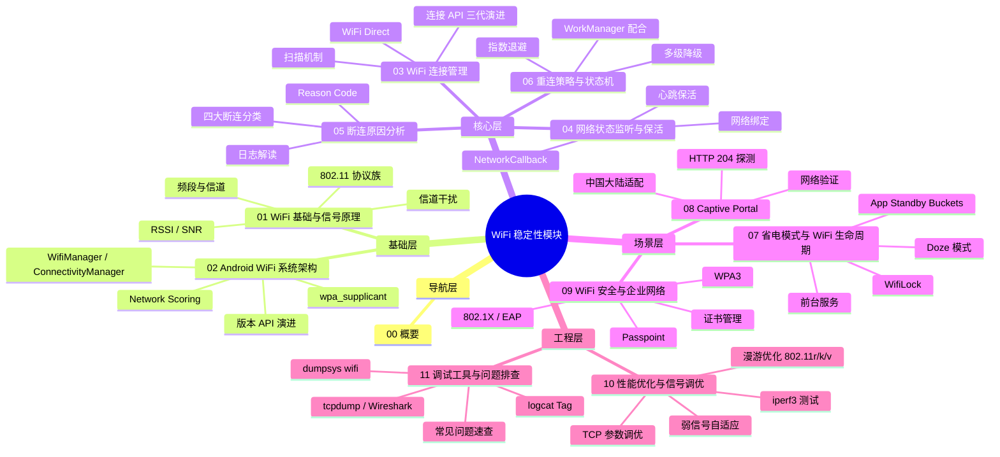
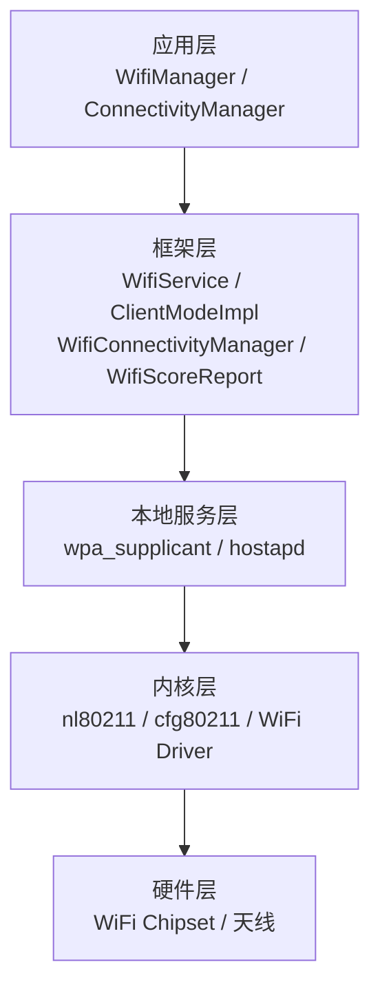
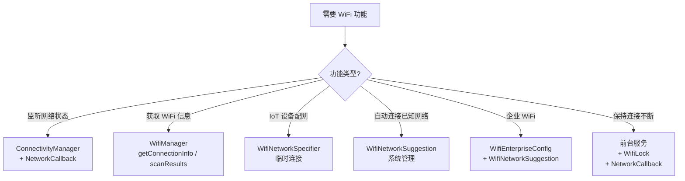
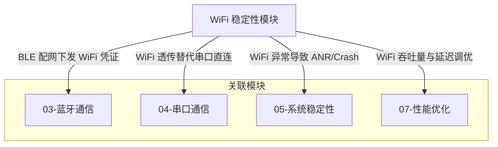

# WiFi 稳定性 - 概要

## 模块定位

WiFi 连接稳定性是 Android 设备网络体验的核心，在 IoT 网关、智能终端、车载系统、工业平板、POS 设备等场景中，WiFi 承担着主要的数据传输职责。WiFi 断连、弱信号、省电机制干扰、Captive Portal 等问题是影响用户体验和业务可靠性的首要因素。

本模块覆盖以下核心领域：

| 领域 | 说明 | 对应文件 |
|------|------|----------|
| WiFi 基础与信号原理 | 802.11 协议族、频段与信道、信号传播与衰减 | `01-WiFi基础与信号原理` |
| Android WiFi 系统架构 | WifiManager/ConnectivityManager 分层架构、版本演进 | `02-Android WiFi系统架构` |
| WiFi 连接管理 | 扫描、连接 API 三代演进、WiFi Direct | `03-WiFi连接管理` |
| 网络状态监听与连接保活 | NetworkCallback、心跳保活、网络绑定 | `04-网络状态监听与连接保活` |
| 断连原因分析与日志解读 | 断连分类、Reason Code、dumpsys 解读 | `05-断连原因分析与日志解读` |
| 重连策略与状态机 | 指数退避、状态机、多级降级 | `06-重连策略与状态机` |
| 省电模式与 WiFi 生命周期 | Doze、Standby Buckets、WifiLock、前台服务 | `07-省电模式与WiFi生命周期` |
| Captive Portal 与网络验证 | Portal 检测、中国大陆适配、网络可用性判断 | `08-Captive Portal与网络验证` |
| WiFi 安全与企业网络 | WPA2/WPA3、EAP 认证、证书管理 | `09-WiFi安全与企业网络` |
| 性能优化与信号调优 | RSSI 监控、漫游优化、TCP 调优、iperf3 测试 | `10-性能优化与信号调优` |
| 调试工具与问题排查 | dumpsys、logcat、抓包、常见问题速查 | `11-调试工具与问题排查` |

## 知识全景图

## 核心原理

### WiFi 协议栈概览

WiFi 通信基于 IEEE 802.11 标准族，经历了从 802.11b（1999）到 802.11be/WiFi 7（2024）的多代演进。核心关注指标包括：

| 指标 | 含义 | 对稳定性的影响 |
|------|------|--------------|
| RSSI | 接收信号强度（dBm） | < -75dBm 时丢包率显著增加 |
| SNR | 信噪比（dB） | < 15dB 时连接不稳定 |
| LinkSpeed | 链路协商速率（Mbps） | 持续降低说明信号恶化 |
| Frequency | 工作频率（MHz） | 2.4GHz 干扰多，5GHz 覆盖小 |
| Channel Width | 信道带宽 | 越宽吞吐越高但稳定性越低 |

### Android WiFi 分层架构

## Android WiFi 开发的特殊性

| 挑战 | 说明 |
|------|------|
| **版本碎片化** | Android 10 WiFi API 断崖式变化（WifiConfiguration 废弃），每个大版本都有权限和行为变更 |
| **省电机制干扰** | Doze 模式、App Standby Buckets 会主动断开 WiFi 或限制网络访问 |
| **Captive Portal 问题** | 中国大陆默认验证服务器不可达，导致"已连接无互联网"误判 |
| **OEM 差异** | 各厂商定制 ROM 的 WiFi 行为差异大，部分 API 行为不一致 |
| **权限演进** | Android 6 到 13 WiFi 扫描权限从 Location 到 NEARBY_WIFI_DEVICES 多次变更 |
| **网络评分切换** | 系统评分机制可能在 WiFi 信号弱时自动切换到蜂窝，导致流量意外消耗 |

## 发展趋势

1. **WiFi 6E / WiFi 7 普及**：6GHz 频段扩展，320MHz 信道带宽，4096-QAM，MLO（Multi-Link Operation）
2. **Passpoint / Hotspot 2.0**：自动安全连接公共 WiFi，运营商 WiFi Offload
3. **WiFi Aware（NAN）**：无需 AP 的邻近感知通信，适合 IoT 场景
4. **Matter 协议**：统一智能家居标准，WiFi + Thread 双协议支持
5. **WPA3 全面推进**：SAE 替代 PSK，前向保密成为标配
6. **Android 模块化更新**：WiFi 模块通过 Project Mainline 独立于 OTA 更新

## 主流工具与库对比

| 工具/库 | 用途 | 适用场景 |
|--------|------|---------|
| `ConnectivityManager` + `NetworkCallback` | 网络状态监听（官方推荐） | 所有 WiFi 应用 |
| `WifiManager` | WiFi 专属操作（扫描、信号） | 需要 WiFi 详细信息时 |
| `WifiNetworkSpecifier` | 临时连接（IoT 配网） | 设备配网、临时通信 |
| `WifiNetworkSuggestion` | 自动连接建议 | 持久化连接场景 |
| `iperf3` | 吞吐量测试 | 性能基准和问题排查 |
| `tcpdump` / `Wireshark` | 网络抓包分析 | 协议级问题排查 |
| `dumpsys wifi` | 系统 WiFi 状态诊断 | 全面诊断工具 |

### 选型建议

## 模块间关系

## 推荐阅读路径

### 新人入门路径

适合刚接触 Android WiFi 开发的开发者，按顺序阅读：

1. **概要**（本文） — 建立全局认知
2. **WiFi 基础与信号原理** — 理解 802.11、频段、RSSI
3. **Android WiFi 系统架构** — 理解分层架构与 API 演进
4. **WiFi 连接管理** — 掌握扫描与三代连接 API
5. **网络状态监听与连接保活** — 掌握 NetworkCallback
6. **调试工具与问题排查** — 掌握 dumpsys 和 logcat 分析

### 按需深入路径

已有基础的开发者，根据当前任务选择对应文件：

| 你的任务 | 推荐阅读 |
|----------|----------|
| 需要监听 WiFi 连接变化 | `04-网络状态监听与连接保活` |
| WiFi 频繁断连需要排查 | `05-断连原因分析与日志解读` |
| 需要实现自动重连机制 | `06-重连策略与状态机` |
| 灭屏后 WiFi 会断开 | `07-省电模式与WiFi生命周期` |
| 连上 WiFi 但显示无互联网 | `08-Captive Portal与网络验证` |
| 需要连接企业 WiFi（802.1X） | `09-WiFi安全与企业网络` |
| WiFi 速度慢需要优化 | `10-性能优化与信号调优` |
| WiFi 出 Bug 需要排查工具 | `11-调试工具与问题排查` |
| 需要做 IoT 设备 WiFi 配网 | `03-WiFi连接管理`（WifiNetworkSpecifier） |

## 踩坑记录

> 此区域供团队成员补充项目中遇到的真实案例。

| 日期 | 记录人 | 问题描述 | 解决方案 |
|------|--------|----------|----------|
| | | | |

## 参考资料

- [Android WiFi Overview - AOSP](https://source.android.com/docs/core/connect/wifi-overview)
- [Android Connectivity - Developers](https://developer.android.com/develop/connectivity)
- [WiFi Alliance](https://www.wi-fi.org/)
- [IEEE 802.11 Standards](https://standards.ieee.org/ieee/802.11/7028/)
- [wpa_supplicant Documentation](https://w1.fi/wpa_supplicant/)
