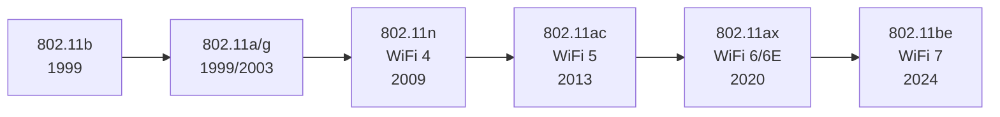
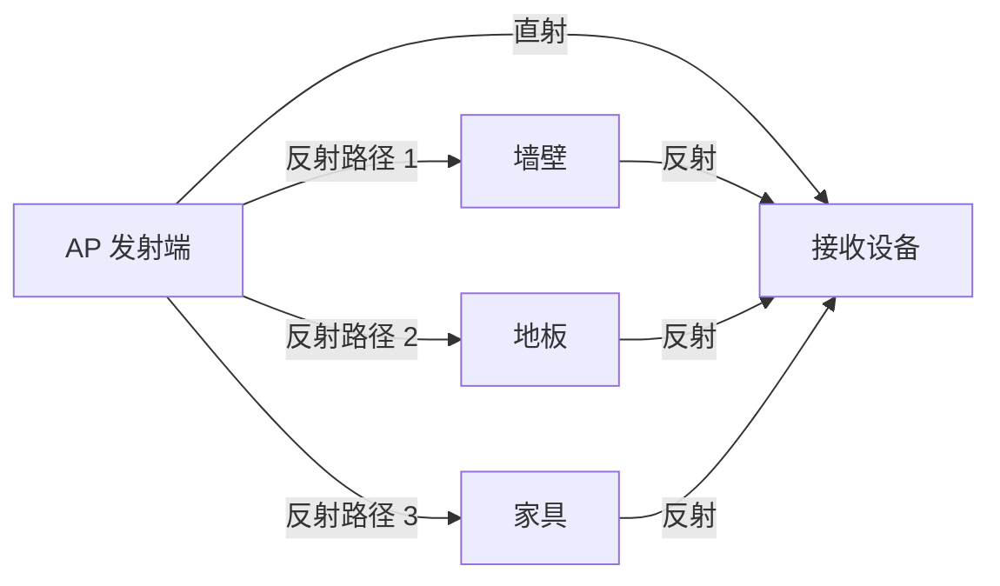
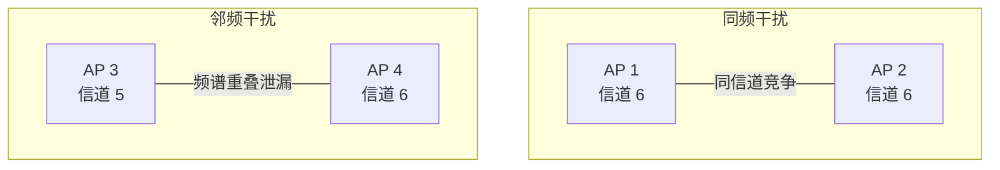

# WiFi 基础与信号原理

## 802.11 协议族速览

WiFi 基于 IEEE 802.11 标准族，自 1997 年首个版本发布以来经历了多代演进。WiFi Alliance 从 802.11ax 开始引入了"WiFi + 数字"的简化命名方式。

### 协议版本与命名对照



### 关键参数对比

| 协议 | 商用名称 | 频段 | 最大信道带宽 | 理论最大速率 | 调制方式 | 典型场景 |
|------|----------|------|-------------|-------------|---------|---------|
| 802.11b | — | 2.4GHz | 22MHz | 11 Mbps | DSSS/CCK | 已淘汰 |
| 802.11a | — | 5GHz | 20MHz | 54 Mbps | OFDM | 已淘汰 |
| 802.11g | — | 2.4GHz | 20MHz | 54 Mbps | OFDM | 已淘汰 |
| 802.11n | WiFi 4 | 2.4/5GHz | 40MHz | 600 Mbps | OFDM + MIMO | 旧设备兼容 |
| 802.11ac | WiFi 5 | 5GHz | 160MHz | 6.93 Gbps | OFDM + MU-MIMO | 目前主流 |
| 802.11ax | WiFi 6 | 2.4/5GHz | 160MHz | 9.6 Gbps | OFDMA + MU-MIMO | 高密度环境 |
| 802.11ax | WiFi 6E | 2.4/5/6GHz | 160MHz | 9.6 Gbps | OFDMA + MU-MIMO | 6GHz 扩展 |
| 802.11be | WiFi 7 | 2.4/5/6GHz | 320MHz | 46 Gbps | OFDMA + 4096-QAM | 超高带宽 |

> **Android 开发者关注点**：大部分 Android 设备支持 WiFi 5 或 WiFi 6，API 中通过 `ScanResult.capabilities` 和 `WifiInfo.getLinkSpeed()` 可获取当前连接的协议信息。Android 12+ 新增 `getWifiStandard()` 直接返回 WiFi 标准版本。

## 频段与信道

### 2.4GHz 频段特性

2.4GHz 频段（2.400 ~ 2.4835 GHz）共划分 14 个信道（中国可用 1-13），每个信道带宽 22MHz：

```
信道:  1    2    3    4    5    6    7    8    9   10   11   12   13
频率: 2412 2417 2422 2427 2432 2437 2442 2447 2452 2457 2462 2467 2472 (MHz)
      |<-----22MHz----->|
```

由于相邻信道频率间隔仅 5MHz 而信道带宽为 22MHz，**只有信道 1、6、11 互不重叠**，这是 2.4GHz 部署的基本原则。

| 特性 | 说明 |
|------|------|
| 可用信道 | 1-13（中国），1-11（美国） |
| 不重叠信道 | 1、6、11 |
| 穿墙能力 | 较强（波长 ~12.5cm） |
| 干扰情况 | 严重（微波炉、蓝牙、Zigbee 共用） |
| 支持带宽 | 20MHz / 40MHz（WiFi 4+） |

### 5GHz 频段特性

5GHz 频段范围更大（5.150 ~ 5.825 GHz），信道更多，分为多个子频段：

| 子频段 | 信道范围 | 频率范围 | 特殊要求 |
|--------|---------|---------|---------|
| UNII-1 | 36, 40, 44, 48 | 5.150-5.250 GHz | 室内使用 |
| UNII-2 | 52, 56, 60, 64 | 5.250-5.350 GHz | DFS（动态频率选择） |
| UNII-2 Extended | 100-144 | 5.470-5.725 GHz | DFS + TPC |
| UNII-3 | 149, 153, 157, 161, 165 | 5.725-5.825 GHz | 室内外均可 |

> **DFS 信道注意事项**：DFS（Dynamic Frequency Selection）信道需要雷达检测，当检测到雷达信号时 AP 必须在 10 秒内切换信道。这可能导致突然断连，在稳定性敏感场景下建议避开 DFS 信道（52-64, 100-144）。

5GHz 支持的信道带宽：

| 带宽 | 可用信道组合数 | 适用场景 |
|------|--------------|---------|
| 20MHz | 最多 25 个 | 高密度、最大兼容 |
| 40MHz | 最多 12 个 | 平衡选择 |
| 80MHz | 最多 6 个 | 高吞吐量 |
| 160MHz | 最多 2-3 个 | 极高吞吐量（WiFi 5+） |

### 6GHz 频段特性（WiFi 6E / WiFi 7）

6GHz 频段（5.925 ~ 7.125 GHz）是 WiFi 6E 引入的全新频段：

- 可用带宽 1200MHz，远超 2.4GHz（83.5MHz）和 5GHz（~500MHz）
- 支持 59 个 20MHz 信道、29 个 40MHz、14 个 80MHz、7 个 160MHz 信道
- **无 DFS 要求**，信道更干净
- 穿墙能力最弱，适合近距离高密度场景

> **Android 支持情况**：Android 12 开始支持 WiFi 6E（6GHz 频段），通过 `WifiManager.is6GHzBandSupported()` 检测设备是否支持。

## 信号传播与衰减

### 自由空间路径损耗

无线信号在自由空间中传播时，功率随距离增加而衰减。自由空间路径损耗（FSPL）公式：

```
FSPL(dB) = 20·log₁₀(d) + 20·log₁₀(f) - 27.55

其中：d = 距离（米），f = 频率（MHz）
```

不同频段在相同距离下的损耗差异：

| 距离 | 2.4GHz 损耗 | 5GHz 损耗 | 6GHz 损耗 |
|------|-----------|----------|----------|
| 1m | 40.0 dB | 46.4 dB | 48.0 dB |
| 5m | 54.0 dB | 60.4 dB | 62.0 dB |
| 10m | 60.0 dB | 66.4 dB | 68.0 dB |
| 20m | 66.0 dB | 72.4 dB | 74.0 dB |

> **实际意义**：5GHz 信号在相同距离下比 2.4GHz 多衰减约 6dB（功率降为 1/4）。这就是 5GHz 覆盖范围更小的根本原因。

### 多径效应与多径衰落

信号在室内传播时会被墙壁、家具、人体等反射、折射和散射，到达接收端的信号是多条路径信号的叠加：



多径效应的后果：
- **建设性叠加**：多条信号同相位到达，信号增强
- **破坏性叠加**：多条信号反相位到达，信号严重衰减（深度衰落）
- **时间扩展**：不同路径信号到达时间不同，导致符号间干扰（ISI）

> **实践影响**：移动设备位置变化几厘米就可能导致 RSSI 波动 10-20dB，这是 WiFi 信号不稳定的根本物理原因之一。MIMO（多天线）技术利用多径效应提升性能。

### 穿墙衰减参考

不同建筑材料对 WiFi 信号的衰减程度：

| 障碍物类型 | 2.4GHz 衰减 | 5GHz 衰减 | 说明 |
|-----------|-----------|----------|------|
| 木门 / 石膏板 | 3-4 dB | 4-5 dB | 影响较小 |
| 玻璃窗（普通） | 2-3 dB | 3-4 dB | 影响较小 |
| 玻璃窗（Low-E 节能） | 8-12 dB | 10-15 dB | 金属镀层反射信号 |
| 砖墙（单层） | 6-8 dB | 10-12 dB | 常见室内隔墙 |
| 混凝土墙 | 10-15 dB | 15-25 dB | 影响很大 |
| 钢筋混凝土 | 15-25 dB | 25-35 dB | 几乎不可穿透 |
| 电梯井 / 金属壁 | 25-40 dB | 30-50 dB | 基本完全屏蔽 |

> **经验法则**：每穿过一堵混凝土墙，信号大约衰减 10-15dB。穿过两堵混凝土墙后，5GHz 信号通常已经不可用。

## RSSI / SNR / Noise Floor

### RSSI 的含义与典型阈值

RSSI（Received Signal Strength Indicator）是接收信号强度的度量，单位为 dBm（分贝毫瓦）。值越接近 0 信号越强。

| RSSI 范围 | 信号质量 | 实际体验 | Android 信号格 |
|-----------|---------|---------|---------------|
| -30 ~ -50 dBm | 优秀 | 所有应用流畅，高速传输无问题 | 4 格 |
| -50 ~ -60 dBm | 良好 | 视频通话、高清流媒体正常 | 3-4 格 |
| -60 ~ -70 dBm | 一般 | 网页浏览正常，视频偶有卡顿 | 2-3 格 |
| -70 ~ -80 dBm | 较差 | 网页加载慢，视频不稳定，丢包增加 | 1-2 格 |
| -80 ~ -90 dBm | 极差 | 频繁断连，基本不可用 | 0-1 格 |
| < -90 dBm | 不可用 | 无法维持连接 | 0 格 |

> **Android 信号等级**：`WifiManager.calculateSignalLevel(rssi, numLevels)` 将 RSSI 映射到 0 ~ numLevels-1 的等级。Android 内部默认使用 `WifiManager.RSSI_LEVELS = 5`（0-4 格）。

### SNR（信噪比）的意义

SNR（Signal-to-Noise Ratio）= 信号功率 - 噪声功率（单位 dB），反映信号质量比单独看 RSSI 更准确：

```
SNR = RSSI - Noise Floor

例：RSSI = -65 dBm, Noise Floor = -95 dBm → SNR = 30 dB
```

| SNR | 质量评估 | 支持的最大调制 |
|-----|---------|-------------|
| > 40 dB | 优秀 | 256-QAM / 1024-QAM |
| 25-40 dB | 良好 | 64-QAM / 256-QAM |
| 15-25 dB | 一般 | 16-QAM / 64-QAM |
| 10-15 dB | 较差 | QPSK |
| < 10 dB | 不可用 | BPSK 或无法解调 |

### Noise Floor（底噪）

Noise Floor 是环境中所有非信号电磁能量的总和，典型值在 -90 ~ -100 dBm。

影响底噪的因素：
- **同频设备**：同信道的其他 WiFi AP 和客户端
- **邻频泄漏**：相邻信道设备的信号泄漏
- **非 WiFi 设备**：微波炉、蓝牙、无线电话等
- **热噪声**：电子元器件本身的热噪声

> **Android 限制**：Android 标准 API 不直接提供 Noise Floor 数据。部分芯片厂商的 HAL 层可获取，但非通用方案。开发者通常只能依赖 RSSI 进行信号质量评估。

## 信道干扰与拥塞

### 同频干扰与邻频干扰



| 干扰类型 | 原因 | 影响 | 缓解方式 |
|----------|------|------|---------|
| 同频干扰 | 多个设备使用同一信道 | CSMA/CA 退避等待，吞吐量下降 | 切换到不重叠信道 |
| 邻频干扰 | 使用重叠信道（如 5 和 6） | 帧解码错误、CRC 失败、重传增多 | 仅使用 1/6/11 信道 |
| 隐藏节点 | 两设备互相不可见但同时发送 | 频繁碰撞、严重丢包 | 启用 RTS/CTS |

> **重要**：邻频干扰往往比同频干扰更具破坏性。同频干扰下设备会通过 CSMA/CA 协调避让，而邻频干扰会直接导致帧损坏。

### 非 WiFi 干扰源

2.4GHz 频段是 ISM（工业、科学和医疗）频段，众多设备共用：

| 干扰源 | 频率范围 | 干扰特征 | 影响程度 |
|--------|---------|---------|---------|
| 微波炉 | 2.45GHz 附近 | 运行时连续干扰，信道 6-11 受影响最大 | 严重 |
| 蓝牙 | 2.4-2.4835GHz | 跳频扩频，干扰分散但持续 | 中等 |
| Zigbee / Thread | 2.405-2.480GHz | 信道 15-26 与 WiFi 信道 1-11 重叠 | 中等 |
| 无绳电话（DECT） | 部分使用 2.4GHz | 持续占用信道 | 中等 |
| USB 3.0 线缆 | 2.4GHz 谐波辐射 | 靠近天线时干扰明显 | 低~中 |
| 婴儿监视器 | 2.4GHz | 持续视频传输 | 中等 |

> **5GHz 优势**：5GHz 频段的非 WiFi 干扰源极少，这是优先选择 5GHz 的重要原因之一。

## Android 开发者需要了解的射频基础

### WifiInfo 中的信号相关字段

```kotlin
val wifiManager = context.getSystemService(Context.WIFI_SERVICE) as WifiManager
val wifiInfo: WifiInfo = wifiManager.connectionInfo

val rssi = wifiInfo.rssi                  // RSSI (dBm)
val linkSpeed = wifiInfo.linkSpeed        // 当前链路速度 (Mbps)
val frequency = wifiInfo.frequency        // 当前频率 (MHz)
val txLinkSpeed = wifiInfo.txLinkSpeedMbps // 发送链路速度 (API 29+)
val rxLinkSpeed = wifiInfo.rxLinkSpeedMbps // 接收链路速度 (API 29+)

// WiFi 标准 (API 30+)
val wifiStandard = wifiInfo.wifiStandard  // WIFI_STANDARD_11N / 11AC / 11AX 等

// 信号等级映射
val level = WifiManager.calculateSignalLevel(rssi, 5) // 0-4 格
```

### RSSI 阈值对业务的影响

不同业务对信号质量的最低要求：

| 业务类型 | 建议最低 RSSI | 建议最低 SNR | 说明 |
|----------|-------------|-------------|------|
| 基本浏览 / IM 消息 | -75 dBm | 15 dB | 低带宽、容忍延迟 |
| 音频流媒体 | -70 dBm | 20 dB | 需要持续低带宽 |
| 标清视频 | -67 dBm | 25 dB | 需要稳定 2-5 Mbps |
| 高清视频 / 视频通话 | -65 dBm | 25 dB | 需要稳定 5-15 Mbps |
| 大文件传输 | -60 dBm | 30 dB | 需要高吞吐量 |
| 实时控制 / IoT | -70 dBm | 20 dB | 低带宽但要求低延迟 |

### 从频率判断信道和频段

```kotlin
fun getWifiBand(frequency: Int): String = when {
    frequency in 2400..2500 -> "2.4GHz"
    frequency in 4900..5900 -> "5GHz"
    frequency in 5925..7125 -> "6GHz"
    else -> "Unknown"
}

fun getChannelFromFrequency(frequency: Int): Int = when {
    frequency in 2412..2484 -> (frequency - 2412) / 5 + 1
    frequency in 5170..5825 -> (frequency - 5170) / 5 + 34
    frequency in 5955..7115 -> (frequency - 5955) / 5 + 1
    else -> -1
}
```

### ScanResult 信号信息提取

```kotlin
val wifiManager = context.getSystemService(Context.WIFI_SERVICE) as WifiManager
val scanResults: List<ScanResult> = wifiManager.scanResults

for (result in scanResults) {
    val ssid = result.SSID
    val rssi = result.level              // RSSI (dBm)
    val freq = result.frequency          // 频率 (MHz)
    val channel = getChannelFromFrequency(freq)
    val bandwidth = result.channelWidth  // CHANNEL_WIDTH_20MHZ / 40 / 80 / 160
    val capabilities = result.capabilities // 安全类型 [WPA2-PSK-CCMP] 等

    // Android 11+ 可获取 WiFi 标准
    if (Build.VERSION.SDK_INT >= Build.VERSION_CODES.R) {
        val standard = result.wifiStandard // WIFI_STANDARD_11AX 等
    }
}
```

## 踩坑记录

> 此区域供团队成员补充项目中遇到的真实案例。

| 日期 | 记录人 | 问题描述 | 解决方案 |
|------|--------|----------|----------|
| | | | |

## 参考资料

- [IEEE 802.11 - Wikipedia](https://en.wikipedia.org/wiki/IEEE_802.11)
- [WiFi Alliance - Generations of WiFi](https://www.wi-fi.org/discover-wi-fi)
- [Android WifiInfo API](https://developer.android.com/reference/android/net/wifi/WifiInfo)
- [Android ScanResult API](https://developer.android.com/reference/android/net/wifi/ScanResult)
- [Radio Propagation - ITU-R](https://www.itu.int/rec/R-REC-P.1238)
- [Android WiFi 系统架构](02-Android%20WiFi系统架构android-wifi-architecture.md) — 本模块下一篇
