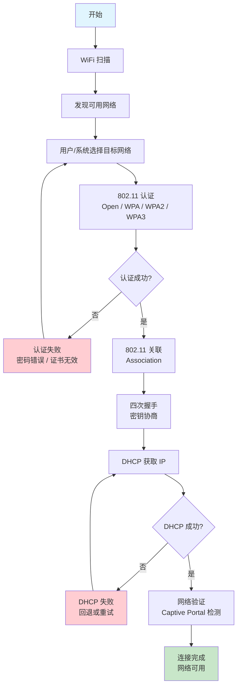
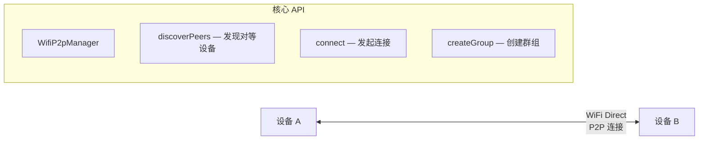

# WiFi 连接管理

## WiFi 连接完整流程

一次完整的 WiFi 连接经历以下阶段：



## WiFi 扫描机制

### 主动扫描 vs 被动扫描

| 类型 | 原理 | 特点 |
|------|------|------|
| **主动扫描** | 设备发送 Probe Request，AP 回复 Probe Response | 速度快，但更耗电 |
| **被动扫描** | 设备监听各信道的 Beacon 帧 | 省电，但发现网络较慢 |

Android 系统通常结合两种方式：前台应用触发主动扫描，后台/息屏时使用被动扫描或 PNO（Preferred Network Offload）。

### 扫描节流限制

Android 9（API 28）起对扫描频率做了严格限制：

| 场景 | 限制 |
|------|------|
| 前台应用 | 每 2 分钟最多 4 次 `startScan()` |
| 后台应用 | 每 30 分钟最多 1 次 |
| 调用超限 | `startScan()` 返回 `false`，不触发扫描 |

### 扫描代码示例

```kotlin
class WifiScanHelper(
    private val context: Context
) {
    private val wifiManager =
        context.applicationContext.getSystemService(Context.WIFI_SERVICE) as WifiManager

    // 扫描结果回调通过广播接收
    private val scanReceiver = object : BroadcastReceiver() {
        override fun onReceive(context: Context, intent: Intent) {
            val success = intent.getBooleanExtra(
                WifiManager.EXTRA_RESULTS_UPDATED, false
            )
            if (success) {
                handleScanResults()
            } else {
                // 扫描失败，仍可读取上次缓存的结果
                handleScanResults()
            }
        }
    }

    fun startScan() {
        val filter = IntentFilter(WifiManager.SCAN_RESULTS_AVAILABLE_ACTION)
        context.registerReceiver(scanReceiver, filter)

        // 注意：Android 9+ 有扫描节流限制
        val success = wifiManager.startScan()
        if (!success) {
            // 扫描被节流，使用上次缓存结果
            handleScanResults()
        }
    }

    private fun handleScanResults() {
        // 需要 ACCESS_FINE_LOCATION 权限（Android 8.1+）
        val results: List<ScanResult> = wifiManager.scanResults
        results.forEach { result ->
            Log.d("WifiScan", "SSID: ${result.SSID}, " +
                "BSSID: ${result.BSSID}, " +
                "信号强度: ${result.level} dBm, " +
                "频率: ${result.frequency} MHz, " +
                "加密方式: ${result.capabilities}")
        }
    }

    fun cleanup() {
        context.unregisterReceiver(scanReceiver)
    }
}
```

> **权限要求**：`ACCESS_FINE_LOCATION`（Android 8.1+）+ `ACCESS_WIFI_STATE`，Android 13+ 可用 `NEARBY_WIFI_DEVICES` 替代位置权限。

## WiFi 连接 API

### 传统方式（Android 9 及以下）

```kotlin
/**
 * 传统 WiFi 连接方式（API 28 及以下可用）
 * 注意：Android 10 开始 addNetwork() / enableNetwork() 等 API 已弃用
 */
@Suppress("DEPRECATION")
fun connectWifiLegacy(ssid: String, password: String): Boolean {
    val wifiManager = context.applicationContext
        .getSystemService(Context.WIFI_SERVICE) as WifiManager

    val config = WifiConfiguration().apply {
        SSID = "\"$ssid\""           // SSID 需要用双引号包裹
        preSharedKey = "\"$password\"" // 密码同样需要双引号
        // WPA/WPA2
        allowedKeyManagement.set(WifiConfiguration.KeyMgmt.WPA_PSK)
    }

    val networkId = wifiManager.addNetwork(config)
    if (networkId == -1) return false

    // 断开当前网络并连接新网络
    wifiManager.disconnect()
    val success = wifiManager.enableNetwork(networkId, true)
    wifiManager.reconnect()
    return success
}
```

### Android 10+：WifiNetworkSpecifier（临时连接）

适用于 IoT 设备配网等场景，系统会弹出网络选择面板，用户确认后连接。连接为临时性质，不会被系统保存。

```kotlin
/**
 * 使用 WifiNetworkSpecifier 连接指定 WiFi
 * 适用场景：IoT 设备配网、临时连接特定 AP
 * 特点：需要用户在系统面板中确认，连接不持久
 */
@RequiresApi(Build.VERSION_CODES.Q)
fun connectWithSpecifier(ssid: String, password: String) {
    val specifier = WifiNetworkSpecifier.Builder()
        .setSsid(ssid)
        .setWpa2Passphrase(password)
        // 也可用 setBssidPattern() 匹配特定 AP
        .build()

    val request = NetworkRequest.Builder()
        .addTransportType(NetworkCapabilities.TRANSPORT_WIFI)
        .setNetworkSpecifier(specifier)
        .build()

    val connectivityManager = context.getSystemService(Context.CONNECTIVITY_SERVICE)
        as ConnectivityManager

    connectivityManager.requestNetwork(request, object : ConnectivityManager.NetworkCallback() {
        override fun onAvailable(network: Network) {
            // 连接成功，绑定进程网络确保流量走此网络
            connectivityManager.bindProcessToNetwork(network)
            Log.d("WifiConnect", "已连接到 $ssid")
        }

        override fun onUnavailable() {
            // 用户拒绝或连接失败
            Log.w("WifiConnect", "连接 $ssid 失败或用户取消")
        }
    })
}
```

### Android 10+：WifiNetworkSuggestion（建议连接）

向系统建议自动连接的网络列表，系统决定何时连接。首次使用需要用户授权通知权限。

```kotlin
/**
 * 使用 WifiNetworkSuggestion 向系统建议连接网络
 * 适用场景：希望设备在发现指定网络时自动连接
 * 特点：系统决定连接时机，用户首次需授权
 */
@RequiresApi(Build.VERSION_CODES.Q)
fun suggestNetwork(ssid: String, password: String) {
    val suggestion = WifiNetworkSuggestion.Builder()
        .setSsid(ssid)
        .setWpa2Passphrase(password)
        .setIsAppInteractionRequired(true) // 连接时通知应用
        .build()

    val wifiManager = context.applicationContext
        .getSystemService(Context.WIFI_SERVICE) as WifiManager

    val status = wifiManager.addNetworkSuggestions(listOf(suggestion))
    when (status) {
        WifiManager.STATUS_NETWORK_SUGGESTIONS_SUCCESS ->
            Log.d("WifiSuggest", "网络建议添加成功")
        WifiManager.STATUS_NETWORK_SUGGESTIONS_ERROR_APP_DISALLOWED ->
            Log.e("WifiSuggest", "应用被用户禁止添加网络建议")
        else ->
            Log.e("WifiSuggest", "添加网络建议失败，状态码: $status")
    }
}
```

### 三种连接方式对比

| 维度 | WifiConfiguration (旧) | WifiNetworkSpecifier | WifiNetworkSuggestion |
|------|------------------------|---------------------|----------------------|
| 最低版本 | API 1（API 29 弃用） | API 29 | API 29 |
| 用户交互 | 无（静默连接） | 弹出系统面板确认 | 首次需通知授权 |
| 连接持久性 | 保存到系统 | 临时，应用退出即断 | 系统自动管理 |
| 适用场景 | 旧设备兼容 | IoT 配网、临时连接 | 建议系统自动连接 |

## NetworkCallback 网络状态监听

### 注册与注销最佳实践

```kotlin
class WifiMonitor(private val context: Context) {
    private val connectivityManager =
        context.getSystemService(Context.CONNECTIVITY_SERVICE) as ConnectivityManager

    // 构建仅关注 WiFi 的网络请求
    private val wifiRequest = NetworkRequest.Builder()
        .addTransportType(NetworkCapabilities.TRANSPORT_WIFI)
        .build()

    private val networkCallback = object : ConnectivityManager.NetworkCallback() {
        override fun onAvailable(network: Network) {
            Log.d("WifiMonitor", "WiFi 网络可用")
        }

        override fun onLost(network: Network) {
            Log.w("WifiMonitor", "WiFi 网络断开")
        }

        override fun onCapabilitiesChanged(
            network: Network,
            capabilities: NetworkCapabilities
        ) {
            // 检查是否具备互联网能力（通过了 Captive Portal 验证）
            val validated = capabilities.hasCapability(
                NetworkCapabilities.NET_CAPABILITY_VALIDATED
            )
            // 获取 WiFi 信号强度（API 29+）
            val rssi = capabilities.signalStrength
            Log.d("WifiMonitor", "网络能力变化 - 已验证: $validated, RSSI: $rssi")
        }

        override fun onLinkPropertiesChanged(
            network: Network,
            linkProperties: LinkProperties
        ) {
            val dns = linkProperties.dnsServers.joinToString()
            Log.d("WifiMonitor", "链路属性变化 - DNS: $dns")
        }
    }

    fun startMonitoring() {
        connectivityManager.registerNetworkCallback(wifiRequest, networkCallback)
    }

    fun stopMonitoring() {
        connectivityManager.unregisterNetworkCallback(networkCallback)
    }
}
```

### 生命周期绑定

在 Activity/Fragment 中使用时，必须绑定生命周期避免泄漏：

```kotlin
class NetworkAwareActivity : AppCompatActivity() {
    private lateinit var wifiMonitor: WifiMonitor

    override fun onCreate(savedInstanceState: Bundle?) {
        super.onCreate(savedInstanceState)
        wifiMonitor = WifiMonitor(this)
    }

    override fun onResume() {
        super.onResume()
        // 在 onResume 注册，确保页面可见时才监听
        wifiMonitor.startMonitoring()
    }

    override fun onPause() {
        super.onPause()
        // 在 onPause 注销，避免不可见时收到无用回调
        wifiMonitor.stopMonitoring()
    }
}
```

> **提示**：如果需要在 Service 中长期监听，使用 `registerDefaultNetworkCallback()` 更为合适，它会跟踪当前默认网络（可能从 WiFi 切换到移动数据）。

## WiFi Direct（P2P）简介

WiFi Direct 允许两台设备不通过 AP 直接建立 WiFi 连接，适用于近场文件传输、屏幕投射等场景。



**关键点：**

- 使用 `WifiP2pManager` 管理 P2P 连接
- 需要 `ACCESS_FINE_LOCATION` 权限（Android 13+ 可用 `NEARBY_WIFI_DEVICES`）
- 连接建立后通过 Socket 通信
- 适合局域网内设备间数据传输，不适合替代常规 WiFi 上网

## 常见坑点

| 问题 | 原因 | 解决方案 |
|------|------|----------|
| `startScan()` 总是返回 `false` | Android 9+ 扫描节流限制 | 降低扫描频率；使用 `getScanResults()` 读取缓存结果 |
| 连接 API 无效（Android 10+） | `addNetwork()` / `enableNetwork()` 已弃用 | 迁移到 `WifiNetworkSpecifier` 或 `WifiNetworkSuggestion` |
| `NetworkCallback` 不回调 | 未正确注册或被 GC 回收 | 持有 callback 强引用；检查 `NetworkRequest` 过滤条件 |
| 获取 SSID 返回 `<unknown ssid>` | 缺少位置权限或位置服务未开启 | 申请 `ACCESS_FINE_LOCATION` + 开启设备位置服务 |
| `WifiNetworkSpecifier` 每次都弹窗 | 设计如此，不可跳过 | 若需静默连接，使用 `WifiNetworkSuggestion` |
| WiFi 连接成功但无法上网 | Captive Portal 检测未通过 | 监听 `NET_CAPABILITY_VALIDATED` 判断实际可用性 |
| `bindProcessToNetwork` 后请求失败 | 绑定的网络无 internet 能力 | 绑定前检查 `NET_CAPABILITY_INTERNET` |

## 踩坑记录

> 此区域供团队成员补充项目中遇到的真实案例。

| 日期 | 记录人 | 问题描述 | 解决方案 |
|------|--------|----------|----------|
| | | | |

## 参考资料

- [Android 官方文档 — Wi-Fi Overview](https://developer.android.com/guide/topics/connectivity/wifi)
- [Android 官方文档 — WifiNetworkSpecifier](https://developer.android.com/reference/android/net/wifi/WifiNetworkSpecifier)
- [Android 官方文档 — WifiNetworkSuggestion](https://developer.android.com/reference/android/net/wifi/WifiNetworkSuggestion)
- [Android 官方文档 — NetworkCallback](https://developer.android.com/reference/android/net/ConnectivityManager.NetworkCallback)
- [Android 官方文档 — WiFi Direct](https://developer.android.com/guide/topics/connectivity/wifip2p)
- [Android 10 行为变更 — WiFi 限制](https://developer.android.com/about/versions/10/privacy/changes#wifi-restrictions)
