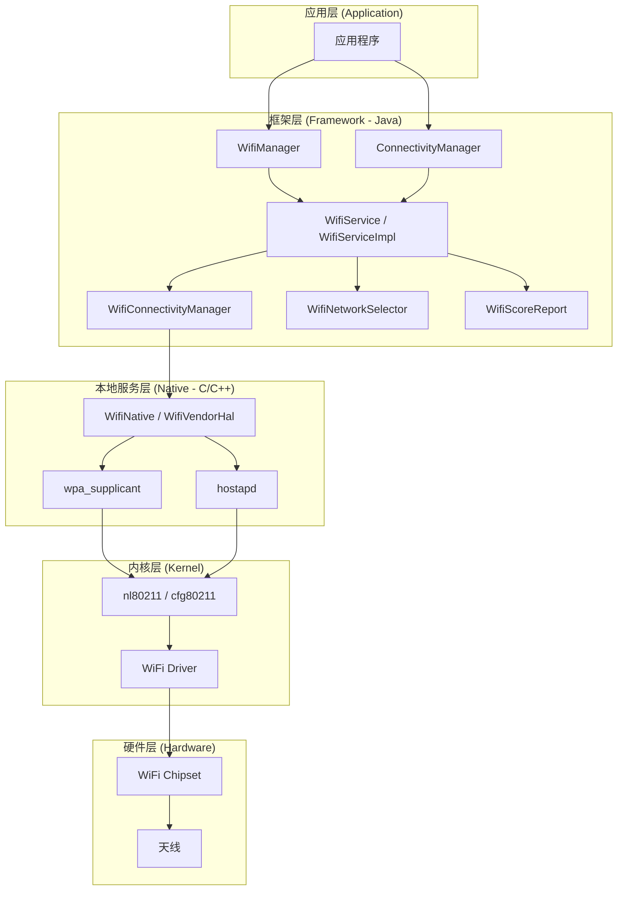
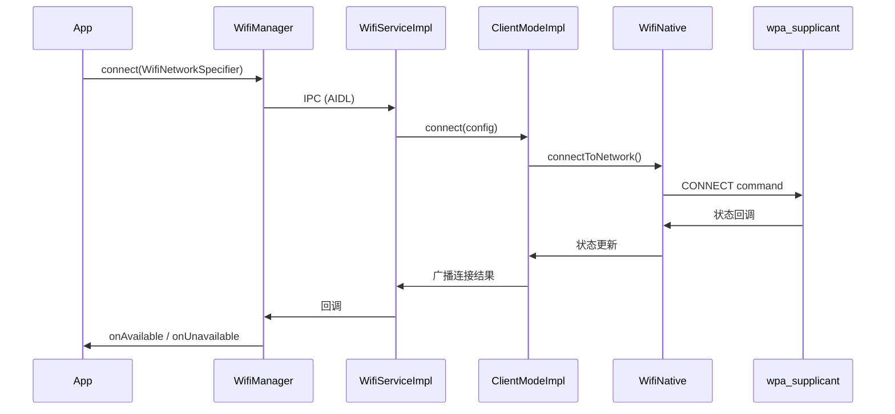
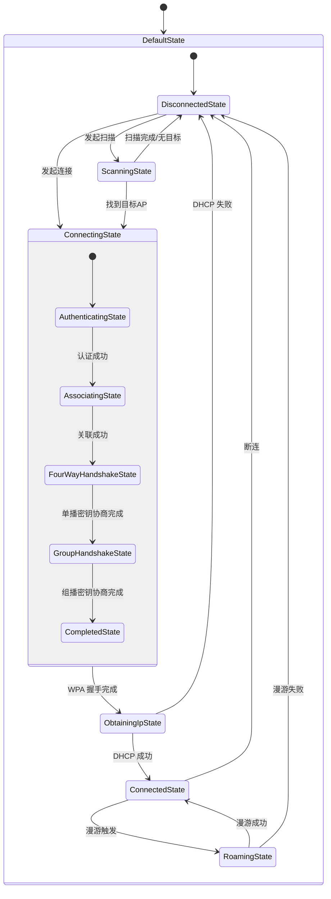
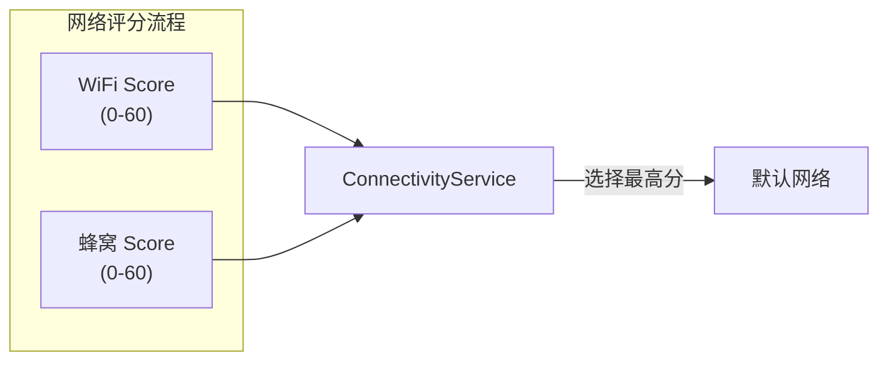

# Android WiFi 系统架构

## 完整架构分层

Android WiFi 子系统从上到下分为五层，每层职责明确：



### 应用层（Application）

应用通过两个核心 Manager 与 WiFi 子系统交互：

| API 入口 | 用途 | 典型场景 |
|----------|------|---------|
| `WifiManager` | WiFi 专属操作：扫描、连接、获取 WifiInfo | 获取 SSID、RSSI、连接指定网络 |
| `ConnectivityManager` | 通用网络管理：监听网络变化、网络绑定 | 监听连接/断开、判断网络可用性 |

### 框架层（Framework）

框架层是 WiFi 子系统的核心，运行在 `system_server` 进程中：

| 组件 | 职责 |
|------|------|
| `WifiServiceImpl` | WiFi 服务的核心实现，处理来自 WifiManager 的所有请求 |
| `ClientModeImpl` | WiFi 客户端模式的状态机实现（替代旧的 WifiStateMachine） |
| `WifiConnectivityManager` | 管理自动扫描和连接决策 |
| `WifiNetworkSelector` | 网络评分和选择算法，决定连接哪个 AP |
| `WifiScoreReport` | 实时评估当前连接质量，提供给 ConnectivityService 做网络切换决策 |
| `WifiNetworkFactory` | 处理来自应用的 NetworkRequest（WifiNetworkSpecifier） |
| `WifiNetworkSuggestionsManager` | 管理应用提交的网络建议（WifiNetworkSuggestion） |

#### WifiManager

`WifiManager` 是应用与 WiFi 交互的主要入口：

```kotlin
val wifiManager = context.getSystemService(Context.WIFI_SERVICE) as WifiManager

// 获取连接信息
val wifiInfo = wifiManager.connectionInfo
val ssid = wifiInfo.ssid         // "\"MyNetwork\""
val rssi = wifiInfo.rssi         // -55
val bssid = wifiInfo.bssid       // "aa:bb:cc:dd:ee:ff"

// 获取扫描结果
val scanResults = wifiManager.scanResults

// 获取已保存网络 (Android 10+ 受限)
val configuredNetworks = wifiManager.configuredNetworks  // 仅系统应用可用

// WiFi 状态
val isEnabled = wifiManager.isWifiEnabled
val wifiState = wifiManager.wifiState  // WIFI_STATE_ENABLED 等
```

#### ConnectivityManager

`ConnectivityManager` 管理所有网络类型，对 WiFi 开发同样重要：

```kotlin
val connectivityManager = context.getSystemService(Context.CONNECTIVITY_SERVICE)
    as ConnectivityManager

// 注册网络回调（推荐方式）
val networkCallback = object : ConnectivityManager.NetworkCallback() {
    override fun onAvailable(network: Network) { /* WiFi 已连接 */ }
    override fun onLost(network: Network) { /* WiFi 已断开 */ }
    override fun onCapabilitiesChanged(
        network: Network,
        capabilities: NetworkCapabilities
    ) {
        val rssi = capabilities.signalStrength
        val validated = capabilities.hasCapability(
            NetworkCapabilities.NET_CAPABILITY_VALIDATED
        )
    }
}

val request = NetworkRequest.Builder()
    .addTransportType(NetworkCapabilities.TRANSPORT_WIFI)
    .build()

connectivityManager.registerNetworkCallback(request, networkCallback)
```

#### WifiService / WifiServiceImpl

WifiServiceImpl 是 WiFi 服务端的核心实现，运行在 system_server 中。它协调各子模块完成扫描、连接、评分等任务。

关键内部调用路径：



### 本地服务层（Native）

#### wpa_supplicant

`wpa_supplicant` 是 WiFi 客户端模式的核心守护进程，负责：

- 802.11 认证和关联
- WPA/WPA2/WPA3 密钥协商（4-Way Handshake）
- 802.1X / EAP 企业级认证
- 漫游决策
- 向上层报告连接状态变化

`wpa_supplicant` 配置文件通常位于 `/data/misc/wifi/wpa_supplicant.conf`。

#### hostapd

`hostapd` 负责 WiFi 热点（SoftAP）模式，在客户端模式下不涉及。

### 内核层（Kernel）

#### nl80211 / cfg80211

`nl80211` 是 Linux 内核与用户态 WiFi 工具之间的通信接口：

- `cfg80211`：内核态配置框架，定义 WiFi 操作的标准接口
- `nl80211`：基于 Netlink 的用户态接口，wpa_supplicant 通过它与内核通信
- 替代了旧的 `wext`（Wireless Extensions）接口

#### WiFi 驱动

WiFi 芯片驱动负责与硬件直接交互，常见芯片厂商：

| 芯片厂商 | 常见型号 | 典型设备 |
|----------|---------|---------|
| Qualcomm (QCA) | WCN3990, WCN6855, FastConnect 6900 | 高通平台手机、平板 |
| MediaTek | MT7921, MT7922 | 联发科平台设备 |
| Broadcom | BCM4389, BCM4398 | 部分三星、Google 设备 |
| Intel | AX200, AX210, BE200 | x86 平板、Chromebook |

## WifiStateMachine / ClientModeImpl 状态迁移

从 Android 10 开始，`WifiStateMachine` 被重构为 `ClientModeImpl`，但核心状态机逻辑类似：



关键状态说明：

| 状态 | 说明 | 常见停留时间 |
|------|------|------------|
| DisconnectedState | 未连接任何 AP | — |
| ScanningState | 正在执行 WiFi 扫描 | 1-5 秒 |
| AuthenticatingState | 802.11 Open System 认证 | < 100ms |
| AssociatingState | 802.11 关联 | < 100ms |
| FourWayHandshakeState | WPA 4-Way Handshake | 100-500ms |
| ObtainingIpState | DHCP 获取 IP 地址 | 1-10 秒 |
| ConnectedState | 已连接并获取 IP | 持续 |
| RoamingState | 漫游到新 AP | 50ms-2s |

## Android 版本 WiFi API 演进

### Android 5.0 - 8.1（Lollipop ~ Oreo）

| 版本 | 关键变更 |
|------|---------|
| 5.0 (API 21) | 引入 `NetworkCallback`，推荐替代 `CONNECTIVITY_ACTION` 广播 |
| 6.0 (API 23) | WiFi 扫描需要 `ACCESS_FINE_LOCATION` 权限 + 位置服务开启 |
| 7.0 (API 24) | `CONNECTIVITY_ACTION` 广播不再发送给 manifest 注册的接收器 |
| 8.0 (API 26) | 后台扫描限制；`WifiManager.startScan()` 后台调用频率受限 |
| 8.1 (API 27) | `WifiManager.startScan()` 返回 boolean 表示是否成功 |

### Android 9（Pie）

| 变更 | 影响 |
|------|------|
| WiFi 扫描节流 | 前台 4 次/2 分钟，后台 1 次/30 分钟 |
| WiFi RTT（Round-Trip Time） | 新增室内定位 API（IEEE 802.11mc） |
| 移除 `WifiConfiguration` 部分字段 | `BSSID`、`networkId` 等受限 |

### Android 10（Q）

这是 WiFi API 变化最大的版本：

| 变更 | 影响 |
|------|------|
| `WifiNetworkSpecifier` | 新的点对点连接 API，替代 `enableNetwork()` |
| `WifiNetworkSuggestion` | 新的网络建议 API，由系统决定是否连接 |
| `WifiConfiguration` API 废弃 | 第三方应用无法直接添加/删除/修改已保存网络 |
| 随机 MAC 地址 | 默认对每个 SSID 使用随机 MAC，影响 MAC 过滤场景 |
| 后台位置权限 | 后台访问扫描结果需要 `ACCESS_BACKGROUND_LOCATION` |

> **重大影响**：Android 10 的 WiFi API 变化是断崖式的。几乎所有基于 `WifiConfiguration` + `enableNetwork()` 的连接代码都需要适配。

### Android 11（R）

| 变更 | 影响 |
|------|------|
| `WifiNetworkSuggestion` 增强 | 支持 Passpoint、可设置优先级 |
| `ScanResult.getWifiStandard()` | 可获取扫描到的 AP 支持的 WiFi 标准 |
| `NetworkCallback#onCapabilitiesChanged` 增强 | 提供更多 WiFi 相关 Capabilities |

### Android 12（S）

| 变更 | 影响 |
|------|------|
| `NEARBY_WIFI_DEVICES` 权限 | 新增权限，可替代位置权限用于 WiFi 扫描（需声明不推导位置） |
| WiFi 6E（6GHz）支持 | `WifiManager.is6GHzBandSupported()` |
| STA + AP 并发 | 支持同时作为客户端和热点 |
| WiFi Aware 增强 | 支持 Aware 上的 STA 连接 |

### Android 13（T）

| 变更 | 影响 |
|------|------|
| `NEARBY_WIFI_DEVICES` 必需 | 以 API 33 为目标的应用必须使用新权限 |
| WiFi 扫描权限简化 | 声明 `neverForLocation` 后无需位置权限 |
| 即时热点（Local-Only Hotspot）增强 | 支持自定义 SSID/密码 |

### Android 14（U）

| 变更 | 影响 |
|------|------|
| WiFi 7 (802.11be) 初步支持 | MLO（Multi-Link Operation）API |
| `WifiManager.addNetworkPrivileged()` | 特权应用网络管理增强 |
| 凭据管理 API | 统一管理 WiFi、Passpoint 凭据 |

## WifiManager vs ConnectivityManager 职责对比

| 维度 | WifiManager | ConnectivityManager |
|------|-------------|-------------------|
| 作用范围 | 仅 WiFi | 所有网络类型（WiFi、蜂窝、以太网…） |
| 获取连接信息 | `getConnectionInfo()` → WifiInfo | `getNetworkCapabilities()` → NetworkCapabilities |
| 监听连接变化 | 无推荐方式（旧广播已废弃） | `registerNetworkCallback()` ✅ |
| 扫描 | `startScan()` + `getScanResults()` | 不支持 |
| 连接网络 | 不直接支持（Android 10+ 废弃） | `requestNetwork()` + WifiNetworkSpecifier |
| 网络建议 | `addNetworkSuggestions()` | 不支持 |
| 网络绑定 | 不支持 | `bindProcessToNetwork()` |
| 推荐用法 | WiFi 专属操作（扫描、信号、热点） | **网络状态监听和管理（首选）** |

> **最佳实践**：网络状态监听统一使用 `ConnectivityManager.NetworkCallback`；仅在需要 WiFi 专属信息（SSID、RSSI、扫描结果）时使用 `WifiManager`。

## NetworkAgent 与 Network Scoring 机制

Android 系统通过评分机制决定使用哪个网络作为默认网络：



WiFi 评分的关键因素：

| 因素 | 影响 | 权重 |
|------|------|------|
| RSSI | 信号强度直接影响基础分 | 高 |
| 网络验证（Validated） | 通过验证 +10 分 | 高 |
| 网络速度 | LinkSpeed 影响吞吐评估 | 中 |
| 丢包率 | 实时检测 TCP 丢包 | 中 |
| 用户选择 | 用户手动选择的网络额外加分 | 低 |

> **关键场景**：当 WiFi 评分低于蜂窝评分时，系统会自动将默认网络切换到蜂窝数据。这是用户反馈"WiFi 明明连着但用的是流量"的根本原因。可通过 `dumpsys wifi` 查看实时评分。

## 源码关键路径索引

以 AOSP Android 14 为参考：

| 模块 | 源码路径 |
|------|---------|
| WifiManager | `frameworks/base/wifi/java/android/net/wifi/WifiManager.java` |
| WifiServiceImpl | `packages/modules/Wifi/service/java/com/android/server/wifi/WifiServiceImpl.java` |
| ClientModeImpl | `packages/modules/Wifi/service/java/com/android/server/wifi/ClientModeImpl.java` |
| WifiConnectivityManager | `packages/modules/Wifi/service/java/com/android/server/wifi/WifiConnectivityManager.java` |
| WifiNetworkSelector | `packages/modules/Wifi/service/java/com/android/server/wifi/WifiNetworkSelector.java` |
| WifiScoreReport | `packages/modules/Wifi/service/java/com/android/server/wifi/WifiScoreReport.java` |
| WifiNative | `packages/modules/Wifi/service/java/com/android/server/wifi/WifiNative.java` |
| ConnectivityService | `packages/modules/Connectivity/service/src/com/android/server/ConnectivityService.java` |
| wpa_supplicant | `external/wpa_supplicant_8/` |

> **注意**：从 Android 12 开始，WiFi 模块通过 Project Mainline 独立更新（`com.google.android.wifi` APEX 模块），源码从 `frameworks/opt/net/wifi` 迁移到 `packages/modules/Wifi`。

## 踩坑记录

> 此区域供团队成员补充项目中遇到的真实案例。

| 日期 | 记录人 | 问题描述 | 解决方案 |
|------|--------|----------|----------|
| | | | |

## 参考资料

- [Android WiFi Overview - AOSP](https://source.android.com/docs/core/connect/wifi-overview)
- [ConnectivityManager - Android Developers](https://developer.android.com/reference/android/net/ConnectivityManager)
- [WifiManager - Android Developers](https://developer.android.com/reference/android/net/wifi/WifiManager)
- [wpa_supplicant 文档](https://w1.fi/wpa_supplicant/)
- [Android Connectivity Stack - AOSP](https://source.android.com/docs/core/connect)
- [WiFi 连接管理](03-WiFi连接管理wifi-connection-management.md) — 本模块下一篇
