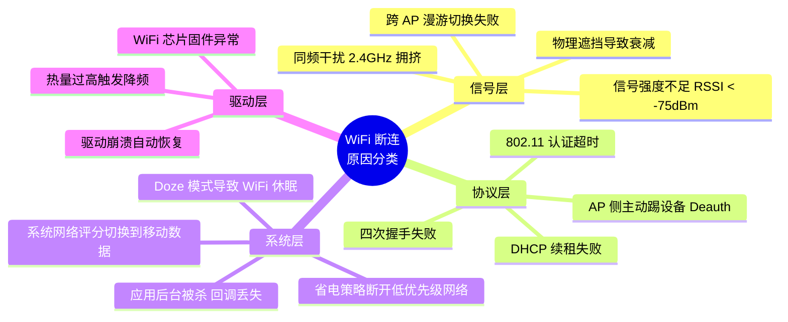
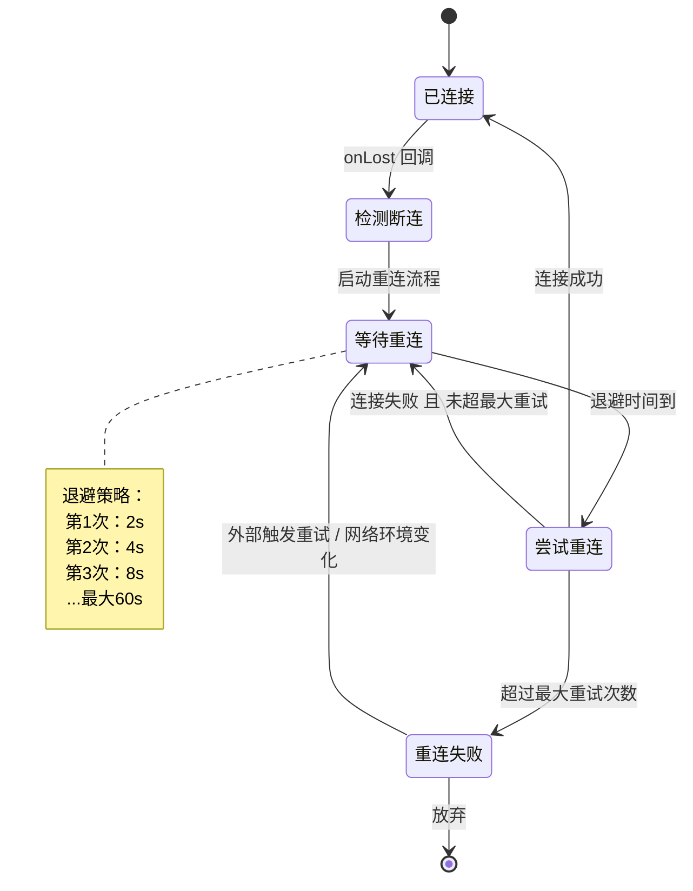
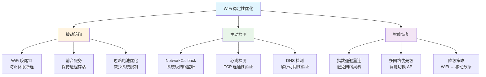

# 断连排查与重连策略

## 常见断连原因分类



### 详细说明

| 分类 | 断连原因 | 现象 | 排查方向 |
|------|---------|------|---------|
| 信号层 | 信号强度不足 | RSSI 低于 -75 dBm，频繁掉线 | 检查 `WifiInfo.getRssi()`，考虑增加 AP |
| 信号层 | 漫游切换失败 | 移动到新 AP 覆盖区时短暂断连 | 检查 802.11r/k/v 支持情况 |
| 协议层 | DHCP 续租失败 | IP 丢失，网络不可用 | 检查 `dumpsys wifi` 中 DHCP 状态 |
| 协议层 | AP 侧踢设备 | 收到 Deauthentication 帧 | 查看 AP 管理后台，确认设备数量限制 |
| 系统层 | 省电策略 | 息屏后 WiFi 断开 | 检查 Settings → WiFi → 高级 → 休眠策略 |
| 系统层 | 网络评分切换 | WiFi 弱时自动切到移动数据 | `dumpsys connectivity` 查看评分变化 |
| 驱动层 | 驱动异常 | 内核日志出现固件 crash | `dmesg` / `bugreport` 分析驱动日志 |

## WiFi 日志分析方法

### `adb shell dumpsys wifi` 解读

这是排查 WiFi 问题最重要的命令，输出包含以下关键信息：

```bash
# 完整 dump（内容很长，建议重定向到文件）
adb shell dumpsys wifi > wifi_dump.txt

# 常用过滤关键字
adb shell dumpsys wifi | grep -A 5 "mWifiInfo"     # 当前连接信息
adb shell dumpsys wifi | grep -A 10 "WifiConfigStore" # 已保存的网络配置
adb shell dumpsys wifi | grep "score"               # 网络评分
```

**关键字段解读：**

| 字段 | 含义 |
|------|------|
| `mWifiInfo` | 当前连接信息：SSID、BSSID、RSSI、LinkSpeed、IP |
| `mNetworkScore` | 当前 WiFi 网络评分（影响系统是否切换到移动数据） |
| `mLastDriverRoamAttempt` | 最近一次漫游尝试时间 |
| `mWifiState` | WiFi 当前状态（启用/禁用/连接中等） |
| `RecentScanResults` | 最近一次扫描的 AP 列表 |

### wpa_supplicant 日志分析

```bash
# 实时查看 wpa_supplicant 日志
adb logcat -s wpa_supplicant:V

# 关键日志模式：
# "CTRL-EVENT-CONNECTED"    — 连接成功
# "CTRL-EVENT-DISCONNECTED" — 断开（reason=X 指示断开原因码）
# "CTRL-EVENT-SCAN-RESULTS" — 扫描完成
# "WPA: Key negotiation"    — 四次握手过程
# "DHCP: bound"             — DHCP 获取 IP 成功
```

**常见断开原因码（reason code）：**

| 原因码 | 含义 |
|--------|------|
| 1 | 未指明原因 |
| 2 | 之前的认证不再有效 |
| 3 | 设备离开 / 已断开关联 |
| 4 | 不活跃超时 |
| 6 | 从未认证的站点收到帧 |
| 7 | 从未关联的站点收到帧 |
| 8 | 设备主动离开 BSS |
| 15 | 四次握手超时 |
| 16 | Group Key 握手超时 |

### 关键日志 Tag

```bash
# 综合监控命令
adb logcat -s WifiStateMachine:V WifiConnectivityManager:V \
    WifiNetworkSelector:V WifiScoreReport:V wpa_supplicant:V
```

| Tag | 作用 |
|-----|------|
| `WifiStateMachine` | WiFi 核心状态机，跟踪连接/断开的所有状态转换 |
| `WifiConnectivityManager` | 连接管理决策：何时扫描、何时切换网络 |
| `WifiNetworkSelector` | 网络选择算法：选择连接哪个 AP |
| `WifiScoreReport` | 网络评分报告，评分过低触发网络切换 |

## 自动重连策略设计

### 重连状态机



### 网络状态监听 + 重连触发

重连策略的核心是：监听断连事件 → 判断是否需要重连 → 按退避策略执行重连。

### 退避策略

采用**指数退避 + 抖动**避免多设备同时重连导致网络风暴：

```
delay = min(baseDelay * 2^retryCount + random(0, 1000ms), maxDelay)
```

### Kotlin 重连管理器代码框架

```kotlin
/**
 * WiFi 自动重连管理器
 *
 * 核心能力：
 * - 监听 WiFi 断连事件，自动触发重连
 * - 指数退避策略，避免频繁重连
 * - 支持多网络优先级管理
 * - 生命周期感知，避免泄漏
 */
class WifiReconnectManager(
    private val context: Context,
    private val scope: CoroutineScope
) {
    companion object {
        private const val TAG = "WifiReconnect"
        private const val BASE_DELAY_MS = 2_000L    // 基础退避时间
        private const val MAX_DELAY_MS = 60_000L     // 最大退避时间
        private const val MAX_RETRY_COUNT = 10       // 最大重试次数
    }

    private val connectivityManager =
        context.getSystemService(Context.CONNECTIVITY_SERVICE) as ConnectivityManager

    private var retryCount = 0
    private var reconnectJob: Job? = null
    private var isMonitoring = false

    // 多网络优先级列表（SSID → 优先级，数字越小优先级越高）
    private val networkPriority = mutableMapOf<String, Int>()

    // WiFi 网络请求
    private val wifiRequest = NetworkRequest.Builder()
        .addTransportType(NetworkCapabilities.TRANSPORT_WIFI)
        .build()

    private val networkCallback = object : ConnectivityManager.NetworkCallback() {
        override fun onAvailable(network: Network) {
            Log.i(TAG, "WiFi 网络恢复")
            resetRetryState()
        }

        override fun onLost(network: Network) {
            Log.w(TAG, "WiFi 网络断开，准备自动重连")
            scheduleReconnect()
        }

        override fun onCapabilitiesChanged(
            network: Network,
            capabilities: NetworkCapabilities
        ) {
            val validated = capabilities.hasCapability(
                NetworkCapabilities.NET_CAPABILITY_VALIDATED
            )
            if (!validated) {
                Log.w(TAG, "WiFi 已连接但未通过网络验证")
            }
        }
    }

    /**
     * 添加优先网络
     * @param ssid 网络名称
     * @param priority 优先级（数字越小越高）
     */
    fun addPreferredNetwork(ssid: String, priority: Int) {
        networkPriority[ssid] = priority
    }

    /** 开始监控 WiFi 状态 */
    fun startMonitoring() {
        if (isMonitoring) return
        isMonitoring = true
        connectivityManager.registerNetworkCallback(wifiRequest, networkCallback)
        Log.i(TAG, "开始监控 WiFi 状态")
    }

    /** 停止监控并取消重连 */
    fun stopMonitoring() {
        isMonitoring = false
        reconnectJob?.cancel()
        try {
            connectivityManager.unregisterNetworkCallback(networkCallback)
        } catch (e: IllegalArgumentException) {
            // callback 未注册，忽略
        }
        Log.i(TAG, "停止监控 WiFi 状态")
    }

    /** 按退避策略调度重连 */
    private fun scheduleReconnect() {
        if (retryCount >= MAX_RETRY_COUNT) {
            Log.e(TAG, "已达最大重试次数 ($MAX_RETRY_COUNT)，停止重连")
            onReconnectFailed()
            return
        }

        reconnectJob?.cancel()
        reconnectJob = scope.launch {
            val delay = calculateBackoffDelay()
            Log.d(TAG, "第 ${retryCount + 1} 次重连，等待 ${delay}ms")

            delay(delay)
            attemptReconnect()
        }
    }

    /**
     * 计算指数退避延迟（含随机抖动）
     * 公式：min(baseDelay * 2^retryCount + random(0,1000), maxDelay)
     */
    private fun calculateBackoffDelay(): Long {
        val exponentialDelay = BASE_DELAY_MS * (1L shl retryCount.coerceAtMost(20))
        val jitter = (Math.random() * 1000).toLong()
        return (exponentialDelay + jitter).coerceAtMost(MAX_DELAY_MS)
    }

    /** 执行一次重连尝试 */
    private suspend fun attemptReconnect() {
        retryCount++
        Log.d(TAG, "执行第 $retryCount 次重连尝试")

        // 获取优先级最高的可用网络
        val targetSsid = selectBestNetwork()
        if (targetSsid != null) {
            performConnect(targetSsid)
        } else {
            Log.w(TAG, "未找到可用的优先网络，等待下次扫描")
            scheduleReconnect()
        }
    }

    /**
     * 从扫描结果中选择优先级最高的已知网络
     */
    private fun selectBestNetwork(): String? {
        val wifiManager = context.applicationContext
            .getSystemService(Context.WIFI_SERVICE) as WifiManager
        val scanResults = wifiManager.scanResults

        return scanResults
            .filter { networkPriority.containsKey(it.SSID) }
            .filter { it.level > -80 } // 过滤信号过弱的 AP
            .sortedWith(compareBy<ScanResult> {
                networkPriority[it.SSID] ?: Int.MAX_VALUE
            }.thenByDescending {
                it.level // 同优先级选信号最强的
            })
            .firstOrNull()
            ?.SSID
    }

    /**
     * 执行实际的连接操作
     * 根据 Android 版本选择不同的连接 API
     */
    private fun performConnect(ssid: String) {
        Log.d(TAG, "尝试连接到: $ssid")
        // 实际连接逻辑根据 API 级别选择
        // Android 10+: WifiNetworkSuggestion
        // Android 9-: WifiConfiguration + enableNetwork
        // 具体实现参见 01-wifi-connection-management.md
    }

    private fun resetRetryState() {
        retryCount = 0
        reconnectJob?.cancel()
    }

    private fun onReconnectFailed() {
        // 通知上层处理：切换到移动数据 / 弹窗提示用户
        Log.e(TAG, "WiFi 重连失败，需要外部干预")
    }
}
```

**使用示例：**

```kotlin
class MyApplication : Application() {
    lateinit var wifiReconnectManager: WifiReconnectManager

    override fun onCreate() {
        super.onCreate()
        val scope = CoroutineScope(SupervisorJob() + Dispatchers.Main)

        wifiReconnectManager = WifiReconnectManager(this, scope).apply {
            // 按优先级注册已知网络
            addPreferredNetwork("Office-5G", priority = 1)
            addPreferredNetwork("Office-2.4G", priority = 2)
            addPreferredNetwork("Guest-WiFi", priority = 3)
            startMonitoring()
        }
    }
}
```

## WiFi 稳定性优化实践

### 保持 WiFi 唤醒锁

防止设备休眠时 WiFi 被关闭（特别是后台长连接场景）：

```kotlin
/**
 * 获取并持有 WiFi 唤醒锁
 * 注意：会增加功耗，仅在必要时使用（如后台推送、设备管理）
 */
class WifiWakeLockHelper(context: Context) {
    private val wifiManager = context.applicationContext
        .getSystemService(Context.WIFI_SERVICE) as WifiManager

    // WIFI_MODE_FULL_HIGH_PERF: 高性能模式，保持 WiFi 活跃且高吞吐
    // WIFI_MODE_FULL_LOW_LATENCY: 低延迟模式（API 29+），适合实时通信
    @Suppress("DEPRECATION")
    private val wifiLock: WifiManager.WifiLock = wifiManager.createWifiLock(
        WifiManager.WIFI_MODE_FULL_HIGH_PERF,
        "MyApp:WifiLock"
    )

    fun acquire() {
        if (!wifiLock.isHeld) {
            wifiLock.acquire()
            Log.d("WifiLock", "WiFi 唤醒锁已获取")
        }
    }

    fun release() {
        if (wifiLock.isHeld) {
            wifiLock.release()
            Log.d("WifiLock", "WiFi 唤醒锁已释放")
        }
    }
}
```

> **注意**：`WIFI_MODE_FULL_HIGH_PERF` 在 API 34 中已被标记为弃用，新项目建议评估是否使用 `WIFI_MODE_FULL_LOW_LATENCY`（API 29+）。

### 心跳检测机制

通过定期 ping 来判断网络是否真正可达：

```kotlin
/**
 * 网络心跳检测器
 * 定期检查网络连通性，弥补 NetworkCallback 无法检测"假连接"的不足
 */
class NetworkHeartbeat(
    private val scope: CoroutineScope,
    private val onNetworkUnreachable: () -> Unit
) {
    companion object {
        private const val HEARTBEAT_INTERVAL_MS = 30_000L  // 心跳间隔 30 秒
        private const val TIMEOUT_MS = 5_000               // 单次检测超时 5 秒
        private const val CONSECUTIVE_FAILURES_THRESHOLD = 3 // 连续失败 3 次判定不可达
    }

    private var heartbeatJob: Job? = null
    private var consecutiveFailures = 0

    fun start() {
        heartbeatJob?.cancel()
        heartbeatJob = scope.launch(Dispatchers.IO) {
            while (isActive) {
                val reachable = checkConnectivity()
                if (reachable) {
                    consecutiveFailures = 0
                } else {
                    consecutiveFailures++
                    Log.w("Heartbeat", "心跳检测失败，连续失败 $consecutiveFailures 次")
                    if (consecutiveFailures >= CONSECUTIVE_FAILURES_THRESHOLD) {
                        Log.e("Heartbeat", "网络不可达，触发重连")
                        withContext(Dispatchers.Main) {
                            onNetworkUnreachable()
                        }
                        consecutiveFailures = 0
                    }
                }
                delay(HEARTBEAT_INTERVAL_MS)
            }
        }
    }

    fun stop() {
        heartbeatJob?.cancel()
    }

    /**
     * 通过 TCP 连接检测网络连通性
     * 比 InetAddress.isReachable() 更可靠（后者依赖 ICMP，部分网络禁止）
     */
    private fun checkConnectivity(): Boolean {
        return try {
            java.net.Socket().use { socket ->
                socket.connect(
                    java.net.InetSocketAddress("8.8.8.8", 53),
                    TIMEOUT_MS
                )
                true
            }
        } catch (e: Exception) {
            false
        }
    }
}
```

### DNS 可达性检测

某些情况下 TCP 连通但 DNS 解析失败，需要额外检测：

```kotlin
/**
 * DNS 可达性检测
 * 检查 DNS 解析是否正常工作
 */
object DnsChecker {
    private const val TIMEOUT_MS = 3_000L

    /**
     * 检查 DNS 是否可用
     * @return true 表示 DNS 解析正常
     */
    suspend fun isDnsReachable(): Boolean = withContext(Dispatchers.IO) {
        try {
            withTimeout(TIMEOUT_MS) {
                // 尝试解析一个知名域名
                val addresses = java.net.InetAddress.getAllByName("dns.google")
                addresses.isNotEmpty()
            }
        } catch (e: Exception) {
            Log.w("DnsChecker", "DNS 解析失败: ${e.message}")
            false
        }
    }

    /**
     * 综合网络可达性检测（TCP + DNS）
     */
    suspend fun isNetworkFullyReachable(): Boolean {
        val tcpOk = withContext(Dispatchers.IO) {
            try {
                java.net.Socket().use { socket ->
                    socket.connect(
                        java.net.InetSocketAddress("8.8.8.8", 53),
                        3000
                    )
                    true
                }
            } catch (e: Exception) { false }
        }

        if (!tcpOk) return false
        return isDnsReachable()
    }
}
```

### 优化策略汇总



## 踩坑记录

> 此区域供团队成员补充项目中遇到的真实案例。

| 日期 | 记录人 | 问题描述 | 解决方案 |
|------|--------|----------|----------|
| | | | |

## 参考资料

- [Android 官方文档 — 网络连接概述](https://developer.android.com/training/basics/network-ops)
- [Android 官方文档 — 监控连接状态](https://developer.android.com/training/monitoring-device-state/connectivity-status-type)
- [Android 官方文档 — WiFi 扫描](https://developer.android.com/guide/topics/connectivity/wifi-scan)
- [IEEE 802.11 Reason Codes 参考](https://www.ieee802.org/11/)
- [wpa_supplicant 官方文档](https://w1.fi/wpa_supplicant/)
- [Android 电池优化白名单](https://developer.android.com/training/monitoring-device-state/doze-standby)
