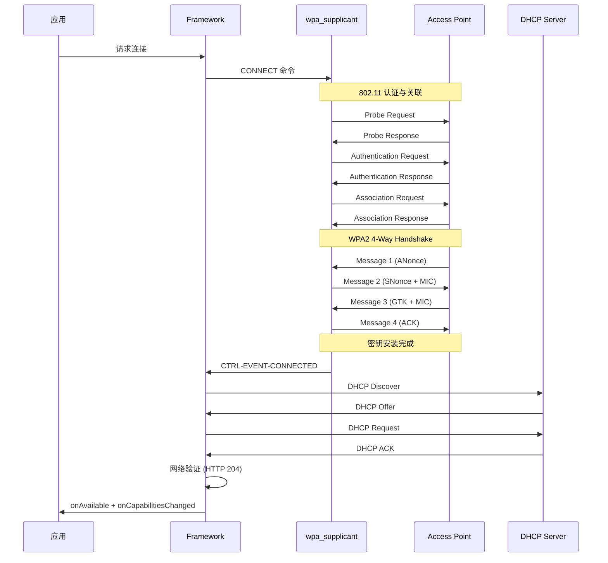
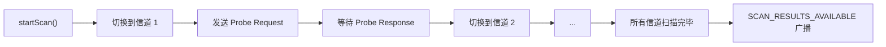
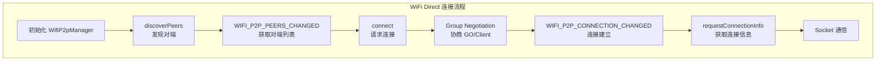

# WiFi 连接管理

## WiFi 连接完整流程

一次完整的 WiFi 连接经历以下阶段：



### Discovery 与 Authentication

802.11 认证分为两种模式：

| 模式 | 说明 | 使用场景 |
|------|------|---------|
| Open System | 无需凭证，直接通过 | WPA/WPA2/WPA3（认证在 4-Way Handshake 中完成） |
| Shared Key | 使用 WEP 密钥认证 | 已淘汰，不应使用 |

> **常见误解**：WPA2 的密码验证不在 802.11 Authentication 阶段，而是在后续的 4-Way Handshake 中。Authentication 阶段对 WPA2 来说实际是 Open System。

### Association

关联（Association）阶段客户端与 AP 协商通信参数：

- 支持的速率集（Supported Rates）
- 信道带宽（Channel Width）
- 安全类型（RSN Information Element）
- QoS 能力（WMM）

关联成功后客户端获得 Association ID（AID），成为 AP 的成员。

### 4-Way Handshake（WPA2/WPA3）

4-Way Handshake 是 WiFi 安全的核心，完成双向身份验证和密钥协商：

| 步骤 | 方向 | 内容 | 目的 |
|------|------|------|------|
| Message 1 | AP → STA | ANonce（AP 随机数） | AP 发起握手 |
| Message 2 | STA → AP | SNonce + MIC | STA 证明拥有 PSK |
| Message 3 | AP → STA | GTK + MIC | AP 确认 STA 身份，下发组密钥 |
| Message 4 | STA → AP | ACK | STA 确认收到，安装密钥 |

密钥推导过程：

```
PMK = PBKDF2(Password, SSID, 4096, 256)    // 由密码派生
PTK = PRF(PMK, ANonce, SNonce, MAC_AP, MAC_STA)  // 成对临时密钥
```

> **稳定性关注点**：4-Way Handshake 超时是常见的连接失败原因。默认超时约 2-3 秒。日志中表现为 `CTRL-EVENT-DISCONNECTED reason=15`（4-Way Handshake Timeout）。

### DHCP 地址获取

WPA 握手完成后，系统通过 DHCP 获取 IP 地址。Android 使用 `dhcpcd` 或内置 DHCP 客户端：

| 阶段 | 超时时间 | 失败处理 |
|------|---------|---------|
| DHCP Discover | 2s（首次），指数退避 | 重发最多 4 次 |
| DHCP Request | 2s | 重发最多 4 次 |
| 总超时 | ~30s | 断开连接，状态回退到 Disconnected |

> **常见问题**：DHCP 服务器过载或 IP 地址池耗尽时，会导致连接卡在"正在获取 IP 地址"然后超时断开。

### 网络验证（Captive Portal Detection）

获取 IP 后，系统发起 HTTP 请求验证网络可达性：

```
请求: http://connectivitycheck.gstatic.com/generate_204
期望: HTTP 204 No Content

实际结果判定:
- 204 → 网络可用 (VALIDATED)
- 302 → Captive Portal (需要认证)
- 超时 → 无互联网 (NOT_VALIDATED)
```

详见 [08-Captive Portal 与网络验证](08-Captive%20Portal与网络验证captive-portal-and-validation.md)。

## WiFi 扫描机制

### 主动扫描与被动扫描

| 扫描方式 | 原理 | 耗时 | 使用场景 |
|----------|------|------|---------|
| 主动扫描 | 客户端发送 Probe Request，AP 响应 Probe Response | 每信道 10-50ms | 快速发现 AP，Android 默认方式 |
| 被动扫描 | 客户端在各信道监听 AP 的 Beacon 帧 | 每信道 100ms+ | DFS 信道必须使用被动扫描 |

完整扫描流程：



### Android 9+ 扫描节流策略

为节省电量，Android 9 引入了扫描频率限制：

| 应用状态 | 扫描频率限制 | 说明 |
|----------|------------|------|
| 前台应用 | 4 次 / 2 分钟 | 超过限制返回上次缓存结果 |
| 后台应用 | 1 次 / 30 分钟 | 严格限制，建议使用系统回调替代主动扫描 |

> **注意**：`startScan()` 被节流时不会返回错误，而是返回 `false` 并使用上次缓存的 `ScanResult`。

### 扫描权限要求

| Android 版本 | 所需权限 | 额外条件 |
|-------------|---------|---------|
| 6.0-12 | `ACCESS_FINE_LOCATION` | 位置服务必须开启 |
| 12+ | `NEARBY_WIFI_DEVICES`（声明 `neverForLocation`） | 无需位置权限 |
| 12+（需位置） | `NEARBY_WIFI_DEVICES` + `ACCESS_FINE_LOCATION` | 需要 BSSID 或位置信息时 |

### 扫描实战代码

```kotlin
class WifiScanner(private val context: Context) {
    private val wifiManager = context.getSystemService(Context.WIFI_SERVICE) as WifiManager

    private val scanReceiver = object : BroadcastReceiver() {
        override fun onReceive(context: Context, intent: Intent) {
            val success = intent.getBooleanExtra(
                WifiManager.EXTRA_RESULTS_UPDATED, false
            )
            if (success) {
                handleScanResults(wifiManager.scanResults)
            } else {
                // 扫描失败，仍可使用缓存结果
                handleScanResults(wifiManager.scanResults)
            }
        }
    }

    fun startScan() {
        context.registerReceiver(
            scanReceiver,
            IntentFilter(WifiManager.SCAN_RESULTS_AVAILABLE_ACTION)
        )
        val started = wifiManager.startScan()
        if (!started) {
            // 被节流，使用缓存结果
            handleScanResults(wifiManager.scanResults)
        }
    }

    private fun handleScanResults(results: List<ScanResult>) {
        results.sortedByDescending { it.level }.forEach { result ->
            Log.d("WifiScanner",
                "SSID=${result.SSID}, BSSID=${result.BSSID}, " +
                "RSSI=${result.level}, Freq=${result.frequency}MHz, " +
                "Capabilities=${result.capabilities}"
            )
        }
    }

    fun cleanup() {
        context.unregisterReceiver(scanReceiver)
    }
}
```

## 连接 API 三代演进

### 第一代：WifiConfiguration + enableNetwork（已废弃）

Android 10 之前的标准连接方式：

```kotlin
// ⚠️ 已废弃，Android 10+ 仅系统应用可用
@Suppress("DEPRECATION")
fun connectLegacy(ssid: String, password: String) {
    val config = WifiConfiguration().apply {
        SSID = "\"$ssid\""
        preSharedKey = "\"$password\""
        allowedKeyManagement.set(WifiConfiguration.KeyMgmt.WPA_PSK)
    }

    val networkId = wifiManager.addNetwork(config)
    if (networkId != -1) {
        wifiManager.disconnect()
        wifiManager.enableNetwork(networkId, true)
        wifiManager.reconnect()
    }
}
```

### 第二代：WifiNetworkSpecifier（Android 10+）

用于点对点临时连接，不会持久化保存网络：

```kotlin
fun connectWithSpecifier(ssid: String, password: String) {
    val specifier = WifiNetworkSpecifier.Builder()
        .setSsid(ssid)
        .setWpa2Passphrase(password)
        .build()

    val request = NetworkRequest.Builder()
        .addTransportType(NetworkCapabilities.TRANSPORT_WIFI)
        .setNetworkSpecifier(specifier)
        .build()

    val connectivityManager = context.getSystemService(Context.CONNECTIVITY_SERVICE)
        as ConnectivityManager

    connectivityManager.requestNetwork(request, object : ConnectivityManager.NetworkCallback() {
        override fun onAvailable(network: Network) {
            // 连接成功，绑定进程到此网络
            connectivityManager.bindProcessToNetwork(network)
        }

        override fun onUnavailable() {
            // 连接失败或用户拒绝
        }
    })
}
```

**WifiNetworkSpecifier 特点**：
- 系统弹出确认面板，用户必须手动确认
- 连接不持久化，应用退出后断开
- 适合 IoT 设备配网等临时连接场景
- 连接期间系统默认网络不切换到该 WiFi

### 第三代：WifiNetworkSuggestion（Android 10+）

向系统建议网络，由系统决定何时连接：

```kotlin
fun suggestNetwork(ssid: String, password: String) {
    val suggestion = WifiNetworkSuggestion.Builder()
        .setSsid(ssid)
        .setWpa2Passphrase(password)
        .setIsAppInteractionRequired(true)  // 连接时通知应用
        .build()

    val status = wifiManager.addNetworkSuggestions(listOf(suggestion))
    if (status == WifiManager.STATUS_NETWORK_SUGGESTIONS_SUCCESS) {
        // 建议已提交，等待系统自动连接
    }

    // 监听建议网络的连接状态
    val intentFilter = IntentFilter(WifiManager.ACTION_WIFI_NETWORK_SUGGESTION_POST_CONNECT)
    context.registerReceiver(object : BroadcastReceiver() {
        override fun onReceive(context: Context, intent: Intent) {
            // 系统已连接到建议的网络
        }
    }, intentFilter)
}
```

**WifiNetworkSuggestion 特点**：
- 首次使用需用户批准（通知形式）
- 网络持久化保存，系统自动连接
- 应用无法控制连接时机
- 适合需要自动连接的持久化场景

### 三代 API 对比表

| 特性 | WifiConfiguration | WifiNetworkSpecifier | WifiNetworkSuggestion |
|------|-------------------|---------------------|----------------------|
| 引入版本 | API 1 | API 29 | API 29 |
| 当前状态 | **已废弃**（API 29+） | 可用 | 可用 |
| 用户交互 | 无 | 系统确认面板 | 首次通知批准 |
| 连接持久化 | 是 | 否 | 是 |
| 应用控制力 | 完全控制 | 高（但需用户确认） | 低（系统决定） |
| 适用场景 | — | IoT 配网、临时连接 | 自动连接已知网络 |
| 默认网络切换 | 是 | **否**（需 bindProcessToNetwork） | 是 |
| 多 SSID 支持 | 逐个添加 | 支持通配符匹配 | 批量建议 |

> **选型建议**：IoT 设备配网或临时连接用 `WifiNetworkSpecifier`；需要自动持久连接用 `WifiNetworkSuggestion`；系统应用/特权应用可继续使用 `WifiConfiguration` 相关 API。

## WiFi Direct / P2P

### WifiP2pManager 基础用法

WiFi Direct 允许设备之间不通过 AP 直接通信：



```kotlin
class WifiDirectManager(
    private val context: Context,
    private val channel: WifiP2pManager.Channel,
    private val manager: WifiP2pManager
) {
    fun discoverPeers() {
        manager.discoverPeers(channel, object : WifiP2pManager.ActionListener {
            override fun onSuccess() {
                // 发现已启动，等待 WIFI_P2P_PEERS_CHANGED_ACTION 广播
            }
            override fun onFailure(reason: Int) {
                // P2P_UNSUPPORTED / ERROR / BUSY
            }
        })
    }

    fun connectToPeer(device: WifiP2pDevice) {
        val config = WifiP2pConfig().apply {
            deviceAddress = device.deviceAddress
            wps.setup = WpsInfo.PBC  // Push Button Configuration
        }
        manager.connect(channel, config, object : WifiP2pManager.ActionListener {
            override fun onSuccess() { /* 连接请求已发送 */ }
            override fun onFailure(reason: Int) { /* 连接失败 */ }
        })
    }
}
```

### P2P 与基础设施模式共存

WiFi Direct 与普通 WiFi 连接可以共存（STA + P2P），但有注意事项：

| 约束 | 说明 |
|------|------|
| 信道限制 | P2P 和 STA 通常需要在同一信道或兼容信道上 |
| 功耗 | 同时维护两个连接增加功耗 |
| 部分设备不支持 | 低端设备可能不支持并发 |
| 吞吐量分摊 | 两个连接共享射频资源，总吞吐降低 |

## 已知 OEM 差异与兼容处理

| 问题 | 受影响设备 | 表现 | 兼容方案 |
|------|----------|------|---------|
| `startScan()` 返回 `false` 但无异常 | 部分三星设备 | 静默失败 | 增加重试 + 使用缓存结果 |
| `WifiNetworkSpecifier` 面板不弹出 | 部分华为/荣耀 | 用户无法确认 | 提供手动连接引导 |
| 随机 MAC 无法关闭 | Android 10+ 部分设备 | MAC 过滤白名单失效 | 使用其他识别方式（如设备名） |
| `ACTION_WIFI_NETWORK_SUGGESTION_POST_CONNECT` 不触发 | 部分小米设备 | 无法感知 Suggestion 连接 | 同时注册 NetworkCallback |
| WiFi 扫描结果延迟 | 部分低端 MTK 设备 | 扫描结果比预期慢 3-5 秒 | 增加超时等待时间 |
| `getConnectionInfo()` 返回空 SSID | Android 12+ 未授权 | `<unknown ssid>` | 确保 NEARBY_WIFI_DEVICES 权限 |

> **兼容性最佳实践**：关键功能不要依赖单一 API 路径，始终准备降级方案。使用 `NetworkCallback` 作为连接状态的权威来源，避免依赖特定广播。

## 踩坑记录

> 此区域供团队成员补充项目中遇到的真实案例。

| 日期 | 记录人 | 问题描述 | 解决方案 |
|------|--------|----------|----------|
| | | | |

## 参考资料

- [Android WiFi Connectivity - Developers](https://developer.android.com/develop/connectivity/wifi)
- [WifiNetworkSpecifier - API Reference](https://developer.android.com/reference/android/net/wifi/WifiNetworkSpecifier)
- [WifiNetworkSuggestion - API Reference](https://developer.android.com/reference/android/net/wifi/WifiNetworkSuggestion)
- [WiFi Direct - Android Developers](https://developer.android.com/develop/connectivity/wifi/wifi-direct)
- [WiFi Scanning - Android Developers](https://developer.android.com/develop/connectivity/wifi/wifi-scan)
- [网络状态监听与连接保活](04-网络状态监听与连接保活network-monitoring-and-keepalive.md) — 本模块下一篇
