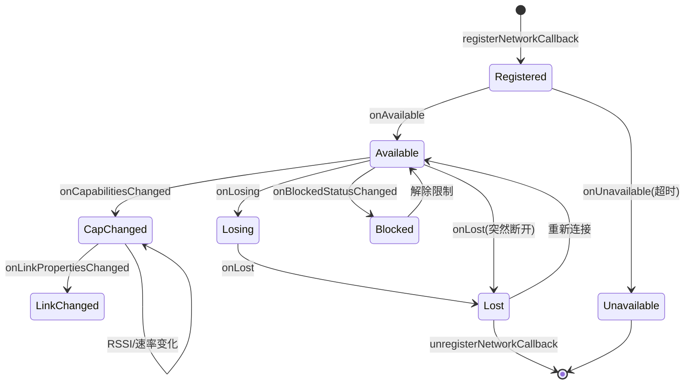

# 网络状态监听与连接保活

## ConnectivityManager.NetworkCallback 完整生命周期

`NetworkCallback` 是 Android 5.0+ 监听网络变化的标准方式，取代了旧的 `CONNECTIVITY_ACTION` 广播。



### onAvailable

网络变为可用时触发。**注意**：此时网络可能尚未通过验证（validated）。

```kotlin
override fun onAvailable(network: Network) {
    // 网络可用，但不代表可以上网
    // 应等待 onCapabilitiesChanged 中检查 NET_CAPABILITY_VALIDATED
}
```

### onCapabilitiesChanged

网络能力变化时触发，包括 RSSI 变化、验证状态变化等。这是获取网络详细信息的主要回调：

```kotlin
override fun onCapabilitiesChanged(
    network: Network,
    capabilities: NetworkCapabilities
) {
    // 是否已验证（能上网）
    val validated = capabilities.hasCapability(
        NetworkCapabilities.NET_CAPABILITY_VALIDATED
    )

    // 是否为 WiFi
    val isWifi = capabilities.hasTransport(NetworkCapabilities.TRANSPORT_WIFI)

    // 信号强度 (RSSI)
    val rssi = capabilities.signalStrength  // dBm, API 29+

    // 带宽估计
    val downBandwidth = capabilities.linkDownstreamBandwidthKbps  // Kbps
    val upBandwidth = capabilities.linkUpstreamBandwidthKbps      // Kbps

    // WiFi 详细信息 (API 31+)
    if (Build.VERSION.SDK_INT >= Build.VERSION_CODES.S) {
        val wifiInfo = capabilities.transportInfo as? WifiInfo
        wifiInfo?.let {
            val ssid = it.ssid
            val linkSpeed = it.linkSpeed
            val frequency = it.frequency
        }
    }
}
```

> **关键**：`onCapabilitiesChanged` 会在 RSSI 变化时频繁触发（约每 3-5 秒），适合实时监控信号质量。

### onLinkPropertiesChanged

网络链路属性变化时触发，包含 IP 地址、DNS、路由等信息：

```kotlin
override fun onLinkPropertiesChanged(
    network: Network,
    linkProperties: LinkProperties
) {
    val addresses = linkProperties.linkAddresses     // IP 地址列表
    val dnsServers = linkProperties.dnsServers       // DNS 服务器
    val domains = linkProperties.domains             // 搜索域
    val routes = linkProperties.routes               // 路由表
    val interfaceName = linkProperties.interfaceName // "wlan0"
}
```

### onBlockedStatusChanged

网络被后台限制（如数据省流、VPN 策略）阻止时触发：

```kotlin
override fun onBlockedStatusChanged(network: Network, blocked: Boolean) {
    if (blocked) {
        // 网络被系统策略阻止，流量无法通过
    }
}
```

### onLosing / onLost

```kotlin
override fun onLosing(network: Network, maxMsToLive: Int) {
    // 网络即将丢失，maxMsToLive 为预估剩余毫秒数
    // 可以开始准备切换到其他网络
}

override fun onLost(network: Network) {
    // 网络已断开
    // 如果有 bindProcessToNetwork，此时需要解绑或重新绑定
}
```

### onUnavailable

仅在使用 `requestNetwork()` 时触发，表示在超时时间内未找到匹配的网络：

```kotlin
override fun onUnavailable() {
    // 请求的网络不可用（超时），仅 requestNetwork 触发
}
```

## 注册方式对比

### registerDefaultNetworkCallback

监听系统默认网络的变化：

```kotlin
val callback = object : ConnectivityManager.NetworkCallback() {
    override fun onAvailable(network: Network) { /* 默认网络可用 */ }
    override fun onLost(network: Network) { /* 默认网络丢失 */ }
    override fun onCapabilitiesChanged(
        network: Network, caps: NetworkCapabilities
    ) {
        // 默认网络可能是 WiFi，也可能是蜂窝
        val isWifi = caps.hasTransport(NetworkCapabilities.TRANSPORT_WIFI)
    }
}

connectivityManager.registerDefaultNetworkCallback(callback)
```

### registerNetworkCallback + NetworkRequest

监听特定类型的网络：

```kotlin
val wifiRequest = NetworkRequest.Builder()
    .addTransportType(NetworkCapabilities.TRANSPORT_WIFI)
    .build()

connectivityManager.registerNetworkCallback(wifiRequest, callback)
```

### 两者的区别与适用场景

| 特性 | registerDefaultNetworkCallback | registerNetworkCallback |
|------|-------------------------------|------------------------|
| 监听范围 | 仅系统默认网络 | 所有匹配 NetworkRequest 的网络 |
| 网络类型 | 默认网络可能是 WiFi/蜂窝/以太网 | 可指定仅 WiFi |
| 回调频率 | 默认网络切换时触发 | 任何匹配网络变化都触发 |
| 适用场景 | 判断"当前能否上网" | 专门监控 WiFi 状态 |
| 获取多网络 | 否，仅当前默认 | 是，可同时获取多个 WiFi 网络 |

> **推荐**：需要监控"应用能否上网"用 `registerDefaultNetworkCallback`；需要专门监控 WiFi 连接状态用 `registerNetworkCallback` + WiFi 过滤。

## 网络验证与 Validated 判断

### NET_CAPABILITY_VALIDATED 的含义

`NET_CAPABILITY_VALIDATED` 表示系统已验证此网络可以访问互联网。验证通过 HTTP 204 探测完成。

### NET_CAPABILITY_INTERNET vs NET_CAPABILITY_VALIDATED

| 能力 | 含义 | 典型场景 |
|------|------|---------|
| `NET_CAPABILITY_INTERNET` | 网络声称支持互联网 | WiFi 和蜂窝网络都有此能力 |
| `NET_CAPABILITY_VALIDATED` | 系统已验证网络确实可达互联网 | 通过 HTTP 204 验证后添加 |

```kotlin
fun isNetworkTrulyUsable(capabilities: NetworkCapabilities): Boolean {
    return capabilities.hasCapability(NetworkCapabilities.NET_CAPABILITY_INTERNET)
        && capabilities.hasCapability(NetworkCapabilities.NET_CAPABILITY_VALIDATED)
}
```

### 判断"已连接但无互联网"

```kotlin
override fun onCapabilitiesChanged(
    network: Network,
    capabilities: NetworkCapabilities
) {
    val hasInternet = capabilities.hasCapability(
        NetworkCapabilities.NET_CAPABILITY_INTERNET
    )
    val isValidated = capabilities.hasCapability(
        NetworkCapabilities.NET_CAPABILITY_VALIDATED
    )

    when {
        hasInternet && isValidated -> {
            // 网络正常可用
        }
        hasInternet && !isValidated -> {
            // 已连接但无互联网（Captive Portal 或网络故障）
        }
        else -> {
            // 受限网络
        }
    }
}
```

## 网络绑定

### bindProcessToNetwork

将当前进程的所有网络流量绑定到指定网络：

```kotlin
// 将流量绑定到特定 WiFi 网络（即使不是默认网络）
connectivityManager.bindProcessToNetwork(wifiNetwork)

// 解除绑定，恢复系统默认
connectivityManager.bindProcessToNetwork(null)
```

> **使用场景**：通过 `WifiNetworkSpecifier` 连接的 WiFi 不会成为默认网络，必须使用 `bindProcessToNetwork` 将流量路由到该网络。

### requestNetwork 指定网络类型

`requestNetwork` 不仅注册回调，还告知系统"我需要此类网络"：

```kotlin
val request = NetworkRequest.Builder()
    .addTransportType(NetworkCapabilities.TRANSPORT_WIFI)
    .addCapability(NetworkCapabilities.NET_CAPABILITY_INTERNET)
    .build()

// requestNetwork 会尝试启动匹配的网络
connectivityManager.requestNetwork(request, callback)

// 使用完毕后释放
connectivityManager.unregisterNetworkCallback(callback)
```

> **区别**：`registerNetworkCallback` 只是被动监听；`requestNetwork` 会主动请求系统提供匹配的网络（可能触发 WiFi 开启或蜂窝数据启用）。

### 多网络并存时的流量路由

```kotlin
// 为单个 Socket 指定网络
val network: Network = ...
val socketFactory = network.socketFactory
val socket = socketFactory.createSocket("example.com", 80)

// 为 OkHttp 指定网络
val client = OkHttpClient.Builder()
    .socketFactory(network.socketFactory)
    .dns { hostname ->
        network.getAllByName(hostname).toList()
    }
    .build()
```

## TCP/UDP 心跳保活

### Socket KeepAlive 机制

TCP 内建的 KeepAlive 机制通过定期发送空数据包检测连接是否存活：

```kotlin
val socket = Socket()
socket.keepAlive = true

// Android 不直接暴露 TCP_KEEPIDLE/TCP_KEEPINTVL 的设置
// 默认值通常为：idle=7200s, interval=75s, count=9
// 对于移动网络来说，2 小时的空闲检测太长
```

> **TCP KeepAlive 的局限**：默认 2 小时间隔对移动网络远不够用（NAT 超时通常 5-30 分钟），必须使用应用层心跳。

### 应用层心跳方案设计

```kotlin
class NetworkHeartbeat(
    private val scope: CoroutineScope,
    private val interval: Long = 30_000L  // 30 秒
) {
    private var heartbeatJob: Job? = null
    private var consecutiveFailures = 0
    private val maxFailures = 3

    var onNetworkUnreachable: (() -> Unit)? = null

    fun start() {
        heartbeatJob = scope.launch(Dispatchers.IO) {
            while (isActive) {
                val reachable = checkConnectivity()
                if (reachable) {
                    consecutiveFailures = 0
                } else {
                    consecutiveFailures++
                    if (consecutiveFailures >= maxFailures) {
                        withContext(Dispatchers.Main) {
                            onNetworkUnreachable?.invoke()
                        }
                        consecutiveFailures = 0
                    }
                }
                delay(interval)
            }
        }
    }

    private suspend fun checkConnectivity(): Boolean = withContext(Dispatchers.IO) {
        try {
            val socket = Socket()
            socket.connect(InetSocketAddress("8.8.8.8", 53), 3000)
            socket.close()
            true
        } catch (e: Exception) {
            false
        }
    }

    fun stop() {
        heartbeatJob?.cancel()
    }
}
```

心跳间隔选择参考：

| 场景 | 建议间隔 | 原因 |
|------|---------|------|
| IM 即时通讯 | 30-60 秒 | 需要及时感知断连 |
| IoT 设备控制 | 15-30 秒 | 实时性要求高 |
| 后台数据同步 | 3-5 分钟 | 平衡功耗与及时性 |
| 长连接保活 | 4-5 分钟 | 略低于 NAT 超时 |

> **NAT 超时注意**：运营商 NAT 超时通常为 5 分钟（TCP）/ 30-60 秒（UDP）。心跳间隔必须小于 NAT 超时，否则连接会被 NAT 设备静默丢弃。

### SocketKeepalive API（Android 10+）

Android 10 引入系统级的网络保活机制，由系统在底层维护保活包：

```kotlin
if (Build.VERSION.SDK_INT >= Build.VERSION_CODES.Q) {
    val callback = object : SocketKeepalive.Callback() {
        override fun onStarted() { /* 保活已启动 */ }
        override fun onStopped() { /* 保活已停止 */ }
        override fun onError(error: Int) { /* 错误 */ }
    }

    // 创建 TCP SocketKeepalive
    val keepalive = connectivityManager.createSocketKeepalive(
        network,
        socket,
        Executors.newSingleThreadExecutor(),
        callback
    )

    keepalive.start(30)  // 30 秒间隔
    // ...
    keepalive.stop()
}
```

**优势**：系统级实现，在 Doze 模式下仍可工作，功耗更低。

## 前台服务 + NetworkCallback 模式

对于需要持续监听网络状态的应用，前台服务 + NetworkCallback 是最可靠的模式：

### 前台服务类型选择

| 前台服务类型 | 适用场景 | 权限要求 |
|------------|---------|---------|
| `connectedDevice` | 与外部设备保持连接 | `FOREGROUND_SERVICE_CONNECTED_DEVICE` |
| `dataSync` | 数据同步 | `FOREGROUND_SERVICE_DATA_SYNC` |
| `specialUse` | 其他特殊用途 | `FOREGROUND_SERVICE_SPECIAL_USE` + 审核 |

### 生命周期管理与注销

```kotlin
class WifiMonitorService : Service() {
    private lateinit var connectivityManager: ConnectivityManager
    private var networkCallback: ConnectivityManager.NetworkCallback? = null

    override fun onCreate() {
        super.onCreate()
        connectivityManager = getSystemService(Context.CONNECTIVITY_SERVICE)
            as ConnectivityManager
    }

    override fun onStartCommand(intent: Intent?, flags: Int, startId: Int): Int {
        startForeground(NOTIFICATION_ID, createNotification())
        registerWifiCallback()
        return START_STICKY
    }

    private fun registerWifiCallback() {
        val callback = object : ConnectivityManager.NetworkCallback() {
            override fun onAvailable(network: Network) {
                // WiFi 连接
            }
            override fun onLost(network: Network) {
                // WiFi 断开，触发重连逻辑
            }
            override fun onCapabilitiesChanged(
                network: Network, caps: NetworkCapabilities
            ) {
                // 监控 RSSI 和验证状态
            }
        }

        val request = NetworkRequest.Builder()
            .addTransportType(NetworkCapabilities.TRANSPORT_WIFI)
            .build()

        connectivityManager.registerNetworkCallback(request, callback)
        networkCallback = callback
    }

    override fun onDestroy() {
        networkCallback?.let { connectivityManager.unregisterNetworkCallback(it) }
        super.onDestroy()
    }

    override fun onBind(intent: Intent?): IBinder? = null

    companion object {
        private const val NOTIFICATION_ID = 1001
    }
}
```

> **注意事项**：`NetworkCallback` 必须在 `onDestroy` 中注销，否则会导致内存泄漏和系统警告。Android 会在未注销的回调达到一定数量时抛出异常。

## 踩坑记录

> 此区域供团队成员补充项目中遇到的真实案例。

| 日期 | 记录人 | 问题描述 | 解决方案 |
|------|--------|----------|----------|
| | | | |

## 参考资料

- [ConnectivityManager - Android Developers](https://developer.android.com/reference/android/net/ConnectivityManager)
- [NetworkCallback - Android Developers](https://developer.android.com/reference/android/net/ConnectivityManager.NetworkCallback)
- [Network Requests - Android Training](https://developer.android.com/training/basics/network-ops/managing)
- [SocketKeepalive - API Reference](https://developer.android.com/reference/android/net/SocketKeepalive)
- [断连原因分析与日志解读](05-断连原因分析与日志解读disconnection-analysis.md) — 本模块下一篇
