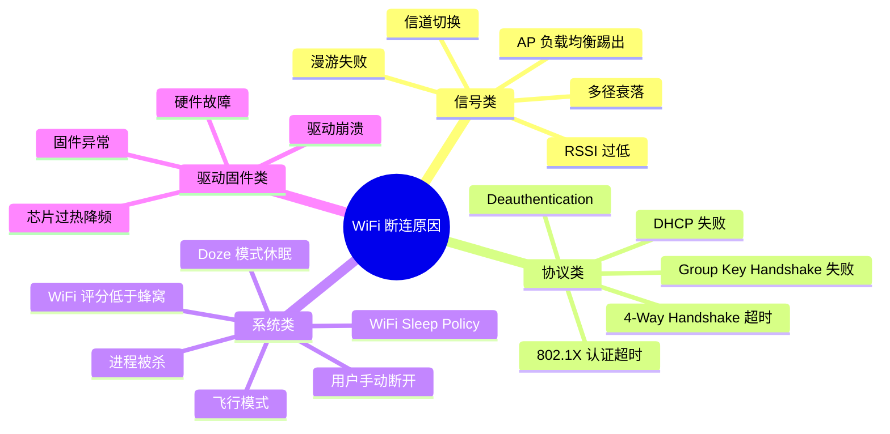
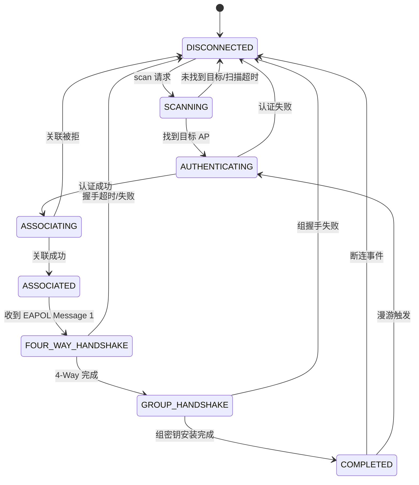

# 断连原因分析与日志解读

## 断连原因分类

WiFi 断连的原因可归为四大类：



### 信号类原因

| 原因 | 表现 | 日志特征 |
|------|------|---------|
| RSSI 过低 | 断连前 RSSI 持续走低 | `WifiScoreReport: rssi=-85` |
| AP 负载均衡 | 被 AP 主动踢出（Reason 5） | `CTRL-EVENT-DISCONNECTED reason=5` |
| 信道切换（CSA） | AP 切换信道时短暂断连 | `Channel switch announcement` |
| 漫游失败 | 切换 AP 时新 AP 拒绝 | `CTRL-EVENT-ASSOC-REJECT` |
| DFS 雷达检测 | AP 检测到雷达切换信道 | 突然断连，AP 日志有 DFS 事件 |

### 协议类原因

| 原因 | 表现 | 日志特征 |
|------|------|---------|
| DHCP 失败 | 卡在"正在获取 IP" | `DhcpClient: TIMEOUT` |
| 4-Way Handshake 超时 | 密码正确但连接失败 | `reason=15 (4WAY_HANDSHAKE_TIMEOUT)` |
| Group Key 更新失败 | 已连接一段时间后突然断开 | `reason=14 (GROUP_KEY_UPDATE_TIMEOUT)` |
| Deauthentication | AP 主动断开客户端 | `reason=1/2/3/6/7` |

### 系统类原因

| 原因 | 表现 | 日志特征 |
|------|------|---------|
| Doze 模式 | 灭屏一段时间后断连 | `PowerManager: going to sleep` + WiFi 断连 |
| 评分低于蜂窝 | WiFi 连着但流量走蜂窝 | `WifiScoreReport: score=XX < cellScore` |
| 进程被杀 | 持有 WifiLock 的进程被回收 | WifiLock 释放日志 |
| WiFi Sleep | 屏幕关闭后 WiFi 休眠 | `WifiController: setSleepMode true` |

### 驱动 / 固件类原因

| 原因 | 表现 | 日志特征 |
|------|------|---------|
| 驱动崩溃 | 突然断连且无法重连 | kernel panic / wlan driver 相关 dmesg |
| 固件挂死 | WiFi 开关无响应 | `WifiNative: failed to get interface` |
| 芯片过热 | 高负载后性能下降/断连 | 温度传感器日志 |

## 802.11 Reason Code 速查表

当收到 Deauthentication 或 Disassociation 帧时，Reason Code 指示断连原因：

| Code | 含义 | 常见场景 |
|------|------|---------|
| 1 | Unspecified reason | 通用原因，AP 未说明具体原因 |
| 2 | Previous authentication no longer valid | 认证过期，AP 清理会话 |
| 3 | Deauthenticated: leaving BSS | STA 或 AP 正常退出 |
| 4 | Disassociated due to inactivity | 客户端长时间无活动被踢出 |
| 5 | Disassociated: AP unable to handle | AP 过载，主动踢出客户端 |
| 6 | Class 2 frame from non-authenticated STA | 未认证就发数据帧 |
| 7 | Class 3 frame from non-associated STA | 未关联就发数据帧 |
| 8 | Disassociated: leaving BSS | STA 正常离开 |
| 14 | MIC failure (TKIP) | TKIP 完整性校验失败（可能被攻击） |
| 15 | 4-Way Handshake timeout | WPA 握手超时，**最常见的密码错误表现** |
| 16 | Group Key Handshake timeout | 组密钥更新超时 |
| 17 | IE in 4-Way Handshake different | RSN IE 不匹配 |
| 23 | IEEE 802.1X authentication failed | 企业级认证失败 |
| 34 | Disassociated due to TDLS teardown | TDLS 连接关闭 |

> **高频关注**：实际开发中最常见的 Reason Code 为 **3**（正常断开）、**4**（空闲超时）、**5**（AP 过载）、**15**（握手超时）。

## 802.11 Status Code 速查表

Status Code 出现在 Authentication Response 和 Association Response 中，表示请求是否被接受：

| Code | 含义 | 处理建议 |
|------|------|---------|
| 0 | Successful | 成功 |
| 1 | Unspecified failure | AP 拒绝，原因不明 |
| 12 | Association denied: not in same BSS | SSID 不匹配 |
| 13 | Association denied: not supporting auth algorithm | 安全类型不匹配 |
| 15 | Association denied: challenge failure | WEP 挑战失败 |
| 17 | Association denied: AP capacity full | AP 连接数已满 |
| 34 | Association denied: RSSI too low | 信号太弱被拒绝 |
| 53 | Invalid RSN IE contents | WPA/RSN 信息元素错误 |

## wpa_supplicant 状态机

wpa_supplicant 维护一个内部状态机，通过日志可以追踪其状态迁移：



### 关键状态迁移路径

**正常连接路径**：
```
DISCONNECTED → SCANNING → AUTHENTICATING → ASSOCIATING →
ASSOCIATED → 4WAY_HANDSHAKE → GROUP_HANDSHAKE → COMPLETED
```

**密码错误路径**：
```
DISCONNECTED → SCANNING → AUTHENTICATING → ASSOCIATING →
ASSOCIATED → 4WAY_HANDSHAKE → DISCONNECTED (reason=15)
```

**AP 拒绝路径**：
```
DISCONNECTED → SCANNING → AUTHENTICATING → ASSOCIATING →
DISCONNECTED (status=17, AP full)
```

### 常见异常状态迁移

| 异常模式 | 表现 | 根因 |
|---------|------|------|
| AUTHENTICATING → DISCONNECTED 循环 | 反复认证失败 | AP MAC 过滤 / 安全类型不匹配 |
| 4WAY_HANDSHAKE → DISCONNECTED 循环 | 反复握手失败 | 密码错误 / PMK 缓存过期 |
| COMPLETED → DISCONNECTED → SCANNING 循环 | 频繁断连重连 | 信号不稳定 / AP 过载 |
| 长时间停在 ASSOCIATED | 卡住不进入握手 | AP 未发送 EAPOL Message 1 |

## dumpsys wifi 日志解读

`adb shell dumpsys wifi` 输出大量信息，以下为关键段落解读：

### 输出结构概览

```
adb shell dumpsys wifi
```

主要段落：

| 段落 | 内容 | 关注点 |
|------|------|--------|
| Wi-Fi is enabled | WiFi 开关状态 | 基本状态确认 |
| WifiInfo | 当前连接的详细信息 | SSID、RSSI、LinkSpeed、Score |
| Network Selection Status | 已保存网络的选择状态 | 网络为何未被选中 |
| Recent scan results | 最近扫描结果 | 环境中的 AP 信息 |
| WifiConfigStore | 已保存网络配置 | 网络配置是否正确 |
| ConnectionEvent | 连接事件历史 | 连接成功/失败记录 |
| WifiScoreReport | 网络评分历史 | 评分下降导致切网 |

### WifiInfo 关键字段

```
WifiInfo:
  SSID: "MyNetwork"
  BSSID: aa:bb:cc:dd:ee:ff
  MAC: 12:34:56:78:9a:bc
  Security type: 2 (WPA2-PSK)
  Supplicant state: COMPLETED
  RSSI: -58
  Link speed: 433 Mbps
  Tx link speed: 433 Mbps
  Rx link speed: 433 Mbps
  Frequency: 5180 MHz
  Net ID: 0
  Metered hint: false
  Score: 54
```

关键指标解读：

| 字段 | 健康值 | 异常信号 |
|------|--------|---------|
| RSSI | > -70 dBm | < -75 dBm 需关注 |
| Link speed | > 54 Mbps | 持续降低说明信号变差 |
| Score | > 40 | < 30 可能触发网络切换 |
| Supplicant state | COMPLETED | 非 COMPLETED 说明连接异常 |

### 连接历史（Connection Events）

```
Connection Events:
  ID=0 startTime=... duration=2345ms level=-55 SSID="MyNetwork"
    result=SUCCESS roamType=NONE
  ID=1 startTime=... duration=1234ms level=-72 SSID="MyNetwork"
    result=FAILURE reason=DHCP_FAILURE
```

### 评分与网络选择日志

```
WifiScoreReport:
  timestamp: score=48 rssi=-62 linkSpeed=433 txBad=0 txGood=120
  timestamp: score=35 rssi=-75 linkSpeed=72 txBad=15 txGood=45
  timestamp: score=28 rssi=-80 linkSpeed=24 txBad=30 txGood=10
  → Network switch triggered (WiFi score < Cell score)
```

## 关键 logcat Tag 清单

### Tag 与过滤命令

```bash
# 综合 WiFi 日志
adb logcat -s WifiService WifiNative WifiConnectivityManager \
  WifiNetworkSelector WifiScoreReport ClientModeImpl \
  wpa_supplicant DhcpClient NetworkMonitor

# 仅连接相关
adb logcat -s ClientModeImpl wpa_supplicant

# 仅评分和切网
adb logcat -s WifiScoreReport WifiNetworkSelector ConnectivityService
```

### 各 Tag 输出内容说明

| Tag | 内容 | 典型日志 |
|-----|------|---------|
| `wpa_supplicant` | 底层连接状态 | `CTRL-EVENT-CONNECTED`, `CTRL-EVENT-DISCONNECTED` |
| `ClientModeImpl` | 状态机迁移 | `transitionTo DisconnectedState` |
| `WifiConnectivityManager` | 连接决策 | `connectToNetwork`, `handleScanResults` |
| `WifiNetworkSelector` | 网络选择 | `candidate selected: SSID=...` |
| `WifiScoreReport` | 评分更新 | `score=45, rssi=-65, txBad=2` |
| `DhcpClient` | DHCP 过程 | `DHCPDISCOVER`, `DHCPACK`, `TIMEOUT` |
| `NetworkMonitor` | 网络验证 | `Validation probe completed`, `CAPTIVE_PORTAL` |
| `ConnectivityService` | 网络切换 | `Switching default network from wifi to cell` |

## 典型断连场景案例分析

### 案例：频繁 Deauth（Reason Code 3）

**现象**：设备每隔 5-10 分钟断连一次，Reason Code 为 3。

**日志片段**：
```
wpa_supplicant: wlan0: CTRL-EVENT-DISCONNECTED bssid=aa:bb:cc:dd:ee:ff reason=3 locally_generated=0
ClientModeImpl: transitionTo DisconnectedState from ConnectedState
WifiConnectivityManager: Auto-reconnect enabled, triggering scan
```

**分析**：
- `reason=3` 表示 "Deauthenticated because sending STA is leaving"
- `locally_generated=0` 说明**不是**本地发起的断连，是 AP 踢出
- 规律性断连指向 AP 端配置问题

**排查方向**：
1. AP 是否配置了客户端空闲超时
2. AP 是否开启了负载均衡（客户端被切换到其他 AP）
3. AP 固件是否有已知 bug

### 案例：DHCP 获取失败导致断连

**现象**：WiFi 显示"已连接"但随后变为"正在获取 IP 地址"，最终断开。

**日志片段**：
```
DhcpClient: Sending DHCPDISCOVER
DhcpClient: No DHCPOFFER received after 2000ms, retrying
DhcpClient: No DHCPOFFER received after 4000ms, retrying
DhcpClient: TIMEOUT waiting for DHCP
ClientModeImpl: DHCP failure, disconnecting
```

**排查方向**：
1. DHCP 服务器是否正常运行
2. IP 地址池是否已满
3. 是否有 DHCP Snooping 或 ARP 检测拦截
4. 同一 AP 下其他设备是否正常

### 案例：Doze 模式下 WiFi 被系统断开

**现象**：设备灭屏 30 分钟后 WiFi 断连，亮屏后重新连接。

**日志片段**：
```
PowerManager: Going to sleep...
DeviceIdleController: Entering IDLE state
WifiController: setSleepMode true
wpa_supplicant: CTRL-EVENT-DISCONNECTED reason=3 locally_generated=1
```

**分析**：
- `locally_generated=1` 说明是**本地主动断开**
- Doze 深度休眠阶段系统主动断开 WiFi 以省电

**解决方案**：
- 使用 `WifiManager.WifiLock` 阻止 WiFi 休眠
- 使用前台服务维持连接
- 详见 [07-省电模式与 WiFi 生命周期](07-省电模式与WiFi生命周期power-saving-and-wifi-lifecycle.md)

### 案例：网络评分低于蜂窝自动切换

**现象**：WiFi 明明连着，但上网走的是蜂窝数据。

**日志片段**：
```
WifiScoreReport: score=25 rssi=-82 linkSpeed=24 txBad=45 txGood=5
ConnectivityService: Switching default network: wifi(score=25) -> cell(score=50)
```

**分析**：
- WiFi 评分降到 25，低于蜂窝的 50
- 系统自动切换默认网络到蜂窝
- WiFi 仍保持连接，但不再承载默认流量

**解决方案**：
- 对于必须走 WiFi 的场景，使用 `bindProcessToNetwork`
- 改善 WiFi 信号质量（调整 AP 位置/天线方向）

## 踩坑记录

> 此区域供团队成员补充项目中遇到的真实案例。

| 日期 | 记录人 | 问题描述 | 解决方案 |
|------|--------|----------|----------|
| | | | |

## 参考资料

- [IEEE 802.11 Reason Codes - IEEE Std 802.11-2020 Table 9-49](https://standards.ieee.org/ieee/802.11/7028/)
- [wpa_supplicant Events](https://w1.fi/wpa_supplicant/devel/ctrl_iface_page.html)
- [Android dumpsys wifi](https://source.android.com/docs/core/connect/wifi-debug)
- [重连策略与状态机](06-重连策略与状态机reconnection-and-state-machine.md) — 本模块下一篇
