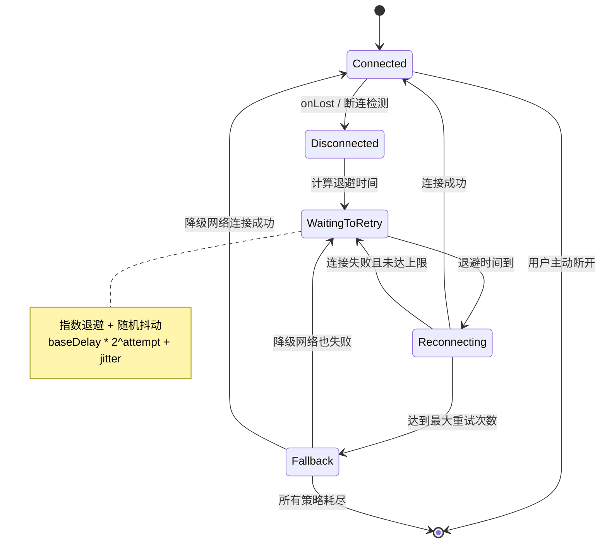
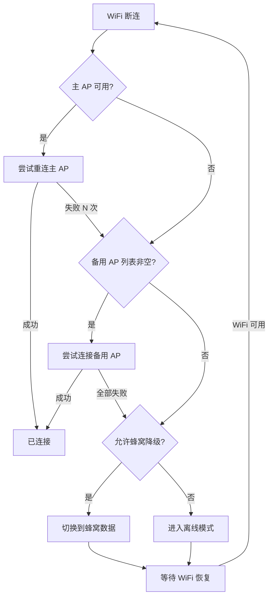

# 重连策略与状态机

## 重连状态机设计

一个健壮的重连机制需要明确的状态管理，避免重复重连或遗漏重连：



### 状态定义

```kotlin
sealed class WifiConnectionState {
    object Connected : WifiConnectionState()
    object Disconnected : WifiConnectionState()
    data class WaitingToRetry(
        val attempt: Int,
        val nextRetryAt: Long
    ) : WifiConnectionState()
    object Reconnecting : WifiConnectionState()
    data class Fallback(val strategy: FallbackStrategy) : WifiConnectionState()
    object Stopped : WifiConnectionState()
}

enum class FallbackStrategy {
    SWITCH_AP,          // 切换到备用 AP
    MOBILE_DATA,        // 降级到蜂窝数据
    OFFLINE_MODE        // 离线模式
}
```

### 状态迁移条件

| 当前状态 | 目标状态 | 触发条件 |
|---------|---------|---------|
| Connected | Disconnected | NetworkCallback.onLost 或心跳检测失败 |
| Disconnected | WaitingToRetry | 自动触发，计算退避延迟 |
| WaitingToRetry | Reconnecting | 退避延迟到期 |
| Reconnecting | Connected | WiFi 连接成功且通过验证 |
| Reconnecting | WaitingToRetry | 连接失败，未达最大重试次数 |
| Reconnecting | Fallback | 达到最大重试次数 |
| Fallback | Connected | 降级策略成功 |
| 任意状态 | Stopped | 用户主动停止 / 应用退出 |

### 状态持久化与恢复

对于需要跨进程生命周期的重连任务，需要持久化当前状态：

```kotlin
class ReconnectStateStore(context: Context) {
    private val prefs = context.getSharedPreferences("wifi_reconnect", Context.MODE_PRIVATE)

    fun saveState(attempt: Int, lastDisconnectTime: Long) {
        prefs.edit()
            .putInt("attempt_count", attempt)
            .putLong("last_disconnect_time", lastDisconnectTime)
            .apply()
    }

    fun restoreState(): Pair<Int, Long> {
        val attempt = prefs.getInt("attempt_count", 0)
        val time = prefs.getLong("last_disconnect_time", 0L)
        return attempt to time
    }

    fun clear() {
        prefs.edit().clear().apply()
    }
}
```

## 指数退避算法

### 基本原理

指数退避（Exponential Backoff）在每次重试失败后将等待时间翻倍，避免频繁重试浪费资源并防止"惊群效应"：

```
等待时间 = min(baseDelay × 2^attempt, maxDelay) + random(0, jitter)
```

| 重试次数 | 基础延迟 (baseDelay=2s) | 加上随机抖动 |
|---------|----------------------|------------|
| 第 1 次 | 2s | 2~3s |
| 第 2 次 | 4s | 4~5s |
| 第 3 次 | 8s | 8~9s |
| 第 4 次 | 16s | 16~17s |
| 第 5 次 | 32s | 32~33s |
| 第 6 次+ | 60s（maxDelay 封顶） | 60~61s |

### 随机抖动（Jitter）的必要性

不加抖动时，多个设备可能在同一时刻重试，导致：
- AP 瞬间过载
- 所有设备同时失败
- 同步重试的死循环

三种常见的抖动策略：

| 策略 | 公式 | 特点 |
|------|------|------|
| Full Jitter | `random(0, delay)` | 范围大，最能打散请求 |
| Equal Jitter | `delay/2 + random(0, delay/2)` | 保证最低等待时间 |
| Decorrelated Jitter | `min(maxDelay, random(baseDelay, prevDelay * 3))` | 与前次延迟关联 |

### 算法实现

```kotlin
class ExponentialBackoff(
    private val baseDelayMs: Long = 2_000L,
    private val maxDelayMs: Long = 60_000L,
    private val jitterMs: Long = 1_000L,
    private val multiplier: Double = 2.0
) {
    private val random = Random()

    fun getDelayMs(attempt: Int): Long {
        val exponentialDelay = (baseDelayMs * multiplier.pow(attempt.toDouble())).toLong()
        val cappedDelay = minOf(exponentialDelay, maxDelayMs)
        val jitter = random.nextLong(jitterMs)
        return cappedDelay + jitter
    }
}
```

### 参数选择建议

| 场景 | baseDelay | maxDelay | maxRetries | 说明 |
|------|-----------|----------|-----------|------|
| IoT 设备控制 | 1s | 30s | 10 | 快速重连，实时性要求高 |
| IM 即时通讯 | 2s | 60s | 15 | 平衡速度与稳定性 |
| 后台数据同步 | 5s | 300s | 8 | 不急，避免频繁唤醒 |
| 视频流媒体 | 1s | 15s | 5 | 快速恢复或快速降级 |

## 多级降级策略

### WiFi 重连 → 切换备用 AP



### WiFi 不可用 → 降级到移动数据

```kotlin
fun fallbackToMobileData() {
    val request = NetworkRequest.Builder()
        .addTransportType(NetworkCapabilities.TRANSPORT_CELLULAR)
        .addCapability(NetworkCapabilities.NET_CAPABILITY_INTERNET)
        .build()

    connectivityManager.requestNetwork(request, object : ConnectivityManager.NetworkCallback() {
        override fun onAvailable(network: Network) {
            connectivityManager.bindProcessToNetwork(network)
            // 通知 UI：已降级到蜂窝数据
        }
    })
}
```

### 网络恢复后的回切策略

降级到蜂窝后，需要持续监听 WiFi 恢复并自动回切：

```kotlin
fun monitorWifiRecovery() {
    val wifiRequest = NetworkRequest.Builder()
        .addTransportType(NetworkCapabilities.TRANSPORT_WIFI)
        .addCapability(NetworkCapabilities.NET_CAPABILITY_VALIDATED)
        .build()

    connectivityManager.registerNetworkCallback(wifiRequest, object : ConnectivityManager.NetworkCallback() {
        override fun onAvailable(network: Network) {
            // WiFi 恢复且已验证，回切
            connectivityManager.bindProcessToNetwork(network)
            // 通知 UI：已恢复 WiFi 连接
        }
    })
}
```

## WifiReconnectManager 完整实现

```kotlin
class WifiReconnectManager(
    private val context: Context,
    private val scope: CoroutineScope
) {
    private val connectivityManager = context.getSystemService(Context.CONNECTIVITY_SERVICE)
        as ConnectivityManager
    private val backoff = ExponentialBackoff()

    private var state: WifiConnectionState = WifiConnectionState.Connected
    private var attempt = 0
    private var reconnectJob: Job? = null
    private var networkCallback: ConnectivityManager.NetworkCallback? = null

    var onStateChanged: ((WifiConnectionState) -> Unit)? = null

    fun start() {
        val callback = object : ConnectivityManager.NetworkCallback() {
            override fun onAvailable(network: Network) {
                handleConnected()
            }

            override fun onLost(network: Network) {
                handleDisconnected()
            }

            override fun onCapabilitiesChanged(
                network: Network,
                capabilities: NetworkCapabilities
            ) {
                if (!capabilities.hasCapability(NetworkCapabilities.NET_CAPABILITY_VALIDATED)) {
                    // 网络未验证，可能是 Captive Portal
                }
            }
        }

        val request = NetworkRequest.Builder()
            .addTransportType(NetworkCapabilities.TRANSPORT_WIFI)
            .build()

        connectivityManager.registerNetworkCallback(request, callback)
        networkCallback = callback
    }

    private fun handleConnected() {
        attempt = 0
        reconnectJob?.cancel()
        updateState(WifiConnectionState.Connected)
    }

    private fun handleDisconnected() {
        updateState(WifiConnectionState.Disconnected)
        scheduleReconnect()
    }

    private fun scheduleReconnect() {
        reconnectJob?.cancel()
        reconnectJob = scope.launch {
            val maxRetries = 10

            while (attempt < maxRetries && isActive) {
                val delay = backoff.getDelayMs(attempt)
                updateState(WifiConnectionState.WaitingToRetry(
                    attempt = attempt,
                    nextRetryAt = System.currentTimeMillis() + delay
                ))

                delay(delay)

                updateState(WifiConnectionState.Reconnecting)
                val success = performReconnect()

                if (success) {
                    return@launch
                }

                attempt++
            }

            // 达到最大重试次数，进入降级
            updateState(WifiConnectionState.Fallback(FallbackStrategy.MOBILE_DATA))
            fallbackToMobileData()
        }
    }

    private suspend fun performReconnect(): Boolean = withContext(Dispatchers.IO) {
        // 系统通常会自动重连已保存网络
        // 这里可以等待一小段时间让系统完成自动重连
        delay(3_000)
        isWifiConnected()
    }

    private fun isWifiConnected(): Boolean {
        val network = connectivityManager.activeNetwork ?: return false
        val caps = connectivityManager.getNetworkCapabilities(network) ?: return false
        return caps.hasTransport(NetworkCapabilities.TRANSPORT_WIFI)
            && caps.hasCapability(NetworkCapabilities.NET_CAPABILITY_VALIDATED)
    }

    private fun updateState(newState: WifiConnectionState) {
        state = newState
        onStateChanged?.invoke(newState)
    }

    fun stop() {
        reconnectJob?.cancel()
        networkCallback?.let { connectivityManager.unregisterNetworkCallback(it) }
        updateState(WifiConnectionState.Stopped)
    }
}
```

## 与后台任务框架的配合

### WorkManager 定期重连检测

适合非实时性的周期性检测：

```kotlin
class WifiCheckWorker(
    context: Context,
    params: WorkerParameters
) : CoroutineWorker(context, params) {

    override suspend fun doWork(): Result {
        val cm = applicationContext.getSystemService(Context.CONNECTIVITY_SERVICE)
            as ConnectivityManager

        val network = cm.activeNetwork
        val caps = network?.let { cm.getNetworkCapabilities(it) }
        val isWifiConnected = caps?.hasTransport(NetworkCapabilities.TRANSPORT_WIFI) == true

        if (!isWifiConnected) {
            // WiFi 未连接，发送通知或尝试恢复
            notifyWifiDisconnected()
        }

        return Result.success()
    }
}

// 注册周期性检测
val request = PeriodicWorkRequestBuilder<WifiCheckWorker>(15, TimeUnit.MINUTES)
    .setConstraints(Constraints.Builder().build())
    .build()

WorkManager.getInstance(context).enqueueUniquePeriodicWork(
    "wifi_check",
    ExistingPeriodicWorkPolicy.KEEP,
    request
)
```

### AlarmManager 精确唤醒重连

适合需要精确定时的场景：

```kotlin
fun scheduleExactReconnect(delayMs: Long) {
    val alarmManager = context.getSystemService(Context.ALARM_SERVICE) as AlarmManager
    val intent = Intent(context, WifiReconnectReceiver::class.java)
    val pendingIntent = PendingIntent.getBroadcast(
        context, 0, intent,
        PendingIntent.FLAG_UPDATE_CURRENT or PendingIntent.FLAG_IMMUTABLE
    )

    if (Build.VERSION.SDK_INT >= Build.VERSION_CODES.S) {
        if (alarmManager.canScheduleExactAlarms()) {
            alarmManager.setExactAndAllowWhileIdle(
                AlarmManager.ELAPSED_REALTIME_WAKEUP,
                SystemClock.elapsedRealtime() + delayMs,
                pendingIntent
            )
        }
    } else {
        alarmManager.setExactAndAllowWhileIdle(
            AlarmManager.ELAPSED_REALTIME_WAKEUP,
            SystemClock.elapsedRealtime() + delayMs,
            pendingIntent
        )
    }
}
```

### JobScheduler 网络条件约束

```kotlin
val jobInfo = JobInfo.Builder(JOB_ID, ComponentName(context, WifiJobService::class.java))
    .setRequiredNetworkType(JobInfo.NETWORK_TYPE_UNMETERED)  // 需要 WiFi
    .setPersisted(true)
    .build()

val jobScheduler = context.getSystemService(Context.JOB_SCHEDULER_SERVICE) as JobScheduler
jobScheduler.schedule(jobInfo)
```

### Android 12+ 精确闹钟限制的影响

| 版本 | 精确闹钟要求 | 影响 |
|------|------------|------|
| < Android 12 | 无限制 | `setExactAndAllowWhileIdle` 可直接使用 |
| Android 12+ | 需要 `SCHEDULE_EXACT_ALARM` 权限 | 普通应用需要声明权限 |
| Android 13+ | `USE_EXACT_ALARM`（无需用户授权） | 限定特定类型应用（闹钟/日历等） |

> **建议**：优先使用 WorkManager，它会自动适配各版本的后台限制。仅在必须精确定时的场景使用 AlarmManager。

## 重连与用户体验的平衡

### 静默重连 vs 用户通知

| 场景 | 策略 | 用户感知 |
|------|------|---------|
| 短暂断连（< 5s） | 静默重连 | 用户无感知 |
| 中等断连（5-30s） | 静默重连 + 状态指示器 | 顶部小图标变化 |
| 长时间断连（> 30s） | 通知用户 + 自动重连 | Toast 或 Snackbar 提示 |
| 多次重连失败 | 通知用户 + 提供操作选项 | 弹出提示或设置入口 |

### 重连过程中的 UI 状态展示

```kotlin
// 根据重连状态更新 UI
reconnectManager.onStateChanged = { state ->
    runOnUiThread {
        when (state) {
            is WifiConnectionState.Connected -> {
                statusView.text = "已连接"
                statusView.setTextColor(Color.GREEN)
            }
            is WifiConnectionState.WaitingToRetry -> {
                val seconds = (state.nextRetryAt - System.currentTimeMillis()) / 1000
                statusView.text = "连接断开，${seconds}秒后重试（第${state.attempt + 1}次）"
                statusView.setTextColor(Color.YELLOW)
            }
            is WifiConnectionState.Reconnecting -> {
                statusView.text = "正在重连..."
                statusView.setTextColor(Color.YELLOW)
            }
            is WifiConnectionState.Fallback -> {
                statusView.text = "WiFi 不可用，已切换到移动数据"
                statusView.setTextColor(Color.RED)
            }
            else -> {}
        }
    }
}
```

### 频繁重连的抑制策略

避免在某些情况下触发无意义的重连：

```kotlin
fun shouldAttemptReconnect(): Boolean {
    // 1. 用户主动断开则不重连
    if (userInitiatedDisconnect) return false

    // 2. 飞行模式下不重连
    if (isAirplaneModeOn()) return false

    // 3. WiFi 被关闭则不重连
    if (!wifiManager.isWifiEnabled) return false

    // 4. 短时间内断连次数过多则暂停
    if (recentDisconnectCount > 5 && timeSinceFirstDisconnect < 60_000) {
        // 1 分钟内断连 5 次以上，暂停重连 5 分钟
        return false
    }

    return true
}
```

## 踩坑记录

> 此区域供团队成员补充项目中遇到的真实案例。

| 日期 | 记录人 | 问题描述 | 解决方案 |
|------|--------|----------|----------|
| | | | |

## 参考资料

- [Exponential Backoff And Jitter - AWS Architecture Blog](https://aws.amazon.com/blogs/architecture/exponential-backoff-and-jitter/)
- [WorkManager - Android Developers](https://developer.android.com/topic/libraries/architecture/workmanager)
- [AlarmManager - Android Developers](https://developer.android.com/reference/android/app/AlarmManager)
- [省电模式与 WiFi 生命周期](07-省电模式与WiFi生命周期power-saving-and-wifi-lifecycle.md) — 本模块下一篇
