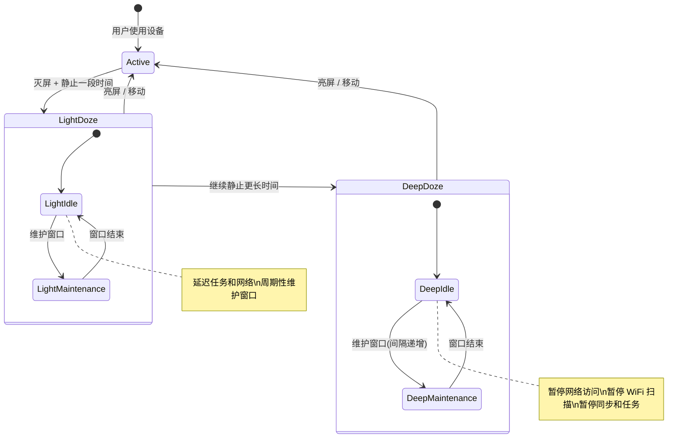

# 省电模式与 WiFi 生命周期

## Doze 模式对 WiFi 的影响

Android 6.0 引入的 Doze 模式是影响 WiFi 稳定性的最大系统级因素。Doze 分为 Light Doze 和 Deep Doze 两个阶段。

### Doze 分阶段行为



### 维护窗口（Maintenance Window）

Doze 模式并非完全断网，而是周期性地开放"维护窗口"：

| Doze 阶段 | 维护窗口间隔 | 窗口持续时间 | WiFi 行为 |
|-----------|------------|------------|----------|
| Light Doze | ~5 分钟 → 递增 | ~30 秒 | 允许网络访问 |
| Deep Doze（初始） | ~15 分钟 | ~30 秒 | 恢复网络，执行延迟任务 |
| Deep Doze（递增） | 30 分钟 → 1 小时 → 最长 6 小时 | ~30 秒 | 间隔越来越长 |

### Doze 模式下的网络行为

| 行为 | Light Doze | Deep Doze |
|------|-----------|-----------|
| WiFi 连接 | 保持 | 可能断开 |
| 网络访问 | 维护窗口内允许 | 仅维护窗口内允许 |
| FCM 高优先级推送 | 可接收 | 可接收 |
| AlarmManager | 延迟到维护窗口 | `setAndAllowWhileIdle` 可触发 |
| WorkManager | 延迟到维护窗口 | 延迟到维护窗口 |
| 前台服务 | 正常运行 | 正常运行（保持网络） |

> **关键**：持有前台服务的应用在 Doze 模式下不受网络限制。这是保持 WiFi 连接最可靠的方式。

## App Standby Buckets

Android 9 引入应用待机分组，根据应用使用频率分配不同的资源配额：

### Bucket 分级与网络限制

| Bucket | 分配条件 | 任务频率限制 | 网络限制 |
|--------|---------|------------|---------|
| Active | 正在使用 / 前台 | 无限制 | 无限制 |
| Working Set | 经常使用 | 2 小时内延迟 | 轻微延迟 |
| Frequent | 定期使用 | 8 小时内延迟 | 中等延迟 |
| Rare | 很少使用 | 24 小时内延迟 | 显著延迟 |
| Restricted（Android 12+） | 极少使用 | 每天 1 次 | 严重限制 |

### 如何查询当前 Bucket

```bash
# adb 命令查询
adb shell am get-standby-bucket <package_name>
```

```kotlin
// 代码中查询 (API 28+)
if (Build.VERSION.SDK_INT >= Build.VERSION_CODES.P) {
    val usageStatsManager = context.getSystemService(Context.USAGE_STATS_SERVICE)
        as UsageStatsManager
    val bucket = usageStatsManager.appStandbyBucket

    when (bucket) {
        UsageStatsManager.STANDBY_BUCKET_ACTIVE -> "Active"
        UsageStatsManager.STANDBY_BUCKET_WORKING_SET -> "Working Set"
        UsageStatsManager.STANDBY_BUCKET_FREQUENT -> "Frequent"
        UsageStatsManager.STANDBY_BUCKET_RARE -> "Rare"
        UsageStatsManager.STANDBY_BUCKET_RESTRICTED -> "Restricted"
        else -> "Unknown"
    }
}
```

### 提升 Bucket 等级的方法

| 方法 | 效果 | 持续时间 |
|------|------|---------|
| 用户打开应用 | 升为 Active | 直到退出一段时间后 |
| 用户与通知交互 | 升为 Working Set | 中等持续时间 |
| 显示前台服务通知 | 保持 Active | 前台服务存续期间 |
| 收到 FCM 高优先级推送 | 临时获得网络豁免 | ~10 秒 |

## WiFi Sleep Policy

WiFi Sleep Policy 控制屏幕关闭后 WiFi 是否保持活跃：

### WIFI_SLEEP_POLICY_DEFAULT

默认策略：屏幕关闭一段时间后可能关闭 WiFi（由系统决定）。

### WIFI_SLEEP_POLICY_NEVER_WHILE_PLUGGED

充电时保持 WiFi 不休眠，拔电后按默认策略。

### WIFI_SLEEP_POLICY_NEVER

始终保持 WiFi 活跃，即使屏幕关闭。

```kotlin
// 查询当前策略
val policy = Settings.Global.getInt(
    context.contentResolver,
    Settings.Global.WIFI_SLEEP_POLICY,
    Settings.Global.WIFI_SLEEP_POLICY_DEFAULT
)

// 设置策略（需要 WRITE_SETTINGS 权限或系统应用）
Settings.Global.putInt(
    context.contentResolver,
    Settings.Global.WIFI_SLEEP_POLICY,
    Settings.Global.WIFI_SLEEP_POLICY_NEVER
)
```

### 各策略对稳定性的影响

| 策略 | 稳定性 | 功耗 | 适用场景 |
|------|--------|------|---------|
| DEFAULT | 低 | 最省电 | 普通用户手机 |
| NEVER_WHILE_PLUGGED | 充电时高 | 充电时功耗增加 | 平板/固定设备 |
| NEVER | 最高 | 功耗最大 | IoT 设备、工业终端 |

> **注意**：Android 新版本中 WiFi Sleep Policy 的行为可能因 OEM 定制而异。部分厂商在 Doze 模式下会忽略此设置。

## WifiLock

`WifiLock` 用于阻止系统在省电模式下关闭 WiFi 射频：

### WifiLock 类型

| 类型 | 常量 | 行为 | 功耗 | 适用场景 |
|------|------|------|------|---------|
| FULL | `WIFI_MODE_FULL` | 保持 WiFi 活跃 | 中 | 基本保活 |
| HIGH_PERF | `WIFI_MODE_FULL_HIGH_PERF` | 保持高性能连接 | 高 | 流媒体、大文件传输 |
| LOW_LATENCY | `WIFI_MODE_FULL_LOW_LATENCY`（API 29+） | 最低延迟模式 | 最高 | 实时游戏、VoIP |

### 使用场景与注意事项

```kotlin
class WifiLockManager(context: Context) {
    private val wifiManager = context.getSystemService(Context.WIFI_SERVICE) as WifiManager
    private var wifiLock: WifiManager.WifiLock? = null

    fun acquire(tag: String = "MyApp:WifiLock") {
        if (wifiLock == null) {
            wifiLock = wifiManager.createWifiLock(
                WifiManager.WIFI_MODE_FULL_HIGH_PERF,
                tag
            ).apply {
                setReferenceCounted(false)  // 推荐非引用计数模式
            }
        }
        wifiLock?.takeIf { !it.isHeld }?.acquire()
    }

    fun release() {
        wifiLock?.takeIf { it.isHeld }?.release()
    }
}
```

### WifiLock 对电池的影响

| WifiLock 类型 | 额外功耗 | 说明 |
|-------------|---------|------|
| FULL | +50-100mW | 保持射频活跃但允许节能 |
| HIGH_PERF | +100-200mW | 禁用 WiFi 省电模式（PS-Poll） |
| LOW_LATENCY | +150-300mW | 最大功率运行，最低延迟 |

### 正确获取与释放

```kotlin
// ✅ 正确：配合前台服务使用
class MyForegroundService : Service() {
    private lateinit var wifiLockManager: WifiLockManager

    override fun onCreate() {
        super.onCreate()
        wifiLockManager = WifiLockManager(this)
    }

    override fun onStartCommand(intent: Intent?, flags: Int, startId: Int): Int {
        startForeground(ID, notification)
        wifiLockManager.acquire()
        return START_STICKY
    }

    override fun onDestroy() {
        wifiLockManager.release()  // 必须释放
        super.onDestroy()
    }
}

// ❌ 错误：在 Activity 中获取但忘记释放
// 导致 WiFi 永远不休眠，用户投诉耗电
```

> **最佳实践**：WifiLock 必须配合前台服务使用。在前台服务 `onDestroy` 中释放。使用 `setReferenceCounted(false)` 避免多次 acquire/release 不匹配的问题。

## 前台服务保活

### 前台服务类型选择

Android 10+ 需要在 manifest 中声明前台服务类型，Android 14+ 必须指定：

```xml
<service
    android:name=".WifiKeepAliveService"
    android:foregroundServiceType="connectedDevice"
    android:exported="false" />
```

| 服务类型 | 适用场景 | 权限 |
|---------|---------|------|
| `connectedDevice` | 与外部设备保持 WiFi 连接 | `FOREGROUND_SERVICE_CONNECTED_DEVICE` |
| `dataSync` | WiFi 数据同步 | `FOREGROUND_SERVICE_DATA_SYNC` |
| `remoteMessaging` | 即时通讯保活 | `FOREGROUND_SERVICE_REMOTE_MESSAGING` |
| `specialUse` | 其他不符合标准类型的用途 | 需要 Google Play 审核 |

### Android 12+ 前台服务限制

| 限制 | 影响 | 解决方案 |
|------|------|---------|
| 后台启动限制 | 后台无法直接 `startForegroundService()` | 使用 WorkManager 或精确闹钟触发 |
| 10 秒超时 | `startForeground()` 必须在 10 秒内调用 | 确保 `onCreate` 中尽早调用 |
| 类型限制 | 必须声明 `foregroundServiceType` | manifest 中正确声明 |

### 前台服务 + WifiLock 组合模式

这是维持 WiFi 连接最可靠的组合：

```kotlin
class WifiKeepAliveService : Service() {
    private var wifiLock: WifiManager.WifiLock? = null
    private var networkCallback: ConnectivityManager.NetworkCallback? = null

    override fun onStartCommand(intent: Intent?, flags: Int, startId: Int): Int {
        startForeground(NOTIFICATION_ID, createNotification())

        // 获取 WifiLock
        val wifiManager = getSystemService(Context.WIFI_SERVICE) as WifiManager
        wifiLock = wifiManager.createWifiLock(
            WifiManager.WIFI_MODE_FULL_HIGH_PERF,
            "WifiKeepAlive"
        ).apply {
            setReferenceCounted(false)
            acquire()
        }

        // 注册 NetworkCallback
        val cm = getSystemService(Context.CONNECTIVITY_SERVICE) as ConnectivityManager
        val callback = object : ConnectivityManager.NetworkCallback() {
            override fun onLost(network: Network) {
                // WiFi 断开，触发重连逻辑
            }
        }
        val request = NetworkRequest.Builder()
            .addTransportType(NetworkCapabilities.TRANSPORT_WIFI)
            .build()
        cm.registerNetworkCallback(request, callback)
        networkCallback = callback

        return START_STICKY
    }

    override fun onDestroy() {
        wifiLock?.takeIf { it.isHeld }?.release()
        networkCallback?.let {
            (getSystemService(Context.CONNECTIVITY_SERVICE) as ConnectivityManager)
                .unregisterNetworkCallback(it)
        }
        super.onDestroy()
    }

    override fun onBind(intent: Intent?): IBinder? = null
}
```

## Android 各版本后台限制演进

### Android 6.0（Doze 引入）

- Doze 模式在灭屏 + 静止时生效
- AlarmManager 延迟到维护窗口（`setAndAllowWhileIdle` 例外）
- 网络访问在 Deep Doze 期间暂停

### Android 8.0（后台执行限制）

- 后台服务在 1 分钟内必须调用 `startForeground()` 或被系统停止
- 隐式广播不再发送给 manifest 注册的接收器
- 后台位置访问频率降低

### Android 9.0（App Standby Buckets）

- 引入应用待机分组机制
- 不同 Bucket 获得不同的资源配额
- Rare Bucket 应用的网络访问严重受限

### Android 12（前台服务启动限制）

- 后台不允许直接启动前台服务（少数例外）
- 必须声明 `foregroundServiceType`
- 精确闹钟需要 `SCHEDULE_EXACT_ALARM` 权限

### Android 13-14（进一步收紧）

- Android 13: 前台服务必须获得对应权限
- Android 14: 短期前台服务（`SHORT_SERVICE`）类型，限时 3 分钟
- Android 14: `dataSync` 类型前台服务限时 6 小时

**各版本后台限制对 WiFi 的影响总览**：

| 版本 | 关键限制 | 对 WiFi 保活的影响 | 应对策略 |
|------|---------|------------------|---------|
| 6.0 | Doze | 灭屏后可能断 WiFi | WifiLock + 前台服务 |
| 8.0 | 后台服务限制 | 后台服务 1 分钟超时 | 改用前台服务 |
| 9.0 | Standby Buckets | Rare 应用网络受限 | 保持用户活跃度 |
| 10 | 后台位置限制 | 后台扫描需额外权限 | 使用 NetworkCallback 替代扫描 |
| 12 | 前台服务启动限制 | 后台无法启动前台服务 | 使用 WorkManager 触发 |
| 14 | 前台服务类型限时 | dataSync 限 6 小时 | 用 connectedDevice 类型 |

## 踩坑记录

> 此区域供团队成员补充项目中遇到的真实案例。

| 日期 | 记录人 | 问题描述 | 解决方案 |
|------|--------|----------|----------|
| | | | |

## 参考资料

- [Doze 模式 - Android Developers](https://developer.android.com/training/monitoring-device-state/doze-standby)
- [App Standby Buckets - Android Developers](https://developer.android.com/topic/performance/appstandby)
- [前台服务类型 - Android Developers](https://developer.android.com/develop/background-work/services/foreground-services)
- [WifiManager.WifiLock - API Reference](https://developer.android.com/reference/android/net/wifi/WifiManager.WifiLock)
- [Captive Portal 与网络验证](08-Captive%20Portal与网络验证captive-portal-and-validation.md) — 本模块下一篇
