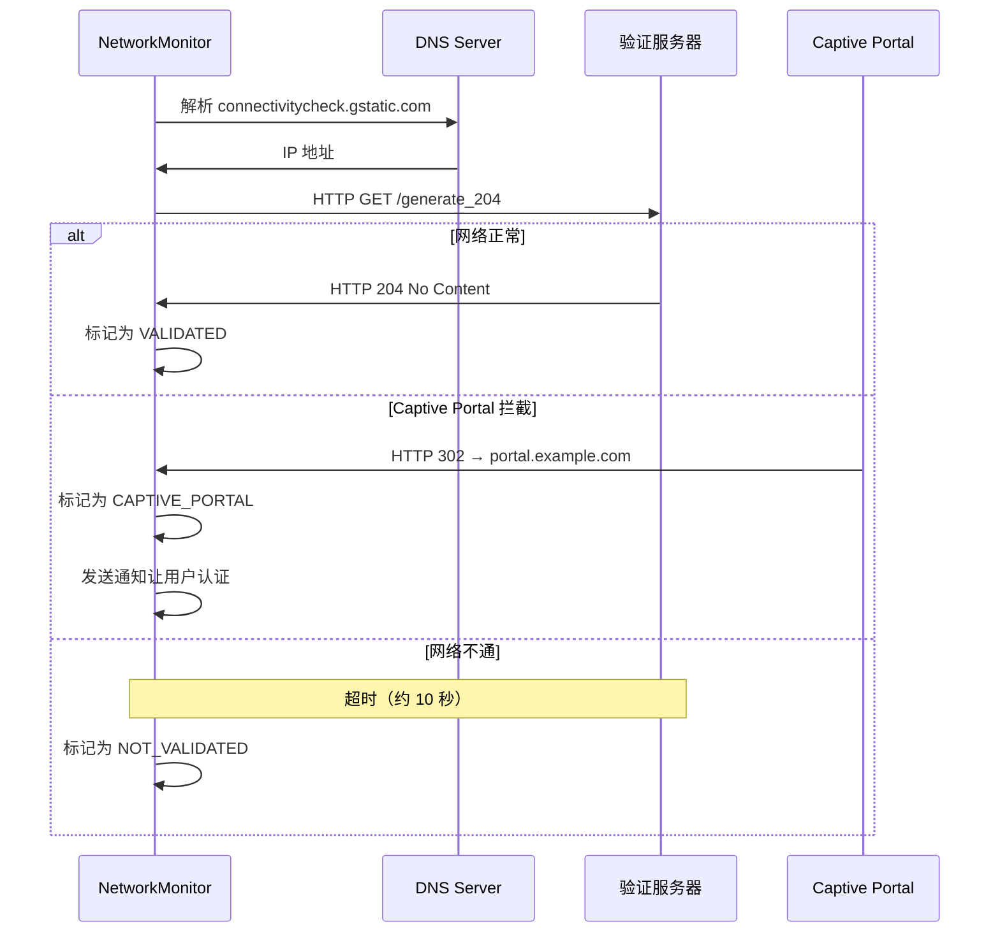
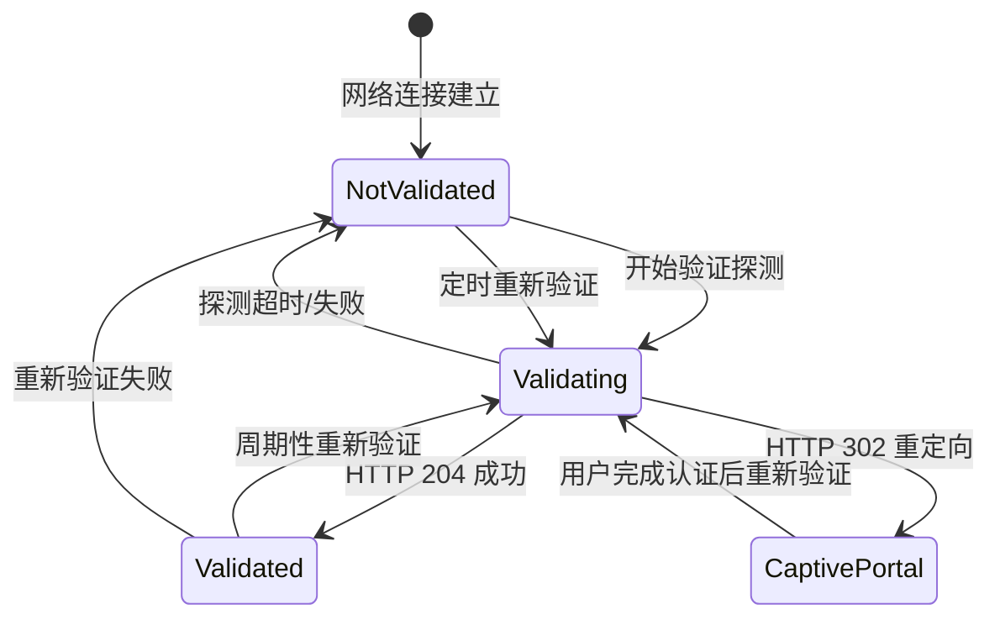
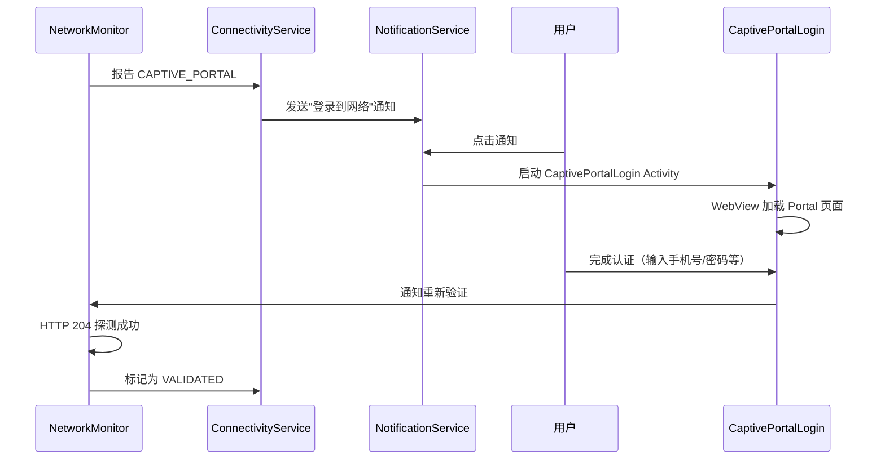
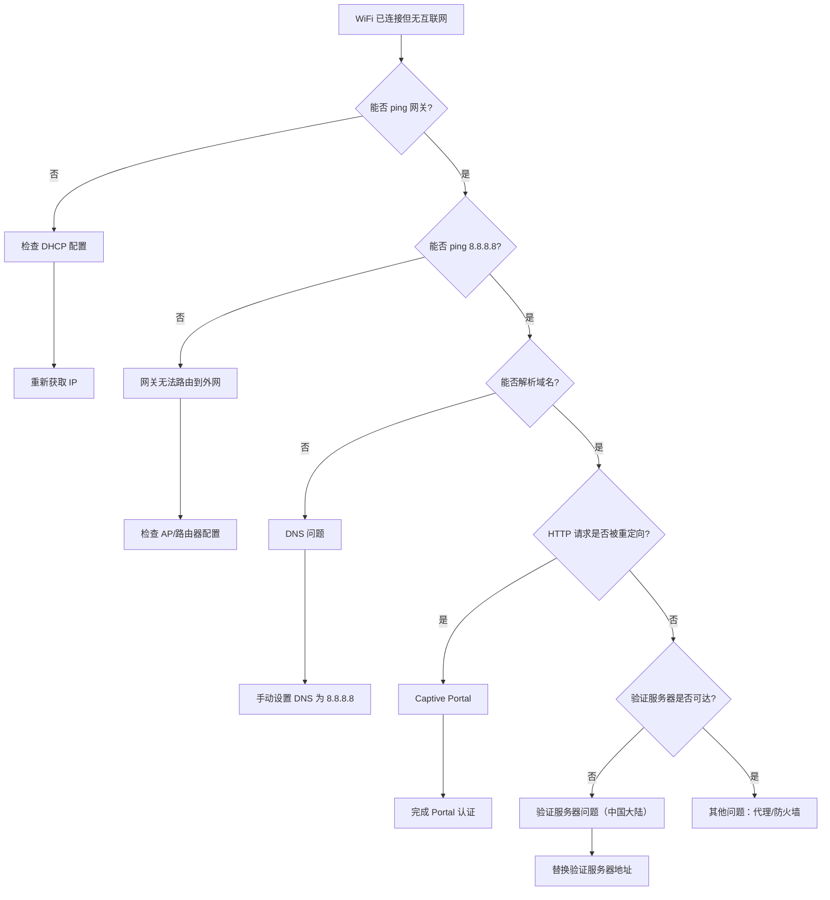

# Captive Portal 与网络验证

## Captive Portal 检测原理

Captive Portal（强制门户）是一种在授权前拦截用户网络流量的技术，广泛用于酒店、机场、咖啡厅等公共 WiFi。Android 系统内置了 Captive Portal 检测机制。

### HTTP 204 探测机制

Android 通过向已知 URL 发送 HTTP 请求来判断网络状态：

```
请求 URL: http://connectivitycheck.gstatic.com/generate_204
或 HTTPS: https://www.google.com/generate_204

期望响应:
- HTTP 204 No Content → 网络正常 (VALIDATED)
- HTTP 302 Redirect  → Captive Portal (需要认证)
- HTTP 200 + 内容    → Captive Portal (内容被替换)
- 超时/无响应       → 无互联网 (NOT_VALIDATED)
```

### 探测 URL 与流程



### 检测结果与网络标记

| 检测结果 | NetworkCapability | 用户感知 |
|---------|-------------------|---------|
| VALIDATED | `NET_CAPABILITY_VALIDATED` | WiFi 图标正常 |
| CAPTIVE_PORTAL | `NET_CAPABILITY_CAPTIVE_PORTAL` | 提示"登录到网络" |
| NOT_VALIDATED | 无 VALIDATED 标记 | 显示"已连接，无互联网" |
| PARTIAL | 部分网站可达 | WiFi 图标带感叹号 |

## Android 系统验证流程

### NetworkMonitor 工作机制

`NetworkMonitor` 是 Android Framework 中负责网络验证的核心类，每个 Network 对象都有一个对应的 NetworkMonitor 实例：

1. 网络连接建立后（DHCP 完成），`ConnectivityService` 创建 `NetworkMonitor`
2. `NetworkMonitor` 立即开始验证流程
3. 同时发起 HTTP 和 HTTPS 探测
4. 根据探测结果标记网络状态
5. 周期性重新验证（间隔递增：10s → 20s → 40s → ... → 10min）

### 验证状态迁移



### 验证超时与重试

| 阶段 | 超时时间 | 重试间隔 |
|------|---------|---------|
| 首次 HTTP 探测 | 10 秒 | 立即重试一次 |
| 首次 HTTPS 探测 | 10 秒 | 同上 |
| 后续重验证 | 10 秒 | 10s → 20s → 40s → 80s → 160s → 10min |

## 自定义验证服务器配置

### captive_portal_http_url / captive_portal_https_url

Android 系统支持自定义验证 URL，可替换默认的 Google 服务器：

| 设置项 | 默认值 | 用途 |
|--------|-------|------|
| `captive_portal_http_url` | `http://connectivitycheck.gstatic.com/generate_204` | HTTP 验证 |
| `captive_portal_https_url` | `https://www.google.com/generate_204` | HTTPS 验证 |
| `captive_portal_fallback_url` | 备选验证 URL | 主 URL 不可达时使用 |

### 通过 Settings.Global 修改

```kotlin
// 需要系统权限或 adb
Settings.Global.putString(
    context.contentResolver,
    "captive_portal_http_url",
    "http://connect.rom.miui.com/generate_204"
)

Settings.Global.putString(
    context.contentResolver,
    "captive_portal_https_url",
    "https://connect.rom.miui.com/generate_204"
)
```

### 通过 adb 命令设置

```bash
# 设置自定义验证服务器
adb shell settings put global captive_portal_http_url "http://connect.rom.miui.com/generate_204"
adb shell settings put global captive_portal_https_url "https://connect.rom.miui.com/generate_204"

# 查看当前设置
adb shell settings get global captive_portal_http_url
adb shell settings get global captive_portal_https_url

# 完全禁用验证（不推荐，仅调试用）
adb shell settings put global captive_portal_mode 0

# 恢复启用验证
adb shell settings put global captive_portal_mode 1
```

## 中国大陆环境特殊处理

### 默认 Google 验证服务器不可达问题

中国大陆无法访问 `connectivitycheck.gstatic.com` 和 `www.google.com`，导致：
- 所有 WiFi 网络被标记为"已连接但无互联网"
- 系统可能自动切换到蜂窝数据
- WiFi 图标始终带感叹号

### 替换为国内可达地址的方案

常用的国内验证服务器替代：

| 来源 | HTTP URL | HTTPS URL |
|------|----------|-----------|
| MIUI（小米） | `http://connect.rom.miui.com/generate_204` | `https://connect.rom.miui.com/generate_204` |
| 华为 | `http://connectivitycheck.platform.hicloud.com/generate_204` | 同 |
| V2EX（第三方） | `http://captive.v2ex.co/generate_204` | `https://captive.v2ex.co/generate_204` |
| 高通 | `http://www.qualcomm.cn/generate_204` | — |

> **注意**：第三方验证服务器可能随时变更或下线。生产环境建议搭建自有验证服务器。

### 系统级 vs 应用级解决方案

| 方案 | 操作方式 | 适用场景 |
|------|---------|---------|
| 系统级 Settings.Global | adb 或系统应用修改 | 定制 ROM、企业设备 |
| OEM 内置 | 厂商 ROM 已替换 | 小米/华为/OPPO 等国行设备 |
| 应用级不依赖系统验证 | 应用自行检测网络可用性 | 通用应用 |

对于普通应用，建议**不依赖系统的 `NET_CAPABILITY_VALIDATED`**，而是自行验证：

```kotlin
suspend fun isNetworkReachable(): Boolean = withContext(Dispatchers.IO) {
    try {
        val url = URL("https://your-api-server.com/health")
        val conn = url.openConnection() as HttpURLConnection
        conn.connectTimeout = 5000
        conn.readTimeout = 5000
        conn.requestMethod = "HEAD"
        val code = conn.responseCode
        conn.disconnect()
        code in 200..399
    } catch (e: Exception) {
        false
    }
}
```

## CaptivePortalLogin 交互流程

### 系统通知与跳转

当系统检测到 Captive Portal 时：



### CaptivePortalLogin Activity 行为

`CaptivePortalLogin` 是系统内置的 Activity，负责：
- 在 WebView 中加载 Portal 认证页面
- 检测认证是否完成（监控 URL 变化或重新探测）
- 认证成功后通知系统重新验证网络

### 用户完成认证后的流程

1. 用户在 WebView 中完成认证操作
2. Portal 服务器放行该客户端的流量
3. `CaptivePortalLogin` 触发重新验证
4. `NetworkMonitor` 再次发送 HTTP 204 探测
5. 探测成功 → 网络标记为 `VALIDATED`
6. 系统通知消失，WiFi 图标恢复正常

## 编程处理 Captive Portal

### NetworkCallback 判断 Captive Portal 状态

```kotlin
val callback = object : ConnectivityManager.NetworkCallback() {
    override fun onCapabilitiesChanged(
        network: Network,
        capabilities: NetworkCapabilities
    ) {
        val hasCaptivePortal = capabilities.hasCapability(
            NetworkCapabilities.NET_CAPABILITY_CAPTIVE_PORTAL
        )
        val isValidated = capabilities.hasCapability(
            NetworkCapabilities.NET_CAPABILITY_VALIDATED
        )

        when {
            isValidated -> {
                // 网络正常可用
            }
            hasCaptivePortal -> {
                // Captive Portal，需要用户认证
                promptUserToLogin()
            }
            else -> {
                // 已连接但无互联网
            }
        }
    }
}
```

### WebView 方案实现认证

对于需要在应用内处理 Captive Portal 的场景：

```kotlin
class CaptivePortalActivity : AppCompatActivity() {
    private lateinit var webView: WebView

    override fun onCreate(savedInstanceState: Bundle?) {
        super.onCreate(savedInstanceState)
        setContentView(R.layout.activity_captive_portal)

        webView = findViewById(R.id.webView)
        webView.settings.apply {
            javaScriptEnabled = true
            domStorageEnabled = true
        }

        webView.webViewClient = object : WebViewClient() {
            override fun onPageFinished(view: WebView, url: String) {
                // 检测是否认证完成
                checkIfAuthenticated()
            }
        }

        // 加载验证 URL 触发 Portal 重定向
        val cm = getSystemService(Context.CONNECTIVITY_SERVICE) as ConnectivityManager
        val network = cm.activeNetwork

        if (network != null) {
            // 绑定 WebView 到 WiFi 网络（即使不是默认网络）
            cm.bindProcessToNetwork(network)
        }

        webView.loadUrl("http://connectivitycheck.gstatic.com/generate_204")
    }

    private fun checkIfAuthenticated() {
        // 尝试访问验证 URL，如果返回 204 说明认证成功
        Thread {
            try {
                val url = URL("http://connectivitycheck.gstatic.com/generate_204")
                val conn = url.openConnection() as HttpURLConnection
                conn.connectTimeout = 5000
                conn.instanceFollowRedirects = false
                val code = conn.responseCode
                conn.disconnect()

                if (code == 204) {
                    runOnUiThread {
                        // 认证成功，关闭页面
                        finish()
                    }
                }
            } catch (e: Exception) {
                // 认证尚未完成
            }
        }.start()
    }
}
```

### 自动化 Portal 认证的可行性与限制

| 方面 | 说明 |
|------|------|
| 技术可行性 | 可以通过 WebView + JavaScript 注入实现部分自动化 |
| 通用性 | 极低——Portal 页面千差万别，无统一标准 |
| 安全隐患 | 自动提交凭证有安全风险 |
| 推荐做法 | 仅对已知的、固定的 Portal 页面实现自动化 |

## "已连接但无互联网" 问题排查

### 常见原因清单

| 原因 | 频率 | 影响 |
|------|------|------|
| Captive Portal 未认证 | 高 | 所有流量被拦截 |
| DNS 不可用 | 高 | 域名解析失败 |
| 验证服务器不可达（中国大陆） | 高 | 系统误判网络不可用 |
| DHCP 分配到无效网关 | 中 | 无法路由到外网 |
| AP 隔离已开启 | 中 | 设备间和外网隔离 |
| ISP 限速/限流 | 低 | 连接超时 |
| 代理配置错误 | 低 | 流量无法到达目标 |

### 排查流程



### 应用层的应对策略

```kotlin
class NetworkAvailabilityChecker(private val context: Context) {

    data class NetworkStatus(
        val wifiConnected: Boolean,
        val systemValidated: Boolean,
        val actuallyReachable: Boolean,
        val captivePortal: Boolean
    )

    suspend fun check(): NetworkStatus = withContext(Dispatchers.IO) {
        val cm = context.getSystemService(Context.CONNECTIVITY_SERVICE) as ConnectivityManager
        val network = cm.activeNetwork
        val caps = network?.let { cm.getNetworkCapabilities(it) }

        val wifiConnected = caps?.hasTransport(NetworkCapabilities.TRANSPORT_WIFI) == true
        val systemValidated = caps?.hasCapability(
            NetworkCapabilities.NET_CAPABILITY_VALIDATED
        ) == true
        val captivePortal = caps?.hasCapability(
            NetworkCapabilities.NET_CAPABILITY_CAPTIVE_PORTAL
        ) == true

        // 即使系统未验证，也自行检测一次
        val actuallyReachable = if (!systemValidated && wifiConnected) {
            checkReachability()
        } else {
            systemValidated
        }

        NetworkStatus(wifiConnected, systemValidated, actuallyReachable, captivePortal)
    }

    private fun checkReachability(): Boolean {
        return try {
            val socket = Socket()
            socket.connect(InetSocketAddress("8.8.8.8", 53), 3000)
            socket.close()
            true
        } catch (e: Exception) {
            false
        }
    }
}
```

## 踩坑记录

> 此区域供团队成员补充项目中遇到的真实案例。

| 日期 | 记录人 | 问题描述 | 解决方案 |
|------|--------|----------|----------|
| | | | |

## 参考资料

- [RFC 7710 - Captive Portal Identification](https://tools.ietf.org/html/rfc7710)
- [NetworkMonitor - AOSP Source](https://android.googlesource.com/platform/packages/modules/NetworkStack/+/refs/heads/main/src/com/android/server/connectivity/NetworkMonitor.java)
- [Captive Portal Detection - Android](https://source.android.com/docs/core/connect/wifi-infrastructure#captive_portal_detection)
- [WiFi 安全与企业网络](09-WiFi安全与企业网络wifi-security-and-enterprise.md) — 本模块下一篇
