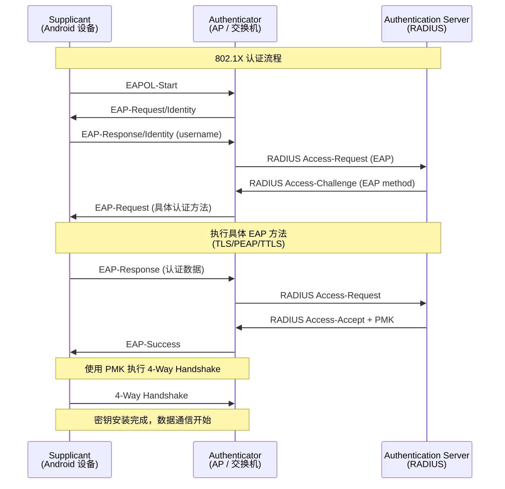
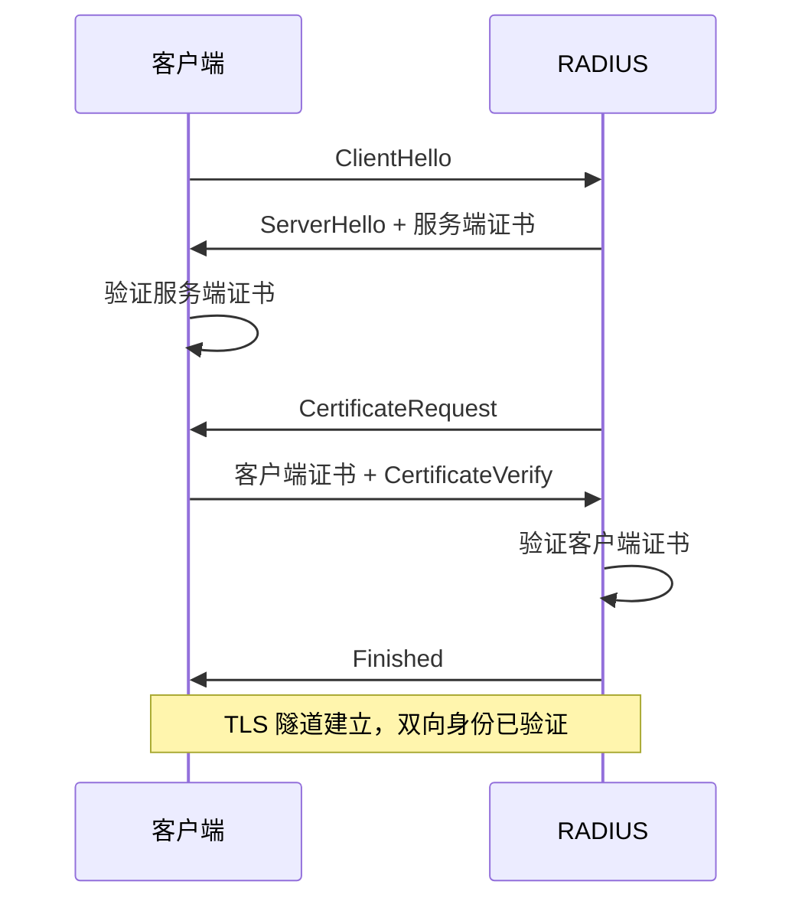
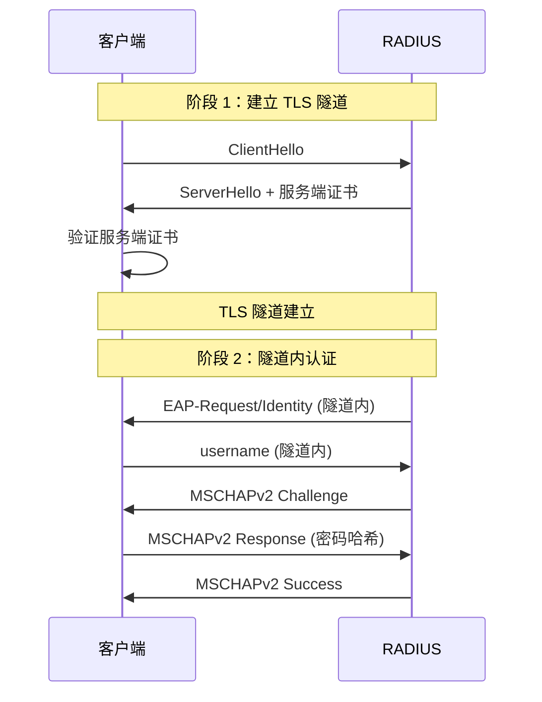

# WiFi 安全与企业网络

## WiFi 安全协议演进

### WEP（已淘汰）

WEP（Wired Equivalent Privacy）是 802.11 最初的安全协议，因存在严重安全漏洞已于 2004 年被正式废弃。

- **密钥长度**：40-bit 或 104-bit
- **漏洞**：RC4 密钥调度算法缺陷，可在数分钟内被破解
- **现状**：Android 不再支持 WEP 连接配置

### WPA / WPA2（PSK / Enterprise）

WPA（Wi-Fi Protected Access）是从 WEP 到 WPA2 的过渡方案，WPA2 是目前最广泛使用的安全协议：

| 特性 | WPA | WPA2 |
|------|-----|------|
| 加密算法 | TKIP | AES-CCMP |
| 密钥协商 | 4-Way Handshake | 4-Way Handshake |
| 认证模式 | PSK / Enterprise | PSK / Enterprise |
| 安全性 | TKIP 已有已知漏洞 | 目前仍安全（PSK 受暴力破解威胁） |

**两种认证模式**：
- **PSK（Pre-Shared Key）**：预共享密钥，家庭和小型办公室使用
- **Enterprise（802.1X）**：每用户独立凭证，通过 RADIUS 服务器认证

### WPA3（SAE / Enterprise）

WPA3 于 2018 年发布，在 WPA2 基础上增强了安全性：

| 特性 | WPA2-PSK | WPA3-SAE |
|------|----------|----------|
| 密钥交换 | 4-Way Handshake（PSK 直接参与） | SAE（Simultaneous Authentication of Equals） |
| 离线字典攻击 | **易受攻击** | **免疫**（每次交互独立） |
| 前向保密 | 不支持 | 支持（历史流量无法解密） |
| 密码强度依赖 | 弱密码容易被破解 | 弱密码也有较好保护 |
| 握手保护 | 无 | PMF（Protected Management Frames）强制启用 |

WPA3-Enterprise 增强：
- 强制 192-bit 安全套件（CNSA Suite）
- 要求使用 GCMP-256 / HMAC-SHA384
- 适合政府和高安全要求场景

### 各协议安全性对比表

| 协议 | 安全等级 | 加密 | 认证 | Android 支持 | 推荐 |
|------|---------|------|------|-------------|------|
| WEP | 极低 | RC4 | 共享密钥 | 已移除 | 禁止使用 |
| WPA-PSK | 低 | TKIP | PSK | 支持 | 不推荐 |
| WPA2-PSK | 中 | AES-CCMP | PSK | 支持 | 可用 |
| WPA2-Enterprise | 高 | AES-CCMP | 802.1X | 支持 | 推荐 |
| WPA3-SAE | 高 | AES-CCMP/GCMP | SAE | API 29+ | 推荐 |
| WPA3-Enterprise | 极高 | GCMP-256 | 802.1X-SHA384 | API 29+ | 企业推荐 |

> **Android WPA3 支持**：Android 10 (API 29) 开始支持 WPA3-SAE。可通过 `ScanResult.capabilities` 中包含 `SAE` 判断 AP 是否支持 WPA3。

## 802.1X 认证流程

802.1X 是企业 WiFi 认证的标准框架，涉及三个角色：



### EAP 协议框架

EAP（Extensible Authentication Protocol）是一个认证框架，支持多种具体认证方法：

| EAP 方法 | 客户端证书 | 服务端证书 | 用户密码 | 安全性 |
|---------|-----------|-----------|---------|--------|
| EAP-TLS | 需要 | 需要 | 不需要 | 最高 |
| EAP-PEAP | 不需要 | 需要 | 需要 | 高 |
| EAP-TTLS | 不需要 | 需要 | 需要 | 高 |
| EAP-SIM | SIM 卡 | — | — | 高 |
| EAP-AKA | USIM 卡 | — | — | 高 |

### 认证角色与交互

| 角色 | 实体 | 职责 |
|------|------|------|
| Supplicant | Android 设备（wpa_supplicant） | 提供用户凭证 |
| Authenticator | AP / WiFi 控制器 | 中转认证消息，不参与认证逻辑 |
| Authentication Server | RADIUS / FreeRADIUS / NPS | 验证凭证，返回结果 |

## 企业 WiFi 认证方式

### EAP-TLS

最安全的认证方式，基于双向证书认证：



- **优点**：最安全，无密码泄露风险
- **缺点**：需要为每个用户/设备签发和部署证书，管理成本高
- **适用**：高安全要求企业、金融机构

### EAP-PEAP

最常见的企业认证方式，TLS 隧道内传输用户名密码：



- **优点**：部署简单，用户名密码认证，兼容性好
- **缺点**：依赖密码安全性，内层协议（MSCHAPv2）有已知弱点
- **适用**：大多数企业环境

### EAP-TTLS

与 PEAP 类似，但内层认证方法更灵活：

- 支持 PAP、CHAP、MSCHAPv2、EAP 等多种内层协议
- PEAP 仅支持 EAP 类内层协议
- 部分 Android 版本对 EAP-TTLS 的支持不如 PEAP 完善

### 认证方式对比表

| 特性 | EAP-TLS | EAP-PEAP | EAP-TTLS |
|------|---------|----------|----------|
| 客户端证书 | 必须 | 不需要 | 不需要 |
| 服务端证书 | 必须 | 必须 | 必须 |
| 内层认证 | — | MSCHAPv2 | PAP/CHAP/MSCHAPv2 |
| 安全性 | 最高 | 高 | 高 |
| 部署复杂度 | 高（PKI 基础设施） | 低 | 中 |
| Android 兼容性 | 好 | 最好 | 一般 |
| 用户体验 | 证书安装较复杂 | 输入用户名密码 | 输入用户名密码 |

## WifiEnterpriseConfig 配置实战

### 基本配置模板

```kotlin
val enterpriseConfig = WifiEnterpriseConfig().apply {
    identity = "user@company.com"    // 用户标识
    anonymousIdentity = "anonymous"  // 匿名外层标识（保护隐私）
    // eapMethod 和认证细节在下面各方法中设置
}
```

### EAP-TLS 配置示例

```kotlin
fun createEapTlsConfig(
    identity: String,
    caCert: X509Certificate,
    clientCert: X509Certificate,
    clientKey: PrivateKey
): WifiEnterpriseConfig {
    return WifiEnterpriseConfig().apply {
        eapMethod = WifiEnterpriseConfig.Eap.TLS
        this.identity = identity
        caCertificate = caCert
        setClientKeyEntry(clientKey, clientCert)
        // Android 11+ 可设置域名验证
        if (Build.VERSION.SDK_INT >= Build.VERSION_CODES.R) {
            domainSuffixMatch = "radius.company.com"
        }
    }
}
```

### EAP-PEAP 配置示例

```kotlin
fun createEapPeapConfig(
    identity: String,
    password: String,
    caCert: X509Certificate? = null
): WifiEnterpriseConfig {
    return WifiEnterpriseConfig().apply {
        eapMethod = WifiEnterpriseConfig.Eap.PEAP
        phase2Method = WifiEnterpriseConfig.Phase2.MSCHAPV2
        this.identity = identity
        this.password = password
        anonymousIdentity = "anonymous"

        if (caCert != null) {
            caCertificate = caCert
        }

        // 域名验证（强烈建议设置，防止中间人攻击）
        if (Build.VERSION.SDK_INT >= Build.VERSION_CODES.R) {
            domainSuffixMatch = "radius.company.com"
        }
    }
}

// 使用 WifiNetworkSuggestion 连接企业 WiFi
fun suggestEnterpriseNetwork(ssid: String, config: WifiEnterpriseConfig) {
    val suggestion = WifiNetworkSuggestion.Builder()
        .setSsid(ssid)
        .setWpa2EnterpriseConfig(config)
        .build()

    val wifiManager = context.getSystemService(Context.WIFI_SERVICE) as WifiManager
    wifiManager.addNetworkSuggestions(listOf(suggestion))
}
```

### 常见配置错误

| 错误 | 表现 | 解决方案 |
|------|------|---------|
| 未设置 CA 证书 | 安全警告或连接被拒 | 设置 `caCertificate` 或使用系统证书 |
| domain 不匹配 | `SSL_ERROR` / 证书验证失败 | 设置正确的 `domainSuffixMatch` |
| phase2 方法错误 | 内层认证失败 | 确认 RADIUS 配置的 Phase2 方法 |
| identity 格式错误 | 用户名不被 RADIUS 接受 | 确认格式（user / user@domain / DOMAIN\user） |
| 客户端证书过期 | EAP-TLS 认证失败 | 更新客户端证书 |

## 证书管理

### 证书安装方式

| 方式 | 适用场景 | 用户感知 | 权限要求 |
|------|---------|---------|---------|
| `KeyChain.createInstallIntent()` | 引导用户手动安装 | 需要用户确认 | 无 |
| `DevicePolicyManager` | MDM 管理设备批量部署 | 静默安装 | 设备管理员 |
| WiFi Profile 推送 | 通过配置 Profile 下发 | 用户确认 Profile | MDM |
| adb 安装 | 调试和测试 | — | adb access |

```kotlin
// 引导用户安装 CA 证书
fun installCaCertificate(certBytes: ByteArray) {
    val intent = KeyChain.createInstallIntent()
    intent.putExtra(KeyChain.EXTRA_CERTIFICATE, certBytes)
    intent.putExtra(KeyChain.EXTRA_NAME, "CompanyCA")
    context.startActivity(intent)
}
```

### 系统证书 vs 用户证书

| 类型 | 存储位置 | 信任范围 | 安装方式 |
|------|---------|---------|---------|
| 系统证书 | `/system/etc/security/cacerts/` | 全系统信任 | 预装 / root 安装 |
| 用户证书 | `/data/misc/user/0/cacerts-added/` | 用户安装的额外信任 | KeyChain API |

> **Android 7.0+ 变化**：以 API 24+ 为目标的应用默认不信任用户安装的 CA 证书。需要在 `network_security_config.xml` 中显式声明信任。

```xml
<!-- res/xml/network_security_config.xml -->
<network-security-config>
    <base-config>
        <trust-anchors>
            <certificates src="system" />
            <certificates src="user" />  <!-- 信任用户证书 -->
        </trust-anchors>
    </base-config>
</network-security-config>
```

### 证书过期处理

```kotlin
fun checkCertificateExpiry(cert: X509Certificate): CertStatus {
    val now = Date()
    return when {
        now.after(cert.notAfter) -> CertStatus.EXPIRED
        now.before(cert.notBefore) -> CertStatus.NOT_YET_VALID
        else -> {
            val daysRemaining = (cert.notAfter.time - now.time) / (1000 * 60 * 60 * 24)
            if (daysRemaining < 30) CertStatus.EXPIRING_SOON(daysRemaining)
            else CertStatus.VALID
        }
    }
}

sealed class CertStatus {
    object VALID : CertStatus()
    object EXPIRED : CertStatus()
    object NOT_YET_VALID : CertStatus()
    data class EXPIRING_SOON(val daysRemaining: Long) : CertStatus()
}
```

### Android 各版本证书行为差异

| 版本 | 变更 | 影响 |
|------|------|------|
| 7.0 | 默认不信任用户 CA 证书 | 需要 `network_security_config` |
| 11 | 支持 `domainSuffixMatch` 和 `altSubjectMatch` | 增强证书验证 |
| 12 | 用户 CA 证书安装需要设备锁屏 | 无锁屏设备无法安装 |
| 13 | WiFi CA 证书可在 WiFi 设置中直接管理 | 用户体验改善 |

## 企业 WiFi 常见连接失败原因

### 证书相关

| 问题 | 表现 | 排查 |
|------|------|------|
| CA 证书未安装 | 连接失败，提示安全警告 | 安装正确的 CA 证书 |
| CA 证书过期 | TLS 握手失败 | 更新 CA 证书 |
| 客户端证书过期 | EAP-TLS 认证失败 | 续期客户端证书 |
| 证书链不完整 | 中间 CA 验证失败 | 安装完整证书链 |

### 认证配置相关

| 问题 | 表现 | 排查 |
|------|------|------|
| EAP 方法不匹配 | 认证协商失败 | 确认 AP 和客户端 EAP 方法一致 |
| Phase2 方法错误 | 内层认证失败 | PEAP 通常用 MSCHAPv2 |
| Identity 格式错误 | RADIUS 拒绝请求 | 确认用户名格式 |
| 密码错误 | MSCHAPv2 失败 | 重新输入密码 |

### 服务端兼容性相关

| 问题 | 表现 | 排查 |
|------|------|------|
| RADIUS 不支持该 EAP 方法 | 认证方法协商失败 | 确认 RADIUS 配置 |
| TLS 版本不兼容 | TLS 握手失败 | 检查 TLS 1.2/1.3 支持 |
| RADIUS 证书使用旧算法 | Android 拒绝不安全算法 | 更新 RADIUS 证书 |

### 排查流程

```bash
# 1. 开启 verbose WiFi 日志
adb shell cmd wifi set-verbose-logging enabled

# 2. 重新连接并抓取日志
adb logcat -s wpa_supplicant ClientModeImpl WifiEnterprise

# 3. 关注关键日志
# "EAP-TLS: Failed to initialize" → 证书问题
# "EAP-PEAP: Phase 2 authentication failed" → 密码或 Phase2 配置
# "SSL: SSL3 alert: certificate unknown" → CA 证书未信任
# "CTRL-EVENT-EAP-FAILURE" → EAP 认证失败
```

## Passpoint / Hotspot 2.0

### Passpoint 概述与优势

Passpoint（Hotspot 2.0）是 WiFi Alliance 推出的自动安全连接标准，类似蜂窝网络的漫游体验：

| 特性 | 传统 WiFi | Passpoint |
|------|----------|-----------|
| 连接方式 | 手动选择 SSID + 输入密码 | 自动发现并安全连接 |
| 安全性 | PSK（密码可能共享） | WPA2/WPA3 Enterprise |
| 漫游 | 不支持 | 支持运营商间漫游 |
| 认证方式 | 密码 | SIM / 证书 / 用户凭证 |

### Android Passpoint API

```kotlin
// 安装 Passpoint 配置 (API 26+)
fun installPasspointConfig(
    fqdn: String,
    friendlyName: String,
    credential: Credential
) {
    val config = PasspointConfiguration().apply {
        homeSp = HomeSp().apply {
            this.fqdn = fqdn
            this.friendlyName = friendlyName
        }
        this.credential = credential
    }

    val wifiManager = context.getSystemService(Context.WIFI_SERVICE) as WifiManager
    wifiManager.addOrUpdatePasspointConfiguration(config)
}

// 移除 Passpoint 配置
fun removePasspointConfig(fqdn: String) {
    val wifiManager = context.getSystemService(Context.WIFI_SERVICE) as WifiManager
    wifiManager.removePasspointConfiguration(fqdn)
}
```

### 运营商 WiFi Offload

运营商可以通过 Passpoint 实现 WiFi Offload，将蜂窝流量卸载到 WiFi：
- 减少蜂窝网络拥塞
- 用户无感知自动连接
- 使用 SIM 认证（EAP-SIM / EAP-AKA）

## 踩坑记录

> 此区域供团队成员补充项目中遇到的真实案例。

| 日期 | 记录人 | 问题描述 | 解决方案 |
|------|--------|----------|----------|
| | | | |

## 参考资料

- [WPA3 Specification - WiFi Alliance](https://www.wi-fi.org/discover-wi-fi/security)
- [WifiEnterpriseConfig - Android Developers](https://developer.android.com/reference/android/net/wifi/WifiEnterpriseConfig)
- [802.1X Overview - IEEE](https://1.ieee802.org/security/802-1x/)
- [EAP Methods - RFC 3748](https://tools.ietf.org/html/rfc3748)
- [Android Network Security Config](https://developer.android.com/training/articles/security-config)
- [Passpoint - WiFi Alliance](https://www.wi-fi.org/discover-wi-fi/passpoint)
- [性能优化与信号调优](10-性能优化与信号调优performance-and-signal-tuning.md) — 本模块下一篇
