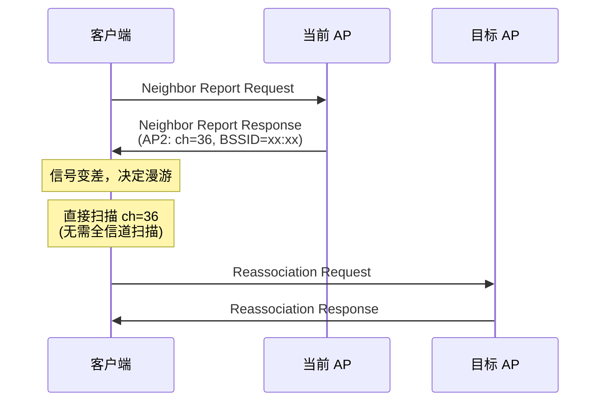
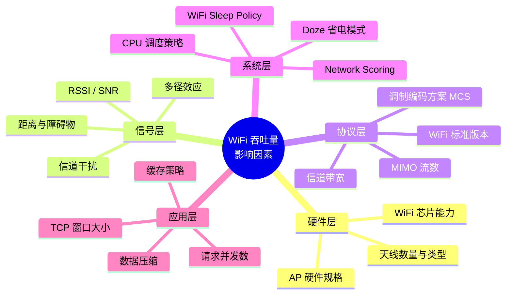

# 性能优化与信号调优

## RSSI / LinkSpeed / Frequency 实时监控

### WifiInfo 关键指标获取

```kotlin
class WifiMetricsCollector(private val context: Context) {
    private val wifiManager = context.getSystemService(Context.WIFI_SERVICE) as WifiManager

    data class WifiMetrics(
        val rssi: Int,               // dBm
        val linkSpeed: Int,          // Mbps
        val txLinkSpeed: Int,        // Mbps (API 29+)
        val rxLinkSpeed: Int,        // Mbps (API 29+)
        val frequency: Int,          // MHz
        val signalLevel: Int,        // 0-4
        val wifiStandard: Int,       // WIFI_STANDARD_XX (API 30+)
        val ssid: String,
        val bssid: String
    )

    fun collect(): WifiMetrics {
        val info = wifiManager.connectionInfo
        return WifiMetrics(
            rssi = info.rssi,
            linkSpeed = info.linkSpeed,
            txLinkSpeed = if (Build.VERSION.SDK_INT >= 29) info.txLinkSpeedMbps else -1,
            rxLinkSpeed = if (Build.VERSION.SDK_INT >= 29) info.rxLinkSpeedMbps else -1,
            frequency = info.frequency,
            signalLevel = WifiManager.calculateSignalLevel(info.rssi, 5),
            wifiStandard = if (Build.VERSION.SDK_INT >= 30) info.wifiStandard else -1,
            ssid = info.ssid ?: "<unknown>",
            bssid = info.bssid ?: "<unknown>"
        )
    }
}
```

### 监控方案设计

两种主要监控方式的对比：

| 方式 | 实现 | 频率 | 优点 | 缺点 |
|------|------|------|------|------|
| 轮询 WifiInfo | Timer/Handler 定期读取 | 自定义（建议 3-5s） | 简单可控 | 无效查询、耗电 |
| NetworkCallback | `onCapabilitiesChanged` | 系统触发（~3-5s） | 按需触发、省电 | 频率不可控 |

推荐使用 NetworkCallback 方案：

```kotlin
class WifiSignalMonitor(context: Context) {
    private val connectivityManager = context.getSystemService(Context.CONNECTIVITY_SERVICE)
        as ConnectivityManager

    private val callback = object : ConnectivityManager.NetworkCallback() {
        override fun onCapabilitiesChanged(
            network: Network,
            capabilities: NetworkCapabilities
        ) {
            val rssi = capabilities.signalStrength
            val downBandwidth = capabilities.linkDownstreamBandwidthKbps
            val upBandwidth = capabilities.linkUpstreamBandwidthKbps

            onMetricsUpdated(rssi, downBandwidth, upBandwidth)
        }
    }

    var onMetricsUpdated: (rssi: Int, downKbps: Int, upKbps: Int) -> Unit = { _, _, _ -> }

    fun start() {
        val request = NetworkRequest.Builder()
            .addTransportType(NetworkCapabilities.TRANSPORT_WIFI)
            .build()
        connectivityManager.registerNetworkCallback(request, callback)
    }

    fun stop() {
        connectivityManager.unregisterNetworkCallback(callback)
    }
}
```

### 信号质量评估模型

综合多个指标评估 WiFi 质量：

```kotlin
enum class WifiQuality { EXCELLENT, GOOD, FAIR, POOR, UNUSABLE }

fun evaluateWifiQuality(
    rssi: Int,
    linkSpeedMbps: Int,
    txBadRate: Float  // 发送失败率 (0.0 ~ 1.0)
): WifiQuality {
    val rssiScore = when {
        rssi >= -50 -> 5
        rssi >= -60 -> 4
        rssi >= -70 -> 3
        rssi >= -80 -> 2
        else -> 1
    }

    val speedScore = when {
        linkSpeedMbps >= 200 -> 5
        linkSpeedMbps >= 100 -> 4
        linkSpeedMbps >= 54 -> 3
        linkSpeedMbps >= 24 -> 2
        else -> 1
    }

    val lossScore = when {
        txBadRate < 0.01 -> 5
        txBadRate < 0.05 -> 4
        txBadRate < 0.10 -> 3
        txBadRate < 0.20 -> 2
        else -> 1
    }

    val totalScore = rssiScore * 0.5 + speedScore * 0.3 + lossScore * 0.2

    return when {
        totalScore >= 4.5 -> WifiQuality.EXCELLENT
        totalScore >= 3.5 -> WifiQuality.GOOD
        totalScore >= 2.5 -> WifiQuality.FAIR
        totalScore >= 1.5 -> WifiQuality.POOR
        else -> WifiQuality.UNUSABLE
    }
}
```

## 漫游优化

漫游（Roaming）是设备在多个 AP 覆盖区域移动时自动切换 AP 的过程。快速无缝漫游对移动场景至关重要。

### 802.11r（Fast BSS Transition）

802.11r 通过预认证大幅减少漫游延迟：

| 特性 | 普通漫游 | 802.11r 快速漫游 |
|------|---------|----------------|
| 漫游耗时 | 200-500ms | 20-50ms |
| 重新认证 | 完整 4-Way Handshake | 仅 2 次消息交换 |
| 密钥层级 | PMK → PTK | PMK-R0 → PMK-R1 → PTK |
| 用户感知 | 可能有短暂中断 | 几乎无感知 |

### 802.11k（Neighbor Report）

802.11k 允许 AP 向客户端提供邻居 AP 列表，加速漫游扫描：



- **优势**：避免全信道扫描，缩短漫游准备时间
- **依赖**：AP 侧必须支持并启用

### 802.11v（BSS Transition Management）

802.11v 允许 AP 主动建议客户端迁移到更合适的 AP：

- AP 可以基于负载均衡发送 BTM（BSS Transition Management）请求
- 客户端可以选择接受或拒绝建议
- 避免了客户端"粘"在信号差的 AP 上不肯漫游

### Android 对漫游协议的支持情况

| 协议 | Android 支持 | 芯片依赖 | 说明 |
|------|-------------|---------|------|
| 802.11r | Android 8.0+ | 芯片/驱动支持 | 由 wpa_supplicant 和驱动协同 |
| 802.11k | Android 8.0+ | 芯片/驱动支持 | Framework 可查询支持状态 |
| 802.11v | Android 8.0+ | 芯片/驱动支持 | BTM 处理在 wpa_supplicant |

```kotlin
// 检查设备是否支持漫游协议 (需要反射或 dumpsys)
// 标准 API 不直接暴露此信息
// 可通过 dumpsys wifi 查看：
// "11k supported: true"
// "11r supported: true"
// "11v supported: true"
```

### 漫游触发条件与调优

系统触发漫游的典型条件：

| 条件 | 阈值参考 | 说明 |
|------|---------|------|
| RSSI 低于阈值 | -70 ~ -75 dBm | 当前 AP 信号太弱 |
| 目标 AP 信号差值 | > 8-12 dB | 新 AP 明显好于当前 AP |
| 负载均衡 | AP 决定 | 802.11v BTM Request |
| 链路质量下降 | 丢包率上升 | 驱动层检测 |

> **"粘性"问题**：部分设备对当前 AP 有"粘性"，即使信号很差也不漫游。这通常是驱动或 wpa_supplicant 的漫游阈值配置问题，需要在 AP 侧配合 802.11v 解决。

## 信道拥塞检测与优化

### 信道利用率评估

```kotlin
fun analyzeChannelCongestion(scanResults: List<ScanResult>): Map<Int, Int> {
    val channelCount = mutableMapOf<Int, Int>()

    for (result in scanResults) {
        val channel = frequencyToChannel(result.frequency)
        channelCount[channel] = (channelCount[channel] ?: 0) + 1
    }

    return channelCount.toSortedMap()
}

fun frequencyToChannel(freq: Int): Int = when {
    freq in 2412..2484 -> (freq - 2412) / 5 + 1
    freq in 5170..5825 -> (freq - 5170) / 5 + 34
    else -> -1
}
```

### ScanResult 中的频率与信道信息

```kotlin
fun printChannelReport(context: Context) {
    val wifiManager = context.getSystemService(Context.WIFI_SERVICE) as WifiManager
    val results = wifiManager.scanResults

    val channelMap = results.groupBy { frequencyToChannel(it.frequency) }

    for ((channel, aps) in channelMap.toSortedMap()) {
        val strongest = aps.maxByOrNull { it.level }
        println("Channel $channel: ${aps.size} APs, " +
                "strongest=${strongest?.SSID}(${strongest?.level}dBm)")
    }
}
```

### 信道建议与 AP 侧配合

| 策略 | 客户端可做 | AP 侧可做 |
|------|----------|----------|
| 避开拥塞信道 | 扫描分析后建议用户 | 自动信道选择（ACS） |
| 优先 5GHz | 应用内提示用户切换 | Band Steering |
| 避免 DFS 信道 | 无（由 AP 和驱动决定） | 配置排除 DFS 信道 |

## TCP 参数调优

### TCP 窗口大小

TCP 窗口大小直接影响吞吐量，尤其在高延迟网络中：

```
理论最大吞吐 = 窗口大小 / RTT

例: 窗口 64KB, RTT 10ms → 最大 6.4 MB/s ≈ 51.2 Mbps
例: 窗口 64KB, RTT 50ms → 最大 1.28 MB/s ≈ 10.2 Mbps
```

Android 默认 TCP 缓冲区大小在 `/proc/sys/net/ipv4/tcp_rmem` 和 `/proc/sys/net/ipv4/tcp_wmem` 中配置（需 root）。

### Nagle 算法（TCP_NODELAY）

Nagle 算法将小数据包合并发送以减少网络开销，但增加延迟：

```kotlin
val socket = Socket()
socket.tcpNoDelay = true  // 禁用 Nagle，减少延迟

// 适用场景：
// - 实时控制指令（IoT）
// - 交互式应用（远程桌面）
// - 小数据包频繁发送
```

| 设置 | 延迟 | 吞吐量 | 适用场景 |
|------|------|--------|---------|
| TCP_NODELAY = false（默认） | 较高 | 较高 | 大文件传输、批量数据 |
| TCP_NODELAY = true | 最低 | 可能降低 | 实时控制、交互式应用 |

### Socket Buffer 调整

```kotlin
val socket = Socket()
socket.sendBufferSize = 256 * 1024   // 256KB 发送缓冲区
socket.receiveBufferSize = 256 * 1024 // 256KB 接收缓冲区

// OkHttp 中调整
val client = OkHttpClient.Builder()
    .socketFactory(object : SocketFactory() {
        override fun createSocket(): Socket = Socket().apply {
            sendBufferSize = 256 * 1024
            receiveBufferSize = 256 * 1024
        }
        // ... 其他 override
    })
    .build()
```

### Keep-Alive 参数

```kotlin
val socket = Socket()
socket.keepAlive = true
// Android 不暴露 TCP_KEEPIDLE / TCP_KEEPINTVL / TCP_KEEPCNT 设置
// 需要通过 NDK 或 JNI 调用 setsockopt 来设置
```

## 吞吐量基准测试

### iperf3 在 Android 上的使用

iperf3 是网络吞吐量测试的标准工具：

```bash
# 服务端（PC 或服务器）
iperf3 -s -p 5201

# 客户端（Android 设备，通过 adb shell 或 Termux）
# 下载测试
iperf3 -c <server_ip> -p 5201 -t 30

# 上传测试
iperf3 -c <server_ip> -p 5201 -t 30 -R

# 双向同时测试
iperf3 -c <server_ip> -p 5201 -t 30 --bidir

# UDP 测试（指定带宽）
iperf3 -c <server_ip> -p 5201 -u -b 100M -t 30
```

### 测试方法与场景设计

| 测试场景 | iperf3 参数 | 关注指标 |
|----------|-----------|---------|
| 最大下载吞吐 | `-c <ip> -t 30` | Bandwidth (Mbps) |
| 最大上传吞吐 | `-c <ip> -t 30 -R` | Bandwidth (Mbps) |
| UDP 丢包率 | `-c <ip> -u -b 50M -t 30` | Lost/Total Datagrams |
| 延迟测试 | `-c <ip> -u -b 1M -l 64` | Jitter (ms) |
| 多线程吞吐 | `-c <ip> -P 4 -t 30` | Sum Bandwidth |
| 不同距离对比 | 相同参数，不同位置 | Bandwidth 变化曲线 |

### 性能基准参考值

| WiFi 标准 | 信道带宽 | 理论最大 | 实际可达（单流） | 实际可达（2x2 MIMO） |
|-----------|---------|---------|----------------|-------------------|
| WiFi 4 (11n) | 40MHz | 150 Mbps | 50-80 Mbps | 100-150 Mbps |
| WiFi 5 (11ac) | 80MHz | 433 Mbps | 150-300 Mbps | 300-500 Mbps |
| WiFi 5 (11ac) | 160MHz | 866 Mbps | 300-500 Mbps | 500-800 Mbps |
| WiFi 6 (11ax) | 80MHz | 600 Mbps | 200-400 Mbps | 400-700 Mbps |
| WiFi 6 (11ax) | 160MHz | 1200 Mbps | 400-700 Mbps | 700-1100 Mbps |

> **注意**：实际吞吐受距离、干扰、设备能力等多因素影响，通常为理论值的 30-70%。

## 弱信号场景优化

### 弱信号检测阈值

```kotlin
object WifiThresholds {
    const val EXCELLENT = -50    // dBm
    const val GOOD = -60
    const val FAIR = -70
    const val WEAK = -80
    const val UNUSABLE = -90

    fun isWeak(rssi: Int): Boolean = rssi < WEAK
    fun isFair(rssi: Int): Boolean = rssi in WEAK until FAIR
}
```

### 应用层自适应策略

根据信号质量动态调整应用行为：

```kotlin
class AdaptiveNetworkStrategy(
    private val wifiMonitor: WifiSignalMonitor
) {
    fun getStrategy(rssi: Int): NetworkStrategy {
        return when {
            rssi >= -60 -> NetworkStrategy.HighQuality(
                imageQuality = "original",
                syncInterval = 10_000L,
                enablePrefetch = true
            )
            rssi >= -70 -> NetworkStrategy.Normal(
                imageQuality = "medium",
                syncInterval = 30_000L,
                enablePrefetch = false
            )
            rssi >= -80 -> NetworkStrategy.LowBandwidth(
                imageQuality = "thumbnail",
                syncInterval = 60_000L,
                enablePrefetch = false,
                compressRequests = true
            )
            else -> NetworkStrategy.Minimal(
                textOnly = true,
                syncInterval = 300_000L,
                queueNonCriticalRequests = true
            )
        }
    }
}

sealed class NetworkStrategy {
    data class HighQuality(
        val imageQuality: String, val syncInterval: Long, val enablePrefetch: Boolean
    ) : NetworkStrategy()

    data class Normal(
        val imageQuality: String, val syncInterval: Long, val enablePrefetch: Boolean
    ) : NetworkStrategy()

    data class LowBandwidth(
        val imageQuality: String, val syncInterval: Long,
        val enablePrefetch: Boolean, val compressRequests: Boolean
    ) : NetworkStrategy()

    data class Minimal(
        val textOnly: Boolean, val syncInterval: Long, val queueNonCriticalRequests: Boolean
    ) : NetworkStrategy()
}
```

### 弱信号下的 UI 反馈

```kotlin
fun showSignalQualityIndicator(rssi: Int) {
    val (message, severity) = when {
        rssi >= -60 -> "信号良好" to Severity.INFO
        rssi >= -70 -> "信号一般，部分功能可能受影响" to Severity.WARNING
        rssi >= -80 -> "信号较弱，建议靠近路由器" to Severity.ERROR
        else -> "信号极弱，网络可能随时中断" to Severity.CRITICAL
    }

    // 使用 Snackbar 或自定义顶部提示条
    if (severity >= Severity.WARNING) {
        showBanner(message, severity)
    }
}
```

## WiFi 吞吐量影响因素总览



## 踩坑记录

> 此区域供团队成员补充项目中遇到的真实案例。

| 日期 | 记录人 | 问题描述 | 解决方案 |
|------|--------|----------|----------|
| | | | |

## 参考资料

- [802.11r/k/v Overview - Cisco](https://www.cisco.com/c/en/us/td/docs/wireless/controller/technotes/8-3/b_RoamingGuide_83.html)
- [iperf3 Documentation](https://iperf.fr/iperf-doc.php)
- [Android Network Performance - Developers](https://developer.android.com/training/basics/network-ops)
- [TCP Tuning Guide](https://fasterdata.es.net/host-tuning/)
- [调试工具与问题排查](11-调试工具与问题排查debugging-and-troubleshooting.md) — 本模块下一篇
