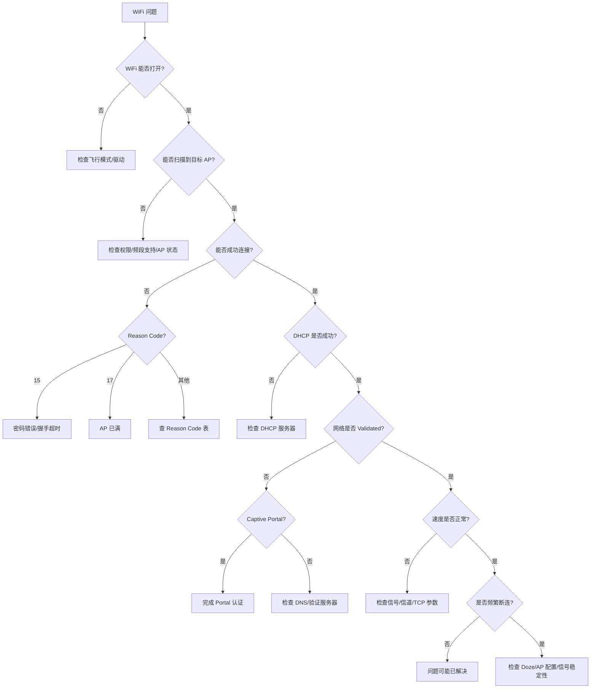

# 调试工具与问题排查

## dumpsys 命令详解

### dumpsys wifi

`dumpsys wifi` 是 Android WiFi 调试最重要的命令，输出系统 WiFi 子系统的完整状态：

```bash
adb shell dumpsys wifi
```

主要输出段落：

| 段落标题 | 内容 | 调试用途 |
|---------|------|---------|
| `Wi-Fi is enabled/disabled` | WiFi 开关状态 | 确认基本状态 |
| `WifiInfo` | 当前连接详情 | RSSI、速度、频率、评分 |
| `Internal state` | ClientModeImpl 状态 | 当前状态机状态 |
| `Latest scan results` | 最近扫描结果 | 环境中 AP 信息 |
| `Configured networks` | 已保存网络列表 | 网络配置是否正确 |
| `Network selection status` | 网络选择状态 | 为何未选某网络 |
| `ConnectionEvent log` | 连接事件日志 | 历史连接成功/失败记录 |
| `WifiScoreReport` | 网络评分记录 | 评分变化趋势 |
| `Recent WifiAware/RTT` | Aware/RTT 状态 | P2P 和定位调试 |
| `Verbose logging` | 详细日志状态 | 是否开启了 verbose |

关键信息提取示例：

```bash
# 仅看当前连接信息
adb shell dumpsys wifi | grep -A 20 "WifiInfo"

# 看连接事件历史
adb shell dumpsys wifi | grep -A 5 "ConnectionEvent"

# 看评分历史
adb shell dumpsys wifi | grep -A 10 "WifiScoreReport"

# 看已保存网络
adb shell dumpsys wifi | grep -A 50 "Configured networks"
```

### dumpsys connectivity

`dumpsys connectivity` 显示所有网络类型的连接状态：

```bash
adb shell dumpsys connectivity
```

关注内容：

| 段落 | 关注点 |
|------|--------|
| `Active default network` | 当前默认网络是 WiFi 还是蜂窝 |
| `NetworkAgentInfo` | 各网络的评分和能力 |
| `NetworkRequests` | 活跃的网络请求 |
| `Default network callbacks` | 注册的 NetworkCallback 列表 |
| `Validated networks` | 已通过验证的网络 |

```bash
# 查看默认网络
adb shell dumpsys connectivity | grep "Active default network"

# 查看所有网络评分
adb shell dumpsys connectivity | grep "score"
```

### dumpsys netstats

`dumpsys netstats` 显示网络流量统计：

```bash
# 查看各 UID 的流量使用
adb shell dumpsys netstats --uid

# 查看各网络接口的流量
adb shell dumpsys netstats --iface
```

## adb shell cmd wifi 命令集

Android 10+ 提供了 `cmd wifi` 命令行工具，功能比旧的 API 更丰富：

### cmd wifi status

```bash
# WiFi 总体状态
adb shell cmd wifi status

# 输出示例:
# Wifi is enabled
# Wifi is connected
# SSID: "MyNetwork"
# BSSID: aa:bb:cc:dd:ee:ff
# RSSI: -55
# Link speed: 433 Mbps
# Frequency: 5180 MHz
```

### cmd wifi list-networks

```bash
# 列出已保存的网络
adb shell cmd wifi list-networks

# 输出示例:
# Network Id | SSID           | Status
# 0          | "HomeNetwork"  | CURRENT
# 1          | "OfficeWifi"   | ENABLED
# 2          | "CafeWifi"     | DISABLED
```

### cmd wifi connect-network

```bash
# 连接到开放网络
adb shell cmd wifi connect-network "SSID" open

# 连接到 WPA2 网络
adb shell cmd wifi connect-network "SSID" wpa2 "password"

# 连接到 WPA3 网络
adb shell cmd wifi connect-network "SSID" wpa3 "password"
```

### cmd wifi set-wifi-enabled

```bash
# 开启 WiFi
adb shell cmd wifi set-wifi-enabled enabled

# 关闭 WiFi
adb shell cmd wifi set-wifi-enabled disabled
```

### 其他常用子命令

```bash
# 开启 verbose 日志（增加 WiFi 日志输出量）
adb shell cmd wifi set-verbose-logging enabled

# 关闭 verbose 日志
adb shell cmd wifi set-verbose-logging disabled

# 触发扫描
adb shell cmd wifi start-scan

# 列出扫描结果
adb shell cmd wifi list-scan-results

# 忘记已保存网络
adb shell cmd wifi forget-network <networkId>

# 查看 WiFi 芯片能力
adb shell cmd wifi get-capabilities
```

## logcat 关键 Tag 与过滤

### WiFi 相关 Tag 汇总表

| Tag | 来源 | 内容 | 重要程度 |
|-----|------|------|---------|
| `wpa_supplicant` | 底层守护进程 | 认证、关联、断连事件 | 极高 |
| `ClientModeImpl` | Framework | 状态机迁移 | 高 |
| `WifiService` | Framework | WifiManager API 调用 | 中 |
| `WifiConnectivityManager` | Framework | 自动连接决策 | 高 |
| `WifiNetworkSelector` | Framework | 网络选择算法 | 高 |
| `WifiScoreReport` | Framework | 网络评分 | 高 |
| `WifiNative` | Framework | 与底层交互 | 中 |
| `DhcpClient` | 网络栈 | DHCP 过程 | 高 |
| `NetworkMonitor` | 网络栈 | 网络验证（Captive Portal） | 高 |
| `ConnectivityService` | Framework | 网络切换决策 | 高 |
| `IpClient` | 网络栈 | IP 配置与维护 | 中 |
| `WifiPermissionsUtil` | Framework | 权限检查 | 低 |

### 组合过滤命令

```bash
# 全面 WiFi 调试日志
adb logcat -s wpa_supplicant:V ClientModeImpl:V WifiConnectivityManager:D \
  WifiNetworkSelector:D WifiScoreReport:D DhcpClient:D NetworkMonitor:D \
  ConnectivityService:D

# 仅看连接/断连事件
adb logcat -s wpa_supplicant:V ClientModeImpl:D

# 仅看 DHCP 过程
adb logcat -s DhcpClient:V IpClient:V

# 仅看网络验证
adb logcat -s NetworkMonitor:V ConnectivityService:D

# 仅看评分和网络切换
adb logcat -s WifiScoreReport:V WifiNetworkSelector:V ConnectivityService:D

# 保存到文件
adb logcat -s wpa_supplicant:V ClientModeImpl:V > wifi_debug.log
```

### 日志级别调整（verbose logging）

开启 verbose logging 可以大幅增加 WiFi 相关日志输出：

```bash
# 方式 1：通过 cmd wifi
adb shell cmd wifi set-verbose-logging enabled

# 方式 2：通过开发者选项
# 设置 → 开发者选项 → WiFi verbose logging → 开启

# 方式 3：通过 setprop（部分设备）
adb shell setprop log.tag.WifiService V
adb shell setprop log.tag.WifiNative V
```

> **注意**：verbose logging 会产生大量日志，可能影响性能。调试完成后记得关闭。

## 网络抓包

### tcpdump 在 Android 上的使用

```bash
# 方式 1：设备上直接抓包（需要 root 或 debug 版本）
adb shell tcpdump -i wlan0 -w /sdcard/capture.pcap

# 方式 2：通过 adb 实时导出
adb shell "tcpdump -i wlan0 -s 0 -w -" > capture.pcap

# 常用过滤参数
adb shell tcpdump -i wlan0 -n port 53           # 仅 DNS
adb shell tcpdump -i wlan0 -n port 67 or port 68 # 仅 DHCP
adb shell tcpdump -i wlan0 -n host 8.8.8.8       # 仅到 8.8.8.8
```

### Wireshark 远程抓包方案

方式 1 — adb 管道实时分析：

```bash
# Linux/Mac
adb shell "tcpdump -i wlan0 -s 0 -w -" | wireshark -k -i -

# Windows (需要 plink 或 adb pipe)
adb shell "tcpdump -i wlan0 -s 0 -w -" | "C:\Program Files\Wireshark\wireshark.exe" -k -i -
```

方式 2 — 先抓后分析：

```bash
# 在设备上抓包
adb shell tcpdump -i wlan0 -w /sdcard/capture.pcap -c 10000

# 导出到 PC
adb pull /sdcard/capture.pcap .

# 用 Wireshark 打开分析
wireshark capture.pcap
```

### 802.11 帧级抓包（Monitor Mode）

标准 Android 设备无法直接进入 Monitor Mode。802.11 帧级抓包的替代方案：

| 方案 | 要求 | 适用场景 |
|------|------|---------|
| 额外 WiFi 网卡 + PC | 支持 Monitor Mode 的 USB 网卡 | 最完整的 802.11 帧分析 |
| 路由器端镜像 | 路由器支持端口镜像 | 已关联后的数据帧 |
| 部分定制内核 | root + 定制 WiFi 驱动 | Nexus/Pixel 部分型号 |

### 抓包分析要点

| 分析目标 | Wireshark 过滤器 | 关注点 |
|---------|-----------------|--------|
| DHCP 过程 | `bootp` | Discover/Offer/Request/ACK 延迟 |
| DNS 解析 | `dns` | 解析耗时、失败查询 |
| TCP 握手 | `tcp.flags.syn==1` | SYN/SYN-ACK 延迟 |
| TCP 重传 | `tcp.analysis.retransmission` | 重传频率和原因 |
| HTTP 验证 | `http.request.uri contains "generate_204"` | Captive Portal 检测 |
| TLS 握手 | `tls.handshake` | 企业 WiFi 证书交换 |

## 常见问题速查表

### 连不上 WiFi

| 可能原因 | 排查方法 | 解决方案 |
|---------|---------|---------|
| 密码错误 | 查看 logcat `reason=15` | 重新输入密码 |
| MAC 被过滤 | 确认 AP MAC 白名单 | 添加设备 MAC 或关闭过滤 |
| AP 连接数已满 | `dumpsys wifi` 看 Status Code | 断开其他设备或扩容 |
| 安全类型不匹配 | 对比 ScanResult.capabilities | 选择正确的安全类型 |
| 权限未授予 | 检查 NEARBY_WIFI_DEVICES | 授予所需权限 |

### 连上后立即断开

| 可能原因 | 排查方法 | 解决方案 |
|---------|---------|---------|
| DHCP 失败 | logcat `DhcpClient` | 检查 DHCP 服务器 |
| 4-Way Handshake 超时 | logcat `reason=15` | 核实密码、检查 AP 兼容性 |
| AP 踢出 | logcat `reason=4/5` | 检查 AP 空闲超时和负载均衡 |
| 网络评分过低 | `dumpsys wifi` 看 Score | 改善信号或禁止自动切网 |

### 已连接但无互联网

| 可能原因 | 排查方法 | 解决方案 |
|---------|---------|---------|
| Captive Portal | `ping 8.8.8.8` 成功但 DNS 被拦截 | 完成 Portal 认证 |
| DNS 不可用 | `ping 8.8.8.8` 成功但域名不可解析 | 手动设置 DNS |
| 验证服务器不可达 | 中国大陆设备 | 替换验证服务器地址 |
| 网关故障 | `ping` 网关失败 | 重启路由器 |

### WiFi 网速极慢

| 可能原因 | 排查方法 | 解决方案 |
|---------|---------|---------|
| 信号弱 | 查看 RSSI | 靠近 AP 或加中继 |
| 信道拥塞 | 扫描结果中同信道 AP 数量 | 切换信道 |
| 2.4GHz 干扰 | 确认频率 | 切换到 5GHz |
| LinkSpeed 低 | `dumpsys wifi` 看 LinkSpeed | 可能是协商降速 |
| TCP 窗口太小 | iperf3 测试 | 调整 TCP 参数 |

### 频繁断连

| 可能原因 | 排查方法 | 解决方案 |
|---------|---------|---------|
| Doze 模式 | 灭屏后断连，亮屏恢复 | WifiLock + 前台服务 |
| 信号波动 | RSSI 日志忽高忽低 | 改善天线/AP 位置 |
| AP 负载均衡 | `reason=5` | 关闭 AP 负载均衡或调整阈值 |
| 驱动 bug | dmesg 有 wlan 错误 | 更新固件/驱动 |

### WiFi 开关无法打开

| 可能原因 | 排查方法 | 解决方案 |
|---------|---------|---------|
| 飞行模式 | 检查飞行模式设置 | 关闭飞行模式 |
| 驱动加载失败 | `dmesg | grep wlan` | 重启设备 |
| 系统异常 | logcat `WifiService` | 恢复出厂/刷机 |

### 5GHz WiFi 搜不到

| 可能原因 | 排查方法 | 解决方案 |
|---------|---------|---------|
| 设备不支持 5GHz | `WifiManager.is5GHzBandSupported()` | 硬件不支持，无解 |
| AP 未开启 5GHz | AP 管理页面确认 | 开启 5GHz 频段 |
| DFS 信道规避 | 扫描结果频率分布 | AP 切换到非 DFS 信道 |
| 国家码限制 | 设备区域设置 | 确认国家码与信道匹配 |

## 排查总流程图



## 自动化诊断脚本

### WiFi 状态采集脚本

```bash
#!/bin/bash
# wifi_diagnostics.sh - WiFi 诊断信息一键采集

OUTPUT_DIR="/sdcard/wifi_diag_$(date +%Y%m%d_%H%M%S)"
mkdir -p "$OUTPUT_DIR"

echo "=== WiFi 诊断信息采集 ==="

# 基本状态
echo "[1/7] 采集 WiFi 状态..."
dumpsys wifi > "$OUTPUT_DIR/dumpsys_wifi.txt"

echo "[2/7] 采集网络连接状态..."
dumpsys connectivity > "$OUTPUT_DIR/dumpsys_connectivity.txt"

echo "[3/7] 采集网络统计..."
dumpsys netstats --uid > "$OUTPUT_DIR/dumpsys_netstats.txt"

echo "[4/7] 采集 IP 配置..."
ip addr show wlan0 > "$OUTPUT_DIR/ip_addr.txt" 2>&1
ip route show > "$OUTPUT_DIR/ip_route.txt" 2>&1

echo "[5/7] 采集 DNS 配置..."
getprop | grep dns > "$OUTPUT_DIR/dns_config.txt"

echo "[6/7] 网络连通性测试..."
{
    echo "--- ping gateway ---"
    ping -c 5 -W 2 $(ip route | grep default | awk '{print $3}') 2>&1

    echo "--- ping 8.8.8.8 ---"
    ping -c 5 -W 2 8.8.8.8 2>&1

    echo "--- DNS resolve ---"
    nslookup www.baidu.com 2>&1
} > "$OUTPUT_DIR/connectivity_test.txt"

echo "[7/7] 采集系统属性..."
getprop | grep -i wifi > "$OUTPUT_DIR/wifi_props.txt"

echo "=== 采集完成: $OUTPUT_DIR ==="
```

使用方式：

```bash
adb push wifi_diagnostics.sh /sdcard/
adb shell sh /sdcard/wifi_diagnostics.sh
adb pull /sdcard/wifi_diag_* .
```

### 批量日志分析脚本

```bash
#!/bin/bash
# analyze_wifi_log.sh - 从 logcat 日志中提取 WiFi 关键事件

LOG_FILE=$1

if [ -z "$LOG_FILE" ]; then
    echo "Usage: $0 <logcat_file>"
    exit 1
fi

echo "=== WiFi 事件分析报告 ==="
echo ""

echo "--- 连接事件 ---"
grep "CTRL-EVENT-CONNECTED" "$LOG_FILE" | tail -20

echo ""
echo "--- 断连事件 ---"
grep "CTRL-EVENT-DISCONNECTED" "$LOG_FILE" | tail -20

echo ""
echo "--- DHCP 事件 ---"
grep "DhcpClient" "$LOG_FILE" | grep -E "TIMEOUT|DHCPACK|DHCPNAK" | tail -20

echo ""
echo "--- 网络切换 ---"
grep "Switching default network" "$LOG_FILE" | tail -10

echo ""
echo "--- 评分变化 ---"
grep "WifiScoreReport" "$LOG_FILE" | grep "score=" | tail -20

echo ""
echo "--- 认证失败 ---"
grep -E "EAP-FAILURE|AUTH_FAILED|WRONG_KEY" "$LOG_FILE" | tail -10

echo ""
echo "--- 统计 ---"
echo "连接次数: $(grep -c 'CTRL-EVENT-CONNECTED' "$LOG_FILE")"
echo "断连次数: $(grep -c 'CTRL-EVENT-DISCONNECTED' "$LOG_FILE")"
echo "DHCP 超时: $(grep -c 'TIMEOUT' "$LOG_FILE")"
```

### 一键诊断报告生成

```bash
#!/bin/bash
# wifi_report.sh - 生成可读的 WiFi 诊断报告

echo "======================================"
echo "  WiFi 诊断报告"
echo "  生成时间: $(date)"
echo "  设备: $(getprop ro.product.model)"
echo "  Android: $(getprop ro.build.version.release)"
echo "======================================"
echo ""

# 当前连接状态
echo "【当前连接状态】"
cmd wifi status 2>/dev/null || echo "cmd wifi 不可用"
echo ""

# 信号质量
RSSI=$(dumpsys wifi | grep "RSSI:" | head -1 | awk '{print $2}')
SPEED=$(dumpsys wifi | grep "Link speed:" | head -1 | awk '{print $3}')
FREQ=$(dumpsys wifi | grep "Frequency:" | head -1 | awk '{print $2}')
SCORE=$(dumpsys wifi | grep "Score:" | head -1 | awk '{print $2}')

echo "【信号质量】"
echo "  RSSI: $RSSI dBm"
echo "  链路速度: $SPEED Mbps"
echo "  频率: $FREQ MHz"
echo "  评分: $SCORE"
echo ""

# 网络连通性
echo "【网络连通性】"
GATEWAY=$(ip route | grep default | awk '{print $3}')
echo -n "  网关($GATEWAY): "
ping -c 1 -W 2 "$GATEWAY" > /dev/null 2>&1 && echo "可达" || echo "不可达"
echo -n "  DNS(8.8.8.8): "
ping -c 1 -W 2 8.8.8.8 > /dev/null 2>&1 && echo "可达" || echo "不可达"
echo -n "  域名解析: "
nslookup www.baidu.com > /dev/null 2>&1 && echo "正常" || echo "失败"
echo ""

# 环境扫描
echo "【周围 AP 数量】"
TOTAL_AP=$(dumpsys wifi | grep -c "SSID:")
echo "  扫描到 $TOTAL_AP 个 AP"
echo ""

echo "======================================"
echo "  报告生成完毕"
echo "======================================"
```

## 踩坑记录

> 此区域供团队成员补充项目中遇到的真实案例。

| 日期 | 记录人 | 问题描述 | 解决方案 |
|------|--------|----------|----------|
| | | | |

## 参考资料

- [Android WiFi Debug - AOSP](https://source.android.com/docs/core/connect/wifi-debug)
- [dumpsys 命令参考 - Android Developers](https://developer.android.com/studio/command-line/dumpsys)
- [Wireshark WiFi 分析指南](https://www.wireshark.org/docs/wsug_html_chunked/ChapterWireless.html)
- [tcpdump 手册](https://www.tcpdump.org/manpages/tcpdump.1.html)
- [adb shell cmd wifi - AOSP](https://source.android.com/docs/core/connect/wifi-debug#command-line)
