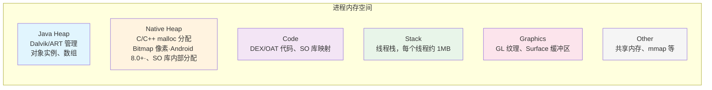

# 内存优化

## Android 内存模型

Android 进程的内存空间由多个区域组成，理解各分区是优化的基础：



各分区要点：

| 分区 | 管理方 | GC 覆盖 | 常见增长原因 |
|------|--------|---------|-------------|
| Java Heap | ART 虚拟机 | 是 | 对象泄漏、大数组、缓存未限大小 |
| Native Heap | libc malloc | 否 | Bitmap（8.0+）、JNI 分配、SO 库 |
| Code | 系统映射 | 否 | 过多 DEX 类、大量 SO 库 |
| Stack | 系统 | 否 | 线程数过多（每线程 ~1MB） |
| Graphics | GPU 驱动 | 否 | 大纹理、多 Surface |

## 内存问题分类

### 内存泄漏

对象在逻辑上已不再需要，但由于被 GC Root 直接或间接引用而无法回收。

**常见泄漏场景：**

#### 1. Activity 泄漏

```kotlin
// ❌ 错误示范：静态变量持有 Activity 引用
companion object {
    var leakedActivity: Activity? = null
}

override fun onCreate(savedInstanceState: Bundle?) {
    super.onCreate(savedInstanceState)
    leakedActivity = this // Activity 销毁后仍被静态引用持有
}
```

```kotlin
// ✅ 正确做法：及时置空或使用 WeakReference
override fun onDestroy() {
    super.onDestroy()
    leakedActivity = null
}

// 或使用弱引用
companion object {
    var activityRef: WeakReference<Activity>? = null
}
```

#### 2. 单例持有 Context

```kotlin
// ❌ 错误示范：单例持有 Activity Context
class AppManager private constructor(val context: Context) {
    companion object {
        @Volatile
        private var instance: AppManager? = null

        fun init(context: Context): AppManager {
            return instance ?: synchronized(this) {
                instance ?: AppManager(context).also { instance = it }
            }
        }
    }
}
// 如果传入 Activity Context，会导致 Activity 无法回收
```

```kotlin
// ✅ 正确做法：单例始终使用 Application Context
fun init(context: Context): AppManager {
    return instance ?: synchronized(this) {
        instance ?: AppManager(context.applicationContext).also { instance = it }
    }
}
```

#### 3. Handler 泄漏

```kotlin
// ❌ 错误示范：匿名内部类 Handler 隐式持有外部 Activity
class MyActivity : AppCompatActivity() {
    private val handler = object : Handler(Looper.getMainLooper()) {
        override fun handleMessage(msg: Message) {
            // 隐式持有 MyActivity.this
            updateUI()
        }
    }
}
```

```kotlin
// ✅ 正确做法：静态内部类 + WeakReference，或直接用 lifecycleScope
class MyActivity : AppCompatActivity() {

    override fun onCreate(savedInstanceState: Bundle?) {
        super.onCreate(savedInstanceState)
        // 推荐：使用协程替代 Handler，自动跟随生命周期取消
        lifecycleScope.launch {
            delay(5000)
            updateUI()
        }
    }
}
```

#### 4. 匿名内部类 / Lambda 持有外部引用

```kotlin
// ❌ 错误示范：注册监听器未反注册
class MyActivity : AppCompatActivity() {
    override fun onCreate(savedInstanceState: Bundle?) {
        super.onCreate(savedInstanceState)
        EventBus.getDefault().register(this)
    }
    // 忘记在 onDestroy 中 unregister → Activity 泄漏
}
```

```kotlin
// ✅ 正确做法：配对注册/反注册
override fun onDestroy() {
    super.onDestroy()
    EventBus.getDefault().unregister(this)
}
```

### 内存抖动

短时间内大量创建并丢弃临时对象，触发频繁 GC，造成 UI 卡顿。

**典型场景：**

- `onDraw()` 中创建 `Paint`、`Rect` 对象
- 循环体内字符串拼接（`+` 操作产生大量中间 String）
- 高频回调中创建临时集合

```kotlin
// ❌ 错误示范：onDraw 中频繁创建对象
override fun onDraw(canvas: Canvas) {
    val paint = Paint()       // 每帧创建，触发内存抖动
    val rect = RectF(0f, 0f, width.toFloat(), height.toFloat())
    canvas.drawRoundRect(rect, 10f, 10f, paint)
}

// ✅ 正确做法：将对象提升为成员变量，复用
private val paint = Paint(Paint.ANTI_ALIAS_FLAG)
private val rect = RectF()

override fun onDraw(canvas: Canvas) {
    rect.set(0f, 0f, width.toFloat(), height.toFloat())
    canvas.drawRoundRect(rect, 10f, 10f, paint)
}
```

### 内存溢出（OOM）

Java Heap 或 Native 内存超过进程限制时触发 `OutOfMemoryError`。

**常见触发源：**

- 加载未压缩的大 Bitmap（一张 4000x3000 ARGB_8888 图片 ≈ 48MB）
- 未限大小的内存缓存
- 大量线程创建（每个线程栈 ~1MB）

## 检测工具与方法

### LeakCanary 集成与使用

```kotlin
// build.gradle.kts
dependencies {
    // 仅在 debug 包中引入，release 自动空实现
    debugImplementation("com.squareup.leakcanary:leakcanary-android:2.14")
}
```

集成后无需任何代码，LeakCanary 会自动：
1. 监控 Activity、Fragment、ViewModel、View、Service 的销毁
2. 检测销毁后 5 秒内对象是否被 GC 回收
3. 未回收时自动 dump hprof 并分析引用链
4. 通过通知栏展示泄漏详情

**自定义监控对象：**

```kotlin
// 手动监控某个对象的回收
class MyCustomCache {
    fun clear() {
        // 清理缓存后，期望此对象被回收
        AppWatcher.objectWatcher.expectWeaklyReachable(
            this, "MyCustomCache 已被清理，应该可回收"
        )
    }
}
```

### Android Studio Memory Profiler

**使用技巧：**

1. **实时监控**：观察内存曲线，锯齿形波动说明存在内存抖动
2. **Heap Dump**：点击"Dump Java Heap"按钮，快照当前堆内存
3. **Allocation Tracking**：录制一段操作，查看期间所有对象分配
4. **泄漏筛查**：在 Heap Dump 中按包名过滤，关注 Activity/Fragment 实例数是否异常

### MAT 分析 hprof

```bash
# 1. 获取 hprof（通过 Android Studio 或 adb）
adb shell am dumpheap <pid> /data/local/tmp/dump.hprof
adb pull /data/local/tmp/dump.hprof

# 2. 转换格式（Android hprof 需要转换才能用 MAT 打开）
hprof-conv dump.hprof dump-converted.hprof

# 3. 用 MAT 打开 dump-converted.hprof
```

MAT 核心功能：

- **Dominator Tree**：按 Retained Size 排序，找出占内存最大的对象
- **Leak Suspects Report**：自动分析疑似泄漏
- **OQL（Object Query Language）**：类 SQL 查询，如 `SELECT * FROM com.example.MyActivity`
- **Path to GC Roots**：查看对象到 GC Root 的引用链（排除弱/软引用）

### adb shell dumpsys meminfo

```bash
# 查看指定应用的详细内存信息
adb shell dumpsys meminfo <包名>
```

关键字段解读：

| 字段 | 含义 |
|------|------|
| Java Heap (Pss) | Java 堆实际物理内存占用 |
| Native Heap (Pss) | Native 堆实际物理内存占用 |
| Code (Pss) | 代码段内存映射 |
| Graphics (Pss) | GPU 相关缓冲区 |
| TOTAL PSS | 进程总内存（重点关注） |
| TOTAL RSS | 进程虚拟内存映射总量 |
| Activities | 当前存活的 Activity 数量（泄漏检查重要指标） |

## Bitmap 优化专题

### inSampleSize 采样压缩

```kotlin
/**
 * 按目标尺寸计算采样率，避免将大图完整加载到内存
 */
fun decodeSampledBitmap(
    res: Resources,
    resId: Int,
    reqWidth: Int,
    reqHeight: Int
): Bitmap {
    // 第一步：仅读取图片尺寸，不加载像素到内存
    val options = BitmapFactory.Options().apply {
        inJustDecodeBounds = true
    }
    BitmapFactory.decodeResource(res, resId, options)

    // 第二步：计算合适的采样率
    options.inSampleSize = calculateInSampleSize(options, reqWidth, reqHeight)

    // 第三步：按采样率加载图片
    options.inJustDecodeBounds = false
    return BitmapFactory.decodeResource(res, resId, options)
}

fun calculateInSampleSize(
    options: BitmapFactory.Options,
    reqWidth: Int,
    reqHeight: Int
): Int {
    val (height, width) = options.outHeight to options.outWidth
    var inSampleSize = 1

    if (height > reqHeight || width > reqWidth) {
        val halfHeight = height / 2
        val halfWidth = width / 2
        // 取最大的 2 的幂次值，使结果尺寸仍大于目标尺寸
        while (halfHeight / inSampleSize >= reqHeight &&
               halfWidth / inSampleSize >= reqWidth) {
            inSampleSize *= 2
        }
    }
    return inSampleSize
}
```

### Bitmap 内存计算公式

```
内存占用 = 宽 × 高 × 每像素字节数 × (设备 DPI / 资源目录 DPI)²
```

| 像素格式 | 每像素字节 | 适用场景 |
|---------|----------|---------|
| ARGB_8888 | 4 | 默认格式，质量最高 |
| RGB_565 | 2 | 不需要透明度时可节省 50% 内存 |
| ALPHA_8 | 1 | 仅存储透明度 |
| HARDWARE | N/A | Android 8.0+，存储在 GPU 内存 |

> **示例**：一张 4000x3000 的 ARGB_8888 图片，放在 `drawable-hdpi`（240dpi）目录中，在 480dpi 设备上加载：
> `4000 × 3000 × 4 × (480/240)² = 192MB`

### 图片加载库的内存管理

**Glide 内存控制：**

```kotlin
// 指定目标尺寸，避免加载原图
Glide.with(context)
    .load(imageUrl)
    .override(300, 300)      // 限制解码尺寸
    .format(DecodeFormat.PREFER_RGB_565)  // 降低色深
    .diskCacheStrategy(DiskCacheStrategy.ALL)
    .into(imageView)

// 全局配置内存缓存大小
@GlideModule
class MyGlideModule : AppGlideModule() {
    override fun applyOptions(context: Context, builder: GlideBuilder) {
        val memoryCacheSizeBytes = 1024 * 1024 * 20 // 20MB
        builder.setMemoryCache(LruResourceCache(memoryCacheSizeBytes.toLong()))
    }
}
```

**Coil（Kotlin-first 图片库）：**

```kotlin
// Coil 默认使用 Hardware Bitmap（8.0+），内存效率更高
val imageLoader = ImageLoader.Builder(context)
    .memoryCache {
        MemoryCache.Builder(context)
            .maxSizePercent(0.25)  // 占用应用最大内存的 25%
            .build()
    }
    .build()
```

### 大图加载方案（BitmapRegionDecoder）

适用于需要展示超大图片（如地图、长图）且允许局部显示的场景：

```kotlin
/**
 * 使用 BitmapRegionDecoder 仅解码可见区域，避免将整张大图加载到内存
 */
fun decodeRegion(inputStream: InputStream, visibleRect: Rect): Bitmap? {
    val decoder = BitmapRegionDecoder.newInstance(inputStream, false)
    val options = BitmapFactory.Options().apply {
        inPreferredConfig = Bitmap.Config.RGB_565  // 降低色深
    }
    return decoder?.decodeRegion(visibleRect, options)
}
```

## 内存优化实践 Checklist

- [ ] 使用 LeakCanary 检测 Activity/Fragment 泄漏（debug 包常驻开启）
- [ ] 单例和全局对象只持有 Application Context
- [ ] Handler/Runnable 使用 `lifecycleScope` 替代，或用静态内部类 + WeakReference
- [ ] 注册的监听器、广播接收器在对应生命周期中反注册
- [ ] Bitmap 加载指定目标尺寸，避免全尺寸解码
- [ ] 图片加载库配置合理的内存缓存上限
- [ ] 自定义 View 的 `onDraw()` 中不创建对象
- [ ] 大数据列表使用 RecyclerView + DiffUtil，避免一次性加载
- [ ] 关注 `adb shell dumpsys meminfo` 中 Activities 计数是否正常
- [ ] CI 中集成 LeakCanary 的 `leakcanary-android-process` 或 KOOM 进行自动化回归

## 常见坑点

### 1. Bitmap 放错资源目录

将高分辨率图片放在 `drawable`（等同于 `drawable-mdpi`）目录中，在高 DPI 设备上会被放大，内存成倍增长。

**解决方案：** 图片应放在对应 DPI 目录（如 `drawable-xxhdpi`），或使用 `drawable-nodpi` 阻止系统缩放。

### 2. Cursor 未关闭

数据库查询返回的 `Cursor` 未关闭，持续持有底层资源。

```kotlin
// ✅ 使用 use 扩展函数自动关闭
contentResolver.query(uri, projection, null, null, null)?.use { cursor ->
    while (cursor.moveToNext()) {
        // 处理数据
    }
}
```

### 3. WebView 内存泄漏

WebView 内部持有 Activity Context，销毁时难以完全释放。

**解决方案：** 将 WebView 运行在独立进程中，销毁时直接杀进程；或在 `onDestroy()` 中手动 `removeAllViews()` + `destroy()`。

### 4. 集合类泄漏

静态集合（`HashMap`、`ArrayList`）中添加对象后未移除，对象一直被引用无法回收。

**解决方案：** 静态集合需要有明确的清理时机，或改用 `WeakHashMap`。

### 5. Android 8.0 前后 Bitmap 内存位置变化

- Android 8.0 之前：Bitmap 像素数据存储在 Java Heap，受 `dalvik.vm.heapsize` 限制
- Android 8.0 及之后：Bitmap 像素数据存储在 Native Heap，Java Heap 压力减小但 Native 需关注

## 踩坑记录

> 此区域供团队成员补充项目中遇到的真实案例。

| 日期 | 记录人 | 问题描述 | 解决方案 |
|------|--------|----------|----------|
| | | | |

## 参考资料

- [Android 官方 - 管理应用内存](https://developer.android.com/topic/performance/memory-overview)
- [Android 官方 - 调查 RAM 使用情况](https://developer.android.com/studio/profile/investigate-ram)
- [LeakCanary 官方文档](https://square.github.io/leakcanary/)
- [KOOM - 快手开源内存监控](https://github.com/nicklfy/KOOM)
- [Glide 官方文档](https://bumptech.github.io/glide/)
- [Coil 官方文档](https://coil-kt.github.io/coil/)
- [Android 性能优化 - 官方最佳实践](https://developer.android.com/topic/performance)
