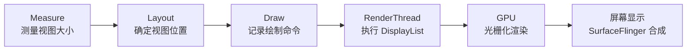
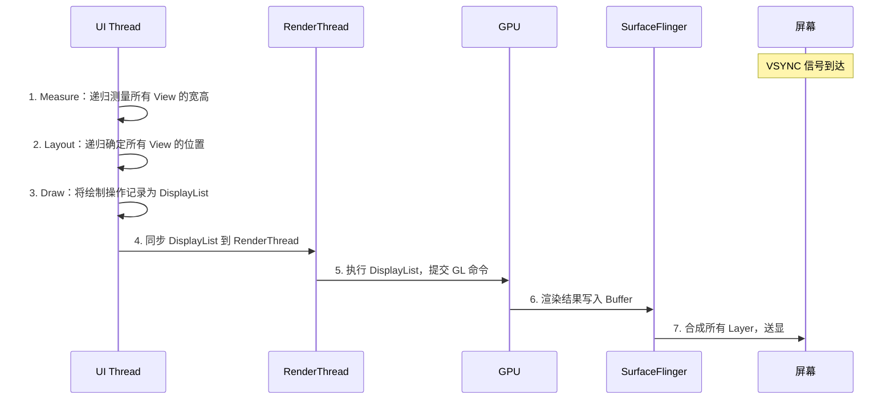
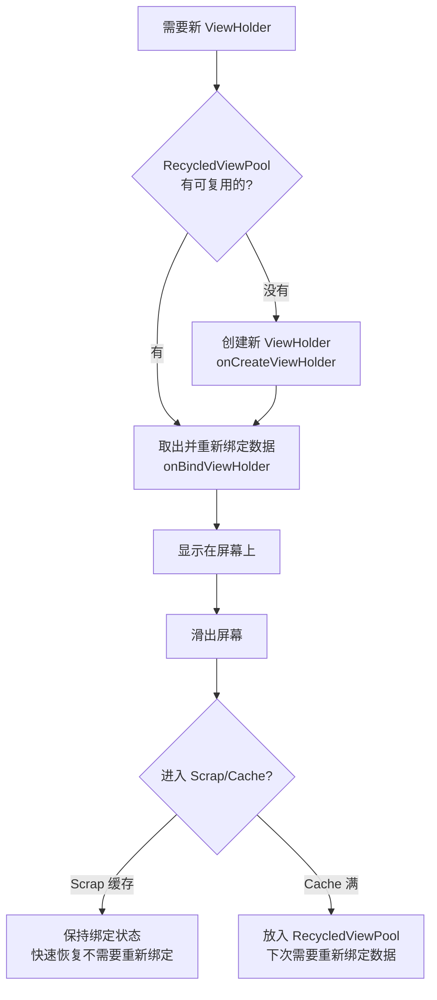

# UI 渲染性能

## Android 渲染原理

Android 的渲染管线经历从 CPU 到 GPU 再到屏幕显示的完整流程：



各阶段详细说明：



## 16ms 渲染目标与掉帧原理

Android 屏幕刷新率通常为 60Hz（部分新设备为 90Hz/120Hz），即每帧需在约 **16.67ms**（60Hz）内完成渲染。

```mermaid
gantt
    title 正常帧 vs 掉帧
    dateFormat X
    axisFormat %L

    section 正常渲染
    帧 1 渲染 (< 16ms)     : done, 0, 12
    帧 2 渲染 (< 16ms)     : done, 16, 28

    section 掉帧发生
    帧 1 渲染 (> 16ms 卡顿) : crit, 0, 25
    帧 2 被跳过              : 16, 16
    帧 3 渲染                : 32, 44
```



**VSYNC 机制：**

- 硬件定时产生 VSYNC 信号（16.67ms 一次）
- `Choreographer` 接收 VSYNC 后触发 input → animation → traversal（measure/layout/draw）
- 如果一帧的处理超过 VSYNC 间隔，该帧被丢弃（掉帧/Jank），用户感知为卡顿
- **冻帧（Frozen Frame）**：渲染耗时超过 700ms 的帧，用户感知为应用无响应

## 过度绘制（Overdraw）

同一像素在一帧中被绘制多次，造成不必要的 GPU 工作。

### 检测方法

**开发者选项 → 调试 GPU 过度绘制：**

| 颜色 | 过度绘制次数 | 是否需要优化 |
|------|-------------|-------------|
| 无色 | 0 次（正常） | — |
| 蓝色 | 1 次 | 可接受 |
| 绿色 | 2 次 | 需要关注 |
| 粉色 | 3 次 | 需要优化 |
| 红色 | 4 次及以上 | 必须优化 |

### 优化策略

#### 1. 减少背景叠加

```kotlin
// ❌ 错误示范：Activity 主题背景 + 根布局背景 + 子 View 背景 = 多层叠加
// styles.xml 中 Activity 主题设置了 windowBackground
// layout.xml 中 FrameLayout 又设置了 android:background

// ✅ 正确做法：移除多余背景
// 方案一：在 Activity 中移除 window 默认背景
override fun onCreate(savedInstanceState: Bundle?) {
    super.onCreate(savedInstanceState)
    window.setBackgroundDrawable(null)
    setContentView(R.layout.activity_main)
}

// 方案二：在主题中设置
// <item name="android:windowBackground">@null</item>
```

#### 2. 使用 clipRect 限制绘制区域

```kotlin
// 自定义叠加卡片视图，只绘制可见部分
override fun onDraw(canvas: Canvas) {
    for (i in cards.indices) {
        canvas.save()
        if (i < cards.size - 1) {
            // 只绘制当前卡片未被上层卡片遮挡的区域
            canvas.clipRect(
                cards[i].left, cards[i].top,
                cards[i].right, cards[i + 1].top
            )
        }
        drawCard(canvas, cards[i])
        canvas.restore()
    }
}
```

#### 3. Canvas.quickReject 快速跳过不可见区域

```kotlin
override fun onDraw(canvas: Canvas) {
    // 如果绘制区域完全在裁剪区域外，直接跳过
    if (canvas.quickReject(drawRect, Canvas.EdgeType.BW)) {
        return
    }
    // 执行实际绘制
    canvas.drawBitmap(bitmap, null, drawRect, paint)
}
```

## 布局层级优化

布局层级越深，measure/layout 的递归越耗时。

### 检测工具

- **Layout Inspector**（Android Studio）：实时查看 View 树层级、属性、绘制边界
- **Hierarchy Viewer**（已废弃）：原理相同，可查看每个 View 的 measure/layout/draw 耗时
- **`adb shell dumpsys activity top`**：查看当前 Activity 的 View 层级

### ConstraintLayout 替代嵌套布局

```xml
<!-- ❌ 错误示范：多层嵌套 LinearLayout 实现复杂布局 -->
<LinearLayout android:orientation="vertical">
    <LinearLayout android:orientation="horizontal">
        <ImageView ... />
        <LinearLayout android:orientation="vertical">
            <TextView ... />
            <TextView ... />
        </LinearLayout>
    </LinearLayout>
    <LinearLayout android:orientation="horizontal">
        <Button ... />
        <Button ... />
    </LinearLayout>
</LinearLayout>

<!-- ✅ 正确做法：ConstraintLayout 扁平化实现 -->
<androidx.constraintlayout.widget.ConstraintLayout
    android:layout_width="match_parent"
    android:layout_height="wrap_content">

    <ImageView
        android:id="@+id/avatar"
        app:layout_constraintStart_toStartOf="parent"
        app:layout_constraintTop_toTopOf="parent" ... />

    <TextView
        android:id="@+id/title"
        app:layout_constraintStart_toEndOf="@id/avatar"
        app:layout_constraintTop_toTopOf="@id/avatar" ... />

    <TextView
        android:id="@+id/subtitle"
        app:layout_constraintStart_toEndOf="@id/avatar"
        app:layout_constraintTop_toBottomOf="@id/title" ... />

    <Button
        android:id="@+id/btn_accept"
        app:layout_constraintTop_toBottomOf="@id/avatar"
        app:layout_constraintStart_toStartOf="parent" ... />

    <Button
        android:id="@+id/btn_reject"
        app:layout_constraintTop_toBottomOf="@id/avatar"
        app:layout_constraintStart_toEndOf="@id/btn_accept" ... />

</androidx.constraintlayout.widget.ConstraintLayout>
```

### merge 标签减少层级

```xml
<!-- 自定义组合控件的布局文件 custom_toolbar.xml -->
<!-- 使用 merge 避免 inflate 时多出一层 ViewGroup -->
<merge xmlns:android="http://schemas.android.com/apk/res/android">
    <ImageView android:id="@+id/iv_back" ... />
    <TextView android:id="@+id/tv_title" ... />
    <ImageView android:id="@+id/iv_menu" ... />
</merge>
```

```kotlin
class CustomToolbar @JvmOverloads constructor(
    context: Context, attrs: AttributeSet? = null
) : FrameLayout(context, attrs) {
    init {
        // merge 的子 View 直接成为 CustomToolbar 的子 View，不多出一层
        LayoutInflater.from(context).inflate(R.layout.custom_toolbar, this, true)
    }
}
```

### ViewStub 延迟加载

```xml
<!-- 错误提示布局默认不加载，需要时才 inflate -->
<ViewStub
    android:id="@+id/stub_error"
    android:layout="@layout/layout_error_tips"
    android:layout_width="match_parent"
    android:layout_height="wrap_content" />
```

```kotlin
// 需要显示时才 inflate
val errorView = findViewById<ViewStub>(R.id.stub_error).inflate()
// 后续可通过 errorView 操作子控件
```

### AsyncLayoutInflater 异步加载布局

```kotlin
// 在子线程中 inflate 复杂布局，减少主线程卡顿
AsyncLayoutInflater(this).inflate(
    R.layout.activity_heavy_layout, null
) { view, _, _ ->
    setContentView(view)
    // 布局加载完成，初始化控件
    initViews()
}
```

> **注意**：AsyncLayoutInflater 不支持包含 `<fragment>` 标签或需要 `Handler` 的布局，且 inflate 出的 View 需要在回调中使用。

## RecyclerView 性能优化专题

### ViewHolder 复用机制



RecyclerView 四级缓存：

| 缓存层级 | 名称 | 默认容量 | 是否需要重新绑定 |
|---------|------|---------|----------------|
| 第一级 | Scrap（屏幕内） | 无限 | 否 |
| 第二级 | Cache（刚滑出屏幕） | 2 | 否 |
| 第三级 | ViewCacheExtension | 自定义 | 取决于实现 |
| 第四级 | RecycledViewPool | 每种 ViewType 5 个 | 是 |

### DiffUtil 高效更新

```kotlin
class MyDiffCallback(
    private val oldList: List<Item>,
    private val newList: List<Item>
) : DiffUtil.Callback() {

    override fun getOldListSize() = oldList.size
    override fun getNewListSize() = newList.size

    override fun areItemsTheSame(oldPos: Int, newPos: Int): Boolean {
        // 判断是否为同一个对象（通常比较 ID）
        return oldList[oldPos].id == newList[newPos].id
    }

    override fun areContentsTheSame(oldPos: Int, newPos: Int): Boolean {
        // 判断内容是否一致（决定是否需要重新绑定）
        return oldList[oldPos] == newList[newPos]
    }
}

// 使用方式
val diffResult = DiffUtil.calculateDiff(MyDiffCallback(oldList, newList))
diffResult.dispatchUpdatesTo(adapter)
```

**推荐使用 `ListAdapter` 简化 DiffUtil：**

```kotlin
class MyAdapter : ListAdapter<Item, MyViewHolder>(ItemDiffCallback()) {

    class ItemDiffCallback : DiffUtil.ItemCallback<Item>() {
        override fun areItemsTheSame(oldItem: Item, newItem: Item) =
            oldItem.id == newItem.id
        override fun areContentsTheSame(oldItem: Item, newItem: Item) =
            oldItem == newItem
    }

    override fun onCreateViewHolder(parent: ViewGroup, viewType: Int): MyViewHolder {
        val view = LayoutInflater.from(parent.context)
            .inflate(R.layout.item_layout, parent, false)
        return MyViewHolder(view)
    }

    override fun onBindViewHolder(holder: MyViewHolder, position: Int) {
        holder.bind(getItem(position))
    }
}

// 提交新列表，自动在后台线程计算 Diff
adapter.submitList(newList)
```

### 关键属性调优

```kotlin
recyclerView.apply {
    // 列表项高度固定时开启，跳过部分 measure 计算
    setHasFixedSize(true)

    // 增大离屏缓存数量（默认 2），适合快速滑动场景
    setItemViewCacheSize(4)

    // 关闭默认 item 动画（减少布局计算，适合高频更新列表）
    itemAnimator = null
}
```

### 预取（Prefetch）与预布局

RecyclerView 从 25.1.0 开始默认开启 **GapWorker 预取**机制：
- 在 RenderThread 执行 GPU 工作时，利用 CPU 空闲时间预先创建/绑定即将进入屏幕的 ViewHolder
- 通过 `LinearLayoutManager.setInitialPrefetchItemCount()` 控制嵌套 RecyclerView 的预取数量

```kotlin
// 嵌套 RecyclerView：告诉外层每个内层大概同时显示 4 个 item
val innerLayoutManager = LinearLayoutManager(
    context, LinearLayoutManager.HORIZONTAL, false
)
innerLayoutManager.initialPrefetchItemCount = 4
```

### 嵌套 RecyclerView 共享 RecycledViewPool

当多个 RecyclerView 使用相同 ViewType 时，共享 ViewPool 避免重复创建 ViewHolder：

```kotlin
// 创建共享的 ViewPool
val sharedPool = RecyclerView.RecycledViewPool().apply {
    // 增大 ViewType 0 的缓存容量
    setMaxRecycledViews(0, 20)
}

// 外层 Adapter 中为每个内层 RecyclerView 设置共享 Pool
override fun onBindViewHolder(holder: OuterViewHolder, position: Int) {
    holder.innerRecyclerView.apply {
        setRecycledViewPool(sharedPool)
        adapter = innerAdapter
    }
}
```

## 渲染性能分析工具

### GPU 渲染模式分析

**开发者选项 → GPU 呈现模式分析 → 在屏幕上显示为条形图**

每个竖条代表一帧的渲染耗时，水平绿线为 16ms 基准线：

| 颜色段 | 含义 | 优化方向 |
|--------|------|---------|
| 蓝色（Swap Buffers） | 将渲染结果传输到屏幕 | 通常无法优化 |
| 红色（Command Issue） | GPU 执行渲染命令 | 减少过度绘制、简化圆角/阴影 |
| 浅绿色（Sync & Upload） | Bitmap 上传到 GPU | 减少大图、使用硬件 Bitmap |
| 深绿色（Draw） | `View.onDraw()` 耗时 | 简化 Canvas 绘制逻辑 |
| 橙色（Measure/Layout） | 布局计算 | 减少布局层级、避免多次 measure |
| 紫色（Animation） | 动画帧计算 | 使用属性动画、避免触发 layout |
| 浅蓝色（Input Handling） | 输入事件处理 | 避免在 onTouch 中做耗时操作 |

### Systrace / Perfetto 帧分析

```bash
# 使用 Perfetto 抓取 10 秒的系统 Trace
adb shell perfetto \
  -c - --txt \
  -o /data/misc/perfetto-traces/trace.perfetto-trace \
<<EOF
buffers: {
    size_kb: 63488
    fill_policy: RING_BUFFER
}
data_sources: {
    config {
        name: "linux.ftrace"
        ftrace_config {
            ftrace_events: "sched/sched_switch"
            ftrace_events: "power/suspend_resume"
            atrace_categories: "view"
            atrace_categories: "am"
            atrace_categories: "gfx"
            atrace_categories: "input"
            atrace_apps: "com.example.myapp"
        }
    }
}
duration_ms: 10000
EOF

# 拉取 Trace 文件并在 Perfetto UI 中打开
adb pull /data/misc/perfetto-traces/trace.perfetto-trace
# 打开 https://ui.perfetto.dev 加载分析
```

**关注要点：**

- **Choreographer#doFrame**：每帧的起止时间，超过 16ms 即为掉帧
- **measure / layout / draw**：各阶段耗时分布
- **RenderThread**：GPU 命令提交耗时
- **SurfaceFlinger**：合成与送显耗时

### FrameMetrics API

通过代码采集每帧渲染数据，适合线上监控：

```kotlin
if (Build.VERSION.SDK_INT >= Build.VERSION_CODES.N) {
    window.addOnFrameMetricsAvailableListener(
        { _, frameMetrics, _ ->
            val copy = FrameMetrics(frameMetrics)
            val totalDuration = copy.getMetric(FrameMetrics.TOTAL_DURATION)
            val layoutDuration = copy.getMetric(FrameMetrics.LAYOUT_MEASURE_DURATION)
            val drawDuration = copy.getMetric(FrameMetrics.DRAW_DURATION)

            // 单位为纳秒，转换为毫秒
            val totalMs = totalDuration / 1_000_000.0
            if (totalMs > 16.67) {
                Log.w(TAG, "掉帧！总耗时: %.2fms, 布局: %.2fms, 绘制: %.2fms".format(
                    totalMs,
                    layoutDuration / 1_000_000.0,
                    drawDuration / 1_000_000.0
                ))
            }
        },
        Handler(Looper.getMainLooper())
    )
}
```

## 常见坑点

### 1. `requestLayout` 连锁反应

调用 `requestLayout()` 会向上冒泡至 ViewRootImpl 并触发整棵 View 树的 measure/layout，在高频场景（如 RecyclerView 滚动中动态改变子 View 尺寸）会导致严重卡顿。

**解决方案：** 尽量使用固定尺寸；确需动态尺寸时用 `View.post {}` 合并多次请求。

### 2. RecyclerView `notifyDataSetChanged` 滥用

`notifyDataSetChanged()` 会导致整个列表重新绑定，所有 ViewHolder 失效。

**解决方案：** 使用 `DiffUtil` 或 `ListAdapter`，只更新变化的 item。

### 3. ConstraintLayout 过度使用 Barrier / Chain

Barrier 和 Chain 虽然强大，但内部实现依赖多次 measure，复杂约束下反而比简单 LinearLayout 更慢。

**解决方案：** 简单的线性排列直接用 LinearLayout；只在需要复杂相对定位时使用 ConstraintLayout。

### 4. 透明 View 的隐藏成本

`View.INVISIBLE` 仍然参与 measure/layout/draw，只是不显示。

**解决方案：** 不需要占位时使用 `View.GONE`；频繁切换显示/隐藏时考虑 `setAlpha(0f)` 避免 layout 抖动。

### 5. 硬件加速不支持的操作

部分 Canvas 操作在硬件加速模式下不支持或行为异常（如 `Canvas.drawBitmapMesh`、`Paint.setMaskFilter`）。

**解决方案：** 对特定 View 关闭硬件加速 `setLayerType(LAYER_TYPE_SOFTWARE, null)`，但注意关闭后该 View 的所有绘制都走软件渲染。

## 踩坑记录

> 此区域供团队成员补充项目中遇到的真实案例。

| 日期 | 记录人 | 问题描述 | 解决方案 |
|------|--------|----------|----------|
| | | | |

## 参考资料

- [Android 官方 - 渲染性能](https://developer.android.com/topic/performance/rendering)
- [Android 官方 - 优化布局层次](https://developer.android.com/develop/ui/views/layout/improving-layouts)
- [Android 官方 - RecyclerView 性能](https://developer.android.com/develop/ui/views/layout/recyclerview-custom#performance)
- [Perfetto UI](https://ui.perfetto.dev/)
- [Systrace 概览](https://developer.android.com/topic/performance/tracing)
- [ConstraintLayout 官方文档](https://developer.android.com/develop/ui/views/layout/constraint-layout)
- [DiffUtil 官方指南](https://developer.android.com/reference/androidx/recyclerview/widget/DiffUtil)
