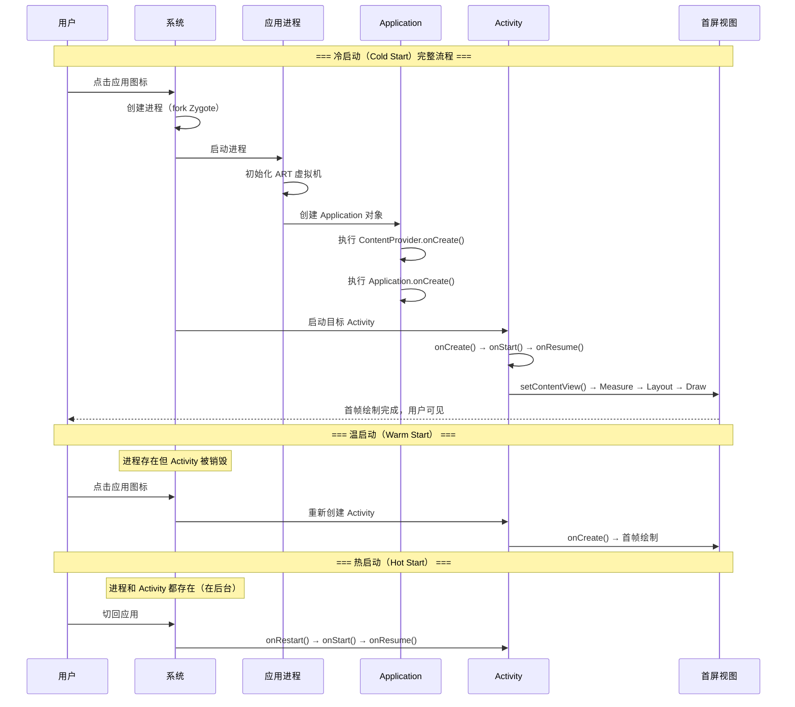
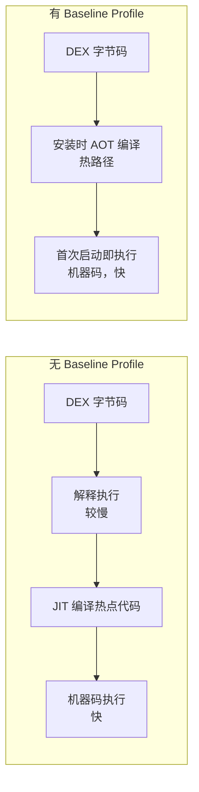

# 启动优化

## 启动类型

Android 应用启动分为三种类型，耗时从高到低依次为冷启动、温启动、热启动：



| 启动类型 | 进程状态 | Activity 状态 | 耗时 | 优化空间 |
|---------|---------|-------------|------|---------|
| 冷启动 | 不存在，需从 Zygote fork | 不存在 | 最长（1-5s） | 最大 |
| 温启动 | 存在 | 被销毁，需重建 | 中等 | 中等 |
| 热启动 | 存在 | 存在，从后台恢复 | 最短（< 500ms） | 较小 |

## 启动耗时测量方法

### Displayed Time（Logcat）

系统自动在 Logcat 中输出首帧绘制耗时：

```
ActivityManager: Displayed com.example.app/.MainActivity: +1s234ms
```

这个时间从 `Activity.startActivity()` 调用到首帧绘制完成。

### reportFullyDrawn() API

当应用的"完全可用"时机晚于首帧绘制（如需要异步加载数据后才算就绪），通过此 API 上报：

```kotlin
class MainActivity : AppCompatActivity() {

    override fun onCreate(savedInstanceState: Bundle?) {
        super.onCreate(savedInstanceState)
        setContentView(R.layout.activity_main)

        lifecycleScope.launch {
            loadInitialData()
            // 数据加载完成，上报"完全绘制"时间
            reportFullyDrawn()
        }
    }
}
```

Logcat 输出：

```
ActivityManager: Fully drawn com.example.app/.MainActivity: +2s567ms
```

### Macrobenchmark 自动化测量

```kotlin
@RunWith(AndroidJUnit4::class)
class StartupBenchmark {

    @get:Rule
    val benchmarkRule = MacrobenchmarkRule()

    @Test
    fun startupCold() = benchmarkRule.measureRepeated(
        packageName = "com.example.app",
        metrics = listOf(StartupTimingMetric()),
        iterations = 10,
        startupMode = StartupMode.COLD
    ) {
        pressHome()
        startActivityAndWait()
    }

    @Test
    fun startupWarm() = benchmarkRule.measureRepeated(
        packageName = "com.example.app",
        metrics = listOf(StartupTimingMetric()),
        iterations = 10,
        startupMode = StartupMode.WARM
    ) {
        pressHome()
        startActivityAndWait()
    }
}
```

**Gradle 配置（Macrobenchmark 模块）：**

```kotlin
// benchmark/build.gradle.kts
plugins {
    id("com.android.test")
    id("org.jetbrains.kotlin.android")
}

android {
    namespace = "com.example.benchmark"
    compileSdk = 35

    defaultConfig {
        minSdk = 23
        testInstrumentationRunner = "androidx.test.runner.AndroidJUnitRunner"
    }

    targetProjectPath = ":app"
    experimentalProperties["android.experimental.self-instrumenting"] = true
}

dependencies {
    implementation("androidx.benchmark:benchmark-macro-junit4:1.3.3")
    implementation("androidx.test.ext:junit:1.2.1")
    implementation("androidx.test.espresso:espresso-core:3.6.1")
}
```

### adb shell am start -W

```bash
# 强制冷启动并测量耗时
adb shell am force-stop com.example.app
adb shell am start -W com.example.app/.MainActivity

# 输出示例：
# Status: ok
# LaunchState: COLD
# Activity: com.example.app/.MainActivity
# TotalTime: 1234        ← 总启动耗时（ms）
# WaitTime: 1256         ← 包含系统调度耗时
```

## 启动瓶颈分析

### Perfetto / Systrace 分析启动 Trace

```bash
# 使用 Perfetto 抓取启动过程 Trace
# 先 force-stop 确保冷启动
adb shell am force-stop com.example.app

# 开始录制
adb shell perfetto \
  -c - --txt \
  -o /data/misc/perfetto-traces/startup.perfetto-trace \
<<EOF
buffers: { size_kb: 63488 }
data_sources: {
    config {
        name: "linux.ftrace"
        ftrace_config {
            atrace_categories: "am"
            atrace_categories: "dalvik"
            atrace_categories: "view"
            atrace_categories: "wm"
            atrace_apps: "com.example.app"
        }
    }
}
duration_ms: 15000
EOF

# 同时启动应用
adb shell am start -W com.example.app/.MainActivity
```

### 启动各阶段耗时拆解

```mermaid
gantt
    title 冷启动各阶段耗时拆解
    dateFormat X
    axisFormat %Lms

    section 系统阶段
    进程创建（fork Zygote）           : 0, 100
    ART 初始化                        : 100, 200

    section Application
    ContentProvider.onCreate()        : 200, 450
    Application.onCreate()            : 450, 800

    section Activity
    Activity.onCreate()               : 800, 1000
    setContentView() + inflate        : 1000, 1150
    onStart() + onResume()            : 1150, 1200

    section 渲染
    首帧 Measure + Layout + Draw      : 1200, 1400
```



**瓶颈识别重点：**

| 阶段 | 常见瓶颈 | 排查方式 |
|------|---------|---------|
| ContentProvider.onCreate | 第三方 SDK 通过 ContentProvider 自动初始化 | 搜索 Manifest 中的 provider 声明 |
| Application.onCreate | SDK 初始化、数据库创建、大量文件 IO | Perfetto 查看各函数耗时 |
| Activity.onCreate | 复杂布局 inflate、大量 View 创建 | Layout Inspector 查看层级 |
| 首帧绘制 | 布局复杂、自定义 View 耗时 draw | Systrace 查看 draw 耗时 |

## 优化策略

### Application.onCreate 优化

#### 延迟初始化

```kotlin
class MyApplication : Application() {

    override fun onCreate() {
        super.onCreate()

        // ✅ 必须同步初始化的（崩溃上报、日志系统）
        CrashReporter.init(this)
        Logger.init(this)

        // ✅ 延迟到主线程空闲时初始化
        val mainHandler = Handler(Looper.getMainLooper())
        mainHandler.post {
            // IdleHandler 在主线程消息队列空闲时执行
            Looper.myQueue().addIdleHandler {
                initNonCriticalSdks()
                false // 返回 false 表示只执行一次
            }
        }
    }

    private fun initNonCriticalSdks() {
        // 推送、统计、广告等 SDK
        PushService.init(this)
        Analytics.init(this)
    }
}
```

#### 按需初始化

```kotlin
// 使用 lazy 延迟到首次使用时初始化
object ServiceLocator {
    lateinit var appContext: Context

    val database: AppDatabase by lazy {
        Room.databaseBuilder(appContext, AppDatabase::class.java, "app.db").build()
    }

    val imageLoader: ImageLoader by lazy {
        ImageLoader.Builder(appContext)
            .memoryCache { MemoryCache.Builder(appContext).maxSizePercent(0.25).build() }
            .build()
    }
}
```

### Jetpack App Startup 库

统一管理通过 ContentProvider 自动初始化的 SDK，合并为单个 ContentProvider 减少启动开销：

```kotlin
// build.gradle.kts
dependencies {
    implementation("androidx.startup:startup-runtime:1.2.0")
}
```

```kotlin
// 定义初始化器
class AnalyticsInitializer : Initializer<Analytics> {

    override fun create(context: Context): Analytics {
        // 执行初始化逻辑
        return Analytics.init(context)
    }

    override fun dependencies(): List<Class<out Initializer<*>>> {
        // 声明依赖：先初始化日志模块
        return listOf(LoggerInitializer::class.java)
    }
}

class LoggerInitializer : Initializer<Logger> {

    override fun create(context: Context): Logger {
        return Logger.init(context)
    }

    override fun dependencies(): List<Class<out Initializer<*>>> = emptyList()
}
```

```xml
<!-- AndroidManifest.xml -->
<provider
    android:name="androidx.startup.InitializationProvider"
    android:authorities="${applicationId}.androidx-startup"
    android:exported="false"
    tools:node="merge">

    <meta-data
        android:name="com.example.app.AnalyticsInitializer"
        android:value="androidx.startup" />

    <!-- 禁用某个库的自动初始化（改为手动控制） -->
    <meta-data
        android:name="com.example.sdk.SdkContentProvider"
        android:value="androidx.startup"
        tools:node="remove" />
</provider>
```

### 异步初始化框架设计（Kotlin 协程方案）

```kotlin
/**
 * 基于协程的启动任务调度器
 * 支持任务依赖、并行执行、主/子线程切换
 */
class StartupTaskDispatcher {

    private val tasks = mutableListOf<StartupTask>()

    fun addTask(task: StartupTask): StartupTaskDispatcher {
        tasks.add(task)
        return this
    }

    suspend fun dispatch() = coroutineScope {
        // 按依赖关系构建有向无环图（DAG）
        val completed = ConcurrentHashMap<String, CompletableDeferred<Unit>>()
        tasks.forEach { completed[it.name] = CompletableDeferred() }

        tasks.map { task ->
            async(task.dispatcher) {
                // 等待所有前置依赖完成
                task.dependencies.forEach { dep ->
                    completed[dep]?.await()
                }
                // 执行任务
                val startTime = SystemClock.elapsedRealtime()
                task.execute()
                val cost = SystemClock.elapsedRealtime() - startTime
                Log.d("Startup", "${task.name} 耗时: ${cost}ms")
                // 标记完成
                completed[task.name]?.complete(Unit)
            }
        }.awaitAll()
    }
}

abstract class StartupTask {
    abstract val name: String
    open val dependencies: List<String> = emptyList()
    open val dispatcher: CoroutineDispatcher = Dispatchers.IO
    abstract suspend fun execute()
}
```

```kotlin
// 使用示例
class MyApplication : Application() {

    override fun onCreate() {
        super.onCreate()

        val dispatcher = StartupTaskDispatcher()
            .addTask(object : StartupTask() {
                override val name = "CrashReporter"
                override val dispatcher = Dispatchers.Main // 需要在主线程
                override suspend fun execute() { CrashReporter.init(this@MyApplication) }
            })
            .addTask(object : StartupTask() {
                override val name = "Database"
                override suspend fun execute() { AppDatabase.init(this@MyApplication) }
            })
            .addTask(object : StartupTask() {
                override val name = "Network"
                override val dependencies = listOf("Database") // 依赖数据库先完成
                override suspend fun execute() { NetworkClient.init(this@MyApplication) }
            })
            .addTask(object : StartupTask() {
                override val name = "ImageLoader"
                override suspend fun execute() { ImageLoaderFactory.init(this@MyApplication) }
            })

        // 在协程中并行执行（受依赖关系约束）
        GlobalScope.launch {
            dispatcher.dispatch()
        }
    }
}
```

### 闪屏优化：SplashScreen API（Android 12+）

```kotlin
// build.gradle.kts
dependencies {
    implementation("androidx.core:core-splashscreen:1.0.1")
}
```

```xml
<!-- res/values/themes.xml -->
<style name="Theme.App.Starting" parent="Theme.SplashScreen">
    <!-- 闪屏背景色 -->
    <item name="windowSplashScreenBackground">@color/splash_bg</item>
    <!-- 中心图标（自动添加圆形遮罩） -->
    <item name="windowSplashScreenAnimatedIcon">@drawable/ic_splash_icon</item>
    <!-- 图标动画时长（最长 1000ms） -->
    <item name="windowSplashScreenAnimationDuration">500</item>
    <!-- 闪屏结束后切换到的真实主题 -->
    <item name="postSplashScreenTheme">@style/Theme.App</item>
</style>
```

```kotlin
class MainActivity : AppCompatActivity() {

    override fun onCreate(savedInstanceState: Bundle?) {
        // 必须在 super.onCreate() 之前调用
        val splashScreen = installSplashScreen()

        super.onCreate(savedInstanceState)
        setContentView(R.layout.activity_main)

        // 保持闪屏显示直到数据准备完毕
        val viewModel: MainViewModel by viewModels()
        splashScreen.setKeepOnScreenCondition {
            viewModel.isLoading.value  // 返回 true 则继续显示闪屏
        }

        // 自定义退出动画
        splashScreen.setOnExitAnimationListener { splashScreenView ->
            val fadeOut = ObjectAnimator.ofFloat(splashScreenView.view, "alpha", 1f, 0f)
            fadeOut.duration = 300
            fadeOut.doOnEnd { splashScreenView.remove() }
            fadeOut.start()
        }
    }
}
```

### 布局优化：减少首屏布局复杂度

```kotlin
class MainActivity : AppCompatActivity() {

    override fun onCreate(savedInstanceState: Bundle?) {
        super.onCreate(savedInstanceState)
        // 首屏只加载核心骨架布局
        setContentView(R.layout.activity_main_skeleton)

        // 非核心区域使用 ViewStub 延迟加载
        lifecycleScope.launch {
            // 等待首帧绘制完成后再加载次要内容
            withContext(Dispatchers.Main) {
                // 使用 postOnAnimation 确保在下一帧之后执行
                window.decorView.post {
                    findViewById<ViewStub>(R.id.stub_bottom_nav)?.inflate()
                    findViewById<ViewStub>(R.id.stub_recommend_section)?.inflate()
                }
            }
        }
    }
}
```

## Baseline Profile

### 原理

Android 应用代码默认在运行时由 ART 解释执行，热点代码通过 JIT 编译为机器码。Baseline Profile 将热路径代码在安装时通过 AOT（Ahead-of-Time）编译，避免运行时的解释和 JIT 开销。



**效果数据（Google 官方）：**

| 指标 | 改善幅度 |
|------|---------|
| 冷启动速度 | 提升 30%+ |
| 首帧渲染 | 提升 20%+ |
| 运行时性能 | 提升 15%+ |

### 生成与集成方法

**1. 在 Macrobenchmark 模块中生成 Baseline Profile：**

```kotlin
// benchmark/src/main/java/com/example/benchmark/BaselineProfileGenerator.kt
@RunWith(AndroidJUnit4::class)
class BaselineProfileGenerator {

    @get:Rule
    val rule = BaselineProfileRule()

    @Test
    fun generate() = rule.collect(
        packageName = "com.example.app"
    ) {
        // 冷启动
        pressHome()
        startActivityAndWait()

        // 模拟用户关键路径操作
        device.findObject(By.text("首页")).click()
        device.waitForIdle()

        device.findObject(By.text("搜索")).click()
        device.waitForIdle()

        // 滑动列表
        device.findObject(By.res("recycler_view"))
            .scroll(Direction.DOWN, 2f)
    }
}
```

**2. Gradle 配置：**

```kotlin
// app/build.gradle.kts
plugins {
    id("com.android.application")
    id("org.jetbrains.kotlin.android")
    id("androidx.baselineprofile")
}

dependencies {
    implementation("androidx.profileinstaller:profileinstaller:1.4.1")
    baselineProfile(project(":benchmark"))
}

baselineProfile {
    automaticGenerationDuringBuild = true
}
```

**3. 生成命令：**

```bash
# 连接设备后执行
./gradlew :app:generateBaselineProfile
```

生成的 `baseline-prof.txt` 会自动打包到 APK/AAB 中，安装时由系统读取并 AOT 编译。

### 效果测量

```kotlin
// 对比有无 Baseline Profile 的启动耗时
@RunWith(AndroidJUnit4::class)
class StartupBenchmarkWithProfile {

    @get:Rule
    val benchmarkRule = MacrobenchmarkRule()

    @Test
    fun startupNoCompilation() = benchmarkRule.measureRepeated(
        packageName = "com.example.app",
        metrics = listOf(StartupTimingMetric()),
        compilationMode = CompilationMode.None(),  // 无预编译
        iterations = 10,
        startupMode = StartupMode.COLD
    ) {
        pressHome()
        startActivityAndWait()
    }

    @Test
    fun startupWithBaselineProfile() = benchmarkRule.measureRepeated(
        packageName = "com.example.app",
        metrics = listOf(StartupTimingMetric()),
        compilationMode = CompilationMode.Partial(
            baselineProfileMode = BaselineProfileMode.Require
        ),
        iterations = 10,
        startupMode = StartupMode.COLD
    ) {
        pressHome()
        startActivityAndWait()
    }
}
```

## 常见坑点

### 1. ContentProvider 隐式初始化

许多第三方 SDK（如 Firebase、WorkManager、Leakcanary）通过 `ContentProvider.onCreate()` 自动初始化，这在 `Application.onCreate()` 之前执行，是隐藏的启动耗时大户。

**排查方式：**

```bash
# 查看 merged manifest 中所有 ContentProvider
# 或在 Perfetto 中搜索 "ContentProvider" 关键字
```

**解决方案：** 使用 App Startup 库统一管理，或通过 `tools:node="remove"` 禁用自动初始化改为手动延迟。

### 2. 多进程启动重复初始化

如果应用有多个进程（如推送进程、WebView 进程），每个进程创建时都会执行 `Application.onCreate()`，造成不必要的重复初始化。

```kotlin
// ✅ 判断当前进程，只在主进程执行完整初始化
class MyApplication : Application() {

    override fun onCreate() {
        super.onCreate()
        if (!isMainProcess()) {
            return // 非主进程，跳过大部分初始化
        }
        // 主进程完整初始化
        initAllSdks()
    }

    private fun isMainProcess(): Boolean {
        val pid = android.os.Process.myPid()
        val manager = getSystemService(ACTIVITY_SERVICE) as ActivityManager
        return manager.runningAppProcesses?.any {
            it.pid == pid && it.processName == packageName
        } ?: false
    }
}
```

### 3. 启动阶段过度使用 SharedPreferences

`SharedPreferences.getXxx()` 在首次调用时会加载整个 XML 文件，如果文件很大且在启动阶段多处调用，会阻塞主线程。

**解决方案：**
- 拆分 SP 文件，避免单个文件过大
- 迁移到 DataStore（基于协程，异步读写）
- 使用 MMKV 替代（mmap 机制，读取速度快 10 倍+）

### 4. StrictMode 误报影响判断

在 Debug 模式下开启 `StrictMode` 会额外增加启动耗时（检测 IO、网络等违规操作的开销），不要将 Debug 模式下的启动数据作为优化基准。

**解决方案：** 启动性能测量始终使用 Release 包（开启 R8/ProGuard）。

### 5. Baseline Profile 版本碎片

Baseline Profile 需要 `profileinstaller` 库配合才能在非 Google Play 渠道生效。低版本 Android（< 7.0）不支持 Profile-guided AOT。

**解决方案：** 确保引入 `androidx.profileinstaller:profileinstaller` 依赖；对低版本设备侧重其他优化策略。

## 踩坑记录

> 此区域供团队成员补充项目中遇到的真实案例。

| 日期 | 记录人 | 问题描述 | 解决方案 |
|------|--------|----------|----------|
| | | | |

## 参考资料

- [Android 官方 - 应用启动时间](https://developer.android.com/topic/performance/vitals/launch-time)
- [Android 官方 - Macrobenchmark](https://developer.android.com/topic/performance/benchmarking/macrobenchmark-overview)
- [Android 官方 - Baseline Profile](https://developer.android.com/topic/performance/baselineprofiles/overview)
- [Android 官方 - App Startup 库](https://developer.android.com/topic/libraries/app-startup)
- [Android 官方 - SplashScreen API](https://developer.android.com/develop/ui/views/launch/splash-screen)
- [Perfetto 文档](https://perfetto.dev/docs/)
- [Jetpack Benchmark 发布说明](https://developer.android.com/jetpack/androidx/releases/benchmark)
