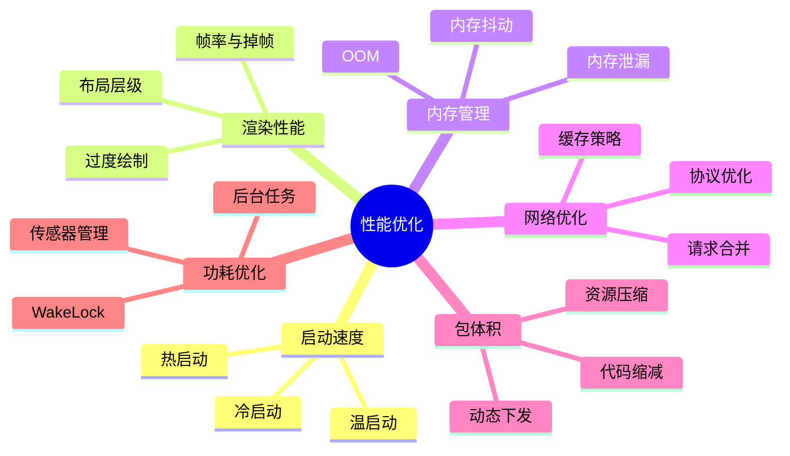
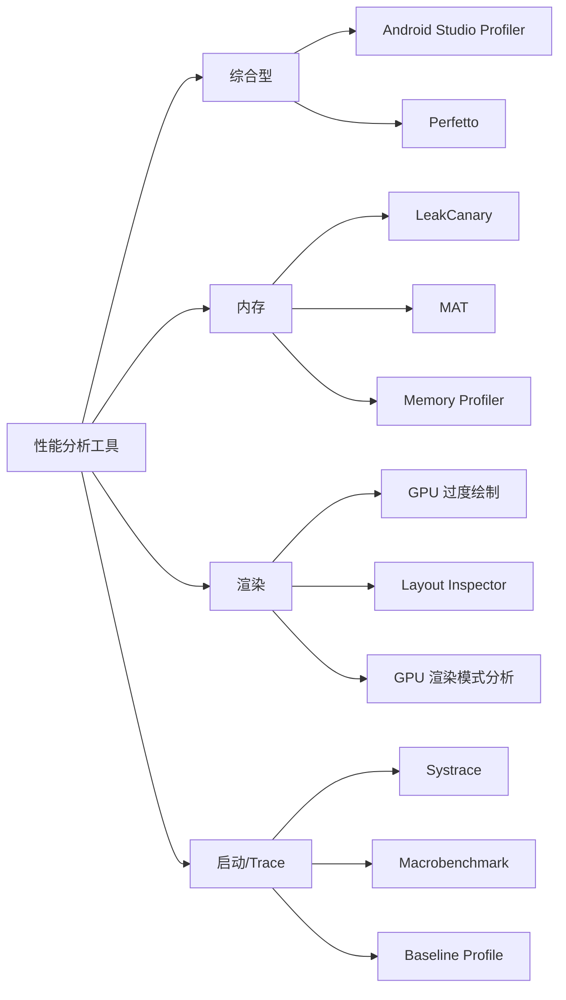

# 性能优化概要

## 核心原理

Android 性能优化涵盖六大维度，构成一个完整的优化全景图：

| 维度 | 核心目标 | 用户感知 |
|------|---------|---------|
| 启动速度 | 缩短冷启动到首帧绘制的时间 | 点击图标到可交互的等待时长 |
| 渲染性能 | 稳定 60fps，避免掉帧 | 滑动流畅度、动画卡顿 |
| 内存管理 | 控制内存占用、消除泄漏 | 应用被杀概率、OOM 崩溃 |
| 网络优化 | 降低延迟、减少流量消耗 | 页面加载速度、流量费用 |
| 包体积 | 缩减 APK/AAB 体积 | 下载意愿、安装成功率 |
| 功耗优化 | 降低 CPU/GPS/网络唤醒频率 | 电量消耗速度 |

## 性能指标体系

| 指标 | 衡量标准 | 采集方式 |
|------|---------|---------|
| 启动时间 | 冷启动 < 2s，温启动 < 1s | `adb shell am start -W`、Macrobenchmark |
| 帧率/掉帧 | P95 帧耗时 < 16ms，冻帧率 < 0.1% | FrameMetrics API、Perfetto |
| 内存占用 | PSS 控制在设备内存 1/8 以内 | `adb shell dumpsys meminfo`、Memory Profiler |
| 内存泄漏 | Activity/Fragment 关闭后可被 GC 回收 | LeakCanary、MAT |
| CPU 使用率 | 空闲时 < 3%，交互时 < 30% | Android Profiler、`top` 命令 |
| 电量消耗 | 后台每小时耗电 < 1% | Battery Historian、`dumpsys batterystats` |

## 工具链总览

| 工具 | 用途 | 使用门槛 |
|------|------|---------|
| Android Studio Profiler | CPU/内存/网络/能耗综合分析 | 低 |
| Perfetto | 系统级 Trace 分析，替代 Systrace | 中 |
| Systrace | 传统系统跟踪工具 | 中 |
| MAT | 分析 hprof 文件，定位内存泄漏 | 高 |
| LeakCanary | 自动检测 Activity/Fragment 内存泄漏 | 低 |
| Macrobenchmark | 自动化启动/滑动性能测试 | 中 |

## 发展趋势

- **Baseline Profile**：通过预编译热路径代码，冷启动速度提升 30%+，Google Play 已自动收集生成
- **Macrobenchmark / Microbenchmark**：Jetpack 官方性能测试框架，支持 CI 集成，取代手动测量
- **Jetpack Compose 性能**：Compose 编译器优化（Stability、Strong Skipping Mode）、`LazyColumn` 替代 RecyclerView、`derivedStateOf` 减少重组
- **App Startup 库**：统一管理 ContentProvider 初始化，消除启动阶段的隐式耗时
- **R8 全模式（Full Mode）**：更激进的代码缩减与优化，减小包体积

## 主流方案与开源项目

| 项目 | 来源 | 聚焦领域 | 特点 |
|------|------|---------|------|
| [LeakCanary](https://github.com/square/leakcanary) | Square | 内存泄漏 | 零配置自动检测，开发阶段必备 |
| [KOOM](https://github.com/nicklfy/KOOM) | 快手 | 内存/线程泄漏 | 线上监控，低开销 hprof dump |
| [Matrix](https://github.com/nicklfy/matrix) | 微信 | 综合性能 | 涵盖卡顿、内存、IO、电量等 |
| [Booster](https://github.com/nicklfy/booster) | 滴滴 | 构建期优化 | 编译插桩、资源压缩、多线程优化 |
| [Anchors](https://github.com/nicklfy/Anchors) | 社区 | 启动框架 | 有向无环图调度初始化任务 |
| [BlockCanary](https://github.com/nicklfy/BlockCanary) | 社区 | 卡顿检测 | 基于 Looper Printer 检测主线程卡顿 |

## 快速上手路径

建议按以下顺序阅读本模块文档：

1. **本文**（`00-overview.md`）— 建立性能优化全局认知
2. [`01-内存优化memory-optimization.md`](01-内存优化memory-optimization.md) — 内存优化：泄漏检测、Bitmap 优化、OOM 防治
3. [`02-UI渲染性能ui-rendering-performance.md`](02-UI渲染性能ui-rendering-performance.md) — 渲染性能：掉帧分析、布局优化、RecyclerView 调优
4. [`03-启动优化app-startup-optimization.md`](03-启动优化app-startup-optimization.md) — 启动优化：耗时分析、异步初始化、Baseline Profile
