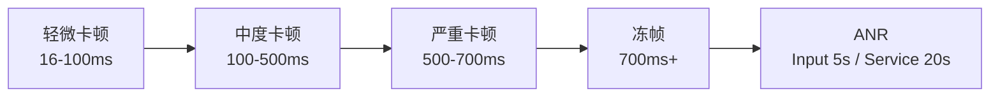
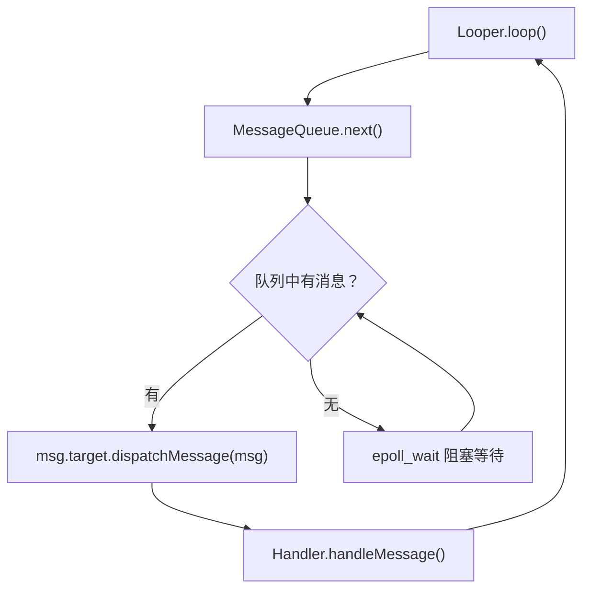
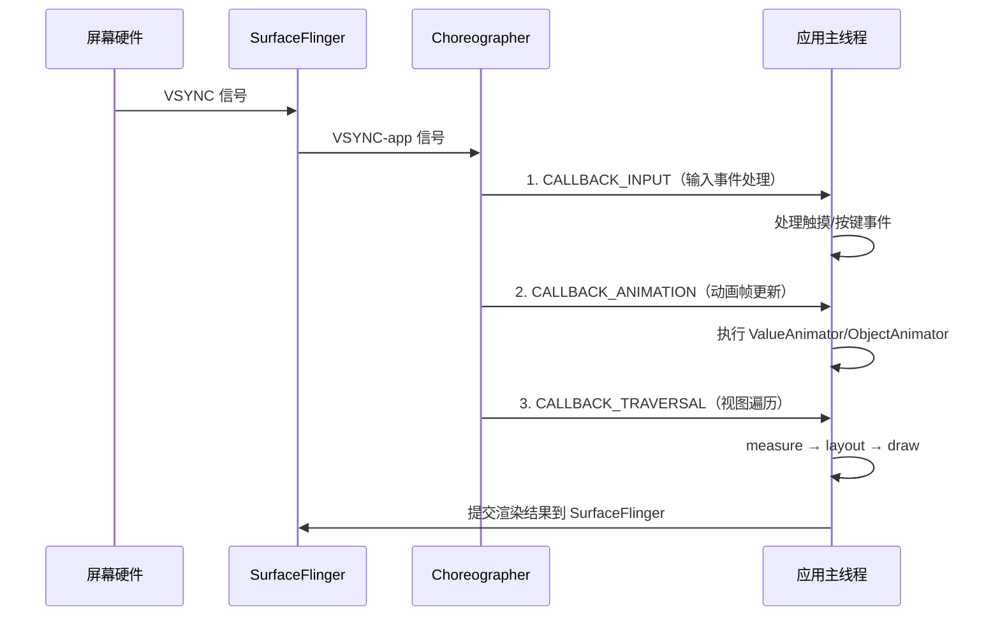
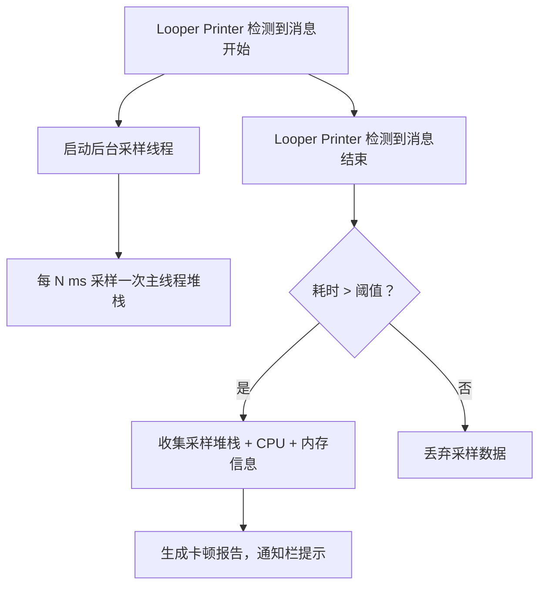

# 卡顿检测与优化

## 卡顿的定义与分类

### 帧卡顿（Jank）

单帧渲染耗时超过 VSYNC 间隔（60Hz 设备为 16.67ms，120Hz 设备为 8.33ms），导致该帧被跳过，用户感知为画面不连贯。

```mermaid
gantt
    title 正常帧 vs 卡顿帧
    dateFormat X
    axisFormat %Lms

    section 正常
    帧1 渲染 12ms   : done, 0, 12
    帧2 渲染 10ms   : done, 16, 26

    section 卡顿
    帧1 渲染 28ms   : crit, 0, 28
    帧2 被跳过       : 16, 16
    帧3 渲染 11ms   : 32, 43
```



### 冻帧（Frozen Frame）

单帧渲染耗时超过 **700ms**，Google Play Android Vitals 将其作为严重性能问题指标上报。用户感知为应用"卡死"，接近 ANR 体验。

### 主线程阻塞

主线程执行耗时操作（IO、网络、大量计算）导致 `Looper` 无法及时处理后续消息，UI 无法响应用户输入。

### 卡顿与 ANR 的关系



卡顿是**量变**，ANR 是**质变**。持续的卡顿积累会最终触发 ANR，但很多卡顿不会达到 ANR 阈值却仍然严重影响用户体验。卡顿治理的目标是在问题演变为 ANR 之前就发现和解决。

## 卡顿原理

### Looper 消息分发机制

Android 主线程的核心是一个无限循环的 `Looper`，持续从 `MessageQueue` 中取出消息并分发处理：



**关键源码逻辑（简化）：**

```kotlin
// Looper.loop() 中的核心循环
fun loop() {
    val me = myLooper()!!
    val queue = me.mQueue
    while (true) {
        val msg = queue.next() ?: return // 取下一条消息，可能阻塞

        // >>>>> Dispatching to handler
        val printer = me.mLogging
        printer?.println(">>>>> Dispatching to ${msg.target} ${msg.callback}: ${msg.what}")

        msg.target.dispatchMessage(msg) // 实际处理消息

        printer?.println("<<<<< Finished to ${msg.target} ${msg.callback}")
        // <<<<< Finished to handler

        msg.recycleUnchecked()
    }
}
```

> **关键洞察**：`>>>>> Dispatching` 和 `<<<<< Finished` 之间的耗时就是一条消息的处理时间。大部分卡顿检测方案都基于这一机制。

### Choreographer 与 VSYNC

`Choreographer` 是 Android 渲染管线的调度者，在收到 VSYNC 信号后按固定顺序执行三类回调：



如果以上三步总耗时超过 VSYNC 间隔，当前帧无法在下一个 VSYNC 到来之前完成，该帧被跳过（Jank）。

### 主线程常见耗时操作

| 类别 | 典型场景 | 耗时量级 |
|------|---------|---------|
| 磁盘 IO | SharedPreferences commit、文件读写 | 10-200ms |
| 数据库 | SQLite 查询、Room 同步调用 | 5-500ms |
| 网络 | 同步 HTTP 请求（错误用法） | 1-30s |
| 序列化 | 大 JSON 解析（Gson/Moshi） | 10-100ms |
| 布局 inflate | 复杂 XML 布局加载 | 20-200ms |
| Binder 调用 | PackageManager、ContentResolver | 5-50ms |
| 计算 | 大列表排序、图片处理 | 10-500ms |

## 卡顿检测方案

### Looper Printer 监控

利用 `Looper.setMessageLogging()` 在每条消息 dispatch 前后打印日志，通过计算时间差判断是否卡顿：

```kotlin
object MainThreadMonitor {

    private const val THRESHOLD_MS = 100L

    fun start() {
        Looper.getMainLooper().setMessageLogging { log ->
            if (log.startsWith(">>>>> Dispatching")) {
                BlockInfo.start = SystemClock.elapsedRealtime()
            } else if (log.startsWith("<<<<< Finished")) {
                val cost = SystemClock.elapsedRealtime() - BlockInfo.start
                if (cost > THRESHOLD_MS) {
                    Log.w("Jank", "主线程卡顿 ${cost}ms")
                    // 采集主线程堆栈
                    val stack = Looper.getMainLooper().thread.stackTrace
                        .joinToString("\n\t") { it.toString() }
                    Log.w("Jank", "堆栈:\n\t$stack")
                }
            }
        }
    }

    private object BlockInfo {
        var start: Long = 0
    }
}
```

> **局限性**：只能获取消息处理结束后的堆栈，不一定是真正造成卡顿的代码位置。需配合定时采样才能获取卡顿发生时的堆栈。

### BlockCanary

基于 Looper Printer 的开源卡顿检测框架，自动采集卡顿时的主线程堆栈、CPU 使用率、内存信息。

**集成方式：**

```kotlin
// build.gradle.kts
dependencies {
    debugImplementation("com.github.markzhai:blockcanary-android:1.5.0")
    releaseImplementation("com.github.markzhai:blockcanary-no-op:1.5.0")
}
```

```kotlin
class MyApplication : Application() {
    override fun onCreate() {
        super.onCreate()
        BlockCanary.install(this, AppBlockCanaryContext()).start()
    }
}

class AppBlockCanaryContext : BlockCanaryContext() {
    override fun provideBlockThreshold() = 200 // 卡顿阈值 200ms
    override fun providePath() = "/blockcanary" // 日志存储路径
    override fun displayNotification() = true   // 通知栏展示
    override fun provideNetworkType() = "wifi"
}
```

**原理：**



### Matrix TraceCanary

微信开源的性能监控框架 Matrix 中的卡顿检测模块，相比 BlockCanary 有两大优势：

1. **编译期插桩**：在每个方法的入口/出口自动插入 Trace 代码，可以精确记录每个方法的耗时
2. **帧率监控**：基于 Choreographer 监控每帧渲染耗时

```kotlin
// build.gradle.kts (项目级)
buildscript {
    dependencies {
        classpath("com.tencent.matrix:matrix-gradle-plugin:2.1.0")
    }
}

// build.gradle.kts (app 级)
plugins {
    id("com.tencent.matrix-plugin")
}

dependencies {
    implementation("com.tencent.matrix:matrix-android-lib:2.1.0")
    implementation("com.tencent.matrix:matrix-trace-canary:2.1.0")
}
```

```kotlin
class MyApplication : Application() {
    override fun onCreate() {
        super.onCreate()

        val builder = Matrix.Builder(this)
        val dynamicConfig = DynamicConfigImpl()

        val tracePlugin = TracePlugin(
            TraceConfig.Builder()
                .dynamicConfig(dynamicConfig)
                .enableFPS(true)             // 帧率监控
                .enableEvilMethodTrace(true) // 慢方法检测
                .enableAnrTrace(true)        // ANR 检测
                .enableStartup(true)         // 启动监控
                .build()
        )

        builder.plugin(tracePlugin)
        Matrix.init(builder.build())
        tracePlugin.start()
    }
}
```

### ANR-WatchDog

独立于 Looper Printer 的另一种检测思路：在子线程中定时向主线程 `post` 一个任务，如果在预期时间内未被执行，说明主线程被阻塞。

```kotlin
class ANRWatchDog(
    private val timeoutMs: Long = 5000L
) : Thread("ANR-WatchDog") {

    @Volatile
    private var tick = 0L

    @Volatile
    private var reported = false

    private val mainHandler = Handler(Looper.getMainLooper())

    private val ticker = Runnable {
        tick = 0
        reported = false
    }

    override fun run() {
        while (!isInterrupted) {
            tick += timeoutMs
            mainHandler.post(ticker)

            try {
                sleep(timeoutMs)
            } catch (e: InterruptedException) {
                return
            }

            // 如果 tick 没有被重置为 0，说明主线程在 timeoutMs 内没有执行 ticker
            if (tick != 0L && !reported) {
                reported = true
                val stack = Looper.getMainLooper().thread.stackTrace
                val anrError = ANRError(stack)
                // 上报或记录
                Log.e("ANRWatchDog", "检测到主线程卡顿", anrError)
            }
        }
    }
}
```

### Choreographer.FrameCallback

通过注册 `FrameCallback` 在每帧的 VSYNC 回调中计算帧间隔，快速检测掉帧：

```kotlin
object FPSMonitor : Choreographer.FrameCallback {

    private var lastFrameTimeNanos = 0L
    private var frameCount = 0
    private var jankCount = 0
    private val FRAME_INTERVAL_NANOS = 16_666_667L // 16.67ms in nanos (60Hz)

    fun start() {
        lastFrameTimeNanos = System.nanoTime()
        Choreographer.getInstance().postFrameCallback(this)
    }

    override fun doFrame(frameTimeNanos: Long) {
        if (lastFrameTimeNanos > 0) {
            val elapsed = frameTimeNanos - lastFrameTimeNanos
            val droppedFrames = (elapsed / FRAME_INTERVAL_NANOS).toInt() - 1

            if (droppedFrames > 0) {
                jankCount++
                val costMs = elapsed / 1_000_000
                Log.w("FPS", "掉帧 $droppedFrames 帧，耗时 ${costMs}ms")

                if (costMs > 700) {
                    Log.e("FPS", "冻帧！耗时 ${costMs}ms")
                }
            }

            frameCount++
        }
        lastFrameTimeNanos = frameTimeNanos
        Choreographer.getInstance().postFrameCallback(this)
    }

    fun getStats(): String {
        val jankRate = if (frameCount > 0) jankCount * 100f / frameCount else 0f
        return "总帧数: $frameCount, 卡顿帧: $jankCount, 卡顿率: %.2f%%".format(jankRate)
    }
}
```

### FrameMetrics API（API 24+）

系统级帧耗时数据采集，可获取每帧各阶段的精确耗时（单位纳秒）：

```kotlin
if (Build.VERSION.SDK_INT >= Build.VERSION_CODES.N) {
    window.addOnFrameMetricsAvailableListener(
        { _, frameMetrics, _ ->
            val copy = FrameMetrics(frameMetrics)

            val totalNs = copy.getMetric(FrameMetrics.TOTAL_DURATION)
            val inputNs = copy.getMetric(FrameMetrics.INPUT_HANDLING_DURATION)
            val animationNs = copy.getMetric(FrameMetrics.ANIMATION_DURATION)
            val layoutNs = copy.getMetric(FrameMetrics.LAYOUT_MEASURE_DURATION)
            val drawNs = copy.getMetric(FrameMetrics.DRAW_DURATION)
            val syncNs = copy.getMetric(FrameMetrics.SYNC_DURATION)
            val commandNs = copy.getMetric(FrameMetrics.COMMAND_ISSUE_DURATION)

            val totalMs = totalNs / 1_000_000.0
            if (totalMs > 16.67) {
                Log.w("FrameMetrics", buildString {
                    append("掉帧！总耗时: %.2fms".format(totalMs))
                    append(" | input: %.1fms".format(inputNs / 1e6))
                    append(" | anim: %.1fms".format(animationNs / 1e6))
                    append(" | layout: %.1fms".format(layoutNs / 1e6))
                    append(" | draw: %.1fms".format(drawNs / 1e6))
                    append(" | sync: %.1fms".format(syncNs / 1e6))
                    append(" | command: %.1fms".format(commandNs / 1e6))
                })
            }
        },
        Handler(Looper.getMainLooper())
    )
}
```

| FrameMetrics 字段 | 含义 | 优化方向 |
|-------------------|------|---------|
| INPUT_HANDLING_DURATION | 输入事件处理耗时 | 避免在 onTouch 中做耗时操作 |
| ANIMATION_DURATION | 动画计算耗时 | 简化动画逻辑 |
| LAYOUT_MEASURE_DURATION | measure + layout 耗时 | 减少布局层级、避免多次 measure |
| DRAW_DURATION | draw 命令记录耗时 | 简化 onDraw 逻辑 |
| SYNC_DURATION | 同步到 RenderThread 耗时 | 减少 Bitmap 上传 |
| COMMAND_ISSUE_DURATION | GPU 命令发射耗时 | 减少过度绘制 |
| TOTAL_DURATION | 总耗时 | 综合优化 |

## 线上卡顿监控

### 卡顿堆栈采集方案

线上环境无法使用 Debug 工具，需要通过**主线程堆栈定时采样**来获取卡顿现场：

```kotlin
class JankStackCollector(
    private val sampleIntervalMs: Long = 50L
) {
    private val mainThread = Looper.getMainLooper().thread
    private var samplerThread: HandlerThread? = null
    private var samplerHandler: Handler? = null
    private val stackBuffer = mutableListOf<Array<StackTraceElement>>()

    fun startSampling() {
        stackBuffer.clear()
        samplerThread = HandlerThread("jank-sampler").also { it.start() }
        samplerHandler = Handler(samplerThread!!.looper)
        scheduleNextSample()
    }

    private fun scheduleNextSample() {
        samplerHandler?.postDelayed({
            stackBuffer.add(mainThread.stackTrace)
            scheduleNextSample()
        }, sampleIntervalMs)
    }

    fun stopAndCollect(): List<Array<StackTraceElement>> {
        samplerHandler?.removeCallbacksAndMessages(null)
        samplerThread?.quitSafely()
        return stackBuffer.toList()
    }
}
```

**采样策略选择：**

| 策略 | 采样频率 | 优点 | 缺点 |
|------|---------|------|------|
| 持续高频采样 | 5-10ms | 堆栈精度高 | CPU 开销大，不适合线上 |
| 卡顿触发后采样 | 检测到卡顿后 20-50ms | 按需采样，开销可控 | 可能错过卡顿起始堆栈 |
| 低频持续 + 卡顿时加速 | 平时 500ms / 卡顿时 20ms | 平衡精度与开销 | 实现稍复杂 |

### 卡顿分级与上报策略

| 级别 | 阈值 | 上报策略 | 处理优先级 |
|------|------|---------|-----------|
| 轻微 | 16-100ms | 聚合统计，不上报单条 | 低 |
| 中度 | 100-500ms | 采样上报（10%） | 中 |
| 严重 | 500-700ms | 全量上报 | 高 |
| 冻帧 | > 700ms | 全量上报 + 附带完整堆栈 | 紧急 |

```kotlin
enum class JankLevel(val thresholdMs: Long, val sampleRate: Float) {
    MILD(16, 0f),
    MODERATE(100, 0.1f),
    SEVERE(500, 1.0f),
    FROZEN(700, 1.0f);

    companion object {
        fun fromDuration(durationMs: Long): JankLevel = when {
            durationMs >= FROZEN.thresholdMs -> FROZEN
            durationMs >= SEVERE.thresholdMs -> SEVERE
            durationMs >= MODERATE.thresholdMs -> MODERATE
            else -> MILD
        }
    }
}

fun shouldReport(level: JankLevel): Boolean {
    if (level.sampleRate >= 1.0f) return true
    if (level.sampleRate <= 0f) return false
    return Random.nextFloat() < level.sampleRate
}
```

### 卡顿归因与聚合

线上卡顿数据量大，需要对相似堆栈进行聚合归类：

**堆栈聚合策略：**

1. **Top Frame 聚合**：取堆栈顶部 N 帧（通常 3-5 帧）作为聚合 Key
2. **关键帧过滤**：过滤掉系统框架层堆栈（`android.os.`、`java.lang.`），只保留业务代码帧
3. **Hash 去重**：对聚合 Key 计算 hash 值，相同 hash 的卡顿归为一组

```kotlin
fun aggregateKey(stackTrace: Array<StackTraceElement>): String {
    return stackTrace
        .filter { it.className.startsWith("com.example.") } // 只保留业务代码
        .take(5)
        .joinToString("|") { "${it.className}.${it.methodName}" }
}
```

## 常见卡顿场景与优化

### 列表滑动卡顿

列表滑动是最常见的卡顿场景，核心优化点：

```kotlin
recyclerView.apply {
    setHasFixedSize(true)
    setItemViewCacheSize(4)
    itemAnimator = null // 高频更新时关闭动画

    // 滑动时暂停图片加载，停止时恢复
    addOnScrollListener(object : RecyclerView.OnScrollListener() {
        override fun onScrollStateChanged(recyclerView: RecyclerView, newState: Int) {
            when (newState) {
                RecyclerView.SCROLL_STATE_DRAGGING,
                RecyclerView.SCROLL_STATE_SETTLING -> {
                    Glide.with(context).pauseRequests()
                }
                RecyclerView.SCROLL_STATE_IDLE -> {
                    Glide.with(context).resumeRequests()
                }
            }
        }
    })
}
```

**onBindViewHolder 优化要点：**

- 避免在 `onBindViewHolder` 中做耗时操作（格式化日期、计算布局等），提前处理好数据
- 图片加载使用 Glide/Coil 异步加载，指定固定尺寸
- 避免创建新对象，复用 Formatter、DateFormat 等

### 页面切换卡顿

```kotlin
// ❌ 在 Activity.onCreate 中执行大量初始化
override fun onCreate(savedInstanceState: Bundle?) {
    super.onCreate(savedInstanceState)
    setContentView(R.layout.activity_detail) // 复杂布局 inflate 耗时
    initHeavySDK()         // SDK 初始化
    loadDataFromDB()       // 同步数据库查询
    setupComplexViews()    // 复杂 View 初始化
}

// ✅ 分散初始化压力
override fun onCreate(savedInstanceState: Bundle?) {
    super.onCreate(savedInstanceState)
    setContentView(R.layout.activity_detail_skeleton) // 轻量骨架布局

    // 首帧绘制后再初始化非核心内容
    window.decorView.post {
        lifecycleScope.launch {
            withContext(Dispatchers.IO) { loadDataFromDB() }
            setupComplexViews()
            findViewById<ViewStub>(R.id.stub_detail_content)?.inflate()
        }
    }
}
```

### 主线程 IO

```kotlin
// ❌ 主线程执行 SharedPreferences commit
fun saveSettings(key: String, value: String) {
    prefs.edit().putString(key, value).commit() // commit 是同步操作
}

// ✅ 使用 apply 异步写入
fun saveSettings(key: String, value: String) {
    prefs.edit().putString(key, value).apply() // apply 是异步的
}

// ✅ 更好的方案：使用 DataStore
val Context.dataStore by preferencesDataStore(name = "settings")

suspend fun saveSettings(key: String, value: String) {
    dataStore.edit { prefs ->
        prefs[stringPreferencesKey(key)] = value
    }
}
```

### 主线程同步 Binder 调用

系统服务调用通过 Binder IPC 完成，是隐式的同步操作：

```kotlin
// ❌ 主线程调用 PackageManager（Binder 调用）
val appList = packageManager.getInstalledApplications(0) // 可能耗时 50ms+

// ✅ 移至后台线程
lifecycleScope.launch {
    val appList = withContext(Dispatchers.IO) {
        packageManager.getInstalledApplications(0)
    }
    updateUI(appList)
}

// ❌ 主线程查询 ContentProvider
val cursor = contentResolver.query(ContactsContract.Contacts.CONTENT_URI, null, null, null, null)

// ✅ 使用 CursorLoader 或协程
lifecycleScope.launch {
    val contacts = withContext(Dispatchers.IO) {
        contentResolver.query(uri, projection, null, null, null)?.use { cursor ->
            // 处理数据
        }
    }
}
```

### 动画卡顿

```kotlin
// ❌ 帧动画每帧触发 layout
val animator = ValueAnimator.ofInt(0, 100).apply {
    addUpdateListener {
        textView.text = "${it.animatedValue}%"  // setText 可能触发 requestLayout
    }
}

// ✅ 使用不触发 layout 的属性
val animator = ObjectAnimator.ofFloat(view, "translationX", 0f, 200f).apply {
    duration = 300
}
// translationX/Y、alpha、scaleX/Y、rotation 不会触发 measure/layout

// ✅ 复杂动画使用 RenderThread 执行（API 21+）
val renderNodeAnimator = RenderNodeAnimator(
    RenderNodeAnimator.TRANSLATION_X, 200f
).apply {
    setDuration(300)
    setTarget(view) // 在 RenderThread 执行，不占用主线程
    start()
}
```

不触发 layout 的动画属性列表：

| 属性 | 说明 | 触发 layout |
|------|------|:-----------:|
| translationX/Y/Z | 位移 | 否 |
| alpha | 透明度 | 否 |
| scaleX/Y | 缩放 | 否 |
| rotation/X/Y | 旋转 | 否 |
| width/height | 尺寸 | **是** |
| padding/margin | 内外边距 | **是** |
| text | 文本内容 | **是** |

## Systrace / Perfetto 卡顿分析实战

### 抓取 Trace

```bash
# Perfetto 抓取 10 秒的帧渲染 + 调度 Trace
adb shell perfetto \
  -c - --txt \
  -o /data/misc/perfetto-traces/jank.perfetto-trace \
<<EOF
buffers: { size_kb: 63488 fill_policy: RING_BUFFER }
data_sources: {
    config {
        name: "linux.ftrace"
        ftrace_config {
            ftrace_events: "sched/sched_switch"
            ftrace_events: "sched/sched_waking"
            atrace_categories: "view"
            atrace_categories: "gfx"
            atrace_categories: "input"
            atrace_categories: "am"
            atrace_categories: "sched"
            atrace_apps: "com.example.myapp"
        }
    }
}
duration_ms: 10000
EOF

adb pull /data/misc/perfetto-traces/jank.perfetto-trace
```

### 自定义 Trace 埋点

```kotlin
import android.os.Trace

inline fun <T> traceBlock(sectionName: String, block: () -> T): T {
    Trace.beginSection(sectionName)
    try {
        return block()
    } finally {
        Trace.endSection()
    }
}

// 使用示例
fun loadData() = traceBlock("loadData") {
    val config = traceBlock("parseConfig") { parseConfig() }
    val data = traceBlock("queryDatabase") { queryDatabase(config) }
    traceBlock("processResult") { processResult(data) }
}
```

### Perfetto 分析要点

在 [Perfetto UI](https://ui.perfetto.dev) 中加载 Trace 文件后，重点关注：

1. **主线程（UI Thread）行**：查看 `Choreographer#doFrame` 的分布，超过 16ms 的 slice 即为卡顿帧
2. **RenderThread 行**：查看 GPU 渲染命令提交耗时，过长说明过度绘制或复杂绘制
3. **CPU 调度**：查看主线程是否被其他进程/线程抢占 CPU 导致调度延迟
4. **自定义 Trace Section**：定位业务代码中各函数的耗时分布

## 常见坑点

### 1. StrictMode 的正确使用

开发阶段启用 StrictMode 可以在主线程执行 IO / 网络等违规操作时立即报告：

```kotlin
if (BuildConfig.DEBUG) {
    StrictMode.setThreadPolicy(
        StrictMode.ThreadPolicy.Builder()
            .detectDiskReads()
            .detectDiskWrites()
            .detectNetwork()
            .detectCustomSlowCalls()
            .penaltyLog()       // 输出到 Logcat
            .penaltyDropBox()   // 写入 DropBox
            .build()
    )

    StrictMode.setVmPolicy(
        StrictMode.VmPolicy.Builder()
            .detectLeakedSqlLiteObjects()
            .detectLeakedClosableObjects()
            .detectActivityLeaks()
            .penaltyLog()
            .build()
    )
}
```

> **注意**：StrictMode 本身有性能开销，只在 Debug 包中开启。不要将 Debug 包下的性能数据作为优化基准。

### 2. WebView 首次加载卡顿

WebView 内核初始化需要 100-500ms，首次 `new WebView()` 或 `loadUrl()` 时会明显卡顿。

**优化方案：**

```kotlin
object WebViewPool {
    private val pool = mutableListOf<WebView>()

    fun preload(context: Context) {
        // 在 Application 启动后的 IdleHandler 中预创建 WebView
        Looper.myQueue().addIdleHandler {
            pool.add(WebView(MutableContextWrapper(context.applicationContext)))
            false
        }
    }

    fun obtain(context: Context): WebView {
        return if (pool.isNotEmpty()) {
            pool.removeAt(0).also {
                (it.context as MutableContextWrapper).baseContext = context
            }
        } else {
            WebView(context)
        }
    }

    fun recycle(webView: WebView) {
        webView.loadUrl("about:blank")
        webView.clearHistory()
        pool.add(webView)
    }
}
```

### 3. 序列化/反序列化阻塞主线程

大 JSON 解析在主线程上可能造成明显卡顿：

```kotlin
// ❌ 主线程解析大 JSON
val result = Gson().fromJson(jsonString, BigResponse::class.java) // 50-200ms

// ✅ 在 IO 线程解析
val result = withContext(Dispatchers.Default) { // Default 适合 CPU 密集型
    Gson().fromJson(jsonString, BigResponse::class.java)
}

// ✅ 使用流式解析减少内存和 CPU 压力
val result = withContext(Dispatchers.Default) {
    JsonReader(StringReader(jsonString)).use { reader ->
        parseStreamingResponse(reader)
    }
}
```

## 踩坑记录

> 此区域供团队成员补充项目中遇到的真实案例。

| 日期 | 记录人 | 问题描述 | 解决方案 |
|------|--------|----------|----------|
| | | | |

## 参考资料

- [Android 官方 - 渲染速度缓慢](https://developer.android.com/topic/performance/vitals/render)
- [Android 官方 - 冻帧](https://developer.android.com/topic/performance/vitals/frozen)
- [Android 官方 - Jank 检测](https://developer.android.com/studio/profile/jankstats)
- [BlockCanary - GitHub](https://github.com/markzhai/AndroidPerformanceMonitor)
- [Matrix - 微信开源性能监控](https://github.com/nicklfy/matrix)
- [Perfetto UI](https://ui.perfetto.dev/)
- [Choreographer 源码分析](https://cs.android.com/android/platform/superproject/+/main:frameworks/base/core/java/android/view/Choreographer.java)
- [JankStats Jetpack 库](https://developer.android.com/topic/performance/jankstats)
