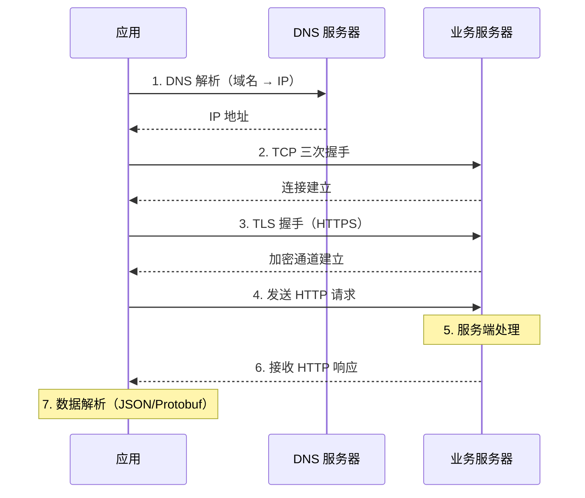
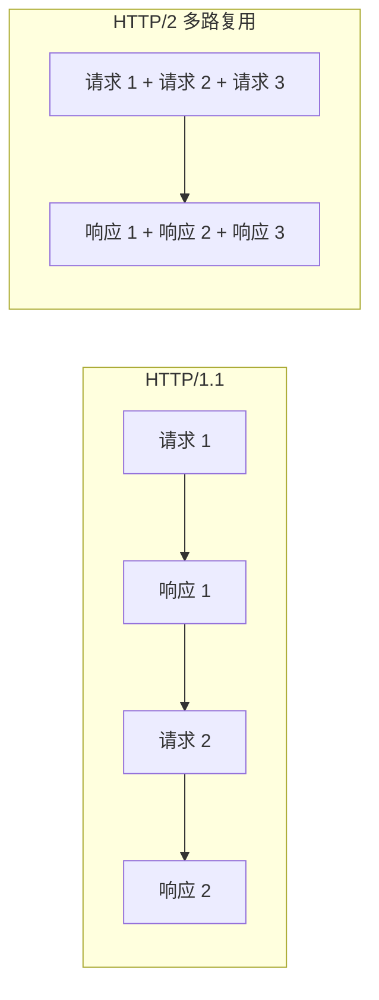
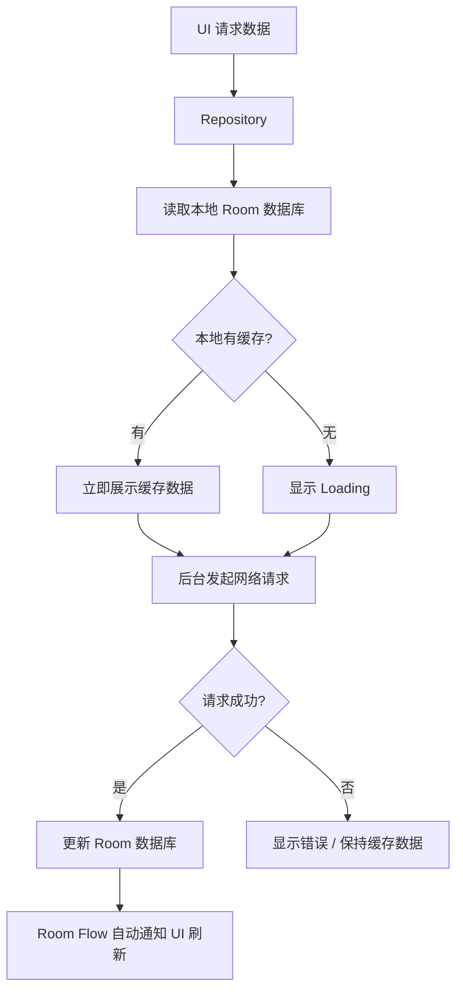

# 网络性能优化

## 网络请求生命周期与耗时分析

### 一次 HTTP 请求的完整链路



**典型耗时分布（首次请求 / 复用连接）：**

| 阶段 | 首次请求 | 连接复用 |
|------|---------|---------|
| DNS 解析 | 50-200ms | 0（已缓存） |
| TCP 握手 | 50-150ms | 0（已复用） |
| TLS 握手 | 100-300ms | 0（已复用） |
| 请求发送 | 1-10ms | 1-10ms |
| 服务端处理 | 50-500ms | 50-500ms |
| 响应接收 | 10-200ms | 10-200ms |
| **总计** | **260-1360ms** | **60-710ms** |

### OkHttp EventListener 监控各阶段耗时

```kotlin
class NetworkTimingListener : EventListener() {

    private var callStartMs = 0L
    private val timings = mutableMapOf<String, Long>()

    override fun callStart(call: Call) {
        callStartMs = SystemClock.elapsedRealtime()
    }

    override fun dnsStart(call: Call, domainName: String) {
        timings["dnsStart"] = SystemClock.elapsedRealtime()
    }

    override fun dnsEnd(call: Call, domainName: String, inetAddressList: List<InetAddress>) {
        timings["dns"] = SystemClock.elapsedRealtime() - (timings["dnsStart"] ?: callStartMs)
    }

    override fun connectStart(call: Call, inetSocketAddress: InetSocketAddress, proxy: Proxy) {
        timings["connectStart"] = SystemClock.elapsedRealtime()
    }

    override fun secureConnectStart(call: Call) {
        timings["tlsStart"] = SystemClock.elapsedRealtime()
    }

    override fun secureConnectEnd(call: Call, handshake: Handshake?) {
        timings["tls"] = SystemClock.elapsedRealtime() - (timings["tlsStart"] ?: callStartMs)
    }

    override fun connectEnd(call: Call, inetSocketAddress: InetSocketAddress, proxy: Proxy, protocol: Protocol?) {
        timings["connect"] = SystemClock.elapsedRealtime() - (timings["connectStart"] ?: callStartMs)
    }

    override fun callEnd(call: Call) {
        val total = SystemClock.elapsedRealtime() - callStartMs
        Log.d("NetworkTiming", buildString {
            append("${call.request().url} 总耗时: ${total}ms")
            timings["dns"]?.let { append(" | DNS: ${it}ms") }
            timings["connect"]?.let { append(" | Connect: ${it}ms") }
            timings["tls"]?.let { append(" | TLS: ${it}ms") }
        })
    }

    companion object {
        val FACTORY = Factory { NetworkTimingListener() }
    }
}

// 注册到 OkHttpClient
val client = OkHttpClient.Builder()
    .eventListenerFactory(NetworkTimingListener.FACTORY)
    .build()
```

## DNS 优化

### 系统 DNS 解析问题

| 问题 | 现象 | 影响 |
|------|------|------|
| DNS 劫持 | 返回非法 IP，跳转到广告/钓鱼页面 | 安全风险、请求失败 |
| 解析超时 | 运营商 LocalDNS 响应慢 | 首次请求耗时增加 200ms+ |
| 缓存失效 | TTL 过期后重新解析 | 间歇性慢请求 |
| 调度不精准 | 返回非最优 CDN 节点 IP | 后续请求延迟增大 |

### HttpDNS 方案

绕过运营商 LocalDNS，通过 HTTP 协议直接向 HttpDNS 服务器查询域名对应的 IP：

```kotlin
class HttpDnsInterceptor(
    private val httpDnsService: HttpDnsService
) : Interceptor {

    override fun intercept(chain: Interceptor.Chain): Response {
        val originalRequest = chain.request()
        val host = originalRequest.url.host

        // 通过 HttpDNS 获取 IP
        val ip = httpDnsService.resolve(host) ?: return chain.proceed(originalRequest)

        // 替换 URL 中的域名为 IP
        val newUrl = originalRequest.url.newBuilder()
            .host(ip)
            .build()

        val newRequest = originalRequest.newBuilder()
            .url(newUrl)
            .header("Host", host) // 保留原始 Host 头，TLS/SNI 需要
            .build()

        return chain.proceed(newRequest)
    }
}
```

### DNS 预解析

在应用启动或空闲时预解析高频访问的域名，避免用户操作时的 DNS 等待：

```kotlin
object DnsPreResolver {

    private val highFreqDomains = listOf(
        "api.example.com",
        "cdn.example.com",
        "img.example.com"
    )

    fun preResolve() {
        val executor = Executors.newFixedThreadPool(3)
        highFreqDomains.forEach { domain ->
            executor.submit {
                try {
                    InetAddress.getAllByName(domain) // 触发 DNS 缓存
                    Log.d("DnsPreResolve", "$domain 预解析成功")
                } catch (e: Exception) {
                    Log.w("DnsPreResolve", "$domain 预解析失败: ${e.message}")
                }
            }
        }
    }
}

// 在 Application.onCreate 的 IdleHandler 中调用
Looper.myQueue().addIdleHandler {
    DnsPreResolver.preResolve()
    false
}
```

## 连接优化

### 连接复用（Connection Pooling）

OkHttp 默认维护一个连接池，复用已建立的 TCP/TLS 连接：

```kotlin
val client = OkHttpClient.Builder()
    .connectionPool(
        ConnectionPool(
            maxIdleConnections = 10,    // 最大空闲连接数
            keepAliveDuration = 5,      // 空闲连接保活时间
            TimeUnit.MINUTES
        )
    )
    .build()
```

> **最佳实践**：整个应用共享一个 `OkHttpClient` 实例，而不是每次请求创建新实例。多个 Client 实例意味着多个独立的连接池，无法复用连接。

### HTTP/2 多路复用

HTTP/2 在单个 TCP 连接上支持多路并发请求，消除了 HTTP/1.1 的队头阻塞问题：



OkHttp 在服务端支持 HTTP/2 时会自动使用，无需客户端额外配置。可以通过 EventListener 验证：

```kotlin
override fun connectEnd(call: Call, inetSocketAddress: InetSocketAddress, proxy: Proxy, protocol: Protocol?) {
    Log.d("Protocol", "${call.request().url.host} 使用协议: $protocol")
    // 输出 h2 表示 HTTP/2, http/1.1 表示 HTTP/1.1
}
```

### QUIC / HTTP/3

QUIC 基于 UDP 协议，相比 TCP 有显著优势：

| 特性 | TCP + TLS 1.3 | QUIC (HTTP/3) |
|------|:---:|:---:|
| 新连接握手 | 2 RTT (TCP + TLS) | 1 RTT (合并) |
| 恢复连接 | 1 RTT | 0 RTT |
| 队头阻塞 | 有（TCP 层面） | 无（流级别独立） |
| 连接迁移 | 不支持（IP 变化断开） | 支持（Connection ID） |

**Cronet（Chromium 网络库）集成：**

```kotlin
// build.gradle.kts
dependencies {
    implementation("org.chromium.net:cronet-api:119.6045.31")
    implementation("org.chromium.net:cronet-embedded:119.6045.31")
}
```

```kotlin
val engine = CronetEngine.Builder(context)
    .enableQuic(true)
    .enableHttp2(true)
    .build()

// 配合 OkHttp 使用 Cronet 作为底层传输
val client = OkHttpClient.Builder()
    .addInterceptor(CronetInterceptor(engine))
    .build()
```

### 连接预建立

在用户尚未发起请求时预先建立到核心服务的连接：

```kotlin
fun preconnect(client: OkHttpClient, url: String) {
    val request = Request.Builder()
        .url(url)
        .method("HEAD", null)
        .build()

    // 低优先级预建立连接
    client.connectionPool // 触发 DNS + TCP + TLS
}
```

## 数据传输优化

### 请求/响应体压缩

OkHttp 默认在请求头中添加 `Accept-Encoding: gzip`，并自动解压响应。但请求体压缩需要手动处理：

```kotlin
class GzipRequestInterceptor : Interceptor {
    override fun intercept(chain: Interceptor.Chain): Response {
        val originalRequest = chain.request()
        val body = originalRequest.body ?: return chain.proceed(originalRequest)

        val compressedRequest = originalRequest.newBuilder()
            .header("Content-Encoding", "gzip")
            .method(originalRequest.method, gzip(body))
            .build()

        return chain.proceed(compressedRequest)
    }

    private fun gzip(body: RequestBody): RequestBody {
        return object : RequestBody() {
            override fun contentType() = body.contentType()
            override fun contentLength() = -1L // 压缩后长度未知

            override fun writeTo(sink: BufferedSink) {
                val gzipSink = GzipSink(sink).buffer()
                body.writeTo(gzipSink)
                gzipSink.close()
            }
        }
    }
}
```

### 精简数据格式

| 方案 | 编码体积 | 解码速度 | 可读性 | 适用场景 |
|------|---------|---------|--------|---------|
| JSON | 大 | 较慢 | 高 | 调试友好的 API |
| Protocol Buffers | 小（比 JSON 小 3-10 倍） | 快（比 JSON 快 5-20 倍） | 低 | 高频/大数据量接口 |
| FlatBuffers | 最小 | 最快（零拷贝） | 低 | 极致性能场景 |

```kotlin
// Protocol Buffers 在 Android 中的使用
// build.gradle.kts
plugins {
    id("com.google.protobuf") version "0.9.4"
}

dependencies {
    implementation("com.google.protobuf:protobuf-kotlin-lite:4.28.0")
}
```

### 请求合并与批处理

```kotlin
// ❌ 并发发送多个小请求
ids.forEach { id ->
    api.getItemDetail(id) // 每个 ID 一次请求
}

// ✅ 批量请求
api.getItemDetails(ids.joinToString(","))

// ✅ 使用 GraphQL 一次获取多个资源
val query = """
    query {
        user(id: "$userId") { name avatar }
        feed(limit: 20) { items { title thumbnail } }
        notifications { unreadCount }
    }
""".trimIndent()
```

### 增量更新与差量同步

```kotlin
// 使用 If-Modified-Since / ETag 实现增量同步
val request = Request.Builder()
    .url("https://api.example.com/data")
    .header("If-None-Match", lastETag) // 上次获取的 ETag
    .build()

val response = client.newCall(request).execute()
when (response.code) {
    200 -> {
        // 数据有更新，解析新数据
        val newETag = response.header("ETag")
        saveETag(newETag)
        parseResponse(response.body)
    }
    304 -> {
        // 数据未变化，使用本地缓存
    }
}
```

## 缓存策略

### OkHttp HTTP 缓存

```kotlin
val cacheDir = File(context.cacheDir, "http_cache")
val cacheSize = 50L * 1024 * 1024 // 50MB

val client = OkHttpClient.Builder()
    .cache(Cache(cacheDir, cacheSize))
    .build()
```

服务端需配合返回正确的 `Cache-Control` 头。如果服务端未正确设置，可通过 Interceptor 强制缓存：

```kotlin
class ForceCacheInterceptor(
    private val maxAgeSeconds: Int = 60
) : Interceptor {
    override fun intercept(chain: Interceptor.Chain): Response {
        val response = chain.proceed(chain.request())
        return response.newBuilder()
            .removeHeader("Pragma")
            .header("Cache-Control", "public, max-age=$maxAgeSeconds")
            .build()
    }
}

// 无网络时使用离线缓存
class OfflineCacheInterceptor(
    private val context: Context
) : Interceptor {
    override fun intercept(chain: Interceptor.Chain): Response {
        var request = chain.request()
        if (!isNetworkAvailable(context)) {
            request = request.newBuilder()
                .cacheControl(CacheControl.FORCE_CACHE)
                .build()
        }
        return chain.proceed(request)
    }
}
```

### 离线优先架构



```kotlin
class ArticleRepository(
    private val api: ArticleApi,
    private val dao: ArticleDao
) {
    fun getArticles(): Flow<List<Article>> = flow {
        // 1. 先发射本地缓存
        val cached = dao.getAll()
        emit(cached)

        // 2. 后台拉取最新数据
        try {
            val remote = api.getArticles()
            dao.replaceAll(remote)
            // 3. Room 会通过 Flow 自动触发新数据发射
        } catch (e: Exception) {
            if (cached.isEmpty()) throw e // 无缓存时抛出错误
        }
    }
}
```

## 弱网优化

### 弱网检测

```kotlin
object NetworkQualityDetector {

    fun getNetworkQuality(context: Context): NetworkQuality {
        val cm = context.getSystemService(Context.CONNECTIVITY_SERVICE) as ConnectivityManager
        val nc = cm.getNetworkCapabilities(cm.activeNetwork) ?: return NetworkQuality.OFFLINE

        val downBandwidthKbps = nc.linkDownstreamBandwidthKbps

        return when {
            downBandwidthKbps >= 10_000 -> NetworkQuality.EXCELLENT
            downBandwidthKbps >= 2_000 -> NetworkQuality.GOOD
            downBandwidthKbps >= 500 -> NetworkQuality.MODERATE
            downBandwidthKbps > 0 -> NetworkQuality.POOR
            else -> NetworkQuality.OFFLINE
        }
    }

    enum class NetworkQuality { EXCELLENT, GOOD, MODERATE, POOR, OFFLINE }
}
```

### 弱网策略

```kotlin
class AdaptiveNetworkInterceptor(
    private val context: Context
) : Interceptor {

    override fun intercept(chain: Interceptor.Chain): Response {
        val quality = NetworkQualityDetector.getNetworkQuality(context)
        val originalRequest = chain.request()

        val request = when (quality) {
            NetworkQuality.POOR -> {
                // 弱网：降级图片质量、增加超时
                originalRequest.newBuilder()
                    .header("X-Image-Quality", "low")
                    .build()
            }
            else -> originalRequest
        }

        val timeout = when (quality) {
            NetworkQuality.EXCELLENT -> 10_000
            NetworkQuality.GOOD -> 15_000
            NetworkQuality.MODERATE -> 20_000
            NetworkQuality.POOR -> 30_000
            NetworkQuality.OFFLINE -> 5_000
        }

        return chain.withConnectTimeout(timeout, TimeUnit.MILLISECONDS)
            .withReadTimeout(timeout, TimeUnit.MILLISECONDS)
            .proceed(request)
    }
}
```

### 弱网模拟与测试

| 工具 | 平台 | 特点 |
|------|------|------|
| Charles Throttling | 全平台 | 预设多种网络条件（3G/Edge/LTE） |
| Android Emulator | 模拟器 | 设置 → Cellular 可调延迟和速度 |
| `adb shell tc` | 设备 | 使用 traffic control 精确控制 |
| Facebook Network Connection Class | 代码 | 自动检测当前网络质量并分级 |

## 图片网络优化

### 图片格式选择

| 格式 | 压缩率 | 透明度 | 动画 | 兼容性 |
|------|--------|--------|------|--------|
| JPEG | 中 | 不支持 | 不支持 | 所有版本 |
| PNG | 低 | 支持 | 不支持 | 所有版本 |
| WebP | 高（比 JPEG 小 25-35%） | 支持 | 支持 | API 18+（有损）/ API 18+（无损） |
| AVIF | 最高（比 WebP 再小 20%） | 支持 | 支持 | API 31+ |

### 按需加载合适尺寸

```kotlin
// 通过 CDN 参数获取合适尺寸的图片，避免加载原图
fun getOptimizedImageUrl(
    originalUrl: String,
    targetWidth: Int,
    targetHeight: Int,
    format: String = "webp"
): String {
    // 阿里云 OSS 图片处理参数示例
    return "${originalUrl}?x-oss-process=image/resize,w_${targetWidth},h_${targetHeight}/format,$format/quality,Q_80"
}

// Glide 配合使用
Glide.with(context)
    .load(getOptimizedImageUrl(url, imageView.width, imageView.height))
    .override(imageView.width, imageView.height)
    .into(imageView)
```

## 网络监控与度量

### 核心监控指标

| 指标 | 计算方式 | 合格基线 |
|------|---------|---------|
| 请求成功率 | 成功请求数 / 总请求数 | > 99.5% |
| 平均耗时 | 所有请求耗时的均值 | < 500ms |
| P95 耗时 | 95 分位的请求耗时 | < 2000ms |
| DNS 耗时 | DNS 解析平均耗时 | < 100ms |
| 连接耗时 | TCP + TLS 握手平均耗时 | < 300ms |
| 首包耗时 | 从请求发送到收到首个字节 | < 800ms |
| 流量消耗 | 单次会话总上下行流量 | 业务相关 |

### 网络异常告警

```kotlin
class NetworkMetricsReporter(
    private val analytics: Analytics
) : EventListener() {

    private var callStartMs = 0L

    override fun callStart(call: Call) {
        callStartMs = SystemClock.elapsedRealtime()
    }

    override fun callEnd(call: Call) {
        val duration = SystemClock.elapsedRealtime() - callStartMs
        analytics.reportNetworkMetric(
            url = call.request().url.encodedPath,
            duration = duration,
            success = true
        )
    }

    override fun callFailed(call: Call, ioe: IOException) {
        val duration = SystemClock.elapsedRealtime() - callStartMs
        analytics.reportNetworkMetric(
            url = call.request().url.encodedPath,
            duration = duration,
            success = false,
            error = ioe.javaClass.simpleName
        )
    }
}
```

## 常见坑点

### 1. Redirect 导致的额外延迟

服务端返回 301/302 重定向，OkHttp 默认自动跟随，但每次重定向意味着一次额外的完整请求（DNS + 连接 + 请求），可能增加 200-500ms 延迟。

**解决方案：** 客户端缓存重定向后的最终 URL；与服务端协调减少不必要的重定向。

### 2. 大文件下载阻塞线程池

大文件下载长时间占用 OkHttp Dispatcher 线程，导致普通 API 请求排队等待。

```kotlin
// ✅ 大文件下载使用独立的 OkHttpClient（独立线程池）
val downloadClient = OkHttpClient.Builder()
    .dispatcher(Dispatcher().apply { maxRequests = 4 })
    .connectTimeout(30, TimeUnit.SECONDS)
    .readTimeout(5, TimeUnit.MINUTES)
    .build()
```

### 3. 证书锁定（Certificate Pinning）失效

证书更新后，旧的 Pin 值失效导致所有请求失败。

```kotlin
// ✅ 配置多个 Pin（当前证书 + 备用证书）
val client = OkHttpClient.Builder()
    .certificatePinner(
        CertificatePinner.Builder()
            .add("api.example.com",
                "sha256/AAAAAAAAAA=",  // 当前证书
                "sha256/BBBBBBBBBB="   // 备用证书（下次更新时使用）
            )
            .build()
    )
    .build()
```

### 4. 未设置合理超时导致长时间等待

OkHttp 默认各超时为 10 秒，弱网环境下可能不够用，但也不应设置过大导致用户长时间等待。

```kotlin
val client = OkHttpClient.Builder()
    .connectTimeout(10, TimeUnit.SECONDS)
    .readTimeout(15, TimeUnit.SECONDS)
    .writeTimeout(15, TimeUnit.SECONDS)
    .callTimeout(30, TimeUnit.SECONDS)   // 整个请求的总超时
    .build()
```

## 踩坑记录

> 此区域供团队成员补充项目中遇到的真实案例。

| 日期 | 记录人 | 问题描述 | 解决方案 |
|------|--------|----------|----------|
| | | | |

## 参考资料

- [Android 官方 - 减少网络耗电量](https://developer.android.com/training/efficient-downloads)
- [OkHttp 官方文档](https://square.github.io/okhttp/)
- [OkHttp EventListener](https://square.github.io/okhttp/features/events/)
- [Cronet - Chromium 网络库](https://developer.android.com/develop/connectivity/cronet)
- [Protocol Buffers 官方文档](https://protobuf.dev/)
- [HTTP/3 (QUIC) 规范 - RFC 9114](https://www.rfc-editor.org/rfc/rfc9114)
- [阿里云 HTTPDNS](https://help.aliyun.com/product/30100.html)
