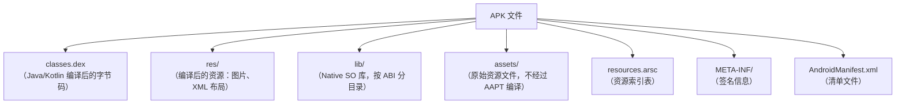

# 包体积优化

## APK 结构与分析

### APK 文件结构

一个 APK 由以下主要部分组成，了解各部分占比是优化的第一步：



**典型 APK 各部分体积占比（参考值）：**

| 部分 | 典型占比 | 说明 |
|------|---------|------|
| lib/ (SO 库) | 30-50% | 通常是体积最大的部分 |
| classes.dex | 15-30% | 代码量与依赖库数量相关 |
| res/ (资源) | 15-25% | 图片资源占大头 |
| assets/ | 5-15% | 字体、预置数据等 |
| resources.arsc | 2-5% | 资源索引表 |
| META-INF/ | 1-2% | 签名信息 |

### APK Analyzer 使用

Android Studio 内置的 APK Analyzer（Build → Analyze APK）可直观查看包体积分布：

```bash
# 命令行方式分析 APK（CI 中可用）
# 使用 bundletool 分析 AAB
bundletool build-apks --bundle=app.aab --output=app.apks --mode=universal
unzip app.apks universal.apk -d output/

# 使用 apkanalyzer（SDK 自带）
$ANDROID_HOME/cmdline-tools/latest/bin/apkanalyzer apk summary app-release.apk
$ANDROID_HOME/cmdline-tools/latest/bin/apkanalyzer apk file-size app-release.apk
$ANDROID_HOME/cmdline-tools/latest/bin/apkanalyzer dex references app-release.apk
```

**APK Analyzer 关注点：**

1. 按文件大小排序，找出体积最大的文件
2. 对比两个版本的 APK，查看体积增量来源
3. 查看 DEX 方法数，评估是否需要 MultiDex

### 包体积基线建立

```kotlin
// CI 脚本中记录每次构建的 APK 大小
// build.gradle.kts
tasks.register("recordApkSize") {
    dependsOn("assembleRelease")
    doLast {
        val apkDir = layout.buildDirectory.dir("outputs/apk/release").get()
        apkDir.asFile.listFiles()?.filter { it.extension == "apk" }?.forEach { apk ->
            val sizeMB = apk.length() / (1024.0 * 1024.0)
            println("APK_SIZE: ${apk.name} = ${"%.2f".format(sizeMB)} MB")
        }
    }
}
```

## 代码优化

### R8 / ProGuard 代码缩减

R8 是 Android 官方的代码缩减、混淆和优化工具，替代了 ProGuard：

```kotlin
// app/build.gradle.kts
android {
    buildTypes {
        release {
            isMinifyEnabled = true  // 启用代码缩减
            isShrinkResources = true // 启用资源缩减
            proguardFiles(
                getDefaultProguardFile("proguard-android-optimize.txt"),
                "proguard-rules.pro"
            )
        }
    }
}
```

**R8 Full Mode（更激进的优化）：**

```properties
# gradle.properties
android.enableR8.fullMode=true
```

Full Mode 相比默认模式额外执行：
- 更激进的类合并（Class Merging）
- 移除更多未使用的代码路径
- 更强的常量折叠和内联

> **注意**：Full Mode 可能导致反射、序列化相关代码被错误移除，需要完善的 keep 规则。

**常用 keep 规则：**

```proguard
# 保留 Serializable 类的字段名（JSON 解析需要）
-keepclassmembers class * implements java.io.Serializable {
    static final long serialVersionUID;
    private static final java.io.ObjectStreamField[] serialPersistentFields;
    !static !transient <fields>;
}

# 保留 data class 用于 Gson/Moshi 的字段名
-keep class com.example.app.model.** { *; }

# 保留 @Keep 注解标记的类和方法
-keep @androidx.annotation.Keep class *
-keepclassmembers class * {
    @androidx.annotation.Keep *;
}

# 保留枚举值名称（某些序列化场景需要）
-keepclassmembers enum * {
    public static **[] values();
    public static ** valueOf(java.lang.String);
}
```

### 无用代码移除

```bash
# Lint 检查未使用的代码
./gradlew lint
# 关注 UnusedResources、UnusedDeclaration 等规则
```

**定期审计依赖树：**

```bash
# 查看完整依赖树
./gradlew :app:dependencies --configuration releaseRuntimeClasspath

# 查找特定依赖被哪些库引入
./gradlew :app:dependencyInsight --dependency guava --configuration releaseRuntimeClasspath
```

### Kotlin 特有优化

```kotlin
// Kotlin lambda 会生成匿名内部类，增加方法数和 DEX 大小
// 对高频调用的小函数使用 inline 减少类生成
inline fun <T> measureTimeAndLog(tag: String, block: () -> T): T {
    val start = System.currentTimeMillis()
    val result = block()
    Log.d(tag, "耗时: ${System.currentTimeMillis() - start}ms")
    return result
}

// data class 的 copy()、componentN()、toString() 方法占用方法数
// 如果不需要这些功能，使用普通 class 替代
```

## 资源优化

### 无用资源移除

```kotlin
// build.gradle.kts
android {
    buildTypes {
        release {
            isShrinkResources = true // 配合 isMinifyEnabled 使用
        }
    }
}
```

**保留动态引用的资源：**

```xml
<!-- res/raw/keep.xml -->
<?xml version="1.0" encoding="utf-8"?>
<resources xmlns:tools="http://schemas.android.com/tools"
    tools:keep="@layout/layout_dynamic_*,@drawable/icon_*"
    tools:shrinkMode="safe" />
```

### 图片资源压缩

| 优化手段 | 节省比例 | 适用场景 |
|---------|---------|---------|
| PNG → WebP | 25-35% | 所有图片（API 18+） |
| PNG → AVIF | 40-50% | API 31+ 设备 |
| PNG 无损压缩（pngcrush） | 5-15% | 需要保持 PNG 格式 |
| SVG → VectorDrawable | 70-90% | 图标、简单图形 |

```bash
# 批量将 PNG 转换为 WebP（Android Studio 内置功能）
# 右键 res/drawable → Convert to WebP

# 命令行批量转换
find res/ -name "*.png" -exec cwebp {} -o {}.webp -q 80 \;
```

**Gradle 自动 WebP 转换：**

```kotlin
// AGP 会在构建时自动将 PNG 转换为 WebP（Release 构建）
android {
    buildTypes {
        release {
            // AGP 4.0+ 默认启用
        }
    }
}
```

### 资源混淆（AndResGuard）

将资源路径名从 `res/drawable-xxhdpi/ic_launcher_background.png` 缩短为 `r/d/a.png`，减少 resources.arsc 和 ZIP 条目大小：

```kotlin
// build.gradle.kts (项目级)
buildscript {
    dependencies {
        classpath("com.tencent.mm:AndResGuard-gradle-plugin:1.2.21")
    }
}

// build.gradle.kts (app 级)
apply(plugin = "AndResGuard")

configure<com.tencent.mm.androlib.res.AndResGuardExtension> {
    mappingFile = null
    isUse7zip = true
    isUseSign = true
    keepRoot = false
    whiteList = listOf(
        "R.drawable.icon",         // 保留启动图标名称
        "R.string.app_name",
        "R.mipmap.ic_launcher*"
    )
}
```

### 按需配置资源

```kotlin
android {
    defaultConfig {
        // 只保留中文和英文资源，移除第三方库携带的其他语言
        resourceConfigurations += listOf("zh-rCN", "en")
    }
}
```

### 矢量图替代位图

```xml
<!-- 一个 VectorDrawable 约 1KB，替代多套 PNG（xxhdpi 一张可能 10-50KB） -->
<vector xmlns:android="http://schemas.android.com/apk/res/android"
    android:width="24dp"
    android:height="24dp"
    android:viewportWidth="24"
    android:viewportHeight="24">
    <path
        android:fillColor="#FF000000"
        android:pathData="M12,2L2,22h20L12,2z" />
</vector>
```

> **限制**：VectorDrawable 不适合复杂图形（路径节点过多渲染慢）；API 21 以下需要 `vectorDrawables.useSupportLibrary = true`。

## SO 库优化

### ABI 过滤

大部分现代设备使用 arm64-v8a，只保留必要的 ABI 可显著减小体积：

```kotlin
android {
    defaultConfig {
        ndk {
            abiFilters += listOf("arm64-v8a") // 只保留 64 位
            // 如需兼容旧设备，加上 "armeabi-v7a"
        }
    }
}
```

| ABI | 设备覆盖率 | 说明 |
|-----|-----------|------|
| arm64-v8a | > 95% | 现代 64 位 ARM 设备 |
| armeabi-v7a | > 99%（含兼容） | 32 位 ARM，arm64 设备可兼容运行 |
| x86_64 | < 2% | 部分 Intel 平板和模拟器 |
| x86 | < 1% | 极少量旧设备和模拟器 |

### SO 库压缩与延迟加载

```kotlin
// Android 6.0+ 支持不压缩 SO 库直接 mmap 加载
android {
    packagingOptions {
        jniLibs {
            useLegacyPackaging = false // 默认 false（AGP 7.0+）
            // false: SO 不压缩，APK 稍大但安装后占用更小（不需要解压）
        }
    }
}
```

**动态下载 SO 库（极端优化）：**

```kotlin
object SoLoader {
    fun loadSoFromNetwork(context: Context, soName: String, url: String) {
        val soFile = File(context.filesDir, "libs/$soName")
        if (!soFile.exists()) {
            // 从网络下载 SO 文件
            downloadFile(url, soFile)
        }
        System.load(soFile.absolutePath)
    }
}
```

### 裁剪不需要的 Native 符号

```cmake
# CMakeLists.txt
# 隐藏非导出符号，减小 SO 体积
set(CMAKE_C_FLAGS "${CMAKE_C_FLAGS} -fvisibility=hidden")
set(CMAKE_CXX_FLAGS "${CMAKE_CXX_FLAGS} -fvisibility=hidden")

# Release 构建去除调试信息
set(CMAKE_C_FLAGS_RELEASE "${CMAKE_C_FLAGS_RELEASE} -Os -DNDEBUG")
set(CMAKE_CXX_FLAGS_RELEASE "${CMAKE_CXX_FLAGS_RELEASE} -Os -DNDEBUG")
```

```bash
# 手动 strip SO 文件
$ANDROID_NDK/toolchains/llvm/prebuilt/linux-x86_64/bin/llvm-strip --strip-unneeded libexample.so
```

## DEX 优化

### 方法数与 DEX 数量

每个 DEX 文件有 64K 方法引用限制。过多的 DEX 文件会增加包体积（每个 DEX 有固定头部开销）和启动耗时。

```bash
# 查看 DEX 方法数
$ANDROID_HOME/cmdline-tools/latest/bin/apkanalyzer dex references app-release.apk
# 输出示例：
# classes.dex  59231
# classes2.dex 12456
```

**减少方法数的手段：**
- 启用 R8 代码缩减（最有效）
- 审计第三方依赖，移除不必要的大型库
- 使用 `implementation` 替代 `api`，减少传递依赖

### 移除调试信息

```proguard
# 移除源文件名和行号信息（减少 DEX 大小，但会影响 Crash 堆栈可读性）
# 建议保留行号以便线上崩溃分析
-keepattributes SourceFile,LineNumberTable

# 如果接受不可读堆栈，可移除以进一步减小体积
# -renamesourcefileattribute SourceFile
```

## 动态化方案

### Play Feature Delivery

```kotlin
// 使用 Dynamic Feature Module
// settings.gradle.kts
include(":app", ":feature_camera")

// feature_camera/build.gradle.kts
plugins {
    id("com.android.dynamic-feature")
}

android {
    namespace = "com.example.feature.camera"
}

dependencies {
    implementation(project(":app"))
}
```

```xml
<!-- feature_camera/src/main/AndroidManifest.xml -->
<manifest xmlns:android="http://schemas.android.com/apk/res/android"
    xmlns:dist="http://schemas.android.com/apk/distribution">

    <dist:module
        dist:instant="false"
        dist:title="@string/feature_camera_title">
        <dist:delivery>
            <dist:on-demand /> <!-- 按需下载 -->
        </dist:delivery>
        <dist:fusing dist:include="true" />
    </dist:module>
</manifest>
```

```kotlin
// 在主模块中请求下载 Dynamic Feature
val splitInstallManager = SplitInstallManagerFactory.create(context)

val request = SplitInstallRequest.newBuilder()
    .addModule("feature_camera")
    .build()

splitInstallManager.startInstall(request)
    .addOnSuccessListener { sessionId ->
        Log.d("DynamicFeature", "安装成功: $sessionId")
    }
    .addOnFailureListener { exception ->
        Log.e("DynamicFeature", "安装失败", exception)
    }
```

### AAB（Android App Bundle）

AAB 让 Google Play 根据用户设备自动生成优化的 APK（只包含设备需要的 ABI、语言、密度资源）：

| 对比 | APK | AAB |
|------|-----|-----|
| 设备适配 | 包含所有 ABI 和密度 | 按设备拆分 |
| 下载大小 | 较大 | 平均小 15-20% |
| 上架渠道 | 所有渠道 | Google Play（其他渠道需自行 bundletool） |

```bash
# 使用 bundletool 从 AAB 生成设备专用 APK
bundletool build-apks \
  --bundle=app.aab \
  --output=app.apks \
  --connected-device # 针对当前连接设备生成

bundletool install-apks --apks=app.apks
```

## 包体积监控与防劣化

### CI 包体积卡点

```bash
#!/bin/bash
# ci_apk_size_check.sh
MAX_SIZE_MB=30
APK_PATH="app/build/outputs/apk/release/app-release.apk"

SIZE_BYTES=$(stat -f%z "$APK_PATH" 2>/dev/null || stat -c%s "$APK_PATH")
SIZE_MB=$(echo "scale=2; $SIZE_BYTES / 1024 / 1024" | bc)

echo "当前 APK 大小: ${SIZE_MB}MB (阈值: ${MAX_SIZE_MB}MB)"

if (( $(echo "$SIZE_MB > $MAX_SIZE_MB" | bc -l) )); then
    echo "❌ APK 体积超过阈值！请检查本次变更引入的体积增量。"
    exit 1
fi
echo "✅ APK 体积正常"
```

### 依赖库体积审计

```bash
# 分析每个依赖对 APK 体积的贡献
./gradlew :app:dependencies --configuration releaseRuntimeClasspath | \
  grep -E "^[+\\\\]" | \
  awk '{print $NF}' | sort -u
```

定期审查大型依赖库，评估是否可以替换为更轻量的替代品：

| 场景 | 重量级方案 | 轻量替代 | 体积差异 |
|------|----------|---------|---------|
| JSON 解析 | Gson (250KB) | Moshi (170KB) / kotlinx.serialization (100KB) | 50-150KB |
| 图片加载 | Glide (600KB) | Coil (300KB) | ~300KB |
| 日期时间 | Joda-Time (600KB) | java.time (系统内置) / ThreeTenABP (100KB) | ~500KB |
| HTTP | Retrofit + OkHttp (500KB) | Ktor Client (200KB) | ~300KB |

## 常见坑点

### 1. 引入大型依赖导致体积暴增

引入一个小功能（如 Google Guava 的某个工具类），却把整个 Guava 库（2.5MB）打包进 APK。

**解决方案：** 只引入需要的子模块（如 `guava-android`），或直接复制需要的工具方法。

### 2. 多语言资源未裁剪

AppCompat、Material 等 Jetpack 库自带几十种语言的字符串资源，每种语言增加几十 KB。

```kotlin
// ✅ 只保留应用实际支持的语言
defaultConfig {
    resourceConfigurations += listOf("zh-rCN", "en")
}
```

### 3. shrinkResources 误删资源

通过字符串拼接动态引用的资源（`getIdentifier("icon_$type")`）会被 R8 误判为未使用而删除。

```xml
<!-- ✅ 在 res/raw/keep.xml 中声明保留 -->
<resources xmlns:tools="http://schemas.android.com/tools"
    tools:keep="@drawable/icon_*" />
```

### 4. Debug 与 Release 包体积差异大

Debug 包不经过 R8 混淆和缩减，体积通常是 Release 包的 2-3 倍。包体积优化效果必须以 Release 包为基准。

## 踩坑记录

> 此区域供团队成员补充项目中遇到的真实案例。

| 日期 | 记录人 | 问题描述 | 解决方案 |
|------|--------|----------|----------|
| | | | |

## 参考资料

- [Android 官方 - 缩减应用大小](https://developer.android.com/topic/performance/reduce-apk-size)
- [Android 官方 - R8 缩减](https://developer.android.com/build/shrink-code)
- [Android 官方 - Android App Bundle](https://developer.android.com/guide/app-bundle)
- [Android 官方 - Play Feature Delivery](https://developer.android.com/guide/playcore/feature-delivery)
- [Android 官方 - APK Analyzer](https://developer.android.com/studio/debug/apk-analyzer)
- [AndResGuard - GitHub](https://github.com/nicklfy/AndResGuard)
- [Bundletool](https://developer.android.com/studio/command-line/bundletool)
