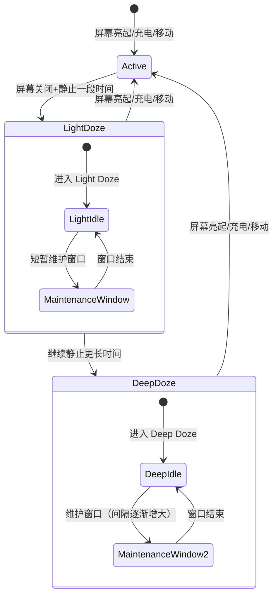
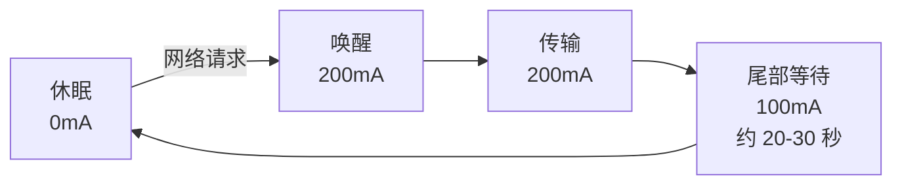

# 功耗优化

## Android 电量管理机制

### Doze 模式

Android 6.0 引入的省电机制，当设备处于静止、未充电、屏幕关闭状态时进入 Doze 模式，限制后台活动。



**Doze 模式下的限制：**

| 限制项 | Light Doze | Deep Doze |
|--------|:---:|:---:|
| 网络访问 | 暂停 | 暂停 |
| WakeLock | 忽略 | 忽略 |
| AlarmManager | 推迟 | 推迟（除 setAlarmClock） |
| JobScheduler/WorkManager | 推迟 | 推迟 |
| GPS/WiFi 扫描 | 暂停 | 暂停 |
| Sync Adapter | 推迟 | 推迟 |

### App Standby Buckets

Android 9.0 引入应用待机分组，根据应用使用频率分为五档，每档享有不同的后台资源配额：

| 分组 | 使用频率 | Job 频率限制 | Alarm 频率限制 | 网络限制 |
|------|---------|-------------|---------------|---------|
| Active | 正在使用 | 无限制 | 无限制 | 无限制 |
| Working Set | 经常使用 | 2 小时内最多 10 次 | 6 分钟 | 无限制 |
| Frequent | 常规使用 | 8 小时内最多 10 次 | 30 分钟 | 无限制 |
| Rare | 很少使用 | 24 小时内最多 5 次 | 2 小时 | 有限 |
| Restricted | 极少使用（Android 12+） | 每天 1 次 | 每天 1 次 | 有限 |

```bash
# 查看应用当前所在分组
adb shell am get-standby-bucket com.example.app

# 手动设置分组（测试用）
adb shell am set-standby-bucket com.example.app rare
```

### 后台执行限制演进

| Android 版本 | 限制 |
|-------------|------|
| 6.0 | Doze 模式限制后台网络和 WakeLock |
| 7.0 | 移动中也可进入 Light Doze |
| 8.0 | **后台 Service 限制**：应用进入后台后 ~1 分钟 Service 被停止 |
| 9.0 | App Standby Buckets 分级限制 |
| 12 | **前台 Service 启动限制**：后台应用无法启动前台 Service（少数例外） |
| 14 | 前台 Service 类型必须声明；短时前台 Service 超时限制 |

## 功耗分析工具

### Battery Historian

Battery Historian 将 `bugreport` 数据可视化为时间线，直观展示各组件的唤醒和耗电情况：

```bash
# 1. 重置电量统计
adb shell dumpsys batterystats --reset

# 2. 断开 USB（避免充电干扰），正常使用应用一段时间

# 3. 重新连接 USB，导出 bugreport
adb bugreport bugreport.zip

# 4. 启动 Battery Historian（Docker 方式）
docker run -p 9999:9999 gcr.io/android-battery-historian/stable:3.1 \
  --port 9999

# 5. 浏览器打开 http://localhost:9999 上传 bugreport.zip
```

**Battery Historian 关注要点：**

- **Wakelock 时间线**：哪些 WakeLock 长时间持有
- **Job 调度**：JobScheduler/WorkManager 的执行频率和时长
- **网络活动**：无线模块唤醒次数和传输量
- **GPS 使用**：定位请求频率和时长
- **Alarm 触发**：AlarmManager 的唤醒频率

### dumpsys batterystats

```bash
# 查看指定应用的电量消耗明细
adb shell dumpsys batterystats --charged com.example.app

# 关键输出字段
#   Uid u0a123: 电量使用概览
#     WiFi: 12.5mAh (网络消耗)
#     Sensor: 3.2mAh (传感器消耗)
#     GPS: 8.1mAh (定位消耗)
#     Wake lock: 15 partial wake locks (WakeLock 次数)
#     Jobs: 8 jobs (Job 执行次数)
```

### Android Studio Energy Profiler

在 Android Studio Profiler 中的 Energy 标签页可以实时查看应用的 CPU、网络、GPS 能耗分布和 WakeLock/Alarm/Job 事件。

## CPU 功耗优化

### 避免不必要的后台 CPU 占用

```kotlin
// ❌ 后台空转轮询
class PollingService : Service() {
    private val handler = Handler(Looper.getMainLooper())

    private val pollTask = object : Runnable {
        override fun run() {
            checkForUpdates() // 每 5 秒检查一次
            handler.postDelayed(this, 5000)
        }
    }

    override fun onStartCommand(intent: Intent?, flags: Int, startId: Int): Int {
        handler.post(pollTask) // 即使应用在后台也持续执行
        return START_STICKY
    }
}

// ✅ 使用 WorkManager 定期任务，由系统智能调度
class UpdateCheckWorker(
    context: Context, params: WorkerParameters
) : CoroutineWorker(context, params) {

    override suspend fun doWork(): Result {
        return try {
            checkForUpdates()
            Result.success()
        } catch (e: Exception) {
            Result.retry()
        }
    }
}

// 注册定期任务
val workRequest = PeriodicWorkRequestBuilder<UpdateCheckWorker>(
    repeatInterval = 15, TimeUnit.MINUTES // 最短 15 分钟
).setConstraints(
    Constraints.Builder()
        .setRequiredNetworkType(NetworkType.CONNECTED)
        .build()
).build()

WorkManager.getInstance(context).enqueueUniquePeriodicWork(
    "update_check",
    ExistingPeriodicWorkPolicy.KEEP,
    workRequest
)
```

### 计算任务调度优化

```kotlin
// ✅ 大量数据处理推迟到充电时执行
val heavyWorkRequest = OneTimeWorkRequestBuilder<DataProcessingWorker>()
    .setConstraints(
        Constraints.Builder()
            .setRequiresCharging(true)      // 充电时执行
            .setRequiresDeviceIdle(true)     // 设备空闲时执行
            .build()
    )
    .build()
```

## 网络功耗优化

无线模块（WiFi/蜂窝）的功耗模型呈阶梯状：唤醒 → 高功耗传输 → 尾部空闲等待 → 休眠。每次网络请求都会经历这个周期。



### 批量网络请求

```kotlin
// ❌ 多个小请求分散发送，每次唤醒无线模块
analytics.reportEvent("page_view")    // 第 1 次唤醒
analytics.reportEvent("button_click") // 第 2 次唤醒（尾部等待刚结束）
analytics.reportEvent("scroll")       // 第 3 次唤醒

// ✅ 批量缓存，达到阈值或定时统一发送
class BatchAnalytics(private val context: Context) {
    private val buffer = mutableListOf<AnalyticsEvent>()
    private val maxBatchSize = 20

    fun reportEvent(event: AnalyticsEvent) {
        synchronized(buffer) {
            buffer.add(event)
            if (buffer.size >= maxBatchSize) {
                flush()
            }
        }
    }

    fun flush() {
        val batch: List<AnalyticsEvent>
        synchronized(buffer) {
            batch = buffer.toList()
            buffer.clear()
        }
        if (batch.isNotEmpty()) {
            // 通过 WorkManager 统一发送
            val data = Data.Builder()
                .putString("events", Gson().toJson(batch))
                .build()
            val request = OneTimeWorkRequestBuilder<UploadWorker>()
                .setInputData(data)
                .setConstraints(Constraints.Builder()
                    .setRequiredNetworkType(NetworkType.CONNECTED)
                    .build())
                .build()
            WorkManager.getInstance(context).enqueue(request)
        }
    }
}
```

### 推送优化

```kotlin
// ❌ 使用长连接轮询（持续消耗网络和 CPU）
while (isRunning) {
    val response = api.pollMessages()
    processMessages(response)
    Thread.sleep(10_000)
}

// ✅ 使用 FCM / 厂商推送通道
// FCM 利用系统级长连接，多个应用共享一个连接，功耗极低
class MyFirebaseMessagingService : FirebaseMessagingService() {
    override fun onMessageReceived(remoteMessage: RemoteMessage) {
        remoteMessage.data.let { data ->
            processMessages(data)
        }
    }
}
```

## WakeLock 管理

### WakeLock 类型

| 类型 | 保持 CPU | 保持屏幕 | 使用场景 |
|------|:---:|:---:|---------|
| PARTIAL_WAKE_LOCK | 是 | 否 | 后台计算、音乐播放 |
| SCREEN_DIM_WAKE_LOCK | 是 | 暗屏 | 已废弃 |
| SCREEN_BRIGHT_WAKE_LOCK | 是 | 亮屏 | 已废弃 |
| FULL_WAKE_LOCK | 是 | 亮屏+键盘灯 | 已废弃 |

> **注意**：只有 `PARTIAL_WAKE_LOCK` 仍然推荐使用，屏幕相关的 WakeLock 已废弃，应使用 `FLAG_KEEP_SCREEN_ON`。

### WakeLock 最佳实践

```kotlin
// ❌ WakeLock 泄漏：忘记释放
val wakeLock = powerManager.newWakeLock(PowerManager.PARTIAL_WAKE_LOCK, "app:task")
wakeLock.acquire() // 获取后未释放

// ✅ 设置超时自动释放
val wakeLock = powerManager.newWakeLock(PowerManager.PARTIAL_WAKE_LOCK, "app:task")
wakeLock.acquire(10 * 60 * 1000L) // 最多持有 10 分钟

// ✅ 使用 try-finally 确保释放
wakeLock.acquire(5 * 60 * 1000L)
try {
    doBackgroundWork()
} finally {
    if (wakeLock.isHeld) {
        wakeLock.release()
    }
}

// ✅ 最佳方案：使用 WorkManager 替代手动 WakeLock
// WorkManager 内部自动管理 WakeLock
```

### WakeLock 泄漏检测

```bash
# 查看系统中所有活跃的 WakeLock
adb shell dumpsys power | grep -A 5 "Wake Locks"

# Battery Historian 中查看 WakeLock 时间线
# 红色长条 = WakeLock 长时间持有 = 潜在泄漏
```

## GPS 与传感器功耗优化

### 定位精度与功耗平衡

| Provider | 精度 | 功耗 | 适用场景 |
|----------|------|------|---------|
| GPS_PROVIDER | 2-10m | 高（25-50mA） | 导航、户外运动 |
| NETWORK_PROVIDER | 50-100m | 中（10-20mA） | 城市级定位 |
| PASSIVE_PROVIDER | 取决于其他应用 | 极低 | 不主动定位，搭便车 |
| FusedLocationProvider | 自适应 | 自适应 | **推荐**，Google Play 服务 |

```kotlin
// ✅ 使用 FusedLocationProvider + 按需精度
val locationRequest = LocationRequest.Builder(
    Priority.PRIORITY_BALANCED_POWER_ACCURACY, // 平衡精度和功耗
    30_000L // 30 秒间隔
).apply {
    setMinUpdateDistanceMeters(50f) // 移动 50 米才更新
    setMaxUpdateDelayMillis(60_000L) // 允许系统延迟 60 秒批量上报
}.build()

// 生命周期感知：不可见时停止定位
lifecycle.addObserver(object : DefaultLifecycleObserver {
    override fun onResume(owner: LifecycleOwner) {
        fusedLocationClient.requestLocationUpdates(locationRequest, callback, Looper.getMainLooper())
    }
    override fun onPause(owner: LifecycleOwner) {
        fusedLocationClient.removeLocationUpdates(callback)
    }
})
```

### 传感器管理

```kotlin
// ❌ 注册后忘记注销
sensorManager.registerListener(listener, accelerometer, SensorManager.SENSOR_DELAY_NORMAL)
// Activity 销毁后传感器持续工作，消耗电量

// ✅ 在 onPause/onDestroy 中注销
override fun onPause() {
    super.onPause()
    sensorManager.unregisterListener(listener)
}

// ✅ 选择合适的采样率
// SENSOR_DELAY_FASTEST = 0ms   → 极高功耗
// SENSOR_DELAY_GAME    = 20ms  → 游戏场景
// SENSOR_DELAY_UI      = 60ms  → 界面交互
// SENSOR_DELAY_NORMAL  = 200ms → 常规需求

// ✅ 使用批量传感器事件（API 19+），允许系统缓冲事件
sensorManager.registerListener(
    listener,
    accelerometer,
    SensorManager.SENSOR_DELAY_NORMAL,
    5_000_000 // maxReportLatencyUs: 允许最多 5 秒延迟批量上报
)
```

## 后台任务优化

### WorkManager 最佳实践

```kotlin
// 场景：定期同步数据，仅在 WiFi + 充电时执行
val syncRequest = PeriodicWorkRequestBuilder<SyncWorker>(
    1, TimeUnit.HOURS   // 每小时一次
).setConstraints(
    Constraints.Builder()
        .setRequiredNetworkType(NetworkType.UNMETERED) // WiFi
        .setRequiresCharging(true)                      // 充电中
        .setRequiresDeviceIdle(true)                    // 空闲时
        .build()
).setBackoffCriteria(
    BackoffPolicy.EXPONENTIAL,
    1, TimeUnit.MINUTES  // 失败重试：1min → 2min → 4min
).build()
```

### AlarmManager 优化

```kotlin
// ❌ 使用精确闹钟频繁唤醒（每 30 秒）
alarmManager.setRepeating(
    AlarmManager.ELAPSED_REALTIME_WAKEUP,
    SystemClock.elapsedRealtime(),
    30_000, pendingIntent
)

// ✅ 使用非精确闹钟，允许系统对齐多个闹钟
alarmManager.setInexactRepeating(
    AlarmManager.ELAPSED_REALTIME,  // 不唤醒 CPU
    SystemClock.elapsedRealtime() + 60_000,
    AlarmManager.INTERVAL_FIFTEEN_MINUTES,
    pendingIntent
)
```

## 常见坑点

### 1. 后台 Service 持有 WakeLock 不释放

导致设备无法进入 Doze 模式，电量快速消耗。Battery Historian 中表现为一条持续的 WakeLock 红线。

**解决方案：** 使用 `wakeLock.acquire(timeoutMs)` 设置超时；优先使用 WorkManager。

### 2. 频繁的位置更新请求

GPS 持续工作导致每小时耗电 5-10%，用户投诉耗电异常。

**解决方案：** 根据场景动态调整定位频率；不可见时停止定位；使用 Geofencing 替代持续定位。

### 3. 动画/定时器未在 onPause 中停止

Activity 不可见时仍在执行 ValueAnimator 或 Timer 定时刷新，持续消耗 CPU。

```kotlin
// ✅ 在 onPause 中暂停，onResume 中恢复
override fun onPause() {
    super.onPause()
    animator.pause()
    refreshTimer?.cancel()
}
```

### 4. 第三方 SDK 的隐式功耗

推送 SDK、统计 SDK 可能在后台频繁唤醒设备建立网络连接。

**排查方式：** 通过 Battery Historian 查看各 UID 的网络唤醒次数和 WakeLock 时长；使用 `adb shell dumpsys alarm` 查看注册的 Alarm。

## 踩坑记录

> 此区域供团队成员补充项目中遇到的真实案例。

| 日期 | 记录人 | 问题描述 | 解决方案 |
|------|--------|----------|----------|
| | | | |

## 参考资料

- [Android 官方 - 优化电池续航](https://developer.android.com/topic/performance/power)
- [Android 官方 - Doze 和 App Standby](https://developer.android.com/training/monitoring-device-state/doze-standby)
- [Android 官方 - WorkManager](https://developer.android.com/topic/libraries/architecture/workmanager)
- [Android 官方 - 位置信息最佳做法](https://developer.android.com/develop/sensors-and-location/location/battery)
- [Battery Historian](https://developer.android.com/topic/performance/power/battery-historian)
- [Android 官方 - 前台 Service 类型](https://developer.android.com/develop/background-work/services/foreground-services)
