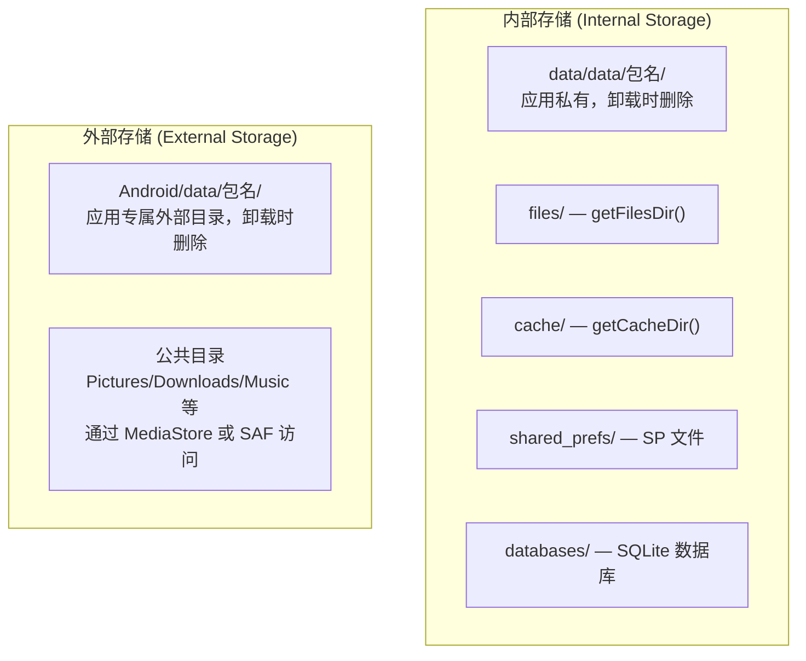
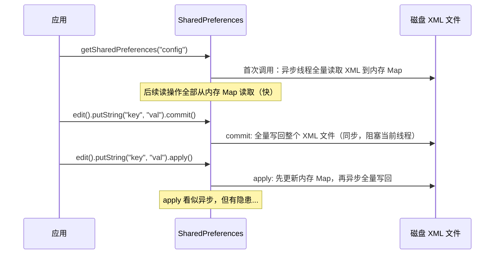

# IO 与存储性能

## Android 存储模型概述



**存储介质性能差异：**

| 存储位置 | 顺序读 | 顺序写 | 随机读 | 安全性 |
|---------|--------|--------|--------|--------|
| 内部存储 | 快 | 快 | 快 | 应用沙箱保护 |
| 外部专属目录 | 快 | 快 | 快 | 仅本应用可访问 |
| 公共外部存储 | 中 | 中 | 中 | 需要 MediaStore/SAF |

### Scoped Storage（分区存储）

Android 10 引入分区存储，限制应用直接访问外部存储的公共目录。对性能的影响：

- `MediaStore` 查询通过 `ContentProvider` 跨进程调用，比直接文件 IO 慢 5-10 倍
- `SAF (Storage Access Framework)` 的文件选择涉及 Intent 跳转和 URI 权限，更重
- 应用专属目录 `getExternalFilesDir()` 不受影响，与直接 IO 性能一致

## SharedPreferences 性能问题

### SP 的工作原理



### SP 的性能陷阱

**陷阱一：apply() 在 Activity 停止时的隐式同步等待**

`apply()` 将写操作提交到 `QueuedWork` 队列异步执行。但在 `Activity.onPause()` 和 `Service.onStop()` 时，系统会调用 `QueuedWork.waitToFinish()` 强制等待所有 pending 写操作完成。如果 SP 文件很大或有多个待写操作，可能阻塞主线程导致 ANR。

```kotlin
// 源码路径：ActivityThread.handleStopActivity()
private void handleStopActivity(IBinder token, ...) {
    ...
    // 等待所有 SP apply 完成
    QueuedWork.waitToFinish(); // 可能阻塞数百毫秒！
    ...
}
```

**陷阱二：SP 文件过大**

每次 `commit/apply` 都是全量写回整个 XML 文件，文件越大写入越慢。

**陷阱三：多进程不安全**

`MODE_MULTI_PROCESS` 已废弃，SP 不支持跨进程安全读写。

### MMKV 替代方案

MMKV 基于 mmap 内存映射和 protobuf 编码，读写性能远优于 SP：

```kotlin
// build.gradle.kts
dependencies {
    implementation("com.tencent:mmkv:1.3.5")
}
```

```kotlin
// 初始化
MMKV.initialize(context)

// 基本使用（API 与 SP 类似）
val kv = MMKV.defaultMMKV()
kv.encode("key_string", "value")
kv.encode("key_int", 42)
kv.encode("key_bool", true)

val str = kv.decodeString("key_string", "default")
val num = kv.decodeInt("key_int", 0)
```

**从 SP 迁移到 MMKV：**

```kotlin
val oldSP = context.getSharedPreferences("config", Context.MODE_PRIVATE)
val mmkv = MMKV.mmkvWithID("config")
mmkv.importFromSharedPreferences(oldSP)
oldSP.edit().clear().apply() // 迁移完成后清空旧 SP
```

**性能对比（参考数据）：**

| 操作 | SharedPreferences | MMKV | 提升倍数 |
|------|:-:|:-:|:-:|
| 写入 1000 次 int | ~500ms | ~10ms | 50x |
| 读取 1000 次 int | ~5ms | ~3ms | 1.5x |
| 写入 1000 次 String | ~1000ms | ~15ms | 65x |

### Jetpack DataStore

Google 推荐的 SP 替代方案，基于协程和 Flow，天然异步安全：

```kotlin
// build.gradle.kts
dependencies {
    implementation("androidx.datastore:datastore-preferences:1.1.1")
}
```

```kotlin
// 声明 DataStore
val Context.settingsDataStore by preferencesDataStore(name = "settings")

// 写入
suspend fun saveTheme(context: Context, isDark: Boolean) {
    val THEME_KEY = booleanPreferencesKey("is_dark_theme")
    context.settingsDataStore.edit { preferences ->
        preferences[THEME_KEY] = isDark
    }
}

// 读取（返回 Flow，响应式）
fun getTheme(context: Context): Flow<Boolean> {
    val THEME_KEY = booleanPreferencesKey("is_dark_theme")
    return context.settingsDataStore.data.map { preferences ->
        preferences[THEME_KEY] ?: false
    }
}
```

**三种方案对比：**

| 特性 | SharedPreferences | MMKV | DataStore |
|------|:-:|:-:|:-:|
| 写入速度 | 慢 | 最快 | 中 |
| 读取速度 | 快（内存缓存） | 最快 | 中 |
| 线程安全 | 部分（apply 有坑） | 是 | 是 |
| 多进程 | 不安全 | 支持 | 不支持 |
| 类型安全 | 否 | 否 | 是（Proto DataStore） |
| 异步 API | 否 | 否 | 是（Flow + suspend） |
| Google 推荐 | 不再推荐 | 非官方 | 推荐 |

## SQLite / Room 数据库性能

### 数据库查询优化

**索引设计原则：**

```kotlin
@Entity(
    tableName = "articles",
    indices = [
        Index(value = ["category"]),             // 单列索引
        Index(value = ["author_id", "created_at"]), // 复合索引
        Index(value = ["title"], unique = true)  // 唯一索引
    ]
)
data class Article(
    @PrimaryKey(autoGenerate = true) val id: Long = 0,
    val title: String,
    val category: String,
    @ColumnInfo(name = "author_id") val authorId: Long,
    @ColumnInfo(name = "created_at") val createdAt: Long
)
```

```sql
-- 使用 EXPLAIN QUERY PLAN 分析查询是否走索引
EXPLAIN QUERY PLAN
SELECT * FROM articles WHERE category = 'tech' ORDER BY created_at DESC;

-- 期望输出 USING INDEX idx_articles_category
-- 如果输出 SCAN TABLE articles 说明全表扫描，需要加索引
```

**避免 SELECT *：**

```kotlin
// ❌ 查询所有列（如果只需要标题列表，加载全部字段浪费内存和 IO）
@Query("SELECT * FROM articles WHERE category = :category")
fun getByCategory(category: String): List<Article>

// ✅ 只查询需要的列
data class ArticleSummary(val id: Long, val title: String)

@Query("SELECT id, title FROM articles WHERE category = :category")
fun getSummaryByCategory(category: String): List<ArticleSummary>
```

### 批量操作优化

```kotlin
// ❌ 逐条插入（每条都开启和提交事务，极慢）
articles.forEach { article ->
    dao.insert(article) // 默认每次调用都是一个独立事务
}

// ✅ 使用 @Transaction 包裹批量插入
@Dao
interface ArticleDao {
    @Insert(onConflict = OnConflictStrategy.REPLACE)
    fun insertAll(articles: List<Article>) // Room 自动包裹在单个事务中

    @Transaction
    fun replaceAll(articles: List<Article>) {
        deleteAll()
        insertAll(articles)
    }

    @Query("DELETE FROM articles")
    fun deleteAll()
}
```

**事务性能差异：**

| 操作 | 无事务（逐条） | 单事务（批量） | 提升倍数 |
|------|:-:|:-:|:-:|
| 插入 1000 条 | ~5000ms | ~50ms | 100x |
| 更新 1000 条 | ~4000ms | ~40ms | 100x |

### WAL 模式

Room 默认启用 WAL（Write-Ahead Logging）模式，支持读写并发，提升多线程场景下的性能：

```kotlin
// Room 2.x 默认开启 WAL
val db = Room.databaseBuilder(context, AppDatabase::class.java, "app.db")
    .setJournalMode(RoomDatabase.JournalMode.WRITE_AHEAD_LOGGING) // 默认值
    .build()
```

| 特性 | DELETE 模式 | WAL 模式 |
|------|:-:|:-:|
| 读写并发 | 不支持（读阻塞写） | 支持（读写并行） |
| 写入速度 | 较慢 | 较快 |
| 磁盘空间 | 较小 | 稍大（WAL 文件） |
| 崩溃恢复 | 完整 | 完整 |

### Paging 3 分页加载

```kotlin
@Dao
interface ArticleDao {
    @Query("SELECT * FROM articles ORDER BY created_at DESC")
    fun getArticlesPagingSource(): PagingSource<Int, Article>
}

// ViewModel 中
val articlesPager = Pager(
    config = PagingConfig(
        pageSize = 20,         // 每页 20 条
        prefetchDistance = 5,   // 提前 5 条开始预加载
        enablePlaceholders = false
    ),
    pagingSourceFactory = { dao.getArticlesPagingSource() }
).flow.cachedIn(viewModelScope)

// UI 层
lifecycleScope.launch {
    viewModel.articlesPager.collectLatest { pagingData ->
        adapter.submitData(pagingData)
    }
}
```

## 文件 IO 优化

### 缓冲 IO

```kotlin
// ❌ 无缓冲，每次 read/write 都是系统调用
FileInputStream(file).use { fis ->
    var byte: Int
    while (fis.read().also { byte = it } != -1) {
        process(byte)
    }
}

// ✅ 使用 BufferedInputStream，减少系统调用次数
BufferedInputStream(FileInputStream(file), 8192).use { bis ->
    val buffer = ByteArray(8192)
    var bytesRead: Int
    while (bis.read(buffer).also { bytesRead = it } != -1) {
        process(buffer, bytesRead)
    }
}

// ✅ Kotlin 扩展函数简化
file.bufferedReader(Charsets.UTF_8).use { reader ->
    reader.forEachLine { line -> process(line) }
}
```

### mmap 内存映射

mmap 将文件映射到进程虚拟地址空间，读写文件等同于读写内存，省去了内核态与用户态之间的数据拷贝：

```kotlin
// 使用 mmap 读取大文件
val channel = RandomAccessFile(file, "r").channel
val buffer = channel.map(FileChannel.MapMode.READ_ONLY, 0, channel.size())

// 直接从 MappedByteBuffer 读取，无需系统调用
val data = ByteArray(1024)
buffer.get(data)

channel.close()
```

| 场景 | 传统 IO | mmap |
|------|--------|------|
| 小文件顺序读 | 差异不大 | 差异不大 |
| 大文件随机读 | 慢（多次 seek + read） | 快（直接内存访问） |
| 频繁小量写入 | 慢（每次系统调用） | 快（MMKV 原理） |

### 异步文件操作

```kotlin
// ❌ 主线程读取文件
val content = File(path).readText() // 阻塞主线程

// ✅ 在 IO 调度器上执行
val content = withContext(Dispatchers.IO) {
    File(path).readText()
}

// ✅ 使用 Okio 的异步能力
val content = withContext(Dispatchers.IO) {
    file.source().buffer().use { it.readUtf8() }
}
```

## ContentProvider 性能

ContentProvider 的每次查询都涉及跨进程 Binder 调用和 Cursor 数据拷贝，开销显著：

```kotlin
// ❌ 在循环中反复查询 ContentProvider
for (id in ids) {
    val cursor = contentResolver.query(
        ContentUris.withAppendedId(baseUri, id),
        projection, null, null, null
    )
    // 每次循环都是一次 Binder 调用
}

// ✅ 使用 IN 查询批量获取
val selection = "_id IN (${ids.joinToString(",")})"
val cursor = contentResolver.query(baseUri, projection, selection, null, null)

// ✅ 使用 ContentProviderClient 复用连接
val client = contentResolver.acquireContentProviderClient(baseUri)
try {
    ids.forEach { id ->
        client?.query(ContentUris.withAppendedId(baseUri, id), projection, null, null, null)
    }
} finally {
    client?.close()
}
```

## 序列化方案性能对比

| 方案 | 序列化速度 | 反序列化速度 | 输出体积 | 适用场景 |
|------|:-:|:-:|:-:|---------|
| Gson | 中 | 慢 | 大（JSON） | 简单场景，兼容性好 |
| Moshi | 中 | 中 | 大（JSON） | Kotlin 友好 |
| kotlinx.serialization | 快 | 快 | 大（JSON）/小（Protobuf/CBOR） | Kotlin 项目首选 |
| Protocol Buffers | 快 | 最快 | 最小（二进制） | 高频/大数据量 |
| Parcelable | 快 | 快 | N/A（进程内传输） | Intent/Bundle 传值 |

```kotlin
// kotlinx.serialization 使用示例
@Serializable
data class User(val id: Long, val name: String, val email: String)

// JSON 序列化
val json = Json.encodeToString(user)
val user = Json.decodeFromString<User>(json)

// Protobuf 序列化（需要 protobuf 格式插件）
val bytes = ProtoBuf.encodeToByteArray(user)
val user = ProtoBuf.decodeFromByteArray<User>(bytes)
```

## 常见坑点

### 1. 主线程执行 SP commit 导致 ANR

`SharedPreferences.commit()` 是同步操作，对大文件写入可能耗时几百毫秒。

**解决方案：** 使用 `apply()` 替代；更好的方案是迁移到 MMKV 或 DataStore。

### 2. 数据库未加索引导致查询缓慢

随数据量增长，无索引的查询从毫秒级退化到秒级。

**解决方案：** 对 WHERE、ORDER BY、JOIN 中涉及的列建立索引；定期用 `EXPLAIN QUERY PLAN` 检查。

### 3. Cursor 未关闭导致资源泄漏

```kotlin
// ✅ 始终使用 use 扩展函数
contentResolver.query(uri, projection, null, null, null)?.use { cursor ->
    while (cursor.moveToNext()) {
        // 处理数据
    }
} // 自动关闭
```

### 4. 大文件读取导致 OOM

```kotlin
// ❌ 一次性读取到内存
val bytes = file.readBytes() // 100MB 文件 → OOM

// ✅ 流式读取
file.inputStream().buffered().use { input ->
    val buffer = ByteArray(8192)
    while (input.read(buffer) != -1) {
        processChunk(buffer)
    }
}
```

### 5. apply 在 Activity 停止时的隐式等待

如前文所述，`QueuedWork.waitToFinish()` 在 Activity 生命周期切换时同步等待所有 pending 的 SP `apply` 操作完成，可能导致 ANR。

**解决方案：** 减小 SP 文件大小；减少写入频率；迁移到 MMKV 或 DataStore。

## 踩坑记录

> 此区域供团队成员补充项目中遇到的真实案例。

| 日期 | 记录人 | 问题描述 | 解决方案 |
|------|--------|----------|----------|
| | | | |

## 参考资料

- [Android 官方 - 数据和文件存储概览](https://developer.android.com/training/data-storage)
- [Android 官方 - Room 持久性库](https://developer.android.com/training/data-storage/room)
- [Android 官方 - DataStore](https://developer.android.com/topic/libraries/architecture/datastore)
- [Android 官方 - Paging 3](https://developer.android.com/topic/libraries/architecture/paging/v3-overview)
- [MMKV - 腾讯开源 KV 存储](https://github.com/Tencent/MMKV)
- [kotlinx.serialization](https://github.com/Kotlin/kotlinx.serialization)
- [SQLite Query Planning](https://www.sqlite.org/queryplanner.html)
