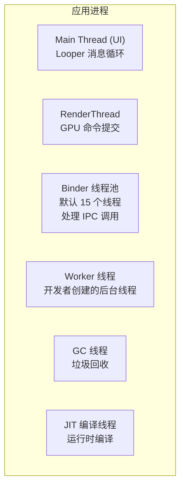
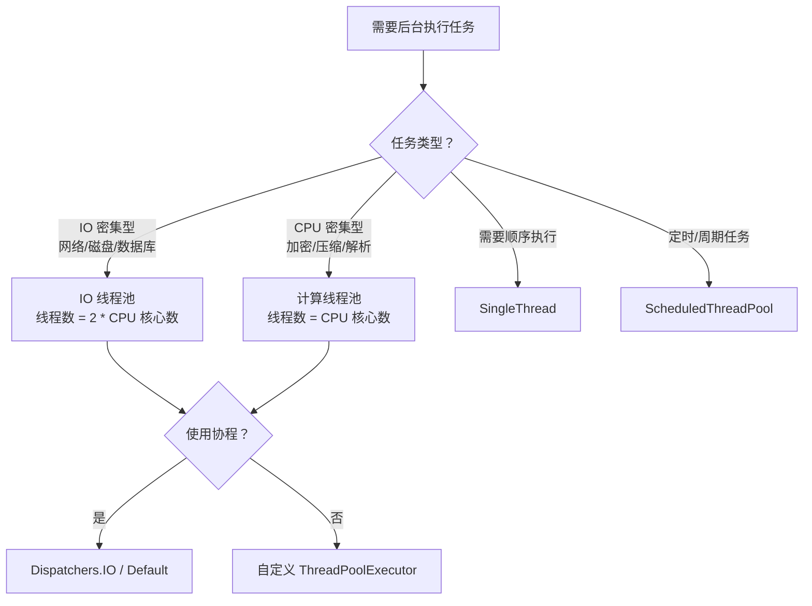

# 多线程与协程性能

## Android 线程模型

### 主线程（UI Thread）

Android 应用的主线程负责以下关键职责：

1. **UI 渲染**：measure/layout/draw
2. **输入事件处理**：触摸、按键
3. **生命周期回调**：Activity/Fragment/Service 的生命周期方法
4. **Choreographer 帧回调**：动画更新

所有这些操作共享同一个 `Looper` 消息队列，任何耗时操作都会阻塞后续消息的处理。

### 常见线程类型



### 线程数量对性能的影响

每个线程默认占用约 **1MB 栈空间**，过多线程导致：

- **内存压力**：100 个线程 ≈ 100MB 栈内存
- **CPU 上下文切换开销**：线程数远超 CPU 核心数时，频繁切换导致性能下降
- **文件描述符耗尽**：每个线程至少占用一个 fd，系统默认限制 1024

```bash
# 查看应用线程数
adb shell cat /proc/<pid>/status | grep Threads
# Threads: 87

# 查看所有线程
adb shell ls /proc/<pid>/task/ | wc -l
```

## 线程池配置与调优

### Executors 内置线程池

| 线程池 | 核心线程 | 最大线程 | 队列 | 适用场景 |
|--------|---------|---------|------|---------|
| FixedThreadPool | N | N | 无界 LinkedBlockingQueue | 稳定并发量的任务 |
| CachedThreadPool | 0 | Integer.MAX_VALUE | SynchronousQueue | 短生命周期大量小任务 |
| SingleThreadExecutor | 1 | 1 | 无界 LinkedBlockingQueue | 顺序执行任务 |
| ScheduledThreadPool | N | Integer.MAX_VALUE | DelayedWorkQueue | 定时/周期任务 |

> **警告**：`CachedThreadPool` 在任务激增时可能创建大量线程导致 OOM；`FixedThreadPool` 的无界队列在任务堆积时可能导致内存溢出。

### 自定义线程池

```kotlin
object AppExecutors {

    val io: ExecutorService = ThreadPoolExecutor(
        4,                              // 核心线程数（CPU 核心数的一半）
        8,                              // 最大线程数
        60L, TimeUnit.SECONDS,          // 空闲线程存活时间
        LinkedBlockingQueue(128),       // 有界队列，防止任务无限堆积
        NamedThreadFactory("io"),       // 自定义线程名
        ThreadPoolExecutor.CallerRunsPolicy() // 拒绝策略：调用者线程执行
    )

    val computation: ExecutorService = ThreadPoolExecutor(
        Runtime.getRuntime().availableProcessors(), // CPU 密集型：核心数
        Runtime.getRuntime().availableProcessors(),
        0L, TimeUnit.SECONDS,
        LinkedBlockingQueue(64),
        NamedThreadFactory("compute"),
        ThreadPoolExecutor.CallerRunsPolicy()
    )
}

class NamedThreadFactory(private val prefix: String) : ThreadFactory {
    private val counter = AtomicInteger(0)
    override fun newThread(r: Runnable) = Thread(r, "$prefix-${counter.incrementAndGet()}")
}
```

### 线程池选择指南



## Kotlin 协程性能模式

### Dispatchers 选择

| Dispatcher | 底层实现 | 默认线程数 | 适用场景 |
|-----------|---------|----------|---------|
| Dispatchers.Main | 主线程 Handler | 1 | UI 更新、轻量操作 |
| Dispatchers.IO | 共享弹性线程池 | 最多 64 | 网络、磁盘、数据库 IO |
| Dispatchers.Default | 共享固定线程池 | CPU 核心数 | CPU 密集型计算 |
| Dispatchers.Unconfined | 调用者线程 | N/A | 测试、不关心线程的场景 |

> **注意**：`Dispatchers.IO` 和 `Dispatchers.Default` 共享同一个线程池（`CommonPool`），但 IO 允许更多并发线程。

```kotlin
// Dispatchers.IO 的线程数上限
// max(64, CPU_COUNT) 个线程
// 可通过系统属性调整：
// System.setProperty("kotlinx.coroutines.io.parallelism", "128")
```

### Structured Concurrency

```kotlin
// ✅ 使用 coroutineScope 确保所有子协程完成或取消
suspend fun loadDashboard(): Dashboard = coroutineScope {
    val profile = async(Dispatchers.IO) { api.getProfile() }
    val feed = async(Dispatchers.IO) { api.getFeed() }
    val notifications = async(Dispatchers.IO) { api.getNotifications() }

    // 如果任意一个失败，其他都会被取消
    Dashboard(
        profile = profile.await(),
        feed = feed.await(),
        notifications = notifications.await()
    )
}

// ✅ 使用 supervisorScope 避免子协程失败影响兄弟
suspend fun loadDashboardSafe(): Dashboard = supervisorScope {
    val profile = async(Dispatchers.IO) { api.getProfile() }
    val feed = async(Dispatchers.IO) {
        try { api.getFeed() } catch (e: Exception) { emptyList() }
    }
    val notifications = async(Dispatchers.IO) {
        try { api.getNotifications() } catch (e: Exception) { emptyList() }
    }

    Dashboard(
        profile = profile.await(),
        feed = feed.await(),
        notifications = notifications.await()
    )
}
```

### 协程 vs 线程性能对比

```kotlin
// 协程的核心优势：轻量
// 创建 10 万个协程 vs 10 万个线程

// 协程版本：正常运行，占用几十 MB
runBlocking {
    repeat(100_000) {
        launch {
            delay(1000)
        }
    }
}

// 线程版本：OOM（100_000 * 1MB 栈 ≈ 100GB）
repeat(100_000) {
    Thread { Thread.sleep(1000) }.start() // OutOfMemoryError
}
```

| 维度 | Thread | Coroutine |
|------|--------|-----------|
| 创建开销 | ~1MB 栈 + 内核线程 | ~几百字节 Continuation 对象 |
| 切换开销 | 内核态上下文切换 (~1-10μs) | 用户态挂起/恢复 (~100ns) |
| 并发数量 | 受内存限制（通常 < 1000） | 可轻松支持 10 万+ |
| 取消机制 | 需要手动中断 + 标志位 | 内置 CancellationException |

### Flow 性能注意

```kotlin
// ❌ 高频 Flow 不加限制导致下游处理不过来
sensorFlow
    .collect { data ->
        // 如果处理速度跟不上发射速度，会导致背压问题
        heavyProcessing(data)
    }

// ✅ 使用 conflate 跳过中间值，只处理最新
sensorFlow
    .conflate()
    .collect { data ->
        heavyProcessing(data) // 处理期间新值到来时丢弃旧值
    }

// ✅ 使用 buffer 允许发射端和收集端并发执行
sensorFlow
    .buffer(capacity = 64)
    .collect { data ->
        heavyProcessing(data)
    }

// ✅ 使用 debounce 去抖动（搜索场景）
searchQueryFlow
    .debounce(300) // 300ms 内没有新值才发射
    .distinctUntilChanged()
    .flatMapLatest { query -> searchApi(query) }
    .collect { results -> showResults(results) }

// ✅ 使用 flowOn 切换上游的执行线程
flow {
    emit(readFromDatabase()) // 在 IO 线程执行
}
.flowOn(Dispatchers.IO)    // 只影响上游
.collect { data ->
    updateUI(data)          // 在调用者线程（通常是 Main）执行
}
```

## Handler / Looper 使用注意

### IdleHandler 的妙用

在主线程消息队列空闲时执行低优先级任务，不影响用户交互：

```kotlin
fun doWhenIdle(task: () -> Unit) {
    Looper.myQueue().addIdleHandler {
        task()
        false // 返回 false 表示执行一次后移除
    }
}

// 使用场景：
// 1. 启动后非紧急初始化
doWhenIdle { Analytics.init(context) }

// 2. 预加载下一个页面的数据
doWhenIdle { preloadNextPage() }

// 3. 延迟执行 GC 提示
doWhenIdle { System.gc() }
```

### HandlerThread 使用场景

需要顺序执行后台任务时，使用 `HandlerThread` 比线程池更可控：

```kotlin
class SequentialTaskExecutor {
    private val handlerThread = HandlerThread("sequential-task").apply { start() }
    private val handler = Handler(handlerThread.looper)

    fun execute(task: Runnable) {
        handler.post(task) // 任务按 FIFO 顺序执行
    }

    fun executeDelayed(task: Runnable, delayMs: Long) {
        handler.postDelayed(task, delayMs)
    }

    fun shutdown() {
        handlerThread.quitSafely()
    }
}
```

## 线程同步与锁优化

### synchronized vs ReentrantLock

```kotlin
// synchronized：简单场景推荐，JVM 内置优化（偏向锁、轻量级锁）
class ThreadSafeCounter {
    private var count = 0

    @Synchronized
    fun increment() { count++ }

    @Synchronized
    fun get() = count
}

// ReentrantLock：需要更多控制时使用
class AdvancedCounter {
    private var count = 0
    private val lock = ReentrantLock()

    fun increment() {
        // tryLock 避免死锁
        if (lock.tryLock(100, TimeUnit.MILLISECONDS)) {
            try {
                count++
            } finally {
                lock.unlock()
            }
        }
    }
}
```

### 无锁并发方案

```kotlin
// AtomicInteger：简单计数器
private val counter = AtomicInteger(0)
fun increment() = counter.incrementAndGet()

// ConcurrentHashMap：高并发读写的 Map
private val cache = ConcurrentHashMap<String, Any>()

// CopyOnWriteArrayList：读多写少的列表
private val listeners = CopyOnWriteArrayList<Listener>()
fun addListener(l: Listener) = listeners.add(l)
fun notifyAll() = listeners.forEach { it.onEvent() } // 遍历时不需要同步
```

### 读写锁

```kotlin
class CachedData<T> {
    private val lock = ReentrantReadWriteLock()
    private var data: T? = null

    // 读操作：多个线程可同时读
    fun get(): T? {
        lock.readLock().lock()
        try {
            return data
        } finally {
            lock.readLock().unlock()
        }
    }

    // 写操作：独占锁，阻塞其他读写
    fun set(value: T) {
        lock.writeLock().lock()
        try {
            data = value
        } finally {
            lock.writeLock().unlock()
        }
    }
}
```

## 线程数监控与治理

### 线程数统计

```kotlin
object ThreadMonitor {

    fun getThreadCount(): Int {
        return Thread.activeCount()
    }

    fun getThreadNames(): List<String> {
        val threads = arrayOfNulls<Thread>(Thread.activeCount() * 2)
        Thread.enumerate(threads)
        return threads.filterNotNull().map { "${it.name} [${it.state}]" }
    }

    fun reportIfExcessive(threshold: Int = 100) {
        val count = getThreadCount()
        if (count > threshold) {
            Log.w("ThreadMonitor", "线程数异常: $count (阈值: $threshold)")
            getThreadNames()
                .groupBy { it.substringBefore("-") }
                .entries
                .sortedByDescending { it.value.size }
                .take(10)
                .forEach { (prefix, threads) ->
                    Log.w("ThreadMonitor", "  $prefix: ${threads.size} 个线程")
                }
        }
    }
}
```

### 线程命名规范

```kotlin
// ❌ 使用默认线程名（Thread-1, Thread-2...），出问题无法定位来源
Thread { doWork() }.start()

// ✅ 所有线程/线程池使用可辨识的名称
Thread(task, "image-decoder-1").start()

val executor = Executors.newFixedThreadPool(4) { runnable ->
    Thread(runnable, "network-pool-${counter.incrementAndGet()}")
}

// 协程也可以命名
launch(Dispatchers.IO + CoroutineName("sync-data")) {
    syncData()
}
```

在 Perfetto/Systrace 中，有意义的线程名可以快速定位问题所在模块。

## 常见坑点

### 1. GlobalScope 滥用导致协程泄漏

```kotlin
// ❌ GlobalScope 的生命周期是进程级，Activity 销毁后协程仍在执行
class MyActivity : AppCompatActivity() {
    override fun onCreate(savedInstanceState: Bundle?) {
        super.onCreate(savedInstanceState)
        GlobalScope.launch {
            val data = api.loadData()
            updateUI(data) // Activity 已销毁，可能 Crash
        }
    }
}

// ✅ 使用 lifecycleScope，自动跟随 Activity 生命周期取消
lifecycleScope.launch {
    val data = api.loadData()
    updateUI(data) // Activity 销毁时自动取消
}

// ✅ ViewModel 中使用 viewModelScope
class MyViewModel : ViewModel() {
    fun loadData() {
        viewModelScope.launch {
            val data = repository.loadData()
            _state.value = data
        }
    }
}
```

### 2. Dispatchers.IO 默认线程数限制

`Dispatchers.IO` 默认最多 64 个线程。在高并发 IO 场景下（如同时下载 100 个文件），超出的任务会排队等待。

```kotlin
// ✅ 为特定场景创建自定义 Dispatcher
val downloadDispatcher = Dispatchers.IO.limitedParallelism(128)

suspend fun downloadFiles(urls: List<String>) = coroutineScope {
    urls.map { url ->
        async(downloadDispatcher) { download(url) }
    }.awaitAll()
}
```

### 3. withContext 频繁切换的开销

```kotlin
// ❌ 在循环中频繁切换线程
for (item in items) {
    val processed = withContext(Dispatchers.Default) { process(item) } // 每次切换约 ~100μs
    withContext(Dispatchers.Main) { updateUI(processed) }
}

// ✅ 批量处理后一次性切换
val results = withContext(Dispatchers.Default) {
    items.map { process(it) } // 只切换一次
}
withContext(Dispatchers.Main) {
    results.forEach { updateUI(it) } // 只切换一次
}
```

### 4. 线程池任务队列无界导致 OOM

```kotlin
// ❌ CachedThreadPool 可能创建无限线程
val pool = Executors.newCachedThreadPool()
repeat(10_000) { pool.execute { Thread.sleep(60_000) } } // 创建 10000 个线程 → OOM

// ✅ 使用有界线程池 + 有界队列
val pool = ThreadPoolExecutor(
    4, 16,
    60L, TimeUnit.SECONDS,
    LinkedBlockingQueue(256), // 有界队列
    ThreadPoolExecutor.CallerRunsPolicy() // 队列满时由调用者线程执行
)
```

## 踩坑记录

> 此区域供团队成员补充项目中遇到的真实案例。

| 日期 | 记录人 | 问题描述 | 解决方案 |
|------|--------|----------|----------|
| | | | |

## 参考资料

- [Android 官方 - 进程和线程](https://developer.android.com/guide/components/processes-and-threads)
- [Kotlin 协程官方文档](https://kotlinlang.org/docs/coroutines-overview.html)
- [Kotlin Flow 官方文档](https://kotlinlang.org/docs/flow.html)
- [Android 官方 - 使用 Kotlin 协程](https://developer.android.com/kotlin/coroutines)
- [Android 官方 - 协程最佳实践](https://developer.android.com/kotlin/coroutines/coroutines-best-practices)
- [Java 并发编程实战](https://jcip.net/)
- [Dispatchers.IO 源码分析](https://github.com/Kotlin/kotlinx.coroutines/blob/master/kotlinx-coroutines-core/jvm/src/Dispatchers.kt)
