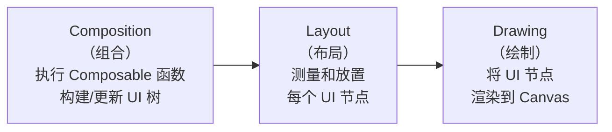

# Compose 性能优化

## Compose 渲染原理

### 三阶段渲染模型

Compose 的渲染分为三个独立阶段，每个阶段可以被单独跳过以提升性能：



| 阶段 | 触发条件 | 可跳过条件 | 性能影响 |
|------|---------|-----------|---------|
| Composition | State 变化 | 读取的 State 未变化，Composable 参数 Stable 且未变 | 最重（执行 Composable 函数） |
| Layout | 尺寸/位置变化 | 只有 Drawing 相关状态变化时跳过 | 中等 |
| Drawing | 视觉属性变化 | 无变化时跳过 | 最轻 |

**性能优化的核心思想：让状态变化只触发必要的阶段。**

```kotlin
// ❌ 状态变化触发 Composition + Layout + Drawing
var padding by remember { mutableStateOf(16.dp) }
Box(modifier = Modifier.padding(padding)) { ... }
// padding 变化 → 重组 → 重新布局 → 重新绘制

// ✅ 使用 Modifier.offset 让变化只触发 Layout + Drawing
var offsetX by remember { mutableStateOf(0.dp) }
Box(modifier = Modifier.offset(x = offsetX)) { ... }

// ✅✅ 使用 lambda 版本的 offset 让变化只触发 Drawing
var offsetX by remember { mutableFloatStateOf(0f) }
Box(modifier = Modifier.offset { IntOffset(offsetX.roundToInt(), 0) }) { ... }
// lambda 在 Drawing 阶段读取 state，只触发绘制
```

### 重组（Recomposition）机制

当 Composable 函数读取的 State 发生变化时，Compose 运行时会重新执行该函数（重组）。Compose 编译器会智能地只重新执行受影响的部分：

```kotlin
@Composable
fun UserProfile(user: User) {
    Column {
        // 如果 user.name 未变，这个 Text 不会重组
        Text(text = user.name)

        // 如果 user.avatar 变了，只有这个 Image 会重组
        AsyncImage(model = user.avatar, contentDescription = null)

        // 内部有自己的 State，独立重组
        LikeButton(userId = user.id)
    }
}
```

## Recomposition 优化

### 避免不必要的重组

**原则：将状态读取推迟到最小的 Composable 作用域。**

```kotlin
// ❌ 在父级读取 State，整个 Column 都会重组
@Composable
fun Screen(viewModel: ScreenViewModel) {
    val scrollState = viewModel.scrollOffset.collectAsState()

    Column {
        Header()                          // 不依赖 scrollOffset，但会被重组
        Content()                         // 不依赖 scrollOffset，但会被重组
        ScrollIndicator(scrollState.value) // 真正需要的地方
    }
}

// ✅ 将 State 读取下推到需要的 Composable
@Composable
fun Screen(viewModel: ScreenViewModel) {
    Column {
        Header()                          // 不会重组
        Content()                         // 不会重组
        ScrollIndicator(viewModel)         // 只有这里重组
    }
}

@Composable
fun ScrollIndicator(viewModel: ScreenViewModel) {
    val scrollOffset by viewModel.scrollOffset.collectAsState()
    // scrollOffset 变化只影响这个 Composable
    Box(modifier = Modifier.offset { IntOffset(0, scrollOffset) })
}
```

### Stability 系统

Compose 编译器通过分析参数的 **Stability**（稳定性）来决定是否可以跳过重组：

- **Stable 参数**：如果所有参数都是 Stable 的且值未变，Composable 可以跳过重组
- **Unstable 参数**：每次父级重组时该 Composable 都会被重新执行

```kotlin
// ✅ Stable：基本类型、String、@Immutable/@Stable 注解的类
data class UserInfo(            // Stable：所有属性都是 val + 基本类型/String
    val id: Long,
    val name: String,
    val avatar: String
)

// ❌ Unstable：包含可变属性或集合
data class UserState(
    val users: List<User>,      // List 是接口，Compose 无法保证不可变 → Unstable
    var isLoading: Boolean       // var → Unstable
)

// ✅ 修复方案一：使用 @Immutable 注解（承诺不可变）
@Immutable
data class UserState(
    val users: List<User>,      // 开发者承诺这个 List 不会被修改
    val isLoading: Boolean
)

// ✅ 修复方案二：使用 kotlinx.collections.immutable
import kotlinx.collections.immutable.ImmutableList
import kotlinx.collections.immutable.toImmutableList

data class UserState(
    val users: ImmutableList<User>,  // Compose 编译器识别为 Stable
    val isLoading: Boolean
)
```

### Compose Compiler Metrics

生成 Stability 报告，帮助发现 Unstable 的 Composable：

```kotlin
// build.gradle.kts
android {
    composeOptions {
        kotlinCompilerExtensionVersion = "1.5.14"
    }
}

// 在 app/build.gradle.kts 中添加
tasks.withType<org.jetbrains.kotlin.gradle.tasks.KotlinCompile>().configureEach {
    compilerOptions {
        freeCompilerArgs.addAll(
            "-P", "plugin:androidx.compose.compiler.plugins.kotlin:reportsDestination=" +
                layout.buildDirectory.dir("compose_metrics").get().asFile.absolutePath,
            "-P", "plugin:androidx.compose.compiler.plugins.kotlin:metricsDestination=" +
                layout.buildDirectory.dir("compose_metrics").get().asFile.absolutePath
        )
    }
}
```

```bash
# 生成报告
./gradlew :app:assembleRelease

# 查看报告
cat app/build/compose_metrics/app_release-composables.txt
# restartable skippable scheme("[androidx.compose.ui.UiComposable]") fun UserProfile(...)
# restartable scheme("[androidx.compose.ui.UiComposable]") fun UserList(...)
#            ↑ 没有 skippable = 参数 Unstable，无法跳过重组
```

**报告关键字解读：**

| 关键字 | 含义 |
|--------|------|
| restartable | 可以被重组（几乎所有 Composable） |
| skippable | 参数未变时可以跳过重组（目标状态） |
| stable | 参数被标记为稳定 |
| unstable | 参数不稳定，导致无法 skip |

### Strong Skipping Mode

Compose Compiler 1.5.4+ 引入的新模式，放宽了跳过重组的条件：

- **默认模式**：所有参数都 Stable 才能 skip
- **Strong Skipping**：即使有 Unstable 参数，只要参数引用相等（`===`）也能 skip

```kotlin
// build.gradle.kts (Compose Compiler 2.0+)
composeCompiler {
    enableStrongSkippingMode = true
}

// 旧版本通过编译器参数启用
// freeCompilerArgs += "-P"
// freeCompilerArgs += "plugin:androidx.compose.compiler.plugins.kotlin:experimentalStrongSkipping=true"
```

## 状态管理性能

### derivedStateOf

当一个 State 依赖另一个高频变化的 State，但自身只在满足特定条件时才需要触发重组：

```kotlin
@Composable
fun MessageList(messages: List<Message>) {
    val listState = rememberLazyListState()

    // ❌ 每次滚动都触发重组（firstVisibleItemIndex 高频变化）
    val showButton = listState.firstVisibleItemIndex > 0

    // ✅ derivedStateOf：只在结果从 true↔false 变化时才触发重组
    val showButton by remember {
        derivedStateOf { listState.firstVisibleItemIndex > 0 }
    }

    Box {
        LazyColumn(state = listState) {
            items(messages) { MessageItem(it) }
        }
        if (showButton) {
            ScrollToTopButton(onClick = { /* ... */ })
        }
    }
}
```

> **注意**：不要对简单的 State 转换使用 `derivedStateOf`（如 `derivedStateOf { count + 1 }`），它本身有创建快照读取的开销，只在"多次输入变化对应少次输出变化"时才有意义。

### snapshotFlow

将 Compose State 转换为 Flow，在需要进行副作用操作（如日志、网络请求）时使用：

```kotlin
@Composable
fun SearchScreen() {
    var query by remember { mutableStateOf("") }

    // 将 Compose State 转换为 Flow，可使用 Flow 操作符
    LaunchedEffect(Unit) {
        snapshotFlow { query }
            .debounce(300)
            .distinctUntilChanged()
            .filter { it.length >= 2 }
            .collectLatest { searchQuery ->
                searchApi(searchQuery) // 不会因为每次按键都触发搜索
            }
    }

    TextField(value = query, onValueChange = { query = it })
}
```

## LazyColumn / LazyGrid 性能

### key 的正确使用

```kotlin
// ❌ 不指定 key：Compose 默认使用 index，增删项时全部重新绑定
LazyColumn {
    items(users) { user ->
        UserItem(user)
    }
}

// ✅ 指定稳定的 key：只有内容变化的 item 才重组
LazyColumn {
    items(
        items = users,
        key = { it.id } // 使用唯一稳定 ID
    ) { user ->
        UserItem(user)
    }
}
```

### contentType 优化

为不同类型的列表项指定 `contentType`，优化 Composition 节点的复用（类似 RecyclerView 的 ViewType）：

```kotlin
LazyColumn {
    items(
        items = feedItems,
        key = { it.id },
        contentType = { item ->
            when (item) {
                is FeedItem.Post -> "post"
                is FeedItem.Ad -> "ad"
                is FeedItem.Header -> "header"
            }
        }
    ) { item ->
        when (item) {
            is FeedItem.Post -> PostItem(item)
            is FeedItem.Ad -> AdItem(item)
            is FeedItem.Header -> HeaderItem(item)
        }
    }
}
```

### 列表项 Composable 优化

```kotlin
// ❌ 在列表项中进行复杂计算
@Composable
fun UserItem(user: User) {
    val formattedDate = SimpleDateFormat("yyyy-MM-dd", Locale.getDefault())
        .format(user.createdAt) // 每次重组都创建 SimpleDateFormat 并格式化

    Text(text = formattedDate)
}

// ✅ 预处理数据，列表项只负责展示
data class UserItemData(
    val name: String,
    val formattedDate: String // 预格式化
)

@Composable
fun UserItem(data: UserItemData) {
    Text(text = data.formattedDate) // 直接使用预处理数据
}
```

### 避免在 LazyColumn 中嵌套滚动

```kotlin
// ❌ 在 LazyColumn 中嵌套 Column + forEach（无法复用 Composable）
LazyColumn {
    item {
        Column {
            categories.forEach { category ->
                CategoryItem(category) // 所有 item 同时存在于 Composition 中
            }
        }
    }
}

// ✅ 使用 items 展平列表，让 LazyColumn 统一管理
LazyColumn {
    items(categories, key = { it.id }) { category ->
        CategoryItem(category) // LazyColumn 只组合可见的 item
    }
}
```

## 布局性能

### Modifier 顺序的影响

Modifier 是链式执行的，顺序不同会影响测量和绘制行为：

```kotlin
// 先 padding 再 background：padding 区域有背景色
Box(
    modifier = Modifier
        .padding(16.dp)
        .background(Color.Blue)
)

// 先 background 再 padding：背景色覆盖整个区域（含 padding）
Box(
    modifier = Modifier
        .background(Color.Blue)
        .padding(16.dp)
)

// 性能相关：clickable 应放在 clip 之后（减少触摸区域计算）
Box(
    modifier = Modifier
        .clip(RoundedCornerShape(8.dp))
        .clickable { onClick() } // 触摸区域限制在圆角内
)
```

### BoxWithConstraints 的性能代价

`BoxWithConstraints` 内部使用 `SubcomposeLayout`，会延迟子组件的 Composition 到 Layout 阶段，增加额外开销：

```kotlin
// ❌ 不必要地使用 BoxWithConstraints
@Composable
fun MyCard() {
    BoxWithConstraints {
        if (maxWidth > 600.dp) {
            WideLayout()
        } else {
            NarrowLayout()
        }
    }
}

// ✅ 如果不需要在 Composition 时读取约束，使用 LocalConfiguration
@Composable
fun MyCard() {
    val screenWidth = LocalConfiguration.current.screenWidthDp.dp
    if (screenWidth > 600.dp) {
        WideLayout()
    } else {
        NarrowLayout()
    }
}
```

## 绘制性能

### drawWithCache

对于不经常变化的绘制操作，使用 `drawWithCache` 缓存绘制对象：

```kotlin
@Composable
fun GradientBackground(modifier: Modifier = Modifier) {
    Box(
        modifier = modifier.drawWithCache {
            // 这个 block 只在 size 变化时重新执行
            val gradient = Brush.verticalGradient(
                colors = listOf(Color.Blue, Color.Cyan),
                startY = 0f,
                endY = size.height
            )
            onDrawBehind {
                // 每帧绘制时执行，但使用缓存的 gradient
                drawRect(brush = gradient)
            }
        }
    )
}
```

### 动画性能

```kotlin
// ✅ animate*AsState：简单状态过渡动画
val alpha by animateFloatAsState(
    targetValue = if (visible) 1f else 0f,
    animationSpec = tween(300),
    label = "alpha"
)
Box(modifier = Modifier.alpha(alpha))

// ✅ 使用 graphicsLayer 让动画只触发 Drawing 阶段
val scale by animateFloatAsState(targetValue = if (pressed) 0.95f else 1f, label = "scale")
Box(
    modifier = Modifier.graphicsLayer {
        scaleX = scale   // graphicsLayer lambda 在 Drawing 阶段执行
        scaleY = scale   // 不触发 Composition 和 Layout
    }
)
```

## Compose 与 View 互操作性能

### AndroidView 的使用代价

```kotlin
// AndroidView 在 Composition 中有额外的 inflate + 桥接开销
// 在列表中使用 AndroidView 性能较差
AndroidView(
    factory = { context ->
        // factory 只在首次组合时执行
        WebView(context).apply { loadUrl("https://example.com") }
    },
    update = { webView ->
        // update 在每次重组时执行，保持轻量
    }
)
```

### RecyclerView 中使用 ComposeView

```kotlin
// 在 RecyclerView ViewHolder 中嵌入 Compose
class ComposeViewHolder(
    private val composeView: ComposeView
) : RecyclerView.ViewHolder(composeView) {

    init {
        // 关键：设置 ViewCompositionStrategy 避免内存泄漏
        composeView.setViewCompositionStrategy(
            ViewCompositionStrategy.DisposeOnViewTreeLifecycleDestroyed
        )
    }

    fun bind(item: Item) {
        composeView.setContent {
            ItemComposable(item)
        }
    }
}
```

## Compose 性能分析工具

### Layout Inspector（Compose 模式）

Android Studio 的 Layout Inspector 支持 Compose：

- 查看 Composable 树结构
- 每个 Composable 的**重组计数**和**跳过计数**
- 实时观察哪些 Composable 在频繁重组

### Recomposition Highlighter

开发阶段可视化重组行为：

```kotlin
// build.gradle.kts
debugImplementation("androidx.compose.ui:ui-tooling:1.7.0")
```

在 Layout Inspector 中开启 "Show Recomposition Counts" 可以看到每个 Composable 的重组次数。高重组次数的 Composable 是优化的重点目标。

### Perfetto 中的 Compose Trace

Compose 在 Perfetto Trace 中会标记各阶段：

- **Compose:recompose**：重组阶段耗时
- **Compose:layout**：布局阶段耗时
- **Compose:draw**：绘制阶段耗时

```kotlin
// 启用 Compose Tracing（需要额外依赖）
dependencies {
    implementation("androidx.compose.runtime:runtime-tracing:1.0.0-beta01")
}
// 启用后 Perfetto 中可以看到每个 Composable 函数名的 Trace Section
```

## 常见坑点

### 1. 在 Composable 中创建新对象导致重组

```kotlin
// ❌ 每次重组创建新 List，导致子 Composable 判定参数变化
@Composable
fun ParentScreen() {
    val items = listOf("a", "b", "c") // 每次重组创建新 List 实例
    ChildList(items) // items 引用每次不同 → ChildList 无法 skip
}

// ✅ 使用 remember 缓存
@Composable
fun ParentScreen() {
    val items = remember { listOf("a", "b", "c") }
    ChildList(items) // 同一引用 → ChildList 可以 skip
}

// ❌ lambda 捕获导致每次创建新实例
@Composable
fun ButtonList(items: List<Item>, onClick: (Item) -> Unit) {
    items.forEach { item ->
        Button(onClick = { onClick(item) }) { // 每次重组创建新 lambda
            Text(item.name)
        }
    }
}

// ✅ 使用 remember + key 缓存 lambda
@Composable
fun ButtonList(items: List<Item>, onClick: (Item) -> Unit) {
    items.forEach { item ->
        val callback = remember(item.id) { { onClick(item) } }
        Button(onClick = callback) {
            Text(item.name)
        }
    }
}
```

### 2. 未使用 key 导致 LazyColumn 性能退化

缺少稳定 key 时，列表数据变化（插入/删除/排序）会导致大量不必要的 Composable 销毁和重建。

### 3. collectAsState 在高频 Flow 上的性能问题

```kotlin
// ❌ 高频传感器数据直接 collectAsState，每秒重组 60 次
val sensorData by sensorFlow.collectAsState(initial = SensorData.EMPTY)

// ✅ 使用 conflate + sample 降低更新频率
val sensorData by remember {
    sensorFlow
        .conflate()
        .sample(100) // 最多每 100ms 更新一次 UI
}.collectAsState(initial = SensorData.EMPTY)
```

### 4. 过度使用 derivedStateOf

```kotlin
// ❌ 简单转换不需要 derivedStateOf
val upperName by remember { derivedStateOf { name.uppercase() } }
// name 变一次，upperName 也变一次，derivedStateOf 没有减少重组

// ✅ 直接计算即可
val upperName = name.uppercase()

// ✅ derivedStateOf 适合：输入高频变化，输出低频变化
val showScrollToTop by remember {
    derivedStateOf { listState.firstVisibleItemIndex > 5 }
}
// firstVisibleItemIndex 每像素变化，但 > 5 的结果只在阈值处变化
```

## 踩坑记录

> 此区域供团队成员补充项目中遇到的真实案例。

| 日期 | 记录人 | 问题描述 | 解决方案 |
|------|--------|----------|----------|
| | | | |

## 参考资料

- [Android 官方 - Jetpack Compose 性能](https://developer.android.com/develop/ui/compose/performance)
- [Android 官方 - Compose Stability 说明](https://developer.android.com/develop/ui/compose/performance/stability)
- [Android 官方 - Compose 阶段](https://developer.android.com/develop/ui/compose/phases)
- [Android 官方 - Compose Compiler Metrics](https://developer.android.com/develop/ui/compose/performance/stability/diagnose)
- [Compose Performance - Google I/O 2023](https://www.youtube.com/watch?v=EOQB8PTLkpY)
- [kotlinx-collections-immutable](https://github.com/Kotlin/kotlinx.collections.immutable)
- [Compose Runtime Tracing](https://developer.android.com/develop/ui/compose/tooling/tracing)
