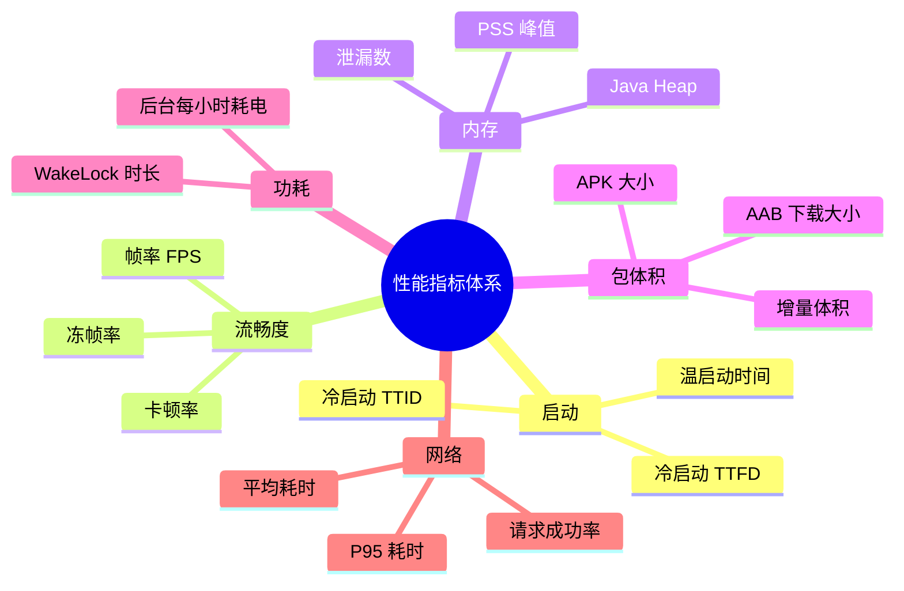
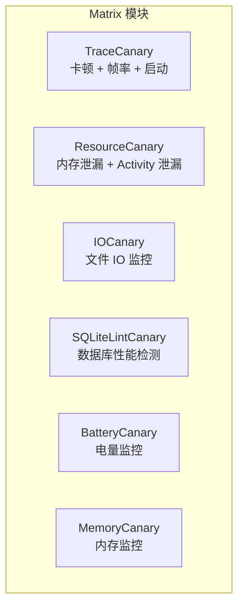
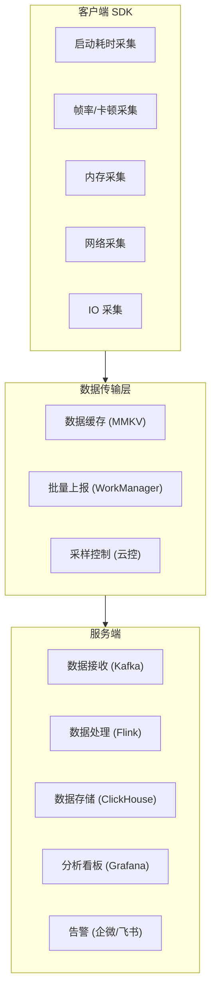
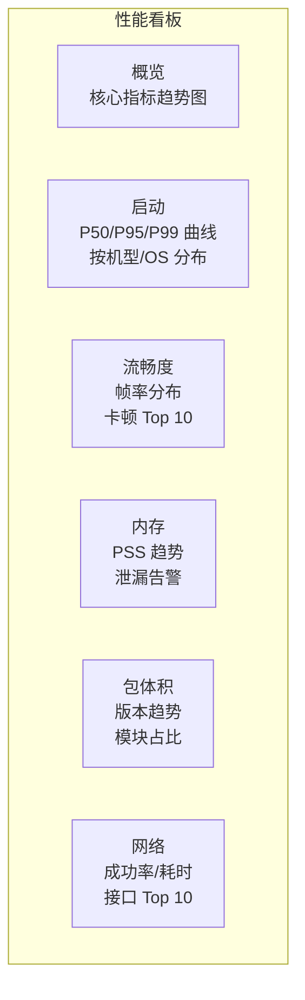

# 性能监控与 CI 集成

## 性能指标体系设计

### 核心性能指标（KPI）



**关键指标定义：**

| 指标 | 全称 | 定义 | 采集方式 |
|------|------|------|---------|
| TTID | Time To Initial Display | 从 Intent 到首帧绘制 | Logcat Displayed / Macrobenchmark |
| TTFD | Time To Fully Drawn | 从 Intent 到数据加载完成 | reportFullyDrawn() |
| FPS | Frames Per Second | 每秒渲染帧数 | FrameMetrics / Choreographer |
| Jank Rate | 卡顿率 | 掉帧数 / 总帧数 | FrameMetrics |
| Frozen Rate | 冻帧率 | 超过 700ms 的帧占比 | FrameMetrics |
| PSS | Proportional Set Size | 进程实际物理内存占用 | dumpsys meminfo |

### 指标分级与基线

| 指标 | 优秀 | 合格 | 需优化 | 严重 |
|------|------|------|--------|------|
| 冷启动（TTID） | < 1s | < 2s | 2-4s | > 4s |
| 帧率 | ≥ 58fps | ≥ 50fps | 40-50fps | < 40fps |
| 卡顿率 | < 1% | < 3% | 3-10% | > 10% |
| 冻帧率 | < 0.01% | < 0.1% | 0.1-1% | > 1% |
| PSS 峰值 | < 150MB | < 250MB | 250-400MB | > 400MB |
| APK 大小 | < 20MB | < 50MB | 50-100MB | > 100MB |

### Android Vitals 指标

Google Play Console 的 Android Vitals 提供以下性能指标（基于用户真实数据）：

| Vitals 指标 | 劣质阈值 | 说明 |
|------------|---------|------|
| ANR 率 | > 0.47% | 超过则 Play Store 搜索排名受影响 |
| Crash 率 | > 1.09% | 同上 |
| 冷启动过慢 | > 5s | TTID 超过 5 秒的比例 |
| 渲染缓慢帧 | > 50% | 超过 16ms 的帧比例 |
| 冻帧 | > 0.1% | 超过 700ms 的帧比例 |

## 线上性能监控方案

### 自建 vs 第三方

| 维度 | 自建 APM | 第三方平台（Matrix/KOOM/Firebase） |
|------|---------|--------------------------------|
| 定制化 | 高（完全可控） | 中（框架内定制） |
| 开发成本 | 高 | 低 |
| 数据隐私 | 完全自主 | 取决于平台 |
| 维护成本 | 高 | 低 |
| 功能深度 | 按需开发 | 框架已覆盖常见场景 |

### Matrix（微信）



```kotlin
// build.gradle.kts
dependencies {
    implementation("com.tencent.matrix:matrix-android-lib:2.1.0")
    implementation("com.tencent.matrix:matrix-trace-canary:2.1.0")
    implementation("com.tencent.matrix:matrix-resource-canary-android:2.1.0")
    implementation("com.tencent.matrix:matrix-io-canary:2.1.0")
    implementation("com.tencent.matrix:matrix-battery-canary:2.1.0")
}
```

```kotlin
class MyApplication : Application() {
    override fun onCreate() {
        super.onCreate()

        val builder = Matrix.Builder(this)
            .pluginListener(object : DefaultPluginListener(this) {
                override fun onReportIssue(issue: Issue) {
                    // 收到性能问题上报
                    Log.w("Matrix", "Issue: ${issue.type} - ${issue.content}")
                    uploadToServer(issue)
                }
            })

        // Trace 插件：卡顿 + 帧率 + 启动监控
        val traceConfig = TraceConfig.Builder()
            .dynamicConfig(DynamicConfigImpl())
            .enableFPS(true)
            .enableEvilMethodTrace(true)
            .enableStartup(true)
            .enableAnrTrace(true)
            .build()
        builder.plugin(TracePlugin(traceConfig))

        // Resource 插件：Activity 泄漏检测
        val resourceConfig = ResourceConfig.Builder()
            .dynamicConfig(DynamicConfigImpl())
            .build()
        builder.plugin(ResourcePlugin(resourceConfig))

        // IO 插件：文件 IO 监控
        val ioConfig = IOConfig.Builder()
            .dynamicConfig(DynamicConfigImpl())
            .build()
        builder.plugin(IOCanaryPlugin(ioConfig))

        Matrix.init(builder.build())
        Matrix.with().startAllPlugins()
    }
}
```

### KOOM（快手）

KOOM 专注于**线上内存泄漏监控**，核心优势是低开销的 hprof dump：

```kotlin
// build.gradle.kts
dependencies {
    implementation("com.kuaishou.koom:koom-java-leak:2.2.0")
    implementation("com.kuaishou.koom:koom-thread-leak:2.2.0")
}
```

```kotlin
class MyApplication : Application() {
    override fun onCreate() {
        super.onCreate()

        // Java 内存泄漏监控
        val config = MonitorConfig.Builder()
            .enableJavaLeak(true)
            .setJavaLeakThreshold(0.8f) // 当 Java Heap 使用率超过 80% 时触发 dump
            .build()

        MonitorManager.init(this, config)
        MonitorManager.start()
    }
}
```

KOOM 的 hprof dump 基于 `fork` + `COW`（Copy-on-Write），dump 过程在子进程中执行，不阻塞主进程。

### 自建 APM 方案架构



## 性能分析工具深度使用

### Perfetto 自定义 Trace

```kotlin
// 封装 Trace 工具类
object PerfTrace {
    private const val ENABLED = true // Release 包可通过云控开关

    inline fun <T> trace(sectionName: String, block: () -> T): T {
        if (ENABLED) android.os.Trace.beginSection(sectionName)
        try {
            return block()
        } finally {
            if (ENABLED) android.os.Trace.endSection()
        }
    }

    // 异步 Trace（跨方法调用）
    fun beginAsync(sectionName: String, cookie: Int) {
        if (ENABLED && Build.VERSION.SDK_INT >= Build.VERSION_CODES.Q) {
            android.os.Trace.beginAsyncSection(sectionName, cookie)
        }
    }

    fun endAsync(sectionName: String, cookie: Int) {
        if (ENABLED && Build.VERSION.SDK_INT >= Build.VERSION_CODES.Q) {
            android.os.Trace.endAsyncSection(sectionName, cookie)
        }
    }
}

// 使用示例
class ArticleRepository {
    suspend fun loadArticles(): List<Article> = PerfTrace.trace("loadArticles") {
        val cached = PerfTrace.trace("loadArticles.cache") {
            dao.getAll()
        }
        val remote = PerfTrace.trace("loadArticles.network") {
            api.getArticles()
        }
        PerfTrace.trace("loadArticles.merge") {
            mergeResults(cached, remote)
        }
    }
}
```

### Perfetto SQL 查询

在 Perfetto UI 中可以使用 SQL 查询分析 Trace 数据：

```sql
-- 查找耗时最长的主线程 Slice
SELECT name, dur / 1e6 as duration_ms
FROM slice
WHERE track_id = (
    SELECT id FROM thread_track WHERE name = 'main'
)
ORDER BY dur DESC
LIMIT 20;

-- 统计各 Composable 的重组耗时
SELECT name, COUNT(*) as count, SUM(dur) / 1e6 as total_ms, AVG(dur) / 1e6 as avg_ms
FROM slice
WHERE name LIKE 'Compose:%'
GROUP BY name
ORDER BY total_ms DESC;

-- 查找掉帧情况
SELECT name, dur / 1e6 as duration_ms
FROM slice
WHERE name = 'Choreographer#doFrame' AND dur > 16666666  -- > 16.67ms
ORDER BY dur DESC;
```

## Macrobenchmark / Microbenchmark

### Macrobenchmark 集成

Macrobenchmark 用于测量应用级别的性能指标（启动、滑动、动画）：

```kotlin
// benchmark/src/main/java/com/example/benchmark/StartupBenchmark.kt
@RunWith(AndroidJUnit4::class)
class StartupBenchmark {

    @get:Rule
    val benchmarkRule = MacrobenchmarkRule()

    @Test
    fun startupCold() = benchmarkRule.measureRepeated(
        packageName = "com.example.app",
        metrics = listOf(StartupTimingMetric()),
        compilationMode = CompilationMode.DEFAULT,
        iterations = 10,
        startupMode = StartupMode.COLD
    ) {
        pressHome()
        startActivityAndWait()
    }

    @Test
    fun scrollFeed() = benchmarkRule.measureRepeated(
        packageName = "com.example.app",
        metrics = listOf(FrameTimingMetric()),
        compilationMode = CompilationMode.DEFAULT,
        iterations = 5
    ) {
        startActivityAndWait()

        val recycler = device.findObject(By.res("feed_list"))
        recycler.setGestureMargin(device.displayWidth / 5)
        repeat(3) {
            recycler.scroll(Direction.DOWN, 2f)
            device.waitForIdle()
        }
    }
}
```

**Benchmark 输出示例：**

```
StartupBenchmark_startupCold
  timeToInitialDisplayMs   min  812.0, median  934.5, max 1102.0
  timeToFullDisplayMs      min 1234.0, median 1456.0, max 1789.0

StartupBenchmark_scrollFeed
  frameDurationCpuMs   P50   5.2,  P90   9.8,  P95  14.2,  P99  28.1
  frameOverrunMs       P50  -8.3,  P90  -2.1,  P95   1.8,  P99  15.6
```

### Microbenchmark 集成

Microbenchmark 用于测量方法级别的性能（序列化、算法、数据结构操作）：

```kotlin
@RunWith(AndroidJUnit4::class)
class SerializationBenchmark {

    @get:Rule
    val benchmarkRule = BenchmarkRule()

    private val largeList = (1..1000).map {
        User(id = it.toLong(), name = "User $it", email = "user$it@example.com")
    }

    @Test
    fun gsonSerialization() = benchmarkRule.measureRepeated {
        val json = runWithTimingDisabled { Gson() }
        json.toJson(largeList)
    }

    @Test
    fun moshiSerialization() = benchmarkRule.measureRepeated {
        val moshi = runWithTimingDisabled {
            Moshi.Builder().add(KotlinJsonAdapterFactory()).build()
        }
        val adapter = moshi.adapter<List<User>>(
            Types.newParameterizedType(List::class.java, User::class.java)
        )
        adapter.toJson(largeList)
    }

    @Test
    fun kotlinxSerialization() = benchmarkRule.measureRepeated {
        Json.encodeToString(largeList)
    }
}
```

## Baseline Profile 自动化

### CI 中自动生成

```yaml
# .github/workflows/baseline-profile.yml
name: Generate Baseline Profile

on:
  push:
    branches: [main]

jobs:
  baseline-profile:
    runs-on: macos-latest # 需要真机或 macOS 模拟器
    steps:
      - uses: actions/checkout@v4

      - name: Setup Android SDK
        uses: android-actions/setup-android@v3

      - name: Start Emulator
        uses: reactivecircus/android-emulator-runner@v2
        with:
          api-level: 34
          arch: x86_64
          script: ./gradlew :app:generateBaselineProfile

      - name: Upload Baseline Profile
        uses: actions/upload-artifact@v4
        with:
          name: baseline-profile
          path: app/src/main/baseline-prof.txt
```

### 效果验证

```kotlin
// 对比三种编译模式的启动性能
@RunWith(AndroidJUnit4::class)
class BaselineProfileVerification {

    @get:Rule
    val rule = MacrobenchmarkRule()

    @Test
    fun startupNone() = startup(CompilationMode.None())

    @Test
    fun startupPartial() = startup(
        CompilationMode.Partial(baselineProfileMode = BaselineProfileMode.Require)
    )

    @Test
    fun startupFull() = startup(CompilationMode.Full())

    private fun startup(compilationMode: CompilationMode) = rule.measureRepeated(
        packageName = "com.example.app",
        metrics = listOf(StartupTimingMetric()),
        compilationMode = compilationMode,
        iterations = 10,
        startupMode = StartupMode.COLD
    ) {
        pressHome()
        startActivityAndWait()
    }
}
```

## CI 性能卡点

### 包体积卡点

```kotlin
// build.gradle.kts - 自定义 Task 检查 APK 体积
tasks.register("checkApkSize") {
    dependsOn("assembleRelease")
    doLast {
        val maxSizeBytes = 30L * 1024 * 1024 // 30MB 阈值
        val apkDir = layout.buildDirectory.dir("outputs/apk/release").get().asFile

        apkDir.listFiles()?.filter { it.extension == "apk" }?.forEach { apk ->
            val sizeBytes = apk.length()
            val sizeMB = sizeBytes / (1024.0 * 1024.0)

            if (sizeBytes > maxSizeBytes) {
                throw GradleException(
                    "APK 体积超标！当前: ${"%.2f".format(sizeMB)}MB, 阈值: ${maxSizeBytes / 1024 / 1024}MB"
                )
            }
            println("✅ APK 体积检查通过: ${"%.2f".format(sizeMB)}MB")
        }
    }
}
```

### 启动时间卡点

```bash
#!/bin/bash
# ci_startup_check.sh - 在 CI 中运行 Macrobenchmark 并检查结果
./gradlew :benchmark:connectedAndroidTest \
  -Pandroid.testInstrumentationRunnerArguments.class=com.example.benchmark.StartupBenchmark

# 解析结果 JSON
MEDIAN_TTID=$(cat benchmark/build/outputs/connected_android_test_additional_output/*/StartupBenchmark_startupCold-benchmarkData.json \
  | jq '.metrics.timeToInitialDisplayMs.median')

MAX_TTID=2000 # 2 秒阈值
if (( $(echo "$MEDIAN_TTID > $MAX_TTID" | bc -l) )); then
    echo "❌ 冷启动中位数 ${MEDIAN_TTID}ms 超过阈值 ${MAX_TTID}ms"
    exit 1
fi
echo "✅ 冷启动时间正常: ${MEDIAN_TTID}ms"
```

## 性能看板与告警

### 性能看板设计

一个有效的性能看板应包含以下模块：



### 告警策略

| 告警类型 | 触发条件 | 告警级别 | 通知渠道 |
|---------|---------|---------|---------|
| 启动劣化 | 冷启动 P50 环比上升 > 20% | 严重 | 企微/飞书群 + 相关负责人 |
| 卡顿率飙升 | 卡顿率环比上升 > 50% | 严重 | 企微/飞书群 |
| 包体积超标 | APK 超过阈值 | 警告 | CI 拦截 + 企微通知 |
| 内存泄漏 | 线上 KOOM 检测到泄漏 | 警告 | 相关负责人 |
| ANR 率 | 超过 Android Vitals 阈值 | 紧急 | 全组通知 |

### 性能数据归因

```kotlin
// 在性能数据中附带版本、机型、OS 信息，便于多维度分析
data class PerformanceEvent(
    val metricName: String,
    val value: Double,
    val appVersion: String,
    val deviceModel: String,
    val osVersion: Int,
    val deviceRam: Long,       // 设备总内存
    val deviceTier: String,    // 设备分级：high/mid/low
    val timestamp: Long
)

// 设备分级（用于分段分析）
fun getDeviceTier(context: Context): String {
    val am = context.getSystemService(Context.ACTIVITY_SERVICE) as ActivityManager
    val memInfo = ActivityManager.MemoryInfo()
    am.getMemoryInfo(memInfo)
    val totalRamGB = memInfo.totalMem / (1024.0 * 1024 * 1024)

    val cpuCores = Runtime.getRuntime().availableProcessors()

    return when {
        totalRamGB >= 8 && cpuCores >= 8 -> "high"
        totalRamGB >= 4 && cpuCores >= 4 -> "mid"
        else -> "low"
    }
}
```

## 性能防劣化机制

### Performance Budget（性能预算）

为关键指标设定预算上限，超预算的变更需要额外审批：

| 指标 | 预算 | 超预算处理 |
|------|------|-----------|
| APK 大小 | 30MB | 需要性能负责人审批 |
| 冷启动（P50） | 1.5s | 需要性能负责人审批 |
| 新增方法数 | 每 PR < 500 | CI 自动提醒 |
| 新增依赖 | 需要评估体积影响 | Code Review 中审查 |

### 定期性能巡检

```kotlin
// 周期性全量性能测试（建议每周/每个 Release 执行）
// benchmark/src/main/java/com/example/benchmark/FullBenchmark.kt
@RunWith(AndroidJUnit4::class)
@LargeTest
class FullBenchmarkSuite {

    @get:Rule
    val rule = MacrobenchmarkRule()

    // 冷启动
    @Test fun coldStartup() = /* ... */

    // 首页滑动
    @Test fun homeFeedScroll() = /* ... */

    // 搜索页加载
    @Test fun searchPageLoad() = /* ... */

    // 详情页跳转
    @Test fun detailNavigation() = /* ... */

    // 图片列表滑动
    @Test fun imageGalleryScroll() = /* ... */
}
```

### Code Review 中的性能关注点

**性能 Review Checklist：**

- [ ] 新增的依赖库是否评估了对包体积的影响？
- [ ] 是否在主线程执行了 IO / 网络 / 数据库操作？
- [ ] 新增的布局层级是否合理？是否可以用 ConstraintLayout 扁平化？
- [ ] RecyclerView/LazyColumn 是否正确设置了 key 和 DiffUtil？
- [ ] Compose 中是否有明显的 Stability 问题（传递 List/Map 未使用 Immutable）？
- [ ] 是否正确管理了生命周期（协程取消、监听器反注册、动画停止）？
- [ ] 是否有潜在的内存泄漏（静态引用 Context、Handler 泄漏）？

## 常见坑点

### 1. CI 环境与真机性能差异

模拟器和 CI 设备的 CPU 性能与真实用户设备差异很大，Benchmark 结果不能直接作为线上性能基准。

**解决方案：** Benchmark 应在固定的物理设备上运行（Firebase Test Lab 提供真机）；CI 中的 Benchmark 主要用于对比同一设备上的版本间回归。

### 2. Benchmark 结果波动大

设备温度、后台进程、CPU 调频等都会影响 Benchmark 结果。

**解决方案：**
- 测试前锁定 CPU 频率：`adb shell "echo performance > /sys/devices/system/cpu/cpu0/cpufreq/scaling_governor"`
- 测试前杀掉后台应用
- 每个测试运行多次取中位数（iterations >= 10）
- 使用 `CompilationMode.DEFAULT` 模拟真实编译状态

### 3. 线上数据采样偏差

采样率设置不当或采样逻辑有偏差，导致数据不能真实反映用户体验。

**解决方案：**
- 对低端设备和高端设备分别设置采样率，确保各设备层级有足够样本
- 使用分位值（P50/P90/P95）而非平均值来衡量性能
- 按机型、OS 版本、网络类型分维度分析

### 4. Trace 埋点对性能的影响

过多的 `Trace.beginSection()` 调用本身会带来微小的性能开销，累积后可能影响测量准确性。

**解决方案：** 只在关键路径埋点；Release 包中通过云控开关控制 Trace 开启；使用 `inline` 函数封装减少调用开销。

## 踩坑记录

> 此区域供团队成员补充项目中遇到的真实案例。

| 日期 | 记录人 | 问题描述 | 解决方案 |
|------|--------|----------|----------|
| | | | |

## 参考资料

- [Android 官方 - 性能概览](https://developer.android.com/topic/performance)
- [Android 官方 - Macrobenchmark](https://developer.android.com/topic/performance/benchmarking/macrobenchmark-overview)
- [Android 官方 - Microbenchmark](https://developer.android.com/topic/performance/benchmarking/microbenchmark-overview)
- [Android 官方 - Baseline Profile](https://developer.android.com/topic/performance/baselineprofiles/overview)
- [Android 官方 - Android Vitals](https://developer.android.com/topic/performance/vitals)
- [Matrix - 微信开源性能监控](https://github.com/nicklfy/matrix)
- [KOOM - 快手开源内存监控](https://github.com/nicklfy/KOOM)
- [Perfetto 官方文档](https://perfetto.dev/docs/)
- [Perfetto SQL Reference](https://perfetto.dev/docs/analysis/sql-tables)
- [Firebase Test Lab](https://firebase.google.com/docs/test-lab)
